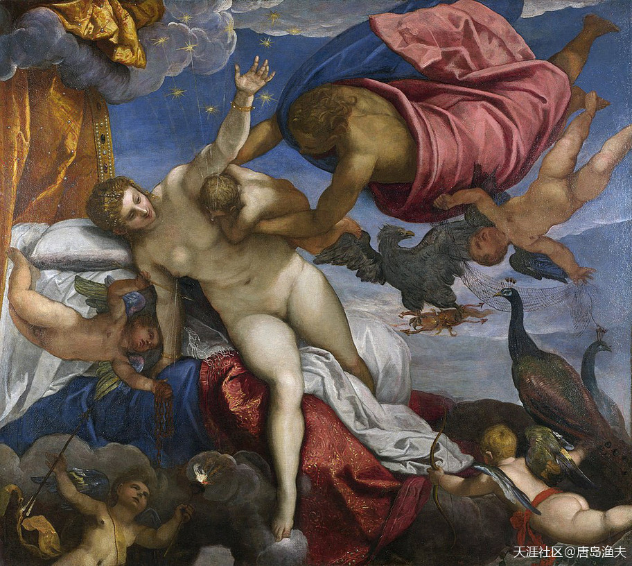
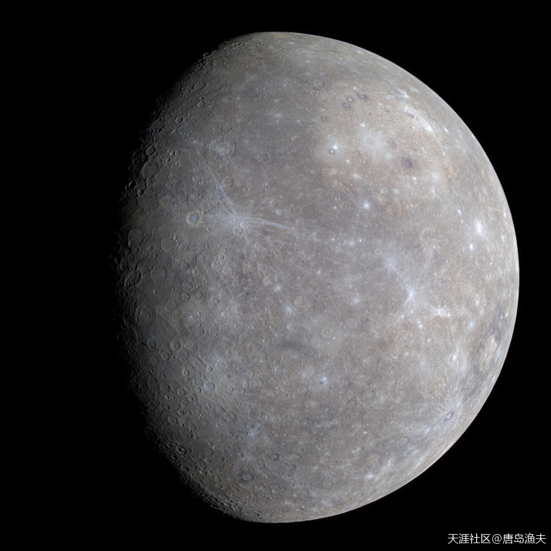
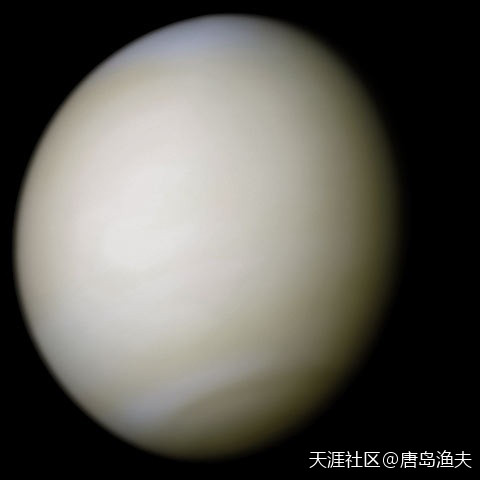
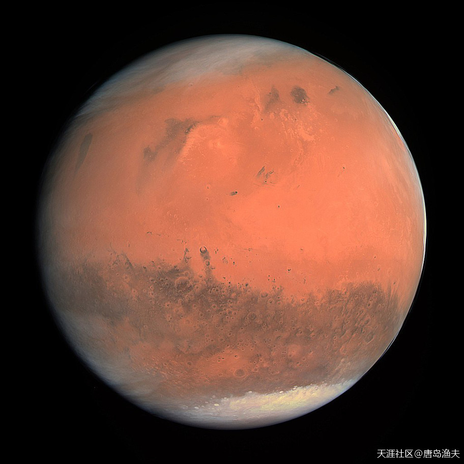
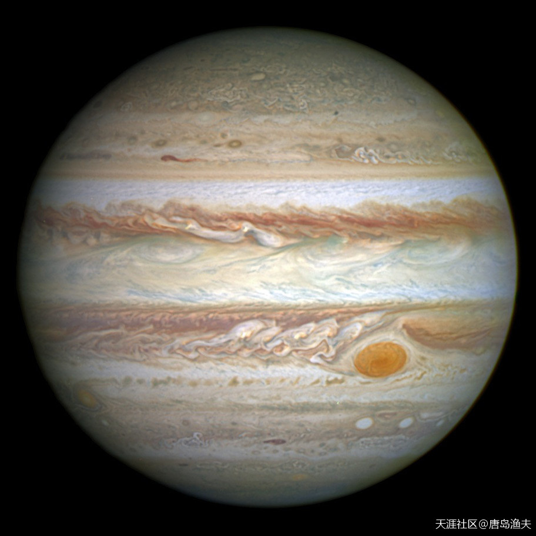
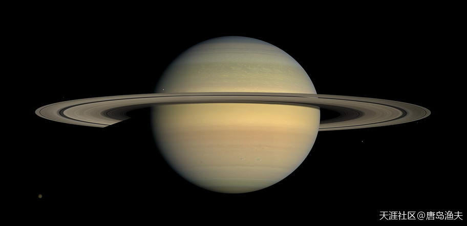
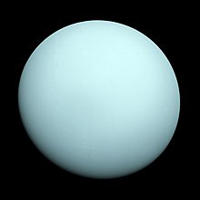
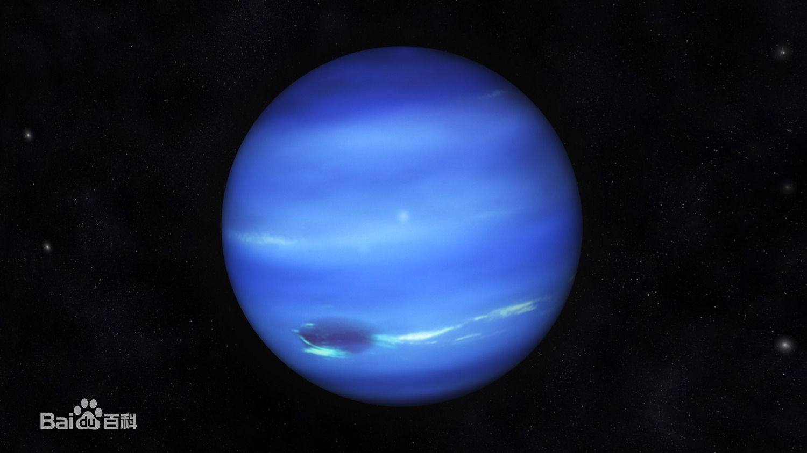

# 八大行星 Planets

八大行星是`太阳系/Solar`的八个大行星，按照离`太阳/Sun`的距离从近到远，它们依次为水星（☿）、金星（♀）、地球（⊕）、火星（♂）、木星（♃）、土星（♄）、天王星（♅）、海王星（♆）。
- 八大行星自转方向多数也和公转方向一致。
- 只有金星和天王星两个例外，金星自转方向与公转方向相反。

?> `银河系`（`Milky Way`）的诞生，`赫拉克勒斯/Hercules`猛吸`赫拉/Hera` 
拯救太阳系 HalleyWars 
太阳系 solar syst

## 水星 `Mercury`（☿）

`墨丘利/Mercury`这个词汇，有没有感觉似曾相识？它是今天很多中外品牌的LOGO。
`Mercury`还是什么？
没错，英文中的 `水星`。

## 金星 `Venus`（♀）

`Mercury`是水星，那么`Venus`呢？
没错，`Venus`就是`金星`。

## 地球 `Earth`（⊕）

## 火星 `Mars`（♂）

战神`Mars`，就是西方天文学中的`火星`这个单词。

## 木星 `Jupiter`（♃）

`Mercury`是水星，`Venus`是金星，那么`Jupiter`呢？
没错，`Jupiter`就是`木星`。

## 土星 `Saturn`（♄）

至此，我们已经集齐了`水星Mercury`、`金星Venus`、`火星Mars`、`木星Jupiter`。

`罗马神话`中的`土星`，就是`Saturn`
而这个`Saturn`，就对应着`希腊神话`中的`克洛诺斯`。

## 天王星 `Uranus`（♅）

至此，八大行星齐聚，还差海王星。。。

还记得不记得克洛诺斯？镰刀夺位，砍自己老爸丁丁的那位老哥。

既然已经谈到了克罗诺斯砍丁丁事件，那么被砍丁丁的那位`乌拉诺斯`同志呢？
没错，`乌拉诺斯`同志就是 `天王星/Uranus`。

## 海王星 `Neptune`（♆）

`海王星`没什么好说的，就是`希腊神话`中的`波塞冬`，也就是`罗马神话`中的`Neptune`。

