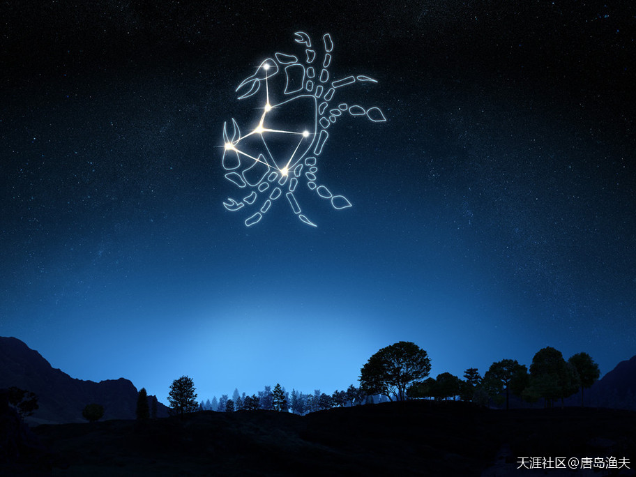
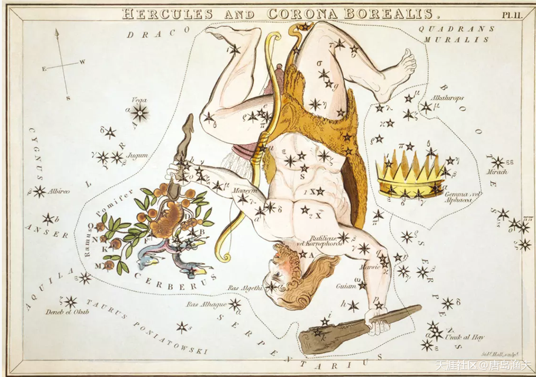
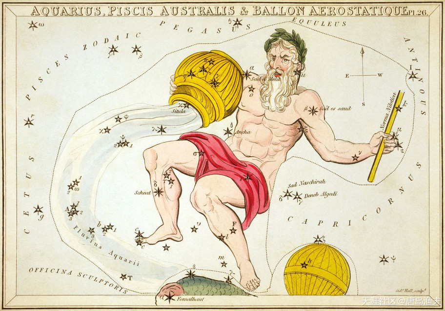

# 十二星座 Astro

## 英仙星座 `Perseus`

## 天马星座 `Pegasus`

## 仙女星座 `Andromeda`

## 仙王星座 `Cepheus`

## 仙后星座 `Cassiopeia`

## 狮子座 `Leo`

## 巨蟹座 `Cancer`

## 人马星座 `Sagittarius`
`人马星座`，就是我们今天常说的`花心射手座`

## 武仙星座 `Hercules`

## 水瓶星座 `Aquarius`

