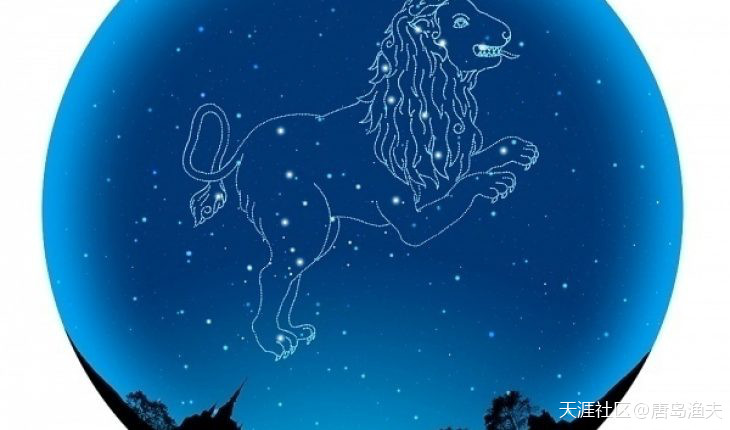
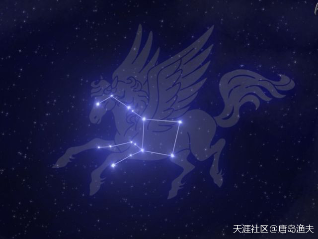
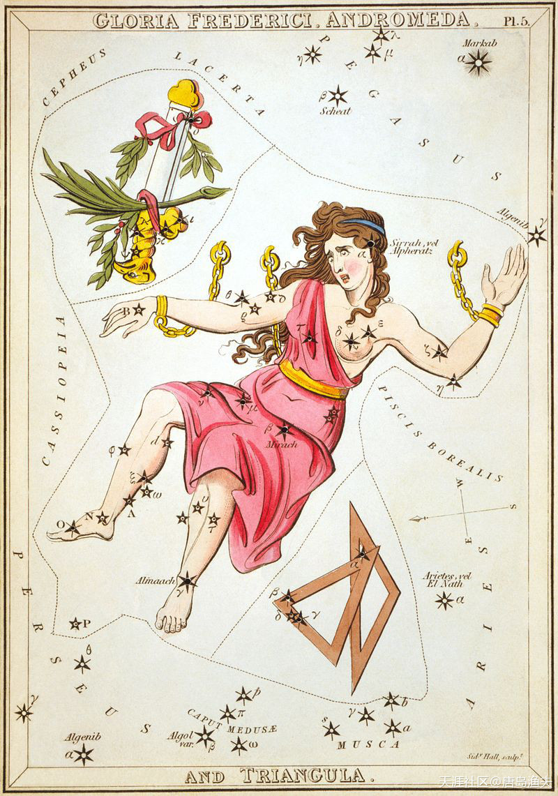
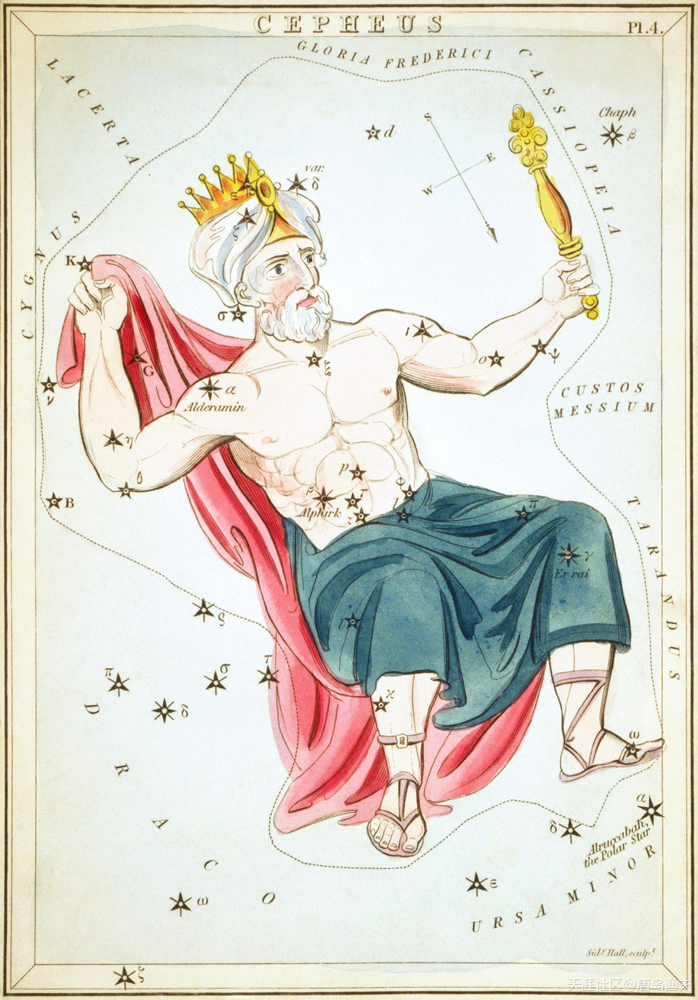

# 八十八星座 Astro

古代为了要方便在航海时辨别方位与观测天象，于是将散布在天上的星星运用想像力把它们连结起来，有一半是在古时候就已命名了，其命名的方式有依照古文明的神话与形状的附会（包含了美索不达米亚、巴比伦、埃及、希腊的神话与史诗）。另一半（大部是在南半球的夜空中）是近代才命名，经常用航海的仪器来命名。

在古代因地域的不同，所以看星空的方式也就不一样！现在全世界已经统一依据星座图将天空划分为八十八区域八十八个星座。

在1930年的一次国际会议上，天文学家终于霸道了一回，他们决定以古巴比伦的星座划分方法为基础，统一把全天的星空划分为88个星座，并确定了它们的名字和边界，使之成为全世界通用的一套系统。星座的命名大部分来自古已有之的希腊神话，少量南天的星座使用了动植物和科学仪器的名称。现在，你知道了吧，天上的星座总共有88个，可别只惦记着十二星座哦。

现在人们把星座归结与占卜的一种必修课，其实学术上的星座是为了方便研究天上的众恒星。

中国的星官 ：中国古代也有星座，当时称为`星官`。顾名思义，好像是把地上的`官僚体系`都搬到了天上。例如：

- 在`北天极`的附近是代表皇家所在的`三垣`（紫微垣、太微垣、天市垣），
- 其外围按四个方向分为`四象`（青龙、白虎、朱雀、玄武）；
- 每个`象`又再分为七个`宿`，因此共有`二十八宿`。
- 在这其中分布着200多个星官，也就是中国特色的小星座，如`三公`、`五帝座`、`天大将军`等等。

## 黄道十二星座

我们一般谈论的`星座/Sign`，指的是`太阳星座/Sunsign`；即以地球上的人为中心，同时间看到太阳运行到轨道（希腊文`Zodiac`：即动物绕成的圈圈，又称“黄道”）上哪一个星座的位置，就说那个人是什么星座。

二千多年前希腊的天文学家希巴克斯（Hipparchus，西元前190～120年）为标示太阳在黄道上运行的位置，就将黄道带分成十二个区段，以春分点为0°，自春分点（即黄道零度）算起，每隔30°为一宫，并以当时各宫内所包含的主要星座来命名，依次为`白羊`、`金牛`、`双子`、`巨蟹`、`狮子`、`处女`、`天秤`、`天蝎`、`射手`、`摩羯`、`水瓶`、`双鱼`等宫，称之为`黄道十二宫`，总计为十二个星群。

在西方占星学上，黄道12星座是宇宙方位的代名词，人们将黄道分成12个星座，称为黄道12星座。一个人出生时，各星体落入黄道上的位置，说明了一个人的先天性格及天赋。黄道12星座象征心理层面，反映出一个人行为的表现的方式。十二星座只是88星座的一部分。

### ♒ 水瓶座/宝瓶座 `Aquarius`

`1月20日`～`2月18日`

### ♓ 双鱼座 `Pisces`

`2月19日`～`3月20日`

### ♈ 白羊座/牡羊座 `Aries`

`3月21日`~`4月19日`

### ♉  金牛座 `Taurus`

`4月20日`～`5月20日`

### ♊  双子座 `Gemini`

`5月21日`～`6月21日`

### ♋ 巨蟹座 `Cancer`

`6月22日`～`7月22日`

### ♌ 狮子座 `Leo`

`7月23日`～`8月22日`

### ♍  处女座/室女座 `Virgo`

`8月23日`～`9月22日`

### ♎ 天秤座 `Libra`

`9月23日`～`10月23日`

### ♏ 天蝎座 `Scorpio`

`10月24日`～`11月22日`

### ♐ 人马座/射手座 `Sagittarius`

`11月23日`～`12月21日`

`人马星座`，就是我们今天常说的`花心射手座`

### ♑ 摩羯座/山羊座 `Capricorn`

`12月22日`～`1月19日`

## 八十八星座

### 英仙星座 `Perseus`

### 天马星座 `Pegasus`

### 仙女星座 `Andromeda`

### 仙王星座 `Cepheus`

### 仙后星座 `Cassiopeia`

### 武仙星座 `Hercules`

