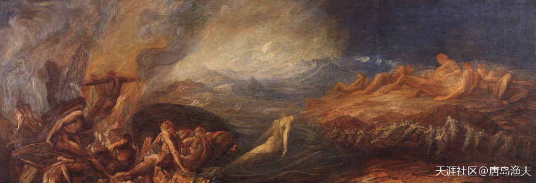
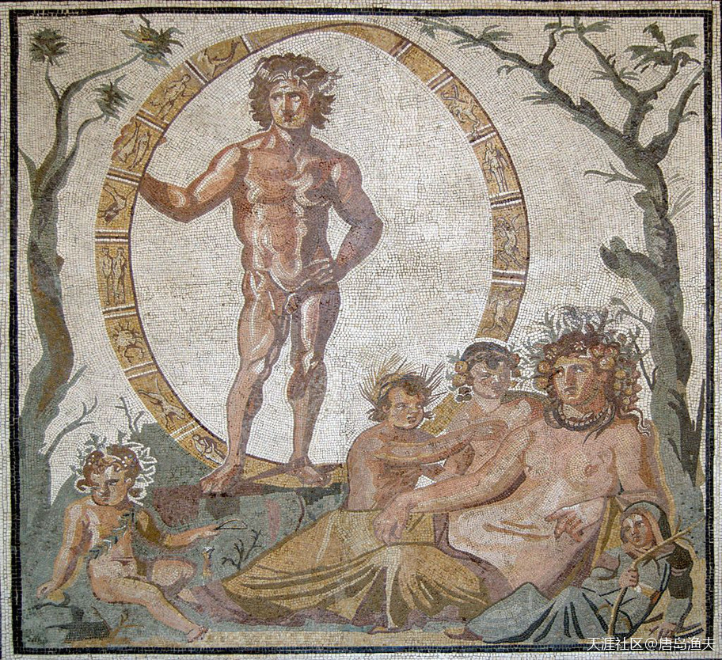
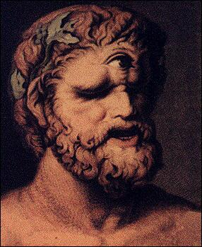
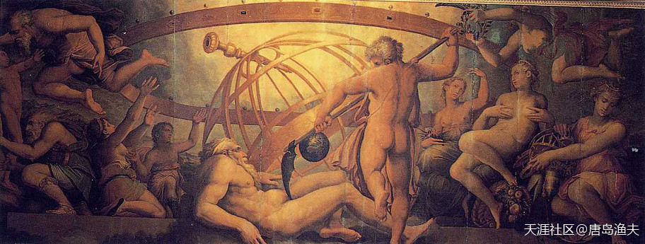
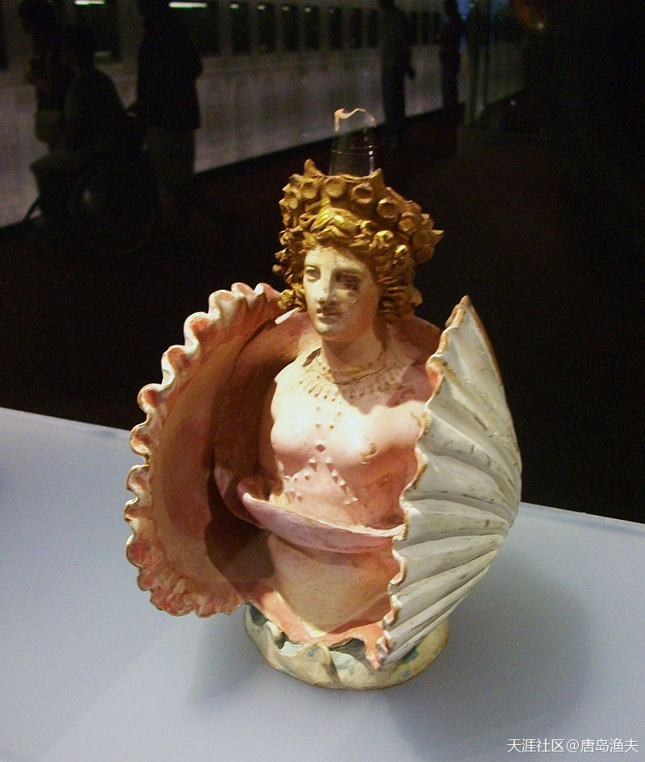

# 第一节 镰刀夺位

## 镰刀夺位(一)

`希腊诸神`的第一代领导集团的核心，叫做`乌拉诺斯/Uranus`。

`乌拉诺斯/Uranus`，其实只能算是第一代众神之王，而并不是世界上的第一个神，比他还要早的神，叫做`盖娅/Gaia`，她也就是`众神之母`。
- 那么`乌拉诺斯/Uranus`是`天空之神`，是天空的神格化；
- 而`盖娅/Gaia`就是`大地之神`，是大地的神格化。

无论`乌拉诺斯/Uranus`还是`盖娅/Gaia`都不是创世神，`创世神`才是`世界第一神`。

**`创世神`的名字叫做`卡俄斯/Chaos`，也就是`混沌`。**

?> 不用怀疑自己，顾名思义并没有错，今天英语中的单词`Chaos`，就是由希腊创世神`卡俄斯/Chaos`作为词源的。 
所以，西方的创世神话跟中国的创世神话在这里是雷同的，人类最初就是混沌。 
所不同的是，我们的混沌之中，诞生了`盘古`。而希腊神话中的混沌之中，诞生了`盖娅/Gaia`和其他`原始神`。

`混沌`中，第一个诞生的原始神是`盖娅/Gaia`，后来在`盖娅/Gaia`的指尖诞生了`乌拉诺斯/Uranus`。

?> 老大`乌拉诺斯`之后，乌拉诺斯的一些兄弟姐妹也陆续诞生，比如原始海神`蓬托斯/Pontos`，原始山神`乌瑞亚/Ourea`等等。 
`乌拉诺斯/Uranus`后来娶了`盖娅/Gaia`，那么，`乌拉诺斯/Uranus`就既是`盖娅/Gaia`的儿子，又是`盖娅/Gaia`的老公， 
`盖娅/Gaia`指定了`乌拉诺斯/Uranus`同志做了`第一代众神之王`。

原始洪荒——`卡俄斯/Chaos`
——by George Frederic Watts

第一代众神之王——`乌拉诺斯/Uranus`同志与`盖娅/Gaia`
> Central part of a large floor mosaic, from a Roman villa in Sentinum

---

- 西方的人果然纠缠不清，又是儿子又是老公，这个真是汗颜！

- 感觉还是中国的神话符合审美观看起来舒服。

---

## 镰刀夺位(二)

`乌拉诺斯/Uranus`成为了众神之王，也就是神中之神之后，内心渐渐膨胀起来。
- 性格飞扬跋扈，统治独断专行，甚至对自己的妈妈兼老婆的`盖娅/Gaia`，也有点不尊重了。
- `乌拉诺斯/Uranus`每天只知道一到晚上就从天上下界，和`盖娅/Gaia`相结合，而且霸占了`盖娅/Gaia`的生育权。
- 在`乌拉诺斯/Uranus`的辛勤劳作之下，`盖娅/Gaia`先后生出了六男六女共十二个娃，而`乌拉诺斯/Uranus`对于这些娃并不怎么喜欢，还给他们起了一个共同的外号，叫做 `提坦/Titan`（意思是`紧张者`）。

除了`Titan`们之外，乌拉诺斯还和盖娅生出了三个`独眼巨人/Cyclops`，以及三个`百臂巨人/Hekatonchires`。乌拉诺斯觉得这六个儿子生的太过丑陋，有辱门风，于是就想把这六位塞回`盖娅/Gaia`的体内去。

这件事情，最终激怒了`盖娅/Gaia`，并成为接下来暴力革命的导火索。

---

- `古罗马人`心目中的`希腊神话`。

---

`独眼巨人/Cyclops`

> by Johann Heinrich Wilhelm Tischbein, 1802

---

- 这位同志长得很喜感 建议长相查考杨戬 就不会被塞回去了。
- 不，西方的眼睛是横着的，东方的是竖着的，感觉东方更注意整体协调。

---

## 镰刀夺位（三）

于是接下来，对自己信心满满的地母之神`盖娅/Gaia`振臂一呼，发动自己所有的`Titan`孩子们起来反抗`乌拉诺斯/Uranus`的残暴统治。然而`Titan`们却并不买账，他们知道天父`乌拉诺斯/Uranus`的厉害，知道暴力革命并不容易。何况到现在位置，天父`乌拉诺斯/Uranus`也是一直压在地母`盖娅/Gaia`的身上，要想打败这样的敌人自己也要付出巨大的代价，这似乎并不是一件非常划算的买卖。

最终帮助老妈`盖娅/Gaia`分忧的，是十二位`Titan`中最小的那个——`克洛诺斯/Kronos`。这位最小的也是最狡猾的儿子，同意帮助老妈——诛暴父，伐无道。

有一天晚上，`盖娅/Gaia`为老公`乌拉诺斯/Uranus`准备了丰盛的晚宴。席间，乌拉诺斯喝的酩酊大醉，盖娅照顾乌拉诺斯睡下。就在`乌拉诺斯/Uranus`同志熟睡的当口，`克洛诺斯/Kronos`掏出来一把镰刀，手起刀落，割掉了`乌拉诺斯/Uranus`同志的丁丁。`乌拉诺斯/Uranus`同志从梦中醒来，看到丁丁已经丁去楼空，愤怒地对小儿子`克洛诺斯/Kronos`诅咒说：你以后也会像我一样，被你的儿子所推翻！

说完之后，`乌拉诺斯/Uranus`就回到了天空，再也没有回到过地面。

镰刀夺位
The Mutilation of Uranus by Saturn

---

- 估计开始看的太粗略了竟然没发现这么有意思，笑的合不拢嘴:)

---

## 镰刀夺位（四）

`乌拉诺斯/Uranus`同志的丁丁，被小儿子抛的很远很远，最终落到了`爱琴海/Aegean Sea`，从掀起的海浪泡沫中诞生了爱神`阿佛洛狄忒/Aphrodite`。而剩下的精血飞溅到了`盖娅/Gaia`身上，则由`盖娅/Gaia`孕育出了怪物`巨人族/Giants`（或称巨灵族，`Gigantes/癸干忒斯`）、复仇三女神`厄里尼厄斯/Erinyes`和白橡树三神女`墨利埃/Melia`。

`乌拉诺斯/Uranus`升天之后，顺理成章地，立下大功的`克洛诺斯/Kronos`就成了新的众神之王。

新的众神之王统治下的神界，`克洛诺斯/Kronos`的哥哥姐姐们，就成了`提坦神/Titan`。于是六位男神和六位女神共十二位神，被合称为`十二提坦神`。

`十二提坦神`，就是希腊诸神的`第二代领导集团`。

而小儿子`克洛诺斯/Kronos`的这次政变，也被称为`镰刀夺位`。

登上王座的`克洛诺斯/Kronos`，却并没有吸取老爸被人推翻的深刻教训，继续排斥并防备那几个丑陋又恐怖的弟弟们——三个`独眼巨人/Cyclops`和三个`百臂巨人/Hekatonchires`。并且变本加厉，`克洛诺斯/Kronos`将他们统统关进了地狱 `塔尔塔罗斯/Tartarus`（就是`深渊神`，深渊地狱的神格化。混沌创世，于地母`盖娅/Gaia`之后诞生的`原始地狱`）。

又是一场轮回的开始。

---

- 克洛诺斯不是最小的孩子吗？其他的儿子应该是他的哥哥啊，而且6个儿子，3个独眼，3个百臂，克洛诺斯是哪种？从图上看应该是独眼吧。

- 谢谢兄台关注。`乌拉诺斯/Uranus`的孩子包括十二提坦神，三个独眼巨人，三个百臂巨人。`克洛诺斯/Kronos`位列十二提坦神之一，也是后来的第二代天神。因乌拉诺斯之死，天后盖娅又孕育出了`癸干忒斯/Gigantes`、复仇三女神`厄里尼厄斯/Erinyes`和白橡树三神女`墨利埃/Melia`。

---

爱神`阿佛洛狄忒/Aphrodite`
> Early fourth-century BC Attic pottery vessel in the shape of Aphrodite inside a shell
——from the Phanagoria cemetery in the Taman Peninsula
