# 第二节 提坦之战

## 提坦之战（一）

`克洛诺斯/Kronos`是时间创造力和破坏力的结合体。

登位之后的`克洛诺斯/Kronos`，迎娶了自己的姐姐`瑞亚/Rhea`。

`瑞亚/Rhea`也在诸神的政治序列中接了自己老妈`盖娅/Gaia`的班，她是第二代地母神，也是第二代天后。

结婚之后的`瑞亚/Rhea`一鼓作气，为`克洛诺斯/Kronos`生了六个孩子。

不过，`克洛诺斯/Kronos`一直念念不忘的，是自己的老爸`乌拉诺斯/Uranus`同志临走之前的那句诅咒。这导致`克洛诺斯/Kronos`对自己所有的孩子都心怀戒备。因此`克洛诺斯/Kronos`一不做二不休，老婆生一个娃他就吃一个娃。

前五个娃，被`克洛诺斯/Kronos`悉数吞进了肚子里。当第六个孩子`宙斯/Zeus`降生的时候，`瑞亚/Rhea`决心保护这个幼小的生命。天后`瑞亚/Rhea`采用了希腊诸神版本的“狸猫换太子”之计，把`宙斯/Zeus`掉包成了一块石头。而将真正的宙斯本尊，送到了`十二提坦神`中的大洋神`欧申纳斯/Oceanus`（英文`Ocean`的词根）与海之女神`泰西斯/Tethys`夫妇手中保护。

逃出生天的`宙斯/Zeus`，在爱琴海中的`克里特岛/Crete`长大成人。

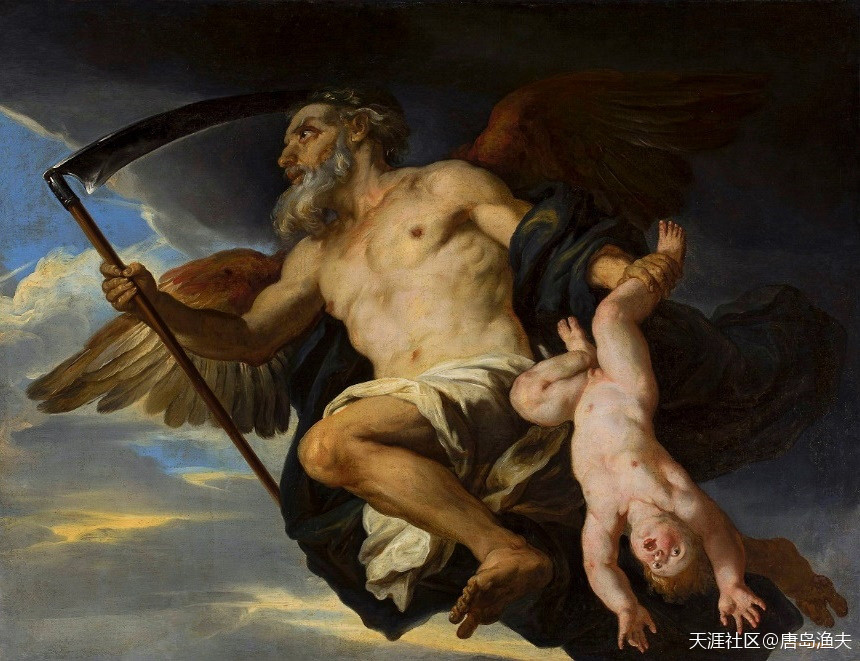

生一个吃一个——`克洛诺斯/Chronos`

> Chronos and his child 
—— Giovanni Francesco Romanelli, National Museum in Warsaw

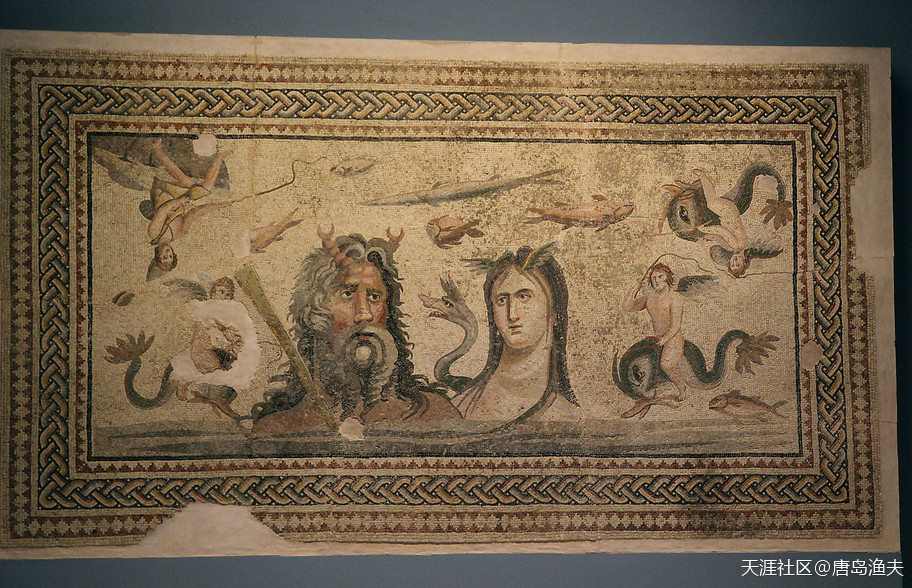

`欧申纳斯/Oceanus`与`泰西斯/Tethys`夫妇

> Mosaic depicting Oceanus and Tethys, 
——Zeugma Mosaic Museum, Gaziantep

---

- `提单`神是不是也翻译做`泰坦`？我貌似哪里看过这段`希腊神话`。
- 是的，两种翻译方法都可以。其实`titan`本身就是音译，转过来翻成汉语又是音译。音译的音译，随便怎么讲都可以，只要西文指代的内容不错就可以了。
- 大洋神Oceanus的头上还长角？怎么这幅画怎么看怎么跟中国的龙，龙王似乎有关联？
---

## 提坦之战（二）

已经成为翩翩少年的`宙斯/Zeus`，有一天得知了自己的身世，他心中的使命感不禁油然而生。为了报答`欧申纳斯/Oceanus`与`泰西斯/Tethys`的搭救之恩，`宙斯/Zeus`迎娶了他们的女儿`美狄丝/Metis`。

?> 要说`欧申纳斯/Oceanus`与`泰西斯/Tethys`两个人的繁殖能力极强，据说全世界的江河湖海都是他们的孩子。他们的女儿就有三千，号称三千 `大洋神女/Oceanid nymph`，`美狄丝/Metis`只不过是这三千佳丽之一而已。所以`美狄丝/Metis`和`宙斯/Zeus`的联姻，说到底其实是`欧申纳斯/Oceanus`夫妇的一个政治赌注。但作为三千大洋神女的老爸老妈，这场政治押宝绝对是一次稳赚不赔的好买卖。

当然，值得一提的是，`美狄丝/Metis`本人也不含糊，她是`希腊神话`中的第一代智慧女神。`美狄丝/Metis`帮助`宙斯/Zeus`同学，配制出了一种特效药，这种药有让神催眠和催吐的神奇功效。

迎娶了`美狄丝/Metis`，拿到了特效药，获得了`欧申纳斯/Oceanus`夫妇的政治默许之后，`宙斯/Zeus`找到了自己的老妈天后瑞亚，密谋推翻老爸克洛诺斯，救出自己的其他哥哥姐姐。

毫无疑问，这是一场伟大的拯救。

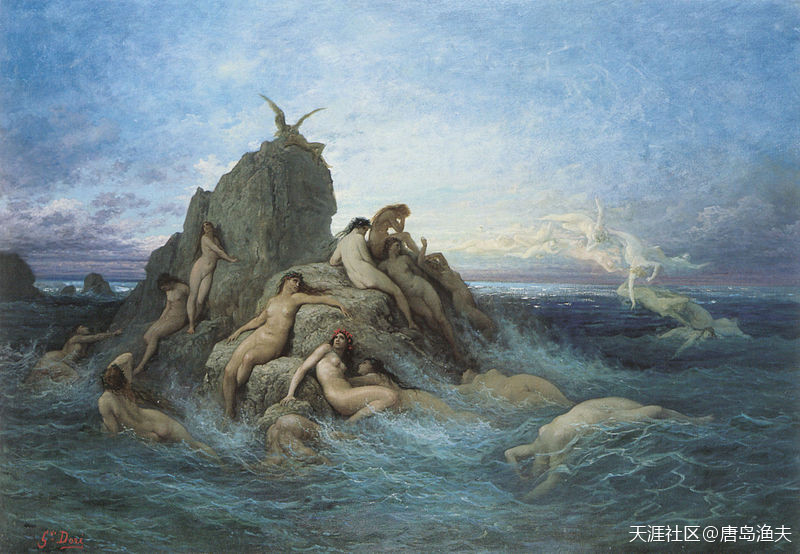

提坦众神中的智慧女神`美狄丝/Metis`，及`大洋神女们/Oceanids`

> Metis and the Oceanids 
—— Gustave Doré (1832–1883)

---

- 看到这些图片，有有种感觉，这布料得多贵，大伙都穿不起衣服！看看中国神话故事，都是对人物先从衣着开始描述，而这欧洲神话，唉，我都不知道该怎么描述人物，难道是先从乳头，毛发开始描述？

- 反正一个感觉，欧洲的神话都是近代编的！

---

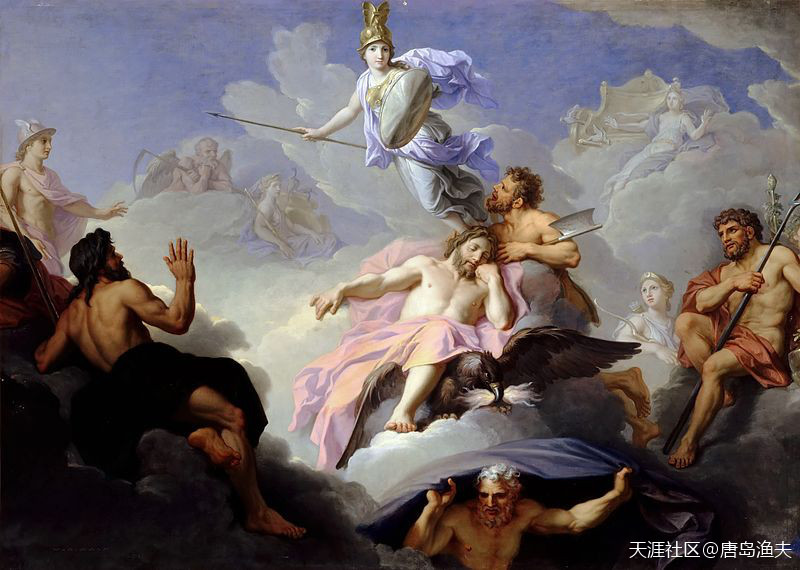

`雅典娜/Athena`的诞生

> The Birth of Minerva (Athena)  
—— René-Antoine Houasse (1645–1710)

作为官方认证的`宙斯/Zeus`的第一个老婆，智慧女神`美狄丝/Metis`后来怀孕，怀着的神就是`雅典娜/Athena`

因为惧怕被自己的孩子（`乌拉诺斯/Uranus`的“祖咒”）推翻，`宙斯/Zeus`一口吞下了`美狄丝/Metis`，从自己脑袋上生出了`雅典娜/Athena`

---

- 感觉不是在看历史，是在看科幻小说～～孤陋寡闻暴露无遗:)

---

## 提坦之战（三）

跟自己的老爸`乌拉诺斯/Uranus`一样，`克洛诺斯/Chronos`也是一个嗜酒如命的人。`克洛诺斯/Chronos`身边有一个倒酒的小厮，被`瑞亚/Rhea`借口支走，换成了年轻的`宙斯/Zeus`。宙斯趁机，将`美狄丝/Metis`配制的毒药放进了老爸饮用的酒中。

酒过三巡。

`克洛诺斯/Chronos`醉眼朦胧地睡下，结果药性发作，开始不断地呕吐。

这一吐不要紧，之前吃进去的五个孩子被统统吐了出来。吐出来的五个孩子分别是——`赫斯提亚/Hestia`、`德墨忒耳/Demeter`、`赫拉/Hera`、`哈迪斯/Hades`和`波塞冬/Poseidon`。当然，被一起吐出来的，还有那块“狸猫换太子”的石头。这块立下大功的石头，被宙斯放在了`德尔菲/Delphi`，后来德尔菲也成了`古希腊`的一块圣地。

老爸`克洛诺斯/Chronos`被丢到了一边，宙斯兄弟欢呼雀跃。

在众兄弟姐妹的一致推举之下，`宙斯/Zeus`在`奥林波斯山/Olympus`（在今希腊北部）成立了新的神界领导集团。`宙斯/Zeus`率领的新的神族，因此被成为`奥林波斯神族`或者`奥林匹斯神族`（翻译不同）。换句话讲，这个时候，希腊诸神的第二代领导集团尚未卸任，而宙斯领导的`第三代领导集团`就开张营业了。

双方必有一战。

---

- 冥王`哈迪斯/Hades`，海王`波塞冬/Poseidon`，圣斗士星矢对这些名字的宣传功不可没。

---

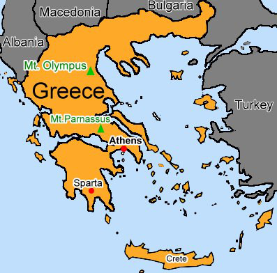

`奥林波斯山/Olympus`在希腊的具体位置

---

- 谢谢支持。原始文献里面，赫西俄德的《神谱》，记载希腊神话是比较多的。当然，渔夫不敢做文献考据。只是依据当代欧洲人的对那个时代的理解，探求西方行为习惯，思维规律，逻辑方式的本源。

- “对那个时代的理解，探求西方行为习惯，思维规律，逻辑方式的本源”，顶顶赞赞！直觉“历史”就是“神话”这样，来源于人们的思维理解逻辑方式，实际可能来的更黑暗血腥，神话甚至能起到隐晦和美化的作用。

- 是的雨点兄。站在西方人的角度，探究今天西方人思维方式的本源，研究他们对今天这个世界看法的理论依据。知己知彼，百战不殆。

- 中世纪很多东西断线了，后来的很多东西，确实说不太清楚了。但对于研究今天的欧洲人来讲，考据并不重要。因为即便是假的，欧洲人也都信了，全世界也都在普及这个理论。

- 有时候反而是因为咱们的历史比较完备，发挥想象的空间不多了。很多国家的历史都整容，因为搞不清楚到底发生了啥，只能胡编乱造，最后就成了神剧。

---

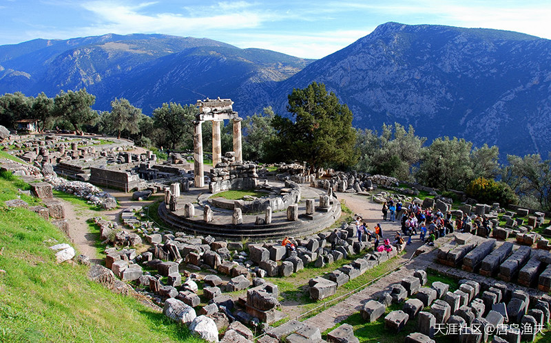

希腊`德尔菲/Delphi`，古城一景：雅典娜圣域（The Temple Of Athena Pronaia）

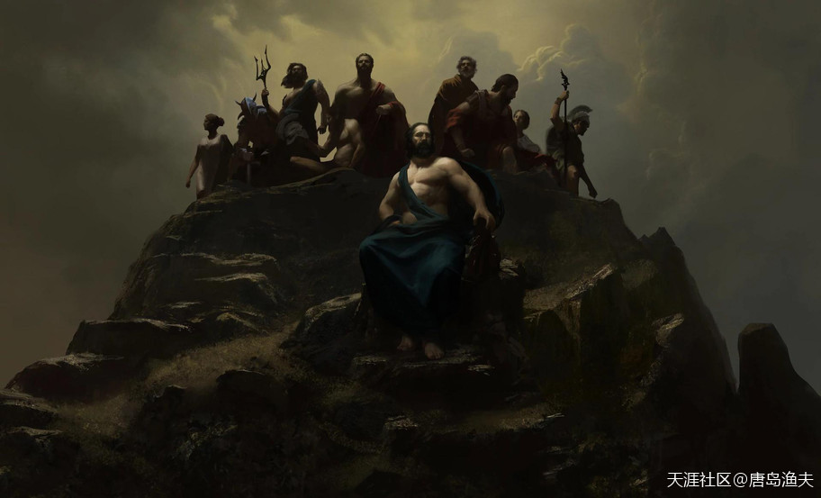

另立党中央的奥林波斯众神

---

- 感觉希腊的众生，仅是被推举出来，就是众神之王，跟个人实力没什么多大关系。完全就是部落选举制度。

- 人类不是宇宙的第一个智能生命体，也不是地球的智能生命体。只不过历史从头来，就按从头来的秩序进行，不能一开始就让他们会拿手机抵头一族而不是抬头看天敬畏神，如果真是人类从单细胞繁衍到智能人，还更不知要多长的时间。神是自有永有，人是神创，神之前的知识智慧只能越积越多。

- 于是就有神来带领人类，教会人类各样的种植和冶炼技能等。这些都是按着神编写的程序，也叫法则进行的。有时，有些神若插足历史进程，忍不住多教人类，人类的文明就会进行过快，这样离一季的历史安排终结也更快。人类其实一有开时就应该什么都会了，只要宇宙文明中有的。

- 谢谢支持。是的，这些神话故事，英雄传说其实一直都存在，渔夫想把他更加系统化地讲出来。我们和老外，需要知己知彼。

- 当小说看看吧，别太认真。看这些东西还不如看十日谈，看看中世纪的白皮日常生活如何下流无耻搞笑，现在的白皮跟书中描写的中世纪白皮真得很象，这是个奇迹。

- 这就是本性，虽然在一定时间内也伪善过，但本性难移嘛。

---

## 提坦之战（四）

下野的`克洛诺斯/Chronos`，跑到提坦神占据的`奥斯利斯山/Othrys`（在今希腊中部）搬救兵，组成了讨伐`宙斯/Zeus`的团队；而`宙斯/Zeus`则占据`奥林波斯山/Olympus`，与自己的众兄弟姐妹一起，组成了反抗`提坦神/Titan`的起义团队。

不过，也有例外。

十二提坦神中，`欧申纳斯/Oceanus`与`泰西斯/Tethys`夫妇，并没有选择参战。没有参战，实际上也就相当于站队到了女婿`宙斯/Zeus`一方。`欧申纳斯/Oceanus`夫妇之外，还有规律女神`忒弥斯/Themis`以及记忆女神`谟涅摩叙涅/Mnemosyne`，统统站队到英俊的侄子`宙斯/Zeus`一边。而`宙斯/Zeus`也投桃报李，索性迎娶了这两位重量级的姑妈为妻，以联姻的形式固化了自己的同盟。同一时间被宙斯迎娶的，还有他自己的姐姐`赫拉/Hera`。

这场希腊神界的全面战争，被称为`提坦之战`。

这场提坦之战，持续了十年。

众神在战争中学习战争，锻炼了队伍，考察了新人。

表现突出的提坦神新人，叫做`阿特拉斯/Atlas`，他是十二提坦神中灵魂之神`爱泼特斯/Iapetus`的儿子，他也是所有提坦神中，最为高大强壮的一个。在`阿特拉斯/Atlas`的带领下，眼看`提坦/Titan`神就要占领`奥林波斯山/Olympus`。

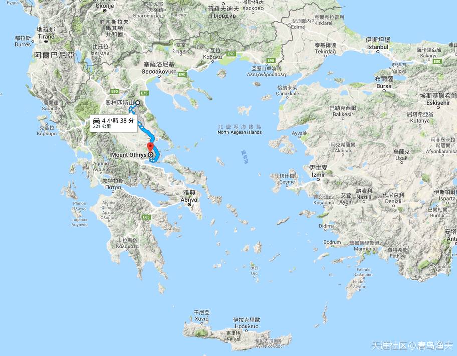

提坦之战路线图

- 用谷歌地图，帮助希腊众神设计一下进攻路线
- `奥斯利斯山/Othrys`到`奥林波斯山/Olympus`，两地相距221公里，走路需要42个小时，开汽车需要4小时38分钟

---

- 哈哈，太幽默了。是村子械斗的感觉。

- 都是神，难道不用飞，还得利用著名的交通工具11路？肩上扛着锄头，手握镰刀，斧子，弹皮弓？然后带着自己的神宠猪马牛羊，鸡鸭猫狗？你还少说了一个耍叉子的——`波塞冬/Poseidon`。

- 脑补了骑着小毛驴去参加神战的诸神：P

- 要不怎么说这西方人格局小呢，200公里的神之战，什么神王的就一原始部落的酋长。

- 所谓的神王之战其实就是两个原始部落争夺生育权而已。

---

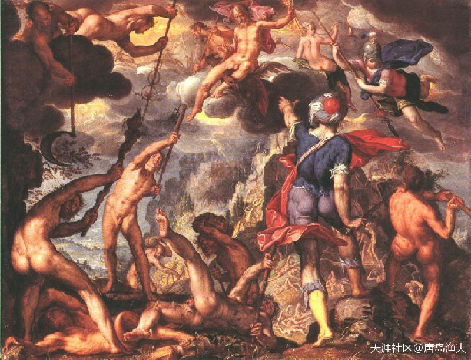

提坦之战

> The Battle Between the Gods and the Titans  
——oil on copper, 1600

---

- **一群赤脚光屁股，拿着一千年以后的农具，披着两千年之后自己才开眼的东方的丝绸……他们就是西方的神。**

---

## 提坦之战（五）

千钧一发之际，`爱泼特斯/Iapetus`的另外一个儿子——足智多谋的`普罗米修斯/Prometheus`出现了。

一直观棋不语的`普罗米修斯/Prometheus`，审时度势。他并没有帮助自己的兄弟`阿特拉斯/Atlas`，而是为`宙斯/Zeus`献计，挽救奥林波斯众神。普罗米修斯的建议是，放出被关押在`塔尔塔罗斯/Tartarus`的`独眼巨人/Cyclops`和`百臂巨人/Hekatonchires`。用脚趾头都可以想到，独眼巨人和百臂巨人，对`第二代领导核心`的`克洛诺斯/Chronos`，一定是怀着深深的仇恨以及恶意。

`宙斯/Zeus`想办法，放出了自己的几个上古神兽叔叔，提坦之战的胜负天平终于开始倾斜。

与此同时，擅长锻造兵器的`独眼巨人/Cyclops`们，在火神`赫菲斯托斯/Hephaestus`（宙斯与赫拉的儿子）的帮助下，帮助宙斯兄弟量身定做了用于同提坦作战的上古神器：
- `宙斯/Zeus` 的 `闪电长矛`
- `波塞冬/Poseidon` 的 `三叉戟`
- `哈迪斯/Hades` 的 `双股叉`。

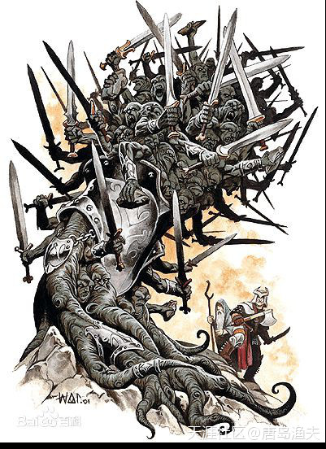

`百臂巨人/Hekatonchires`

---

- 三叉戟有倒刺的，刺进人体怎么拔出来？显然是杜撰的，还是中国的三股叉好用。

- 好吧，汽车品牌出现了。

- 普罗米修斯这厮脑后有反骨。

- 对:千手观音。继续对，万佛朝宗

- 海洋民族，章鱼崇拜？

- 很臃肿 没有千手观音优美 而且武器单一 千手观音一手一法器。

---

## 提坦之战（六）

`宙斯/Zeus`手持闪电长矛，不断用雷霆和闪电攻击`提坦神/Titan`。惊慌失措，四散逃奔的提坦神们，被`百臂巨人/Hekatonchires`一一擒获。`宙斯/Zeus`用自己父亲的方式，以彼之道，还施彼身。把所有参战的提坦神，都关进了`塔尔塔罗斯/Tartarus`地狱。`百臂巨人/Hekatonchires`或许是特别扬眉吐气的一位神，他由当年的囚犯变成了今天的狱警。`百臂巨人/Hekatonchires`带着一只三头狗，每天负责看管这些旧政权的提坦战犯。

所有提坦战犯中，像`阿特拉斯/Atlas`这样长了一副好身板的，则被区别对待。`宙斯/Zeus`派他到了世界的最西边，去用头和双肩来支撑苍天。所以，其他提坦神是被囚禁，而`阿特拉斯/Atlas`则成了劳改犯，因此，又被后世称为`擎天之神`。而阿特拉斯的名字`Atlas`，则成了今天英语中`地图集`的词源。

提坦之战，以奥林波斯众神的全面胜利而告终。

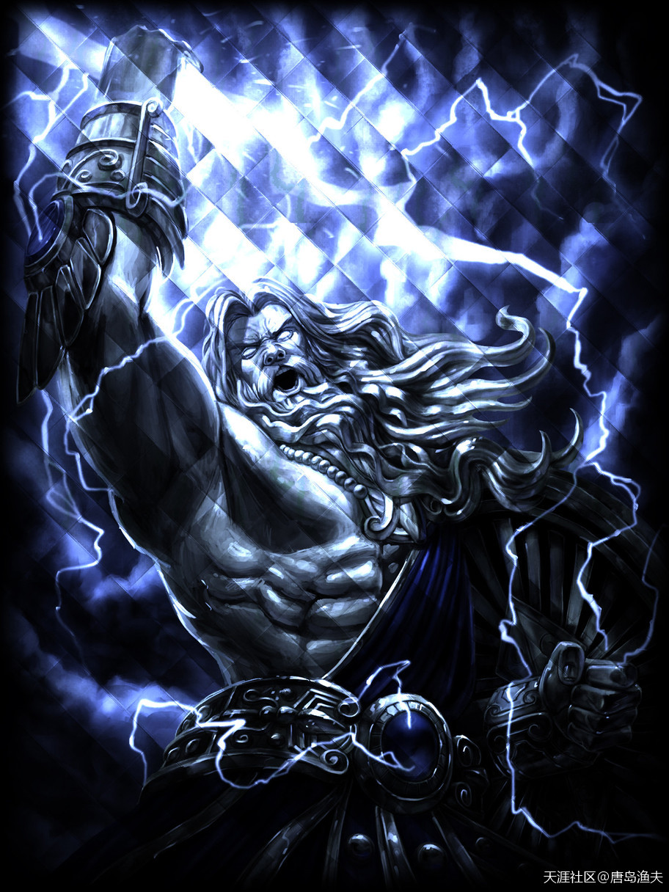

战斗模式中的黑化版`宙斯/Zeus`

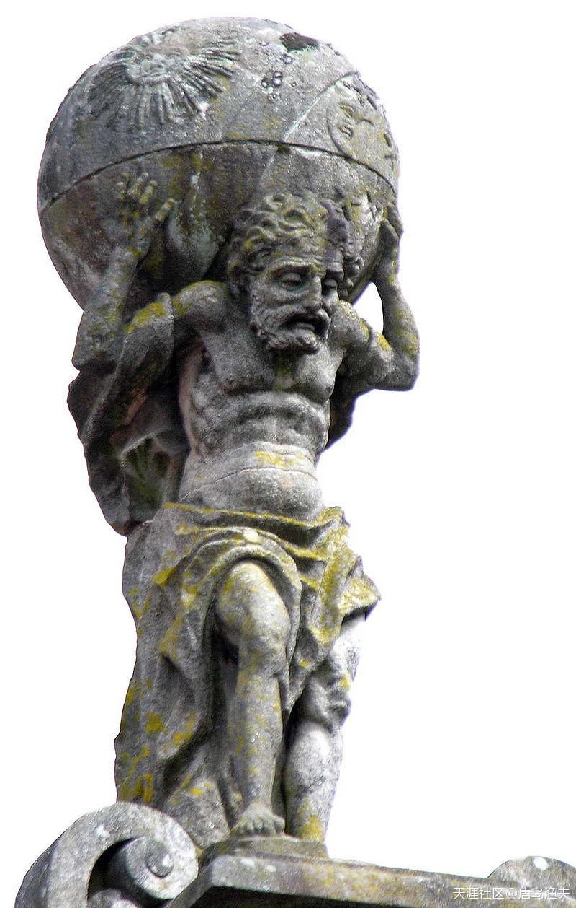

怂版的`阿特拉斯/Atlas`

> Sculpture of Atlas  
——Praza do Toural, Santiago de Compostela

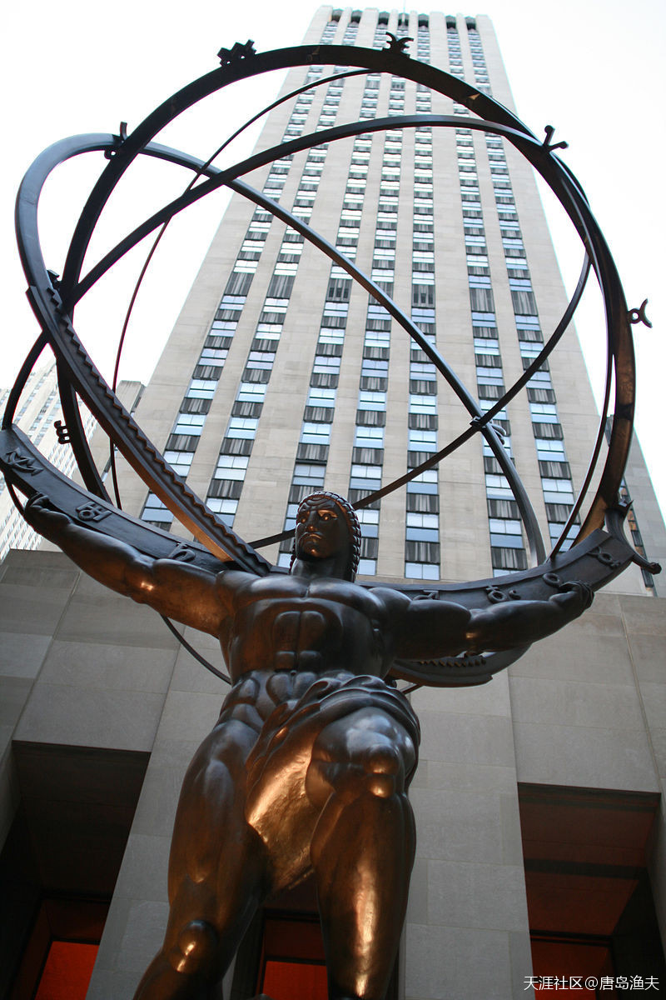

美国纽约的`阿特拉斯/Atlas`擎天雕像

> Lee Lawrie's colossal bronze Atlas, Rockefeller Center, New York

----

- 西方神话跟东方神话比起来，还是觉得东方神话更容易接受一些。

- ATLAS的形象作为品牌宠儿，同样在西方世界喜闻乐见，而且涉及到的行业很多。其中有名的，比如ATLAS电梯。

- 作为披头士迷，我印象最深的是纽约的达科他大楼，列侬工作室+遇刺的地方，这个楼四周的栏杆是波塞冬雕像，楼里的房间也和海神有关系，都是房子原始设计者和房主的创意。

- `阿特拉斯/Atlas`举太阳那个，国内传统神话也有一个。有人论述认为`希腊神话`更像是抄袭`东亚神话体系`并进行合理化整理而产生的。而且，根据`巨石阵`～`巨石遗址`～`东亚石棚`的严丝密缝的流传形态来说，极有可能是几千年前东亚地区的排挤效果，把东北亚一些族群驱逐出去的。

- 当年亚欧大陆之间的交流，比我们今天想象的应该更加频繁。草原丝绸之路，游牧民族之间的逐水草而居，远赴欧洲不会像其他路线那么刻意。

- 最直接的证据就是新疆的小河公主墓地。

----

## 提坦之战（七）

胜利的尾声，则是奥林波斯众神的分赃大会。第三代领导集团，要重新划分第二代提坦神们的势力范围。眼看没有一个合理的方式来进行利益平衡，新掌权的奥林波斯诸神，随时可能因为分赃不均而大打出手，下一场的腥风血雨很有可能就在眼前。

这个时候站出来的，依然是那个擅长审时度势的`普罗米修斯/Prometheus`。

`普罗米修斯/Prometheus`提出了一个最科学的方式来划分势力范围——`抓阄`。

这个方法，让宙斯众兄弟感到恍然大悟，心悦诚服。

抓阄结果，
- `波塞冬/Poseidon` 分到了海洋，成为`海神`；
- `哈迪斯/Hades` 分到了冥界，成为`冥神`；
- `宙斯/Zeus` 得到了天空，成为`天神`。

经过协商，大地为三兄弟共有，而三兄弟则以宙斯为尊，`宙斯/Zeus`也就成了众神之王，也就是`第三代领导集团`的核心。

成为天王的`宙斯/Zeus`，则尊自己的第七个老婆`赫拉/Hera`为天后，`赫拉/Hera`也就是希腊诸神的`第三代天后`。

不过，看上去完美的战后会议，正在面临新一场的针对诸神的阴谋。

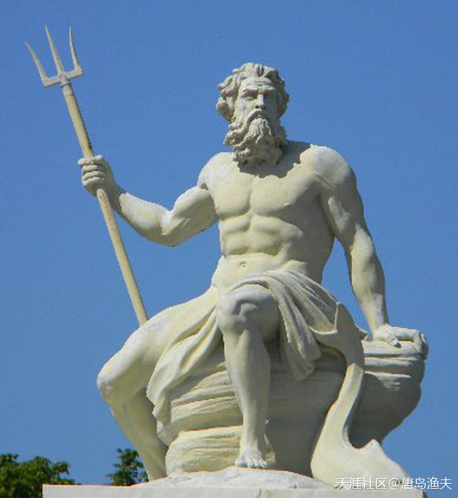

已经配发了制式武器的海神`波塞冬/Poseidon`

---

- 波塞冬的这个`三叉戟`，英文叫做`trident`，也是个古代网红兵器。在欧美国家，很多场合很多标志很多品牌都可以看得到。

---

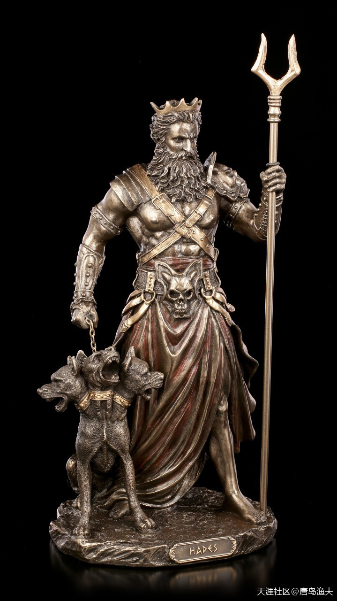

冥王`哈迪斯/Hades`和他的宠物——地狱三头狗

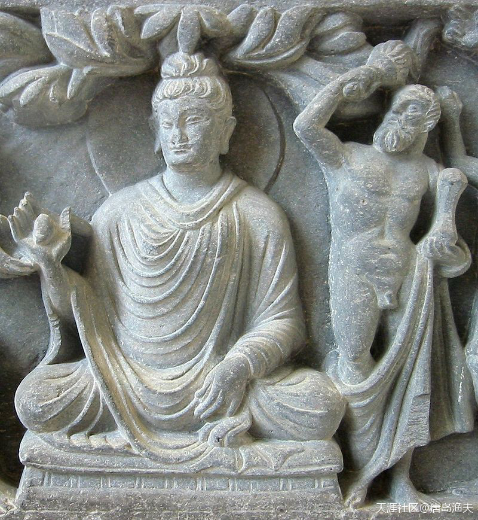

在所有古代`宙斯/Zeus`神像中，这个版本的宙斯是混的最惨的

- 在这个雕像中，宙斯手持闪电长矛，为佛家的西天佛祖做保镖
- 宙斯在这里其实是一位菩萨，名字叫做Vajrapani，也就是汉语中的 `金刚手菩萨`
- 那么如此以来，他的闪电长矛也就不是长矛了，应该叫做 `大力金刚杵`。

> Zeus as Vajrapāni, the protector of the Buddha.  
——2nd century, Greco-Buddhist art.
