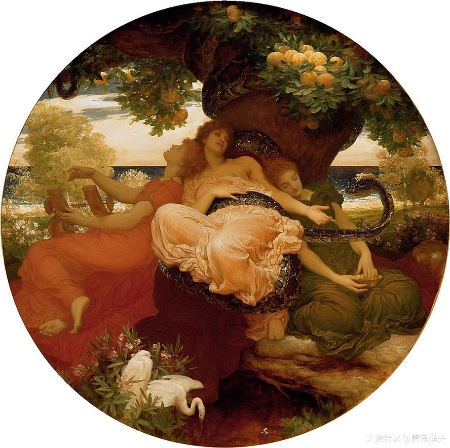
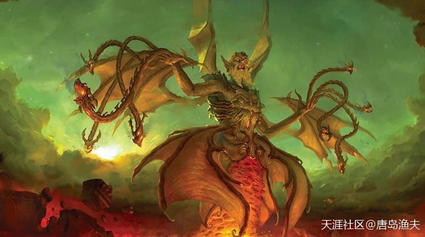
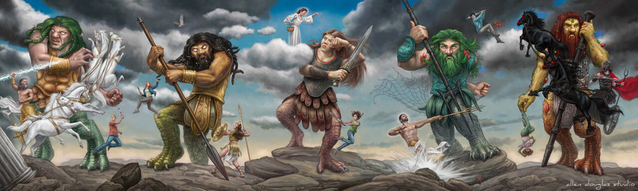
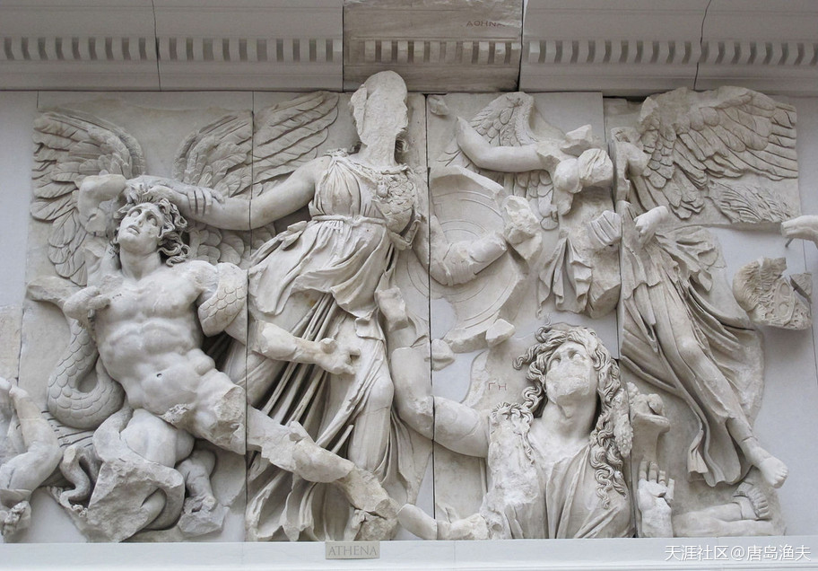
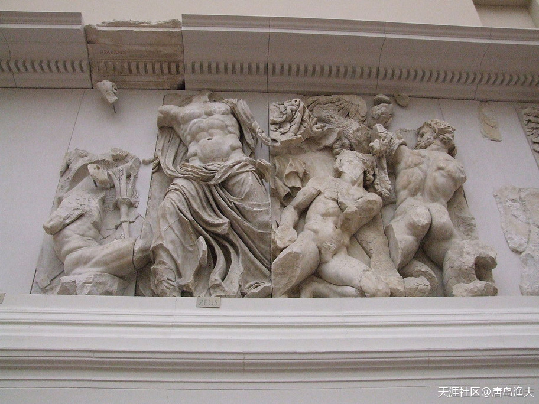

# 第四节 盖娅的复仇

## 盖娅的复仇（一）

`宙斯/Zeus`一直都忘不了，自己当年的那场婚礼。

那场婚礼是天王`宙斯/Zeus`与天后`赫拉/Hera`的大婚，这是一场政治婚礼。

婚礼上，宙斯非常荣幸地接待了希腊诸神第一代领导集团的二号人物——原始神`盖娅/Gaia`。当然我们知道，`盖娅/Gaia`不仅德高望重，号召力强，她还是宙斯本神的祖母兼外祖母，简称“老佛爷”。

很显然，有了`盖娅/Gaia`的支持，宙斯这个众神之神的位子，坐的异常稳固。

而革命老前辈`盖娅/Gaia`也投桃报李，借婚礼之机，送给了宙斯一棵苹果树。

这棵苹果树来自于大洋西海岸的一个苹果园，这棵苹果树的不同之处在于，树上结的都是`金苹果/Garden`。苹果树并不是随随便便的礼物，苹果园更是绝世之宝地。苹果园由三仙女（`赫斯珀里得斯/Hesperides`）看守，四位仙女的来头都不小，她们是夜神（黑夜神格化的原始神，和`盖娅/Gaia`一个辈分）的女儿。仙女们还带着一只看守苹果园的宠物，这个宠物的名字叫做拉冬。拉冬是一个怪物，怪物长着一百个龙的脑袋，号称“百头巨龙”。

当时的宙斯并没有想到，自己最终会和老佛爷反目为仇；

当时的`盖娅/Gaia`也没有想到，自己对孙子`宙斯/Zeus`的这番美意，并没有换来提坦之战的和平解决。

---

- `金苹果`其实就是`桔子`。而桔子正是明朝中国海员带过去的。桔子在西方种植的主要目的是用作航海提供维生素，以防败血症，毕竟那时候西方的茶叶比黄金还贵，所以就可以看出这个所谓希腊神话多久被创作出来了的。

- 桔子比起其他水果来，优点就是易存储，放久了的桔子，只要保证干燥（比如放在面粉中），烂的都比较少，最多就是比较干，但是依然可以提供维生素。

---

看守金苹果园的三仙女

> The Garden of the Hesperides 
—— by Frederick, Lord Leighton, 1892.

---

- 最左边的一位，感觉像是在刷朋友圈。

- 小的时候见过这些油画挂历，还以为是简单的西方美女图，竟不知是神仙。

---

## 盖娅的复仇（二）

`克洛诺斯/Kronos`是`盖娅/Gaia`最心爱的老儿子，也是`盖娅/Gaia`当年指挥镰刀夺位的革命战友。`宙斯/Zeus`最终取得提坦之战的胜利，老祖母两面押宝，却最终眼睁睁看着自己的老儿子`克洛诺斯/Kronos`被打入深渊地狱，永世不得超生。

当初在婚礼上，`盖娅/Gaia`给宙斯的面子有多大，如今在诸神面前丢的脸就有多大。

`盖娅/Gaia`怒了。

`盖娅/Gaia`决定，重新集结兵力，再次攻打`奥林波斯山/Olympus`。

`盖娅/Gaia`派出的领军人物，是自己战斗力最强的一个娃，也是希腊神界战斗力最强的一位神，他的名字叫做`堤丰/Typhaon`。堤丰是盖娅当年同深渊神`塔尔塔罗斯/Tartarus`搞外遇生出来的怪兽，是暴风的神格化。我们今天看到的英文中的`Typhoon 台风`一词，实际上词源就是`Typhaon`。

`堤丰/Typhaon`不仅是`盖娅/Gaia`与`塔尔塔罗斯/Tartarus`的娃，而且还是很多妖魔鬼怪的老爹，比如我们前文已经出场的`三头狗`、`高加索神鹰`、`百头巨龙拉冬`。还有后来在妖魔界混的风生水起的狮身人面`斯芬克斯/Sphinx`，头上顶着一脑袋毒蛇看谁一眼谁变石头的`美杜莎/Medusa`，这些都是提丰的娃。因此，`堤丰/Typhaon`又被希腊诸神尊称为`万妖之祖`，或`万魔之父`。

`堤丰/Typhaon`带着`盖娅/Gaia`爆表的怒气值前来挑战的时候，`宙斯/Zeus`并不在`奥林波斯山/Olympus`。

万妖之祖——`堤丰/Typhaon`

---

- `盖娅/Gaia`竟然也是万魔之祖奶奶。

- 男神、女神都在搞破鞋。

---

## 盖娅的复仇（三）

`堤丰/Typhaon`带着`盖娅/Gaia`爆表的怒气值前来挑战的时候，`宙斯/Zeus`并不在`奥林波斯山/Olympus`。

`宙斯/Zeus`正在`克里特岛/Crete`，同来自东方的少女`欧罗巴/Europa`缠绵悱恻。大战来临，宙斯离开女人的温柔乡，重整旗鼓投入战斗。

`堤丰/Typhaon`虽然来头很大，但雷声大雨点小，最终的战斗过程并不复杂。

`宙斯/Zeus`凭借自己的闪电长矛，对着`堤丰/Typhaon`一顿穷追猛打。闪电不断地打在`堤丰/Typhaon`身上，闪电吐出的烈火烧入了`堤丰/Typhaon`的心脏。最终`堤丰/Typhaon`大败而回。

被人扰了清梦的`宙斯/Zeus`，索性将`堤丰/Typhaon`也关进了`塔尔塔罗斯/Tartarus`地狱。

`堤丰/Typhaon`的失败，很显然并没有出乎`盖娅/Gaia`的意料之外。

因为很快，`盖娅/Gaia`就组织了第二次战役。

`盖娅/Gaia`压箱底的战斗序列，是由150个`癸干忒斯/Gigantes`组成的`巨灵族/Giants`，这些巨人们，是盖娅的原配老公`乌拉诺斯/Uranus`升天之际，留在盖娅身上的精血幻化而成。也就是说，被割去了丁丁而失去生育能力的`乌拉诺斯/Uranus`同志，最后的骨血就是`巨灵族/Giants`。

150个巨人的创业团队带头人有两个，分别叫做`阿尔库俄纽斯/Alcyoneus`和`波耳费里翁/Porphyrion`。

这一次，`巨灵族/Giants`来者不善。

`巨灵族/Giants` —— `癸干忒斯/Gigantes`作战团队

?> 我们首先要知道，过去的历史、现在、跟将来，是个连续体，是个联系非常紧密的连续体，起作用的是因果论。 
其实`哲学史`是白皮自己给`道家`翻译过去起的名字。这他妈的不贴切，因为不够抽象，不够形而上，白皮的毛病知道在哪里不？只会形而下，不会形而上。它们形而上的能力，几乎没有。 
`具象`，说大白话，叫钻牛角尖。 
`具象`与`抽象`，叫`须弥山`与`芥子`，都不可少。 
具象到极点，就不对了。不对了，绝对不对了，错了。

## 盖娅的复仇（四）

这一次，`巨灵族/Giants`来者不善。

这一场战争的规模，仅次于提坦之战。因此，这场这场战争又被称为 `癸干忒斯之战` 或者 `巨灵之战`。

然而这个时候，一则关于战争的预言，悄悄地成为了整个神界的舆论焦点。

这则预言说，人类英雄前来参战之时，就是巨灵们的战败之时。

人类英雄，就是生活在凡间的半人半神之躯。

这样的人类英雄存在吗？

当然存在。

不仅存在，而且还很多。

在`宙斯/Zeus`这个空前绝后的多情种子面前，人类英雄出现，这都不算事。

这一次站出来解决问题的人，叫做 `赫拉克勒斯/Hercules`。

?> **就是小时候动画片里的`海格力斯`**

巨灵之战

> Alcyoneus , Athena, Gaia, and Nike, detail of the Gigantomachy frieze, Pergamon Altar, Pergamon museum, Berlin.

巨灵之战2

> Zeus (center left) against Porphyrion (far right), detail from the Pergamon Altar Gigantomachy frieze, Pergamon Museum Berlin.

