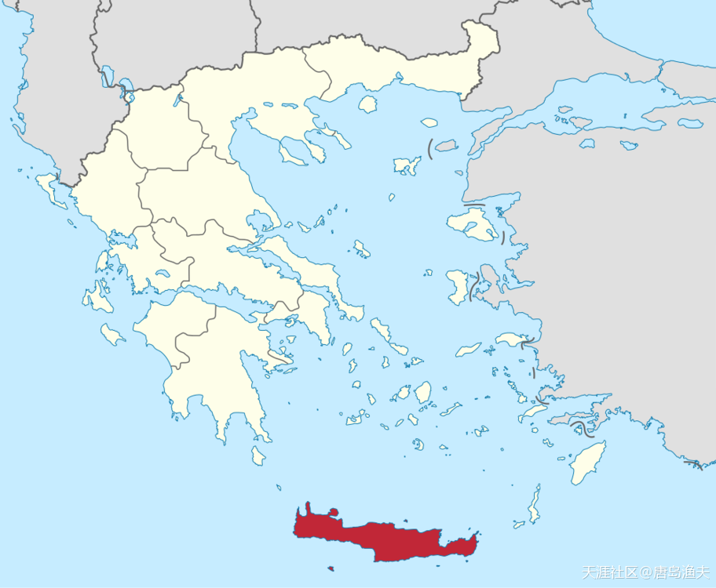
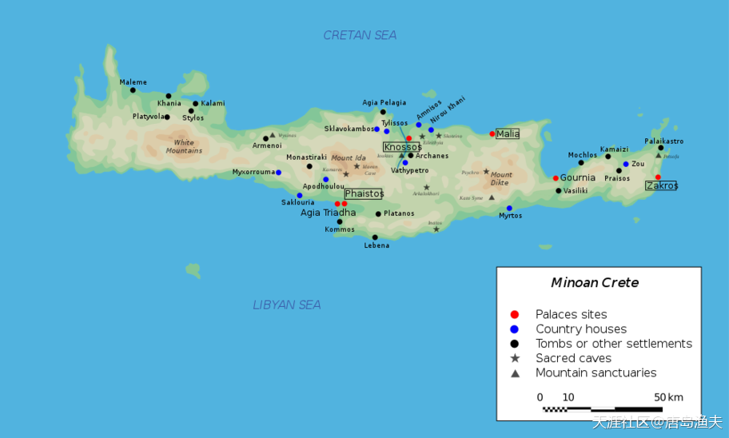
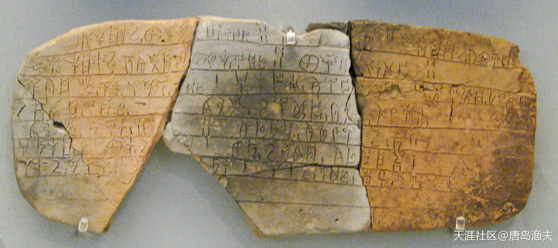
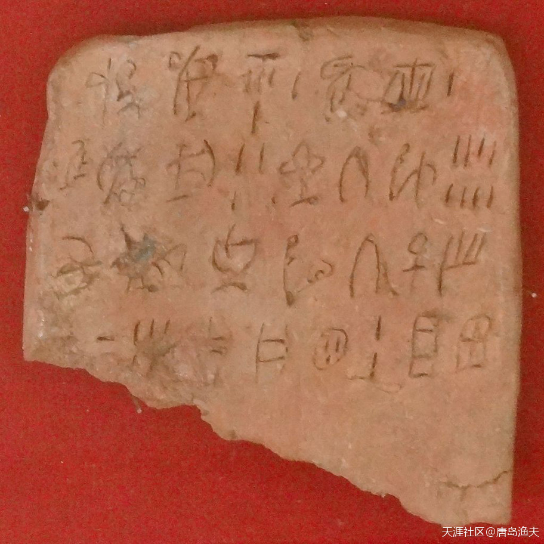

# 引言

现实中，欧洲文明的源头，其实跟我们前文讲到的`宙斯/Zeus`与`欧罗巴/Europa`公主的神话有一个非常巧合的地方，都是起源于`克里特岛/Crete`。起源于克里特岛的古代文明，被称为`克里特文明`。克里特文明的考古发掘已经进行的非常深入，然而即便到今天为止，却依然有太多太多的语焉不详。`古代欧洲人`或者说`古代希腊人`，以各种艺术形式记载了大量的`神话故事`、`英雄传说`，却唯独没有记载`正史`的习惯。

`克里特/Crete 文明`后来被`迈锡尼/Mycenae 文明`所取代，而且迈锡尼还成了克里特文明中`线形文字B`的继承者。正因为如此，线形文字B已经被学术界所破解。然而，早期克里特文明的`线形文字A`却一直是一个未解之谜，被称为国际考古学界的“圣杯”。

触及这个圣杯，对于我们来说，既不可望，也不可即。

或许，我们依然可以从英雄传说入手，去推测当年真实历史的原貌。

我们就从`克里特岛/Crete`开始。

`克里特岛/Crete`在欧洲的位置

从图上看，克里特岛的古文化遗迹还是很多的

线形文字B

?> 田、目、日、月……虽然我知道不该这么解读，但是看着就是像。 
 确实有点像。

线形文字A

?> 感觉是在泥坯上刻划(古代欧洲没竹子)，尖而且细。和中国宜兴茶壶的陶刻不一样。莫非那时候他们已经把铁杵磨成了针？有神助攻^O^

---------------------

希腊神话里这么多怪异的生物主宰江山，而且动辄还是“神”乱伦的产物。

这个如果从字面理解是污秽不堪的。但如果从基因实验角度看，就非常正常了。

开开脑洞，如果说古代人类和来地球祸害的外星生物打过交道并不奇怪。外星生物对古人类来说，确实像神一般有力量，而且也可能搞基因杂交。。。所以产生怪物？

- `规律0927`：至于什么神什么星座之类的 ，也很有可能是来自某个殖民星球。 所以西方的神话起源更像是西方人的祖先膜拜在外星人奴役之下的记录。
- `唐岛渔夫`：脑洞很大，哈哈。我个人倾向于西方主流神话在文艺复兴之后，有一次重新系统化，理论化的过程。
- `橘子柚子和橙子`：我认为西方神话是不断系统化和理论化的，也是一个不断的将地方神话纳入主体神话的过程。
- `唐岛渔夫`：说的好，跟渔夫想法差不多，是历朝历代很多年不断完善的一个体系。

埃及后也是嫁给她弟？

- `唐岛渔夫`：埃及的那个是真的，后期托勒密王朝，算是西方正史了。
- `我嫌雨点小2016`：波若波若蜜