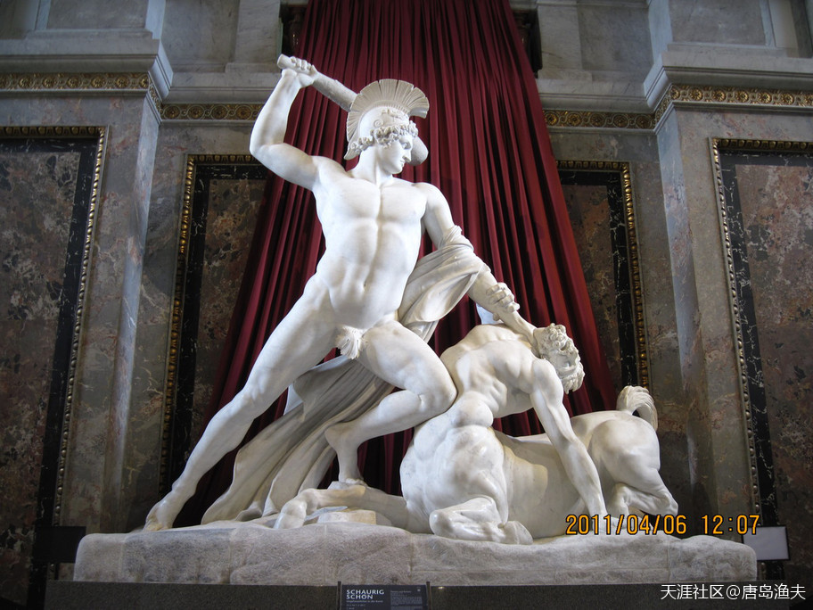

# 第二节 美女海伦

## 美女海伦（一）

行文到此，`忒修斯/Theseus`这个年少成名的高富帅，似乎并没有遇到太多人生挫折。非但没有任何挫折，`忒修斯/Theseus`几乎是人见人爱，花见花开——

美人相助，建功立业；

凯旋归来，老爹让位。

这个自从出场就自带主角光环的狠角色，几乎是一个完美的人设。

然而，对于真正的男人来讲，没有挫折的人生，无益于健全人格的塑造。年轻的时候对吃点亏，对于完美的人生几乎是必修课。

`忒修斯/Theseus`的人生磨砺，是从讨老婆开始的。

`忒修斯/Theseus`和他老妈`埃特拉/Aethra`

> Theseus and Aethra, by Laurent de La Hyre

## 美女海伦（二）

`忒修斯/Theseus`的第一任老婆，并不是`淮德拉/Phaedra`。`淮德拉/Phaedra`跟随姐姐叛变老爹，离开克里特之后，革命的意志并不坚决，于是半途又回到了岛上。至于说`淮德拉/Phaedra`嫁给`忒修斯/Theseus`，那已经是后话了。

`忒修斯/Theseus`的第一任老婆，名叫`希波吕特/Hippolyta`。

`希波吕特/Hippolyta`是`亚马逊/Amazon`女战士的首领，也是亚马逊女儿国的女王。

这里提到的`亚马逊/Amazon`，跟今天的所有关于亚马逊的概念都不同。这里的`亚马逊/Amazon`，是生活在小亚细亚半岛靠近黑海一侧的一个部族。这个部族有个特点——只有女人，而没有男人。女人们怀孕生下男婴，就送给别的部族或者干脆杀死，而只保留生下来的女婴。为了保证正常的传宗接代，这个部族会圈养一批男人，然而这些男人除了具备生殖功能之外，手和脚都要被砍掉，身份地位都还不如奴隶。`亚马逊/Amazon`部族的女人们个个身材高大，金发碧眼，敢爱敢恨，无论颜值还是战斗力都是顶级的，所以这个部族又被称为`亚马逊女战士`。

`亚马逊女战士们`崇拜战神`阿瑞斯/Ares`，也崇拜狩猎女神`阿尔忒弥斯/Artemis`（三处女神之一）。好战与贞洁，这两个基本属性的存在，让`亚马逊女战士`这个字眼在古希腊神话中地位独特，是一个不可或缺的浪漫存在。

受伤的亚马逊女战士

> Wounded Amazon of the Capitol, Rome

位于今天土耳其的亚马逊女战士雕像

> Amazons monument in Samsun, Turkey.

亚马逊女战士的日常

> Thalestris, Queen of the Amazons, visits Alexander 
——by Johann Georg Platzer

---

天涯上有一个老帖一直很火，楼主用大量事实证明了欧洲文明的虚伪和欧洲文明对华夏文明的剽窃，下面是链接，大家看看是否有道理。http://bbs.tianya.cn/m/post-worldlook-1838040-140.shtml

- 这个贴，写的不错，我也收藏了。因为，为欧洲人证伪，需要严谨的治学态度；正确认识欧洲人，同样需要搞清楚欧洲人思想逻辑的理论基础。这是同一件事情的两面，并不矛盾。

---

## 美女海伦（三）

亚马逊女王`希波吕特/Hippolyta`，早年曾经仰慕`赫拉克勒斯/Hercules`的英雄盖世，也曾经同英雄有过一段不打不成交的暧昧往事。然而后来`赫拉克勒斯/Hercules`封神，这段感情也就无疾而终。

正版的`赫拉克勒斯/Hercules`没有等到，结果等来了个盗版的。

`忒修斯/Theseus`慕名来到了亚马逊河岸，邀请亚马逊女王`希波吕特/Hippolyta`上船，然而女王刚刚登上甲板，忒修斯就起锚开船了。

少年英雄的`忒修斯/Theseus`连哄带骗，年纪渐长的`希波吕特/Hippolyta`半推半就。女王表面上的佯装愤怒，挡不住来自于身体上的极度诚实。

于是就这样，`希波吕特/Hippolyta`跟着`忒修斯/Theseus`顺水行舟来到`雅典/Athens`，由亚马逊的女王摇身一变成了`忒修斯/Theseus`的王后。

---

- 这有点像都市爱情小说味道。。。凄美爱情故事

---

与`赫拉克勒斯/Hercules`搞暧昧的`希波吕特/Hippolyta`

> Hercules Obtaining the Girdle of Hyppolita by Nikolaus Knüpfer

---

- 又是个丹麦人，画风都是偏北欧的。Nikolaus Knüpfer (1609 – 1655) was a Dutch Golden Age painter.

- 画风像极了鲁本斯

---

## 美女海伦（四）

可是，王后被骗走，`亚马逊女战士们/Amazons`愤怒了。

群情激愤的女战士们杀到了雅典城下，混战中，雅典王后`希波吕特/Hippolyta`被自己的亲姐姐`彭特西勒亚/Penthesilea`所误伤，一代女杰，香消玉殒。

第一场轰轰烈烈的骗老婆行动以悲剧收场，没有挡住`忒修斯/Theseus`对漂亮女人的孜孜以求。

既然骗婚不成，那就去抢婚。

这是国王的逻辑。

戎装出征的`亚马逊女战士/Amazons`

> Departure of the Amazons, by Claude Deruet, 1620

---

- 欧人也会给自己脸上贴金。玩神话可以，飞天神往的不稀奇。那地方那时代那么多战马兵器盔甲，类似我们的封神故事……

- 脚踏马蹬，看着玩的吧。

---

`忒修斯/Theseus`对`希波吕特/Hippolyta`的拯救

> Theseus saves Hippodameia, work by Johannes Pfuhl in Athens

## 美女海伦（五）

这一次，被抢的那个美艳女人，叫做`海伦/Helen`。

`海伦/Helen`来自于`斯巴达/Sparta`王国，是公主。

`海伦/Helen`的老爹叫做`廷达瑞俄斯/Tyndareus`，老妈叫做`勒达/Leda`，这两个人就是当时`斯巴达/Sparta`的国王和王后。传说`勒达/Leda`是一个非常漂亮的女人，结果被生性风流的`宙斯/Zeus`盯上了。于是，`宙斯/Zeus`采取了对`欧罗巴/Europa`公主相同的手段，变成了一个大白鹅，跟`勒达/Leda`结合才生出了`海伦/Helen`。因此，`海伦/Helen`的亲爹并不是`廷达瑞俄斯/Tyndareus`，而是`宙斯/Zeus`。

`宙斯/Zeus`的女儿们，往往都生的美貌，而美成像`海伦/Helen`这样的，更是人间神界少有。

`海伦/Helen`的美，本身并没有错。

错在那些无节制消费女人美貌的男人们。

`勒达/Leda`与大白鹅

> Leda and the Swan, 16th-century copy after the lost painting by Michelangelo

---

- 小巧的头手和脚与庞大不成比例的身体形成对比。

- 所以一直有这样的说法，他们（画家）最先掌握和运用小孔成像技术，在类似投影布上作画，其实就类似描红填色。因为广角镜原理，近处被超正常肉眼视觉放大。近代专门有画家和学者研究这事，还模拟还原实验证实吻合。

---

## 美女海伦（六）

失去第一任老婆`希波吕特/Hippolyta`的`忒修斯/Theseus`，正是空房难耐。而忒修斯在`雅典/Athens`的好朋友，`庇里托俄斯/Pirithous`的老婆恰好也刚刚离开人世。于是，两个好朋友就相约，一起去抢老婆。

`庇里托俄斯/Pirithous`和`忒修斯/Theseus`两个人相识多年，是共同经历过很多惊涛骇浪的正经老铁。当年在大名鼎鼎的古希腊大网红`伊阿宋/Jason`的带领下，古希腊聚齐了50位人间英雄，一道乘坐“阿尔戈号”去抢金羊毛。所谓`阿尔戈/Argo`，意思就是指当时的古希腊。我们今天所看到的希腊这个词，在当时还不存在。当时希腊半岛及整个爱琴海区域希腊化地区，最为著名的城市叫做`阿尔戈斯/Argus`。因此后来，整个区域都自称为`阿尔戈人/Argiver`。

`伊阿宋/Jason`率领的50个阿尔戈英雄里面，颇具艺术天分的神二代`俄耳甫斯`（光明之神`阿波罗/Apollo`的儿子）算一个，半人半神成名已久的`赫拉克勒斯/Hercules`斯算一个，而尚未成名的`忒修斯/Theseus`与`庇里托俄斯/Pirithous`也都双双名列其中。

抢金羊毛这事干的漂亮，那么抢老婆这个活，`庇里托俄斯/Pirithous`其实也不陌生。

他的前任老婆，其实基本就算是抢来的。

`阿尔戈号/Argo`

> The Argo (c. 1500–1530), painting by Lorenzo Costa

---

- 在地中海里划船，怎么都不会迷路的，除非划出了直布罗陀海峡，这也就是欧洲的船一直比中国厉害的原因，不象中国的船，只敢沿海岸走。

- 说得好。欧洲文明的诞生绝对不是偶然，商贸，海洋，劫掠，这都是关键字。古希腊是把爱琴海做内湖的，罗马帝国则放大爱琴海到地中海。后边讲地缘，都会系统来说。

- 温柔的贪狼 ：常识都不懂，爱琴海是个密布岛屿的内海，没有大风暴。

- 评论 温柔的贪狼 ：扯蛋，我不想说了，在爱琴海划船也是相当于湖里划船吧？只要你不划出直布罗陀海峡就行了。

- 叮当风云town ：湖里划船一样迷航找不到家在哪儿。阴天下雨起雾湖里样样有。大海里回不了家就等着渴死吧。

- 评论 叮当风云town ：古欧洲的船都带桨带帆的，三五天都能划到岸。

---

## 美女海伦（七）

`庇里托俄斯/Pirithous`的前任老婆`希波达弥亚/Hippodamia`，来自于古希腊中部山地勇猛善战的`拉庇泰/Lapiths`部族。

在`庇里托俄斯/Pirithous`迎娶`希波达弥亚/Hippodamia`的婚礼上，新娘的美貌引起来了半人马部族`肯陶洛斯人/Centaurus`的浓厚兴趣，于是半人马的肯陶洛斯人先下手为强，把新娘`希波达弥亚/Hippodamia`揽入怀中，准备抢走。突发事件，让`忒修斯/Theseus`和`庇里托俄斯/Pirithous`这两个好哥们怒不可遏，于是两个人并肩作战，在婚礼上同半人马部族大打出手。

最终结局，`肯陶洛斯人/Centaurus`被打跑，`庇里托俄斯/Pirithous`抢回美人，带回了`雅典/Athens`。

新娘固然抢的艰辛，但没想到娶回来没过多久，美人就撒手西去。

所以，这次合伙抢老婆，`忒修斯/Theseus`和`庇里托俄斯/Pirithous`就驾轻就熟。

为了抢老婆，`忒修斯/Theseus`和`庇里托俄斯/Pirithous`远征`斯巴达/Sparta`。

抢媳妇大战

> Battle Between the Lapiths and Centaurs 
by Giordano, Luca. 1634-1705

- 我们复习一下，前文提到的`赫拉克勒斯/Hercules`的授业恩师`喀戎/Chiron`，就是出身于半人马部族`肯陶洛斯/Centaurus`。

古希腊抢女人二人组——`忒修斯/Theseus`与`庇里托俄斯/Pirithous`

> Theseus and Pirithoüs Clearing the Earth of Brigands, Deliver Two Women from the Hands of their Abductors 
—— by Angelique Mongez (1806)

## 美女海伦（八）

为了抢老婆，`忒修斯/Theseus`和`庇里托俄斯/Pirithous`远征`斯巴达/Sparta`。

在`斯巴达/Sparta`，`忒修斯/Theseus`和`庇里托俄斯/Pirithous`两个人见到`海伦/Helen`的时候，`海伦/Helen`正在`阿尔忒弥斯/Artemis`的神庙向女神展示自己的曼妙舞姿。`海伦/Helen`的外貌本来已经惊为天人，再加上这婀娜多姿的身段。各自丧偶已久的两个异乡男人，终于按捺不住冲动的欲望之火。

两个大男人三下五除二，就把`海伦/Helen`带上了去`雅典/Athens`的路。

在路上，绅士的男人们用抓阄的方式决定，到底`海伦/Helen`归谁。并且约定，一旦有一方得到了`海伦/Helen`，到时就一起二次创业，再帮助失去`海伦/Helen`的一方抢一个女人做老婆。

抓阄结束，`忒修斯/Theseus`得到了`海伦/Helen`。

按照约定，`忒修斯/Theseus`和`庇里托俄斯/Pirithous`重整旗鼓，继续抢女人。

`海伦/Helen`

> Helen of Troy by Evelyn De Morgan (1898, London); 
Helen admiringly displays a lock of her hair, as she gazes into a mirror decorated with the nude Aphrodite.

`忒修斯/Theseus`抢`海伦/Helen`

> Helen Carried Off by Theseus 
——Giovanni Francesco Romanelli (1610–1662)

## 美女海伦（九）

按照约定，`忒修斯/Theseus`和`庇里托俄斯/Pirithous`重整旗鼓，继续抢女人。

这一次，`庇里托俄斯/Pirithous`的胃口更大，他要抢冥王`哈迪斯/Hades`的女人`珀耳塞福涅/Persephone`。要说，两个初生牛犊的年轻人，这第三次抢亲在逻辑上并没有太大的错误。因为，既然天王`宙斯/Zeus`的女儿可以抢，那么冥王`哈迪斯/Hades`的老婆为啥就不可以抢？

但很显然，年轻人的胃口很大，但能力与经验的增长速度并没有赶上胃口的脚步。

最终，两个人的行动失败，被关进了地狱。

大英雄`赫拉克勒斯/Hercules`及时出现，经过一番努力，最终救出了`忒修斯/Theseus`。而我们的另外一位抢亲专家`庇里托俄斯/Pirithous`，则被永远地留在了冥王的地盘当牛做马。

然而，人虽然活着回到了`雅典/Athens`。但在`忒修斯/Theseus`回来之前，雅典城已经发生了内乱，而绝世美人`海伦/Helen`，则被她的哥哥救回了`斯巴达/Sparta`。

`忒修斯/Theseus`抢亲二人组对，抓阄现场分`海伦/Helen`

> Theseus and Pirithous playing dice game to marry Helen

---

- 我去，海伦在一旁好像还挺高兴？

- 一脸娇羞？

---

冥后`珀耳塞福涅/Persephone`

> Archaeological Museum in Herakleion. Statue of Isis-Persephone holding a sistrum. Temple of the Egyptian gods, Gortyn. Roman period ( 180-190 A.C.)

---

- 鼻子没坏，差评，不够专业。

---

## 美女海伦（十）

然而，人虽然活着回到了`雅典/Athens`。但在`忒修斯/Theseus`回来之前，雅典城已经发生了内乱，而绝世美人`海伦/Helen`，则被她的哥哥救回了`斯巴达/Sparta`。

`忒修斯/Theseus`这一辈子，都在效仿自己的偶像`赫拉克勒斯/Hercules`，无奈人不能跟命争。前辈`赫拉克勒斯/Hercules`一直有`宙斯/Zeus`的背后相助，成长之路上可以跳级可以提干还可以免试入学。但`忒修斯/Theseus`从生下来就是一个说不清源流的口头上的半人半神。

如果`赫拉克勒斯/Hercules`算是个根正苗红的`神二代`，那么`忒修斯/Theseus`充其量算是凡间落魄贵族之后。`忒修斯/Theseus`这辈子战天斗地，但奥林波斯众神那里他没有深厚的人脉，也没有谁特别垂青和提携这个晚生后辈，包括他传说中的野爹`波塞冬/Poseidon`。

因此，山寨版的赫拉克勒斯——`忒修斯/Theseus`，最终的下场并没有比自己的好兄弟好战友`庇里托俄斯/Pirithous`强了多少。他虽然安全回到了故乡`雅典/Athens`，后来又娶到了来自克里特的另外一个公主`淮德拉/Phaedra`，但这位人间英雄最终没有逃过政敌的暗杀，稀里糊涂走完了人生之路。

而九死一生回到`斯巴达王国/Sparta`的美女`海伦/Helen`，则在多年以后卷入了更大的一场纷争。

`忒修斯/Theseus`的又一个女人——`淮德拉/Phaedra`

> Phaedra (1880) by Alexandre Cabanel

我们再回忆一下，当年初出茅庐的`忒修斯/Theseus`，大战`人头马`

> Theseus Defeats the Centaur by Antonio Canova (1804–1819), Kunsthistorisches Museum