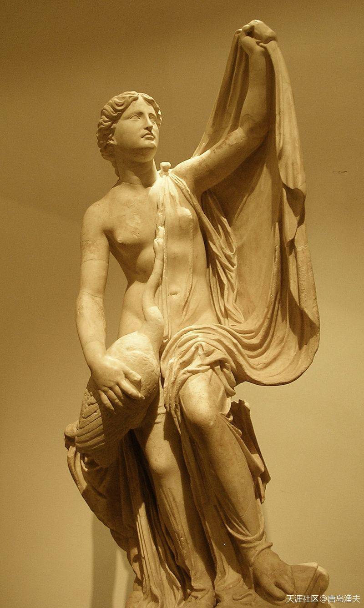
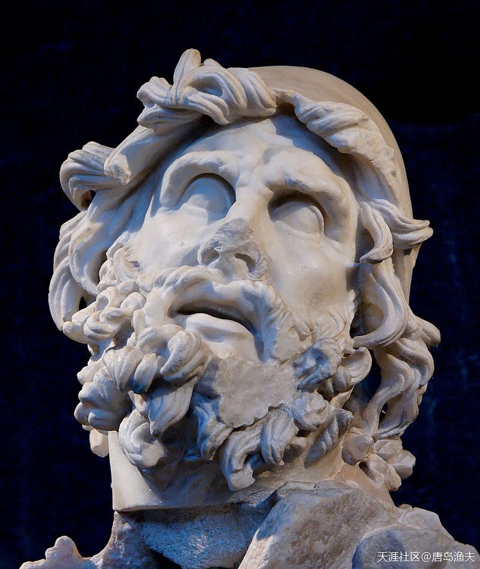
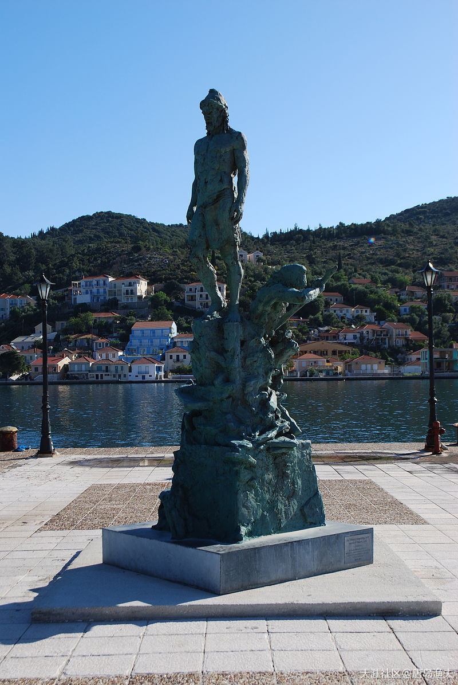
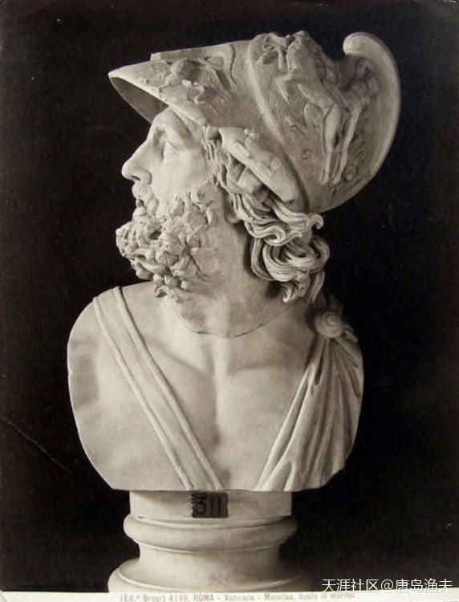
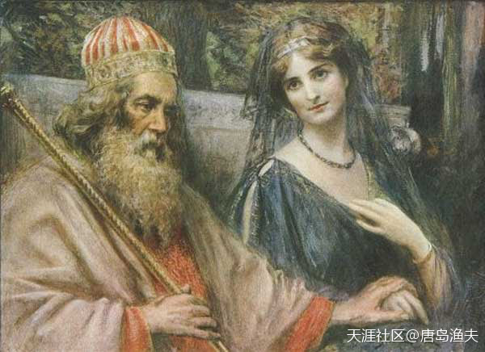
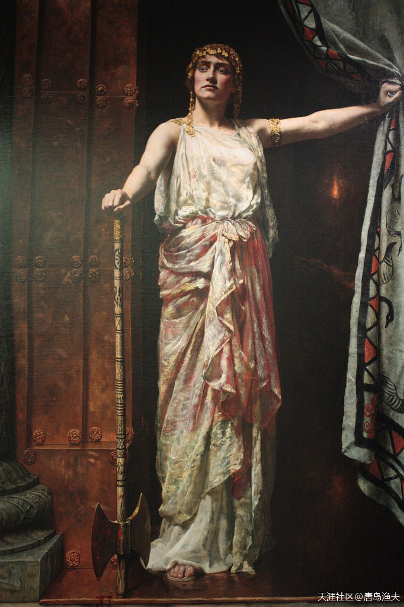
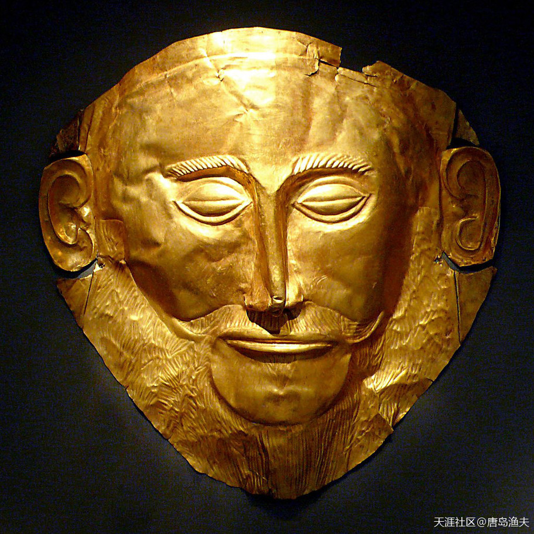
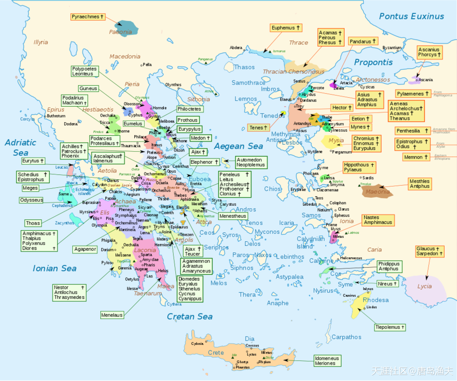
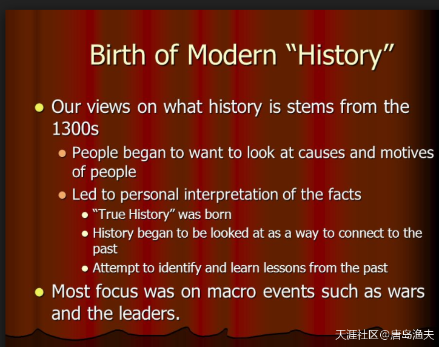
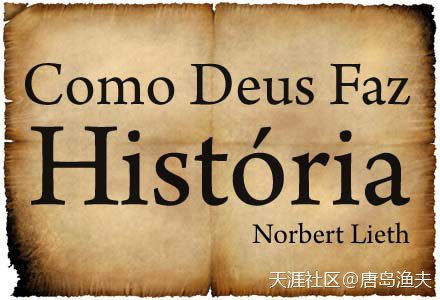

# 第三节 迈锡尼王国

## 迈锡尼王国（一）

经过`忒修斯/Theseus`和自己的老铁抢亲这么一场折腾，`海伦/Helen`的名声愈发响彻整个`古希腊`。

求亲的人，也是踏破了`斯巴达/Sparta`王`廷达瑞俄斯/Tyndareus`的门槛。

求亲的人，都是希腊半岛和爱琴海一带有头有脸的人。贵族子弟们的身后，站着各自的家族，王国，背景由近及远，还可以隐约看到他们的密密麻麻军队，战船。`廷达瑞俄斯/Tyndareus`从来没有这么头痛过，之前他曾经因为`海伦/Helen`的美貌而无比骄傲。而今天，他清楚地知道，如果这件事情处理不好，只会给自己带来无穷无尽的灾祸。

一把岁数的老爹心里有数，`海伦/Helen`如今已经不再仅仅是自己的女儿，或斯巴达的公主。她现在是一种象征，是整个古希腊的美丽的代言人。得到她的人将拥有无比的荣耀，而竞争失败的人，将会颜面扫地，甚至反目成仇。

怎么办？难题摆在了老国王的面前。

`勒达/Leda`与大白鹅

> 提亲的人虽然多，但`海伦/Helen`的亲爹不是`廷达瑞俄斯/Tyndareus`，而是大白鹅`宙斯/Zeus`  
Leda with the Swan, a restored Roman copy, perhaps after an original by Timotheus (Museo del Prado)

## 迈锡尼王国（二）

站出来解决问题的，是一个叫做`奥德修斯/Odysseus`的年轻人。`奥德修斯/Odysseus`是美女`海伦/Helen`诸多的求婚者之一，也是希腊半岛西端的`伊塔卡岛/Ithaca Island`的王子。`奥德修斯/Odysseus`是当时古希腊一位远近闻名的智者，素来以多谋善断著称。

`奥德修斯/Odysseus`的解决方案是，求婚者中最终的人生赢家，必须由`海伦/Helen`本人来选择。而在`海伦/Helen`做出选择之前，所有的求婚者都要起誓，对`海伦/Helen`未来的丈夫永不动武，并在有必要时，帮助`海伦/Helen`的丈夫渡过难关。

`奥德修斯/Odysseus`当时并不知道，多年以后，他会成为一个传奇人物。他的聪明才智，将会被用之于更加辽阔的疆场之上，他的名字将会被万古传颂。而`奥德修斯/Odysseus`所确切知道的是，在当时的场合和时机之下，他的小小建议，最终打开了所有人的心结。

`奥德修斯/Odysseus`的方案，得到了所有人的赞同，老国王喜笑颜开。

`奥德修斯/Odysseus`

> Head of Odysseus from a sculptural group representing Odysseus blinding Polyphemus. Marble, Greek, probably 1st century AD. 
——From the villa of Tiberius at Sperlonga. Museo Archeologico Nazionale in Sperlonga

---

- 鼻子梗，现身江湖……

- 额……太坏了你，明火执仗，欺负谁呢？

---

`奥德修斯/Odysseus`雕像，在希腊伊塔卡岛

> Odysseus' statue in Vathy.

---

- ：文革后再版的希腊神话和传说叫`俄底修斯`，据说是文革后期就开始重新发行名著，但是我没看过。

- `奥德赛`

---

## 迈锡尼王国（三）

然而，`奥德修斯/Odysseus`用自己的智慧夺人眼球，但美女`海伦/Helen`行走江湖靠的并不是聪明的大脑，她最终并没有选择`奥德修斯/Odysseus`这位智者，而是遵从美人自己的眼光，选择了一位所有求婚者中最为英俊的贵族子弟——`墨涅拉奥斯/Menelaus`。

`墨涅拉奥斯/Menelaus`是`阿伽门农/Agamemnon`的弟弟，`阿伽门农/Agamemnon`则是后来的`迈锡尼/Mycenae`国王。

`迈锡尼/Mycenae`这个名字，我们前文已经出现过了。

大英雄`赫拉克勒斯/Hercules`的祖国，就是`迈锡尼/Mycenae`。

`迈锡尼/Mycenae`之王的英雄血脉，来自于英仙星座`珀尔修斯/Perseus`，后来因为天后`赫拉/Hera`的插手，阴差阳错，`珀尔修斯/Perseus`的孙子`欧律斯透斯/Eurystheus`代替`赫拉克勒斯/Hercules`，成了新的`迈锡尼/Mycenae`国王。`赫拉克勒斯/Hercules`为新国王`欧律斯透斯/Eurystheus`所猜忌，费尽千辛万苦，完成了`欧律斯透斯/Eurystheus`交代的`十二项任务`。`赫拉克勒斯/Hercules`死后，最终成为奥林波斯山上的`大力神`。

?> 这段话绕口令一般。

`墨涅拉奥斯/Menelaus`

> Marble bust of Menelaus, Vatican Museums

`海伦/Helen`与她的正经老公`墨涅拉奥斯/Menelaus`

> Menelaus and the beautiful Helen（1901） 
——by Jan Styka

## 迈锡尼王国（四）

在`赫拉克勒斯/Hercules`死后，自知得位不正的`欧律斯透斯/Eurystheus`，开始对赫拉克勒斯的子孙们进行追杀。并且，在战争过程中，欧律斯透斯连同他自己的儿子们，全部兵败被杀。于是，`迈锡尼/Mycenae`的`珀尔修斯/Perseus`王朝宣告结束。

`欧律斯透斯/Eurystheus`出征时，留守迈锡尼的部将`阿特柔斯/Atreus`宣布继承王位，这就是`迈锡尼/Mycenae`第二王朝。

`阿特柔斯/Atreus`，就是`阿伽门农/Agamemnon`和`墨涅拉奥斯/Menelaus`两个人的老爸。

`阿特柔斯/Atreus`登位之后，爆发了和自己的弟弟`梯厄斯忒斯/Thyestes`之间的夺位内战，内战中，`阿特柔斯/Atreus`被杀，`梯厄斯忒斯/Thyestes`篡位成功。

`墨涅拉奥斯/Menelaus`依靠自己的英俊帅气，征服了美人`海伦/Helen`的心，也为自己和`阿伽门农/Agamemnon`获得了卷土重来的机会。`墨涅拉奥斯/Menelaus`很快和`海伦/Helen`举行了大婚，而`阿伽门农/Agamemnon`则在同时娶了`海伦/Helen`的姐妹`克吕滕涅斯特拉/Clytemnestra`。

亲兄弟娶了亲姐妹，一时之间传为佳话。

`海伦/Helen`的亲姐妹——`克吕滕涅斯特拉/Clytemnestra`

> Clytemnestra, John Collier, 1882

---

- 这副画一副腐朽的味道，像从陵墓里爬出来的一样。

- 谢谢关注。后边会讲，之所以感觉怪怪的，因为这是表现的谋杀亲夫现场。

---

## 迈锡尼王国（五）

新鲜出炉的老岳父，`斯巴达/Sparta`王`廷达瑞俄斯/Tyndareus`，带领自己的两位东床快婿`阿伽门农/Agamemnon`兄弟挥师杀回`迈锡尼/Mycenae`。在迈锡尼的战斗中，`阿伽门农/Agamemnon`兄弟的叔叔`梯厄斯忒斯/Thyestes`兵败被杀。`阿伽门农/Agamemnon`替父报仇，迈锡尼第二王朝的大宗复国成功。

此战之后，`阿伽门农/Agamemnon`成为了新的`迈锡尼/Mycenae`之王。

`廷达瑞俄斯/Tyndareus`死后，`海伦/Helen`的老公`墨涅拉奥斯/Menelaus`继承了`斯巴达/Sparta`王位，成为`斯巴达/Sparta`之王。

`阿伽门农/Agamemnon`兄弟两个，成为整个古希腊地区最为重要的两支政治力量。

而`阿伽门农/Agamemnon`的野心也在慢慢膨胀。

`阿伽门农/Agamemnon`已经不满足于做`迈锡尼/Mycenae`之王，他要做全希腊的王中王，就像奥林波斯山上的众神之神宙斯一样，`阿伽门农/Agamemnon`要做人间的诸王之王！

为了实现这样的夙愿，`阿伽门农/Agamemnon`要等待一个机会，或者说一个借口。

所谓的文物——“阿伽门农金面具”

> The so-called Mask of Agamemnon  
——discovered by Heinrich Schliemann in 1876 at Mycenae, now believed to pre-date the legendary Trojan War by 300 years

这个所谓的“文物”，想都不用想，绝对是个十足的假货，现代仿制品。因此，就连西方文化本身，也不敢承认这就是`阿伽门农/Agamemnon`用过的东西，而是加上一个单词`所谓`——`so called`。

（`荷马史诗/Homer's Epic`中的）古希腊全地图——`Homeric Greece`.

- 从`迈锡尼/Mycenae`文明以及`阿伽门农/Agamemnon`开始，西方历史进入了一个非常尴尬的时代。

- 之前的神话故事，英雄传说好歹可以放肆地讲，放肆地编，甚至后期美化都没关系，不用考虑后果。

- 但从`阿伽门农/Agamemnon`开始，`神话故事`——`英雄传说`——`欧洲历史`，这个体系将会形成彻底的“硬着陆”。

- `迈锡尼/Mycenae`文明原本就是源自`荷马史诗/Homer's Epic`，考古支撑说服力有限，欧洲人不承认不甘心，承认了又拿不出证据。

- 只能进入当婊子立牌坊，立牌坊当婊子的无限自我辩解死循环之中，到今天也是糊里糊涂一锅粥。

- 那么正因为如此，渔夫依然把这些故事，放在神话之中讲。

- 包括后边的所谓`特洛伊/Troy`，所谓`王政罗马时代`。

?> 能编出那么复杂的图，也难为西方历史学家们了啊……

在今天的英文词汇中，“历史”这个单词History，与“故事”这个单词Story，看上去毫无关联。

然而其实，我们都被西方人的文字游戏骗了——"Story"与“History”同源，原本都是“故事”的意思。

换句话说，西方人的概念中，就没有“历史”这个说法，他们形成“历史”这个概念，已经很晚了。

- 法语单词`histoire`就是故事的意思哦

- 14世纪才萌生现代历史观，那些与现代人体结构有极高相似度的雕塑也不知道咋来的。

好的，毕竟英语太年轻，从有英语到今天也不过一千多年，之前还是野蛮人阶段。

那我们看英语的祖宗——拉丁语。

在今天的西语葡语这些拉丁语遗珠中，“Historia”这个词的概念，既是“历史”，又是“故事”。

换句话讲，最大程度保留了古拉丁语原貌的西语，葡语，到今天还是“历史”与“故事”不分家。

原汁原味的拉丁原貌，恰好印证了我们的猜测——英文中的"Story"与“History”是后期西方人粉饰过的词汇。

- 图中的这句是葡语，意思是，上帝如何制造历史？

- 还能借机会学习葡语，真是赚大了:)

- **故事就是旧的，已故的事，和历史可以同义。不过中文语境，习惯了故事是编的，而不是历史。**

