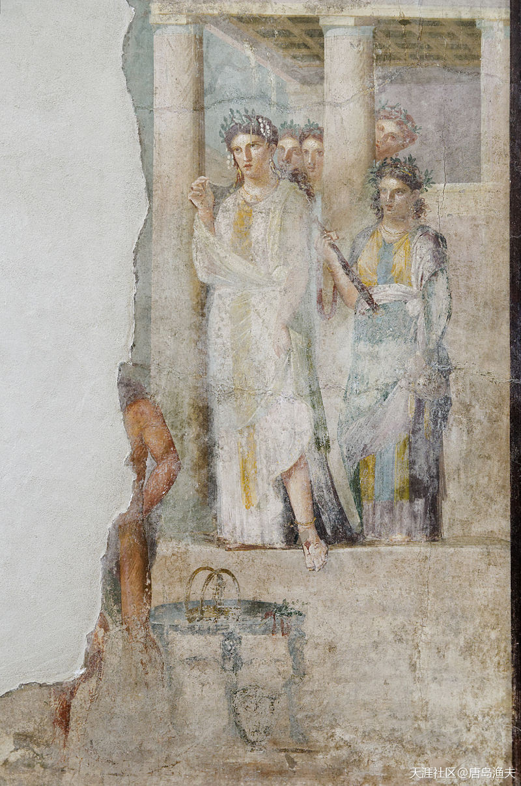

# 第三节 兵发特洛伊

## 兵发特洛伊（一）

在`阿伽门农/Agamemnon`的设想里面，远渡重洋，一举荡平`特洛伊/Troy`应该不是什么难事。

`希腊联军/Greek Coalition`自成立以来，联军方面号角连天，旌旗猎猎，战船的桅杆遮天蔽日。这样的壮观景象，让`阿伽门农/Agamemnon`心生横槊赋诗，对酒当歌的豪迈之情。

然而，`阿伽门农/Agamemnon`显然低估了战争的复杂性。而且，因为一次偶然的桃色事情就轻易地大起刀兵，仓促之间也缺少了很多必要的战前准备，比如证明自己合法性的`战斗檄文`，验证战争可行性的`情报收集`、`气候水文`、`兵马钱粮`等等。扯虎皮拉大旗容易，真正的战争机器一旦开动，事无巨细则都要有人去关心。否则，一个细节的疏忽，就有可能导致全盘皆输。

回顾一下——`荷马史诗/Homer's Epic`全地图

?> 真实服了，批大点地方发生的一场械斗，居然能写成史诗。 
相当于渤海湾大战。

## 兵发特洛伊（二）

打进`特洛伊/Troy`，活捉`帕里斯/Paris`，这话太好说了。

但尴尬的是，口号喊得山响，联军连去`特洛伊/Troy`的路都不知道该怎么走。

扬帆远航之后不久的一天，联军终于看到了一片陆地。

一脸懵逼的希腊联军，一脸懵逼地踏上了这块陆地，马不停蹄地跟同样一脸懵逼的对方军人开了一仗，勇猛的`阿喀琉斯/Achilles`带着长矛加入战斗。仗打到最后，战场上血流成河，大英雄的长矛刺入了敌军主将的大腿。就在这个时刻，联军却突然发现对方居然并不是他们要找的敌人，而这里也不是特洛伊。

- 我是谁？
- 我在哪里？
- 发生了什么？

一脸懵逼的`阿喀琉斯/Achilles`——可惜了一脑袋定好型的啫喱水

?> 皮特可是欧美人眼中的pretty boy 
：说实话，希腊人金发碧眼的应该有，但绝对不会多。把古希腊排名第二的大神搞成金发碧眼，欧洲影视剧的舆论导向是有自己考量的。

## 兵发特洛伊（三）

联军登陆的地方，叫做`米西亚/Mysia`。

被`阿喀琉斯/Achilles`刺伤的人，叫做`忒勒福斯/Telephus`。

`忒勒福斯/Telephus`是`赫拉克勒斯/Hercules`的众多儿子们之一，也是`特洛伊/Troy`国王`普里阿摩/Priam`的女婿。`忒勒福斯/Telephus`的双重身份，让他在做出个人选择的时候变得十分为难。他并不愿意同联军兵戎相见，当然也不愿意带着自己的人民同老岳父`普里阿摩/Priam`开战。

不过，此时此刻的十万希腊联军，就如同一群无头的苍蝇，唯一能够给他们带来方向的人，毫无疑问就是`忒勒福斯/Telephus`。

然而，`忒勒福斯/Telephus`的腿伤十分严重，就算他想为联军出力，也是心有余而力不足。

说话间，联军撤出`米西亚/Mysia`，无可奈何地退回到了出发时的海湾，`奥利斯/Aulis`。

眼看人心惶惶，漫无目的的希腊联军就要各回各家，各找各媳妇。

站出来解决问题的人，又是`奥德修斯/Odysseus`。

大英雄`赫拉克勒斯/Hercules`与婴儿时代的`忒勒福斯/Telephus`

> Heracles with the infant Telephus and deer, mid second century AD. 
——Paris, Louvre MA 75  

参考前文几位男同学的发言，讲到这里又要有人说，找到自信了。。。其实渔夫想说，我们对西方人生理的误解，跟心理的误解一样多。 
其实要找到自信也非常简单，多看看 德国 GGG公司的影片就行了。 ： ) 
为什么大英雄都包皮过长？

发一张小亚细亚半岛的地图，看看大家能不能找到`米西亚/Mysia`

## 兵发特洛伊（四）

`奥德修斯/Odysseus`告诉`阿喀琉斯/Achilles`，只有`阿喀琉斯/Achilles`长矛上面的铁锈，才能救治`忒勒福斯/Telephus`的腿伤。要说这聪明人就是触类旁通——现在的问题是已知能够刺伤大腿的就是长矛，能够腐蚀长矛的就是铁锈。根据敌人的敌人就是朋友，这个朴素的辩证法进行推理。那么能够治疗腿伤的，可不就是铁锈。

铁锈涂到了`忒勒福斯/Telephus`的大腿上，药到病除。

重新获得健康的`忒勒福斯/Telephus`，决心为十万联军带路，向`特洛伊/Troy`开拔。

这一次的重整旗鼓，又是不顺。

因为万事俱备，只欠东风。

`阿喀琉斯/Achilles`为`忒勒福斯/Telephus`疗伤

> Achilles (right) scapes rust from his spear on the wound of the seated Telephus, c. first century BC. Marble bas-relief, from the House of the Relief of Telephus, Herculaneum, Naples, National Archaeological Museum 6591

【路线图】传说中的`奥利斯港/Aulis`，到现代被西方学者强行认证过的`特洛伊/Troy`城遗址

> 为防止走错路，用谷歌地图重新设计陆路攻击路线。 
开车十个小时，解决问题。 
海上直线距离，跟天津到大连比怎么样？

---

回应一下女侠的问题：海上直线距离，跟天津到大连比怎么样？

- 从奥利斯港出发，到传说中的特洛伊遗址，比较从天津出发到大连
- 备注：同一比例尺比较，图中的标注时间是从奥利斯港附近机场开始计算的全程用时，含转飞机时间
- 换句话讲，如果荷马史诗有一定的真实性，现代考古强行认定的特洛伊遗址也有一定的真实性。
- 那么这个打了十年的人神共愤的`特洛伊之战/Trojan War`，其实就是从天津远征大连(感谢女侠的idea)

---

怎么讲得都是是神话故事？准备什么时候开讲欧洲历史？

?> 谢谢关注。这个问题前面回答了很多遍了，欧洲人给我们看的历史，是依据现代考古。但是他们心中的真正历史，都是依据神话传说。我标题写的是神话，但是欧洲人排序，可都是把从克里特到迈锡尼，从特洛伊到罗马统统排进正史的。我们读他们的历史，为啥要按照他们设计的思路走？

---

## 兵发特洛伊（五）

万事俱备，只欠东风。

古代的战船出发，要靠船帆，没有风的帮助，根本没法成行。

第二次踏上征程，希腊联军被巨大的逆风困在了海港无法动弹。

海上刮起了巨大的逆风，不是因为希腊联军倒霉，而是因为`阿伽门农/Agamemnon`当年曾经得罪了奥林波斯的狩猎女神`阿尔忒弥斯/Artemis`。`特洛伊之战/Trojan War`的战前，`阿伽门农/Agamemnon`杀死了原本要献祭给狩猎女神`阿尔忒弥斯/Artemis`的神鹿，并且吹嘘自己的枪法堪比女神。这件事情，让狩猎女神心怀怨恨。这一次，狩猎女神就施展了自己的神力，将希腊联军困在了海港之中。而女神也派人给`阿伽门农/Agamemnon`带话，如果想让舰队驶出港口，就必须拿`阿伽门农/Agamemnon`的亲生女儿`伊菲格涅娅/Iphigenia`来献祭。

`阿伽门农/Agamemnon`这个人的性格虽然有点不堪，但`迈锡尼/Mycenae`的公主`伊菲格涅娅/Iphigenia`却深明大义，具备极高的个人觉悟。

为了联军的胜利，为了父亲的荣誉，也为了帮助绿帽子老叔`墨涅拉奥斯/Menelaus`抢回自己的亲大婶`海伦/Helen`，小小年纪的`伊菲格涅娅/Iphigenia`甘愿献出自己的生命。

狩猎女神`阿尔忒弥斯/Artemis`

> Artemis with a hind, better known as "Diana of Versailles". 
——Marble, Roman artwork, Imperial Era (1st-2nd centuries CE). Found in Italy.  
狩猎女神`阿尔忒弥斯/Artemis`是奥林波斯十二主神之一，也是三处女神之一。 
其实`阿尔忒弥斯/Artemis`这个名字，也就是对应到`罗马神话`中的狩猎女神`黛安娜/Diana`。

`伊菲格涅娅/Iphigenia`

> Iphigenie (1862) by Anselm Feuerbach

`阿尔忒弥斯/Artemis`劫法场

> François Perrier's The Sacrifice of Iphigenia (17th century), depicting Agamemnon's sacrifice of his daughter Iphigenia

变成女神祭司的`伊菲格涅娅/Iphigenia`

> Iphigenia as a priestess of Artemis in Tauris sets out to greet prisoners, amongst which are her brother Orestes and his friend Pylades; a Roman fresco from Pompeii, 1st century AD

## 兵发特洛伊（六）

祭坛已经设好了，却出现了劫法场的一幕。

狩猎女神被慷慨赴死的女孩`伊菲格涅娅/Iphigenia`所感动，祭祀之前，将女孩的身体调换成了一头鹿。而`伊菲格涅娅/Iphigenia`也因祸得福，从此成了狩猎女神`阿尔忒弥斯/Artemis`的女祭司。

`阿伽门农/Agamemnon`和狩猎女神，相逢一笑泯恩仇。

逆风解除，大军重新出征。

这一次，在`忒勒福斯/Telephus`的帮助下，希腊联军顺利到达`特洛伊/Troy`。

`特洛伊/Troy`王国，老国王`普里阿摩/Priam`，以及`赫克托尔/Hector`和`帕里斯/Paris`兄弟们严阵以待。

`特洛伊之战/Trojan War`的前哨战，抢滩登陆，率先爆发。

## 兵发特洛伊（七）

`特洛伊之战/Trojan War`的前哨战，抢滩登陆，率先爆发。

联军十万，显然不是来钓海鱼的，他们的目的很明确，就是上岸拿下特洛伊。

登陆战持续一天，以联军的全面胜利而告终。`特洛伊人/Trojan`虽然退回城内，但勇猛的`赫克托尔/Hector`勇冠三军，左冲右突，初露锋芒。希腊联军冲上了海岸，但也付出了不小的代价。

大战之前，争取和平的努力还是是必要的，毕竟战争机器一旦开动，流血与牺牲是不可避免的。即便是最开始希望开战的`阿伽门农/Agamemnon`，如果能够成功拿到自己想要的东西，又在全希腊所有城邦面前树立了权威，他也未必真的希望动武。

战争永远是为政治服务的，如果能够达到政治目的，流血则毫无必要。

抢滩登陆战的第二天，智者`奥德修斯/Odysseus`，还有事件漩涡中央的`墨涅拉奥斯/Menelaus`，领命前往`特洛伊/Troy`城内和谈。

`赫克托尔/Hector`初露锋芒

> 咋地？不服气？想打架？早说！

`墨涅拉奥斯/Menelaus`剧照

## 兵发特洛伊（八）

政治斡旋非常失败。

`帕里斯/Paris`虽然做了非常令人不齿的事情，但城下之盟这样的羞辱，老王`普里阿摩/Priam`显然无法接受。如果政治谈判发生在希腊联军成军之前，那么无论何种和谈条件都有可能为双方所接受。然而`阿伽门农/Agamemnon`借力打力，希腊人不宣而战，大军浩浩荡荡远征特洛伊，又在滩头首战中打了`特洛伊人/Trojan`一个出其不意，那么在这种情况下逼特洛伊就范，这样的和谈并不具备最起码的互信。退一步讲，如果老王`普里阿摩/Priam`在这种情况下答应希腊人的条件，那么他在全特洛伊人心目中的地位也会一落千丈，政治上也就再也没有翻身的可能。所以，`阿伽门农/Agamemnon`借战争达到号令全希腊的政治图谋，刚好和老王`普里阿摩/Priam`的政治现状是相悖的，不可共生的。

`特洛伊人/Trojan`决定同仇敌忾，一致对外。并且，他们认为希腊诸神必将协助`特洛伊/Troy`。

`特洛伊之战/Trojan War`，宣告爆发。

战争的残酷，体现在了特洛伊城墙之坚固，也体现在了希腊联军意志之顽强。在`阿喀琉斯/Achilles`的率领之下，联军虽然无法打破特洛伊的主城，但周边的卫星城则无法逃脱希腊人的潮水般的进攻。

`普里阿摩/Priam`剧照

`阿伽门农/Agamemnon`剧照

---

- 这剧也是有政治隐喻的，只不过咱们中国人看不出来。`古希腊`和`古罗马`都是典型地中海白人文明，但剧中很多白人都是日耳曼文化做派，日耳曼种族特征。

---

`古希腊的人体雕塑`不得不承认是唯美的。在这一方面，汉文明是无法相比的。

- `唐岛渔夫`: 谢谢兄台关注。假设我们今天看到的欧洲文物是可信的，那么欧洲文明一脉相承的艺术风格就是写实。这里有个问题，欧洲文明发展历程短，第一他可以学习的参考模板很多，第二他保留了很多艺术发展早期特点。只说雕塑，我们只看考古依据的话，兵马俑就是写实的，只不过后来中国人放弃了写实，改成了写意而已。

- `唐岛渔夫`: 写实一直是比较低级的艺术，欧洲绘画发展到梵高，才有点写意了。

---
