# 第五节 沙场斗将

https://bbs.tianya.cn/m/post-worldlook-1865442-41.shtml

## 沙场斗将（一）

大英雄`阿喀琉斯/Achilles`的暂时离队，让第十年的战争充满了无数种悬念与可能。

这一年中，两场著名的单挑引人注目。

中国古代的沙场斗将，换了时空人物，穿越到了古希腊。

`特洛伊之战/Trojan War`，说白了最初就是因为一个女人，`海伦/Helen`。

而围绕`海伦/Helen`的两个男主角，一个是被戴了帽子的`墨涅拉奥斯/Menelaus`，一个是隔壁那个猥琐的老王`帕里斯/Paris`。

解铃还须系铃人。

仗打了九年还没有分出胜负，那就用男人的方式决斗吧。

老帕赢了，联军退兵；

老墨赢了，城下之盟。

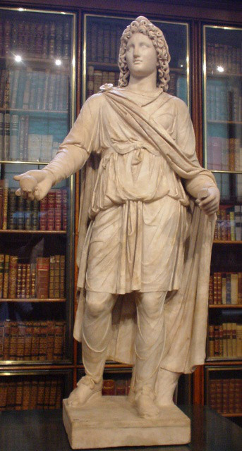

`帕里斯/Paris`在罗马人心目中的标准像

> Paris, in "Phrygian dress", a second-century CE Roman marble (The King's Library, British Museum) 
这个雕像，是罗马人按照自己的想法给`帕里斯/Paris`上的正装，后文还会讲，西欧诸国和`特洛伊/Troy`的联系。 
oceanary3：`Phrygian式`的服饰是有特殊寓意的 
评论 oceanary3：没错，历史都是政治，艺术也会掺杂政治，谁都跑不了。 
`弗里吉亚的衣服/Phrygian dress`

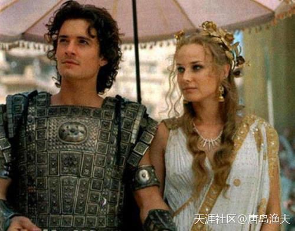

`帕里斯/Paris`剧照

> 电影中的`帕里斯/Paris`在年龄上是不符的 
因为`帕里斯/Paris`的判决，发生在`阿喀琉斯/Achilles`爹娘婚礼。这样算下来，帕里斯应该是`阿喀琉斯/Achilles`的长辈，不是同龄人。

## 沙场斗将（二）

男一号和反一号之战，反一号`帕里斯/Paris`在`伊达山/Mount Ida`修炼多年才学艺下山，是`特洛伊/Troy`一等一的单挑高手，但反一号却并不情愿出战。不愿出战，是因为心里有鬼，底气不足。没有办法，老王子`赫克托尔/Hector`掐着弟弟的脖子把他送到了城外。

不情不愿的反一号，被怒气冲天的男一号一顿修理，反一号灰溜溜败回城内。

不管真的假的，反正`帕里斯/Paris`终究是败了。

于是联军要求按照单挑的规矩来，签订城下之盟。

`特洛伊人/Trojan`心有不甘，用男人的方式决斗，又用极其不男人的方式毁约。

战争继续。

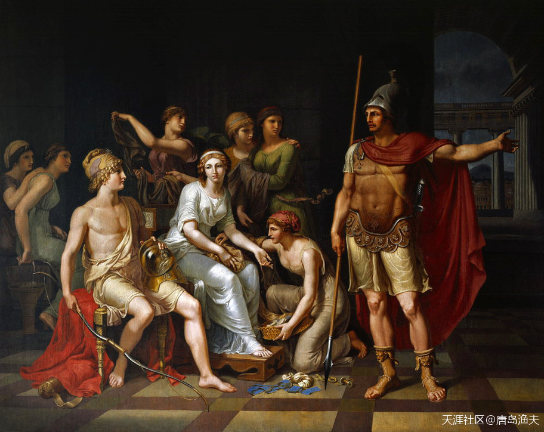

`赫克托尔/Hector`痛斥`帕里斯/Paris`——你丫快去和`斯巴达/Sparta`绿帽子王单挑，自己的屁股自己擦

> Hector Admonishes Paris for His Softness and Exhorts Him to Go to War. 
—— by J. H. W. Tischbein (1751–1828)

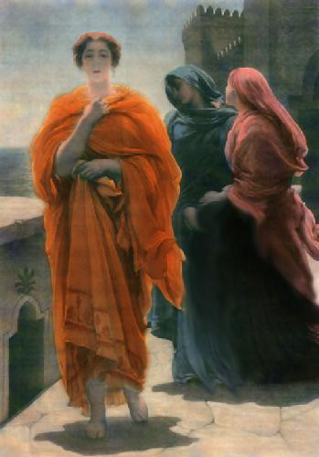

身在`特洛伊/Troy`的美女`海伦/Helen`，紧张和焦虑之下，也不怎么美了

> Helen on the Ramparts of Troy was a popular theme in the late 19th-century art – seen here a depiction. 
——by Frederick Leighton.  
19世纪晚期的热门主题，啧啧

## 沙场斗将（三）

老帕与老墨之战不久，我们终于等到了另外一场真正属于男人的单挑。

老王子`赫克托尔/Hector`，对阵希腊联军中的另外一位大英雄，`埃阿斯/Ajax`。

`埃阿斯/Ajax`的身上，流着`忒拉蒙/Telamon`的血，也拥有着传承自`宙斯/Zeus`的英雄血脉。

`赫克托尔/Hector`和`埃阿斯/Ajax`的决斗，没有胜者。因为最后两位大英雄不分胜负，联军和特洛伊人的战争只能继续；`赫克托尔/Hector`和`埃阿斯/Ajax`的决斗，当然也没有败者。因为最后两位大英雄惺惺相惜，甚至在战场上交换了各自的腰带。

古希腊的男人之爱，有种不可言说的妙处。

甚至在血流成河的战场上，也不例外。

单挑不了了之，战争依然在僵持。

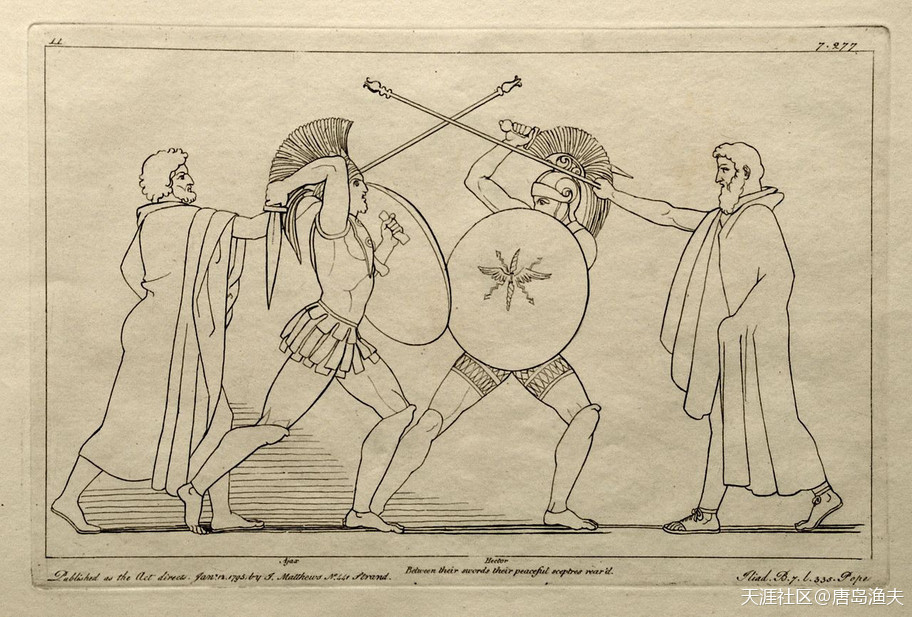

`大埃阿斯/Ajax`大战`赫克托尔/Hector`

> Ajax battling Hektor, engraving. 
——by John Flaxman, 1795

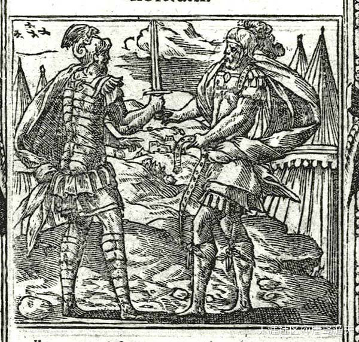

`赫克托尔/Hector`与`大埃阿斯/Ajax`交换定情信物

> Ajax and Hector exchange gifts (woodcut in Andreas Alciatus, Emblematum libellus, 1591).  
宝玉和蒋玉菡即视感 
：贾宝玉就是口中含玉出生，口中玉就是国。将玉含，其实也有这个寓意。俩人算是一对，天生一对。

## 沙场斗将（四）

事情发展到这一步，奥林波斯众神的态度当然就显得更加重要。有些愣头青类型的神祗，甚至直接参与到了白刃战之中，比如那个著名的杀人不带脑子的货——战神`埃阿斯/Ajax`。

既然`埃阿斯/Ajax`已经开了这个口子，那么神祗们之间也就不用忌讳什么了。

智慧女神`雅典娜/Athena`也冲入战阵，对`埃阿斯/Ajax`兵来将挡，水来土屯。

`埃阿斯/Ajax`最终没有带领特洛伊人出奇制胜，反而处处掣肘于`雅典娜/Athena`。果真是白瞎了“战神”这个响亮的名号，扯虎皮拉大旗的事玩的山响，跟嫂子偷腥的事也干的轰轰烈烈，反而真正打起来秒变草包，真真是浪得虚名。

那么“战神”这个名头也就不用再纠结了，送给`雅典娜/Athena`吧。

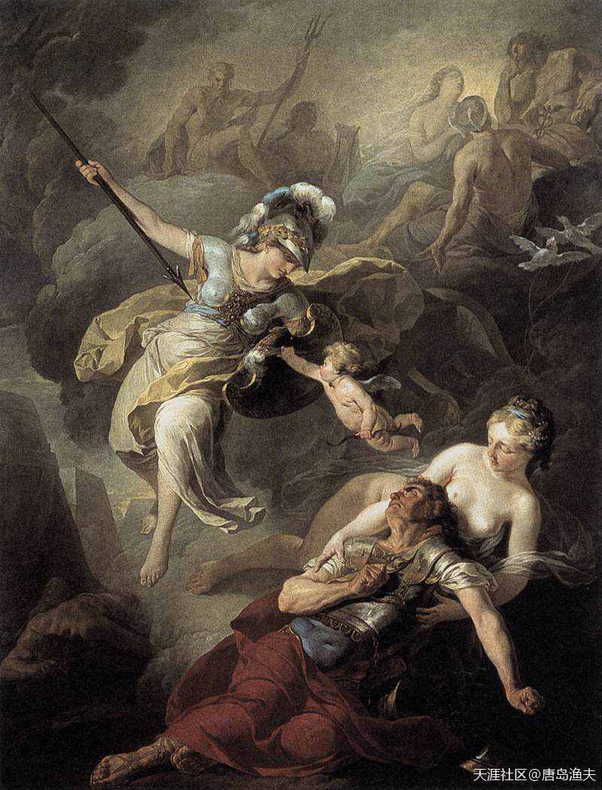

`埃阿斯/Ajax`大战`雅典娜/Athena`

> The Combat of Mars and Minerva (1771) 
——by Joseph-Benoît Suvée

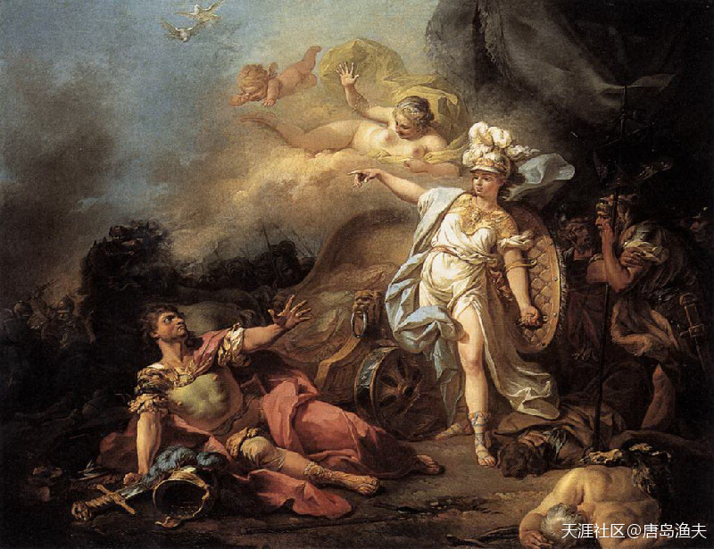

`埃阿斯/Ajax`继续大战`雅典娜/Athena`

> Minerva Fighting Mars (1771) 
——by Jacques-Louis David  
两只鸽子总是同框。 
`密涅瓦/Minerva`（智慧女神，即希腊神话中的雅典娜）

## 沙场斗将（五）

所以直到今天，`雅典娜/Athena`的名头除了智慧女神，还因为`特洛伊之战/Trojan War`打得漂亮，被评上了`战争之神`的荣誉称号，以资鼓励。战神与战争之神，并非只是玩文字游戏。`战神`这两个字，表明`埃阿斯/Ajax`只是醉心于战争本身的杀戮与恐怖；而`战争之神`，则代表正义的一方，女神`雅典娜/Athena`象征着战争的艺术，谋略与维护和平。

没有什么事是无缘无故的，天上掉馅饼的。所有的名头都得真刀真枪拿回来，即便是神祗也不例外，这就是欧洲人创世神话中的重要精髓之一。

人和人决斗，无功而返；神和神治气，一地鸡毛。

按照剧本，只能派真正的男猪脚出场了。

男猪脚虽然有点自大，有点虚荣，但他是命中注定的那个人。

大英雄`阿喀琉斯/Achilles`，重新出山，捞回自尊的时机已经成熟。

更不用说，大英雄给自己找了一个颇为意外台阶下。

?> **“没有什么事是无缘无故的，天上掉馅饼的。所有的名头都得真刀真枪拿回来，即便是神祗也不例外，这就是欧洲人创世神话中的重要精髓之一。” 现代同样是，永远如是。欺骗换不来任何荣耀。欺天欺地欺人，欺不了神。**

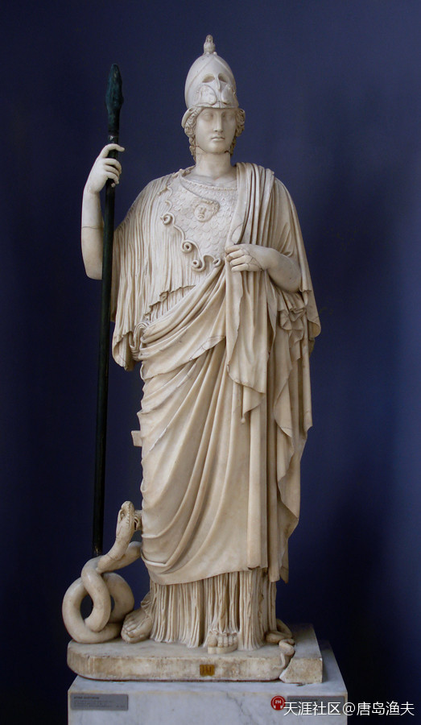

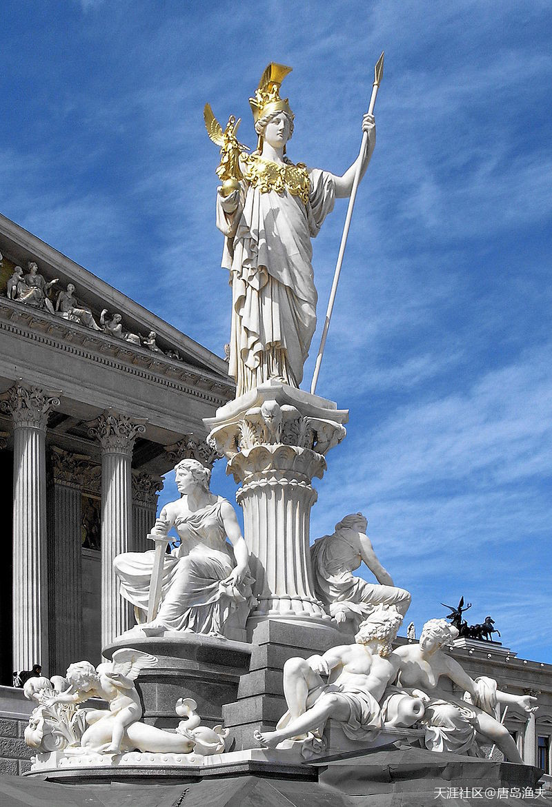

`雅典娜/Athena`雕像——在奥地利

> Statue of Pallas Athena in front of the Austrian Parliament Building. Athena has been used throughout western history as a symbol of freedom and democracy.  
所以，还是那个问题，渔夫为什么开篇讲神话？ 
西方人的`田野考古学`，还有世界史教科书的`欧洲历史开篇`，那是用来否认你`三皇五帝`和`大禹治水`的。 
而`古希腊神话`，`古罗马神话`对于西方文化自身来讲，既是历史，又是现实！ 
而且不仅是历史和现实，还能够代表他们自己定义的价值观中的自由和民主！

`雅典娜/Athena`为象征的美国加州大印章

> Athena on the Great Seal of California. 
看看神话在西方文化中的神圣不可侵犯的地位

## 沙场斗将（六）

大英雄`阿喀琉斯/Achilles`的发小，穿一条裤衩的好基友，`帕特罗克洛斯/Patroclus`死了。

`帕特罗克洛斯/Patroclus`之死，是一次不折不扣的巧合。

这事，就连死亡肇事者`赫克托尔/Hector`都觉得不可思议。

在此之前，大英雄负气回到了妈妈忒提丝的怀抱，战争陷入了焦灼，`帕特罗克洛斯/Patroclus`的心中，一种盲目的使命感油然而生。他和`阿喀琉斯/Achilles`之间，一直都有一种非常微妙的男人之间的互相欣赏，而在身形外貌上也有几分相似。为了弥补`阿喀琉斯/Achilles`不在军中的遗憾，`帕特罗克洛斯/Patroclus`自告奋勇，穿上了`阿喀琉斯/Achilles`的盔甲率军出征。乱战之中，`帕特罗克洛斯/Patroclus`死于`赫克托尔/Hector`之手。

战斗结束，`阿喀琉斯/Achilles`的盔甲落入敌手，联军士兵带回的，只有一具冰冷的尸体。

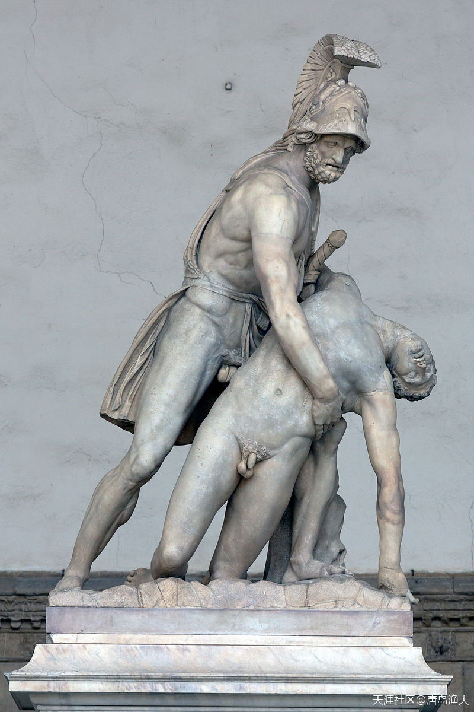

`帕特罗克洛斯/Patroclus`之死

> The body of Patroclus borne by Menelaus, Roman sculpture, Florence, Italy

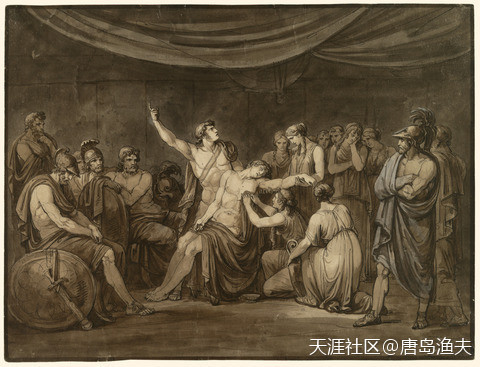

`阿喀琉斯/Achilles`发誓为小情人报仇

> Achilles Swears an Oath to Avenge the Dead Patroclus, Killed by Hector. 
Bartolomeo Pinelli, Italian, 1781–1835
