# 第二节 七丘之城

## 七丘之城（一）

`埃涅阿斯/Aeneas`去世之后，他的儿子`阿斯卡尼乌斯/Ascanius`（也叫`Julus`)）继承了`拉丁人/Latins`之王的位子。`阿斯卡尼乌斯/Ascanius`想带领`拉丁人/Latins`做一番大事业，于是他对用母亲`拉维尼亚/Lavinia`的名字命名的那座城市拉维尼，感到并不是十分满意。因为这个城市的规模比较小，而向周边扩张的余地也不是特别大。于是，新王就把自己的老妈安排在了拉维尼，而自己则在`拉丁姆/Latium`附近的`阿尔巴/Alba`山区，建立了一座新城。

新城的名字叫做`阿尔巴龙伽/Alba Longa`。

围绕`阿尔巴龙伽/Alba Longa`，新的`拉丁人/Latins`的政治中心开始成形。

`阿斯卡尼乌斯/Ascanius`，就是`阿尔巴龙伽/Alba Longa`政权的第一代王。

从`阿斯卡尼乌斯/Ascanius`开始，他的子孙后代将王位代代相传。就这样，经过了大约四百年沧海桑田，历经十三代王，来到了公元前八世纪。这个时候，`阿尔巴龙伽/Alba Longa`的王位传到了第十四代王，`努米特/Numitor`手中。

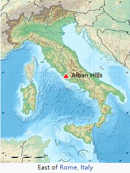

传说中的`阿尔巴龙伽/Alba Longa`的位置

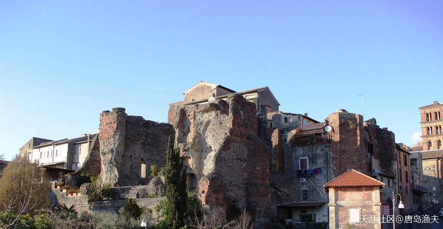

被认为是传说中的`阿尔巴龙伽/Alba Longa`遗迹的地方

## 七丘之城（二）

`努米特/Numitor`的王位没有坐多久，宫廷政变爆发。`努米特/Numitor`被自己一母同胞的弟弟`阿穆略/Amulius`赶下了台。`努米特/Numitor`本人虽然保全了性命，但已经变成了一介平民。`努米特/Numitor`的儿子被`阿穆略/Amulius`杀掉，只留下了一个女儿。

留下的这个女儿，叫做`西尔维亚/Rhea Silvia`。她之所以虎口余生，保住了一条性命，是有非常苛刻的条件的。那就是`西尔维亚/Rhea Silvia`必须去做`维斯塔贞女/Vestales Virgins`。`维斯塔女神/Vestales`，对应`希腊神话`中的灶神`赫斯提亚/Hestia`。

而所谓的`维斯塔贞女/Vestales Virgins`，实际上是就是要`西尔维亚/Rhea Silvia`去做侍奉维斯塔女神的女祭司。而这个女祭司的一般要求是，三十年内必须严守贞洁。换句话讲，只要是`西尔维亚/Rhea Silvia`做了`维斯塔贞女/Vestales Virgins`，她就基本上丧失了生育的权利。而只要`西尔维亚/Rhea Silvia`不生孩子，那么被赶下台的老王努米特这一支，也就算是断后了。

`西尔维亚/Rhea Silvia`听从叔叔`阿穆略/Amulius`的安排，去做了`维斯塔贞女/Vestales Virgins`。然而大侄女却并没有按照叔叔的剧本铺陈情节。在`西尔维亚/Rhea Silvia`没做“维斯塔贞女”之前，倒还算是恪守妇道，反而是做了贞女之后，很快就身怀六甲。十月怀胎，一朝分娩，争气的大侄女一生就是一对双胞胎，还都是男丁。两个孩子来历不明，`西尔维亚/Rhea Silvia`倒是不慌不忙，振振有词 —— 战神`玛尔斯/Mars`（对应`希腊神话`中的战神`阿瑞斯/Ares`）爱上了我，这两个男孩是纯种战神后裔。故事编的有鼻子有眼，显然大侄女是有备而来。

---

- ：火星
- ：没错

---

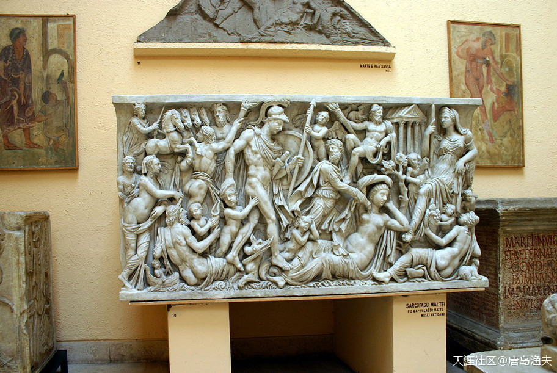

`西尔维亚/Rhea Silvia`的故事

> Symbolic representation of the Rhea Silvia myth on a sarcophagus in the Palazzo Mattei. 
Most of the elements of the story can be found in the scene. The central figure, Mars, strides over Rhea Silvia being put to sleep by Somnus pouring the juice of sleep on her from a horn. The wolf, the personification of the river, the temple of Vesta, are all present.  
 oceanary3 2019-01-02 22:40

精美的石棺，不过这算不算圣灵感孕的雏形了...... 
看看`伊休塔尔`也知道所谓`圣女`是干吗的

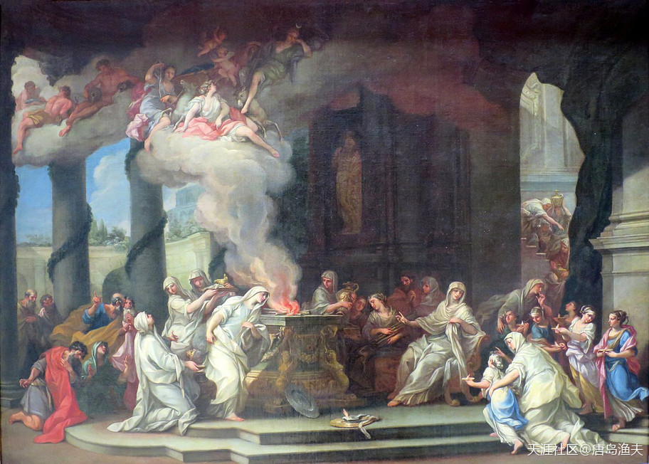

`维斯塔/Vestal`的献祭

> Early 18th-century depiction of the dedication of a Vestal 
——by Alessandro Marchesini

战神`玛尔斯/Mars`，就是西方天文学中的`火星`这个单词
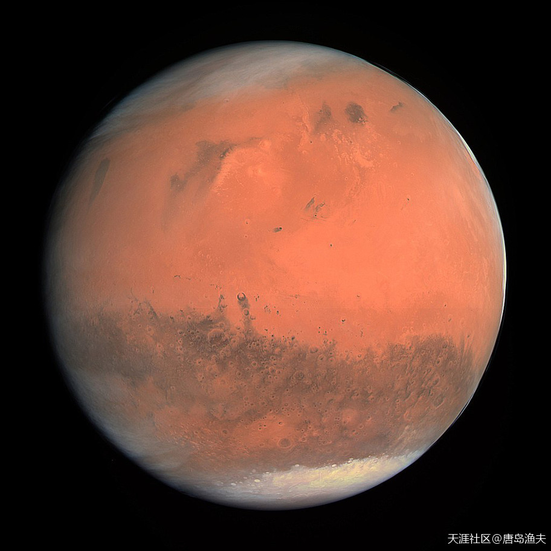

至此，我们已经集齐了`水星/Mercury`、`金星/Venus`、`火星/Mars`、`木星/Jupiter`。

那么，`土星`又是谁呢？
`罗马神话`中的`土星`，就是`Saturn`
而这个`Saturn`，就对应着`希腊神话`中的`克洛诺斯/Kronos`。
还记得不记得`克洛诺斯/Kronos`？镰刀夺位，砍自己老爸丁丁的那位老哥

`土星/Saturn`标准像
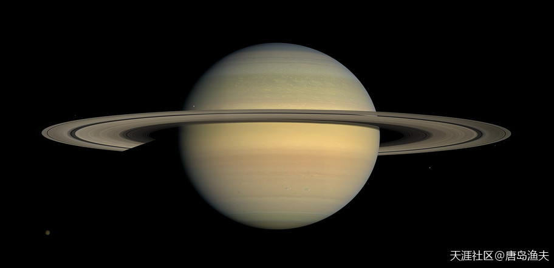

既然已经谈到了`克罗诺斯/Kronos`砍丁丁事件，那么被砍丁丁的那位`乌拉诺斯/Uranus`同志呢？
没错，他就是`天王星/Uranus`
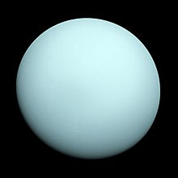

至此，八大行星齐聚，还差`海王星`......

`海王星/Neptune`没什么好说的，就是`希腊神话`中的`波塞冬/Poseidon`，也就是`罗马神话`中的`Neptune`

## 七丘之城（三）

要说这`西尔维亚/Rhea Silvia`这番话，不管真的假的，应该都是受到了高人指点。

`阿尔巴龙伽/Alba Longa`这一枝的王族，要往上数可都是`埃涅阿斯/Aeneas`的后人，再往上数也就是`埃涅阿斯/Aeneas`他妈，爱神`维纳斯/Venus`的后人。爱神`维纳斯/Venus`在神界的正牌隔壁老王，就是战神`玛尔斯/Mars`，那都是光明正大，挂牌营业的。所以`阿尔巴龙伽/Alba Longa`家族，乃至`拉丁姆/Latium`地区的普通老百姓，除了崇拜爱神`维纳斯/Venus`，也崇拜战神`玛尔斯/Mars`。老祖奶奶`维纳斯/Venus`跟战神不清不楚，那么换成大侄女`西尔维亚/Rhea Silvia`，也跟战神欲说还休，这不叫羞耻，这叫传承。

而且经大侄女这么一编排，叔叔`阿穆略/Amulius`恨的牙根痒痒，也不好直接下手了。毕竟这是号称战神的两个孩子，如果当面锣对面鼓地干掉这俩孩子，社会舆论也不好交待。`阿穆略/Amulius`没有办法，只能幽禁了`西尔维亚/Rhea Silvia`，并交代自己的仆人，把这俩孩子悄悄地扔进`台伯河/Tiber River`淹死。

`阿穆略/Amulius`千算万算，还是少算了一个节口。

既然`拉丁姆/Latium`的老百姓都信战神`玛尔斯/Mars`，那么`阿穆略/Amulius`不敢杀这俩孩子，仆人们难道就敢杀？不怕万一被战神报复？

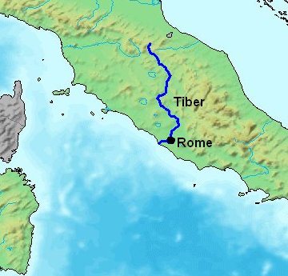

`台伯河/Tiber River`在意大利半岛的位置示意图

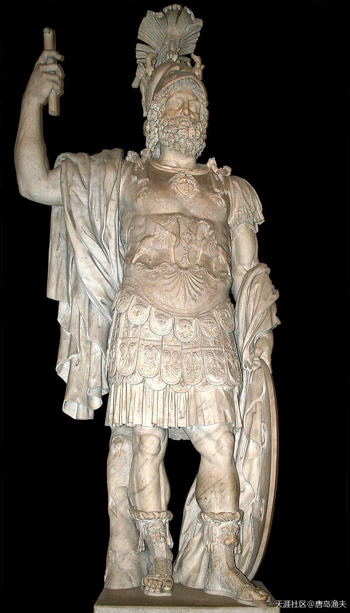

战神`玛尔斯/Mars`在罗马神话中的标准像

> Colossal statue of Mars (Pyrrhus). Marble, Roman artwork.

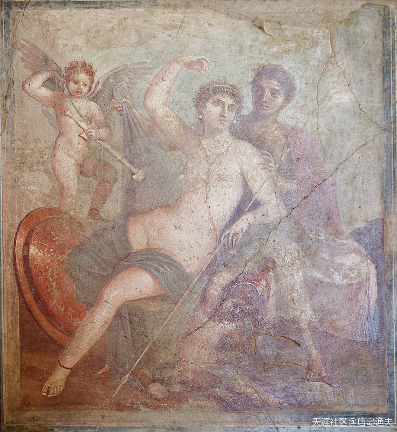

隔壁老王`玛尔斯/Mars`与风流情种`维纳斯/Venus`的日常

> Wall painting (mid-1st century AD) from which the House of Venus and Mars at Pompeii takes its name

-----

请LZ试着解读一下：以`阿佛洛狄忒/Aphrodite`之美貌、风流和放荡，以`宙斯/Zeus`之百无禁忌的风格，两个人为什么没搞在一起？

- `唐岛渔夫`：首先`宙斯/Zeus`和`阿佛洛狄忒/Aphrodite`差着辈分呢。当然，这事并不是最重要的，毕竟`宙斯/Zeus`确实是百无禁忌的。问题的关键之处在于，`宙斯/Zeus`风流之余， 他政务繁忙就很难到处拍婆子。`阿佛洛狄忒/Aphrodite`恰好急天王之所急，负责帮天王拉皮条。所以，`宙斯/Zeus`不敢造次去跟爱神乱来。嫖客和老鸨，关系越单纯越好。

- 因何无涯：楼主的解读有道理。细看，`宙斯/Zeus`同神的男女关系很多是出于功利因素的，因而他在神中间不太敢放肆，因为里面纠葛太大，同时神也可以伤到它，真正让他完全放开自我的是凡间的女子，看来他比较鈡情`女仆款`，另外，看来他对`破公交类款型`的兴趣也不大。看来神也是比较有品味的。

- 评论 唐岛渔夫：我觉得是太熟了，不好意思下手

-----

## 七丘之城（四）

仆人们果然就耍了个心眼，把两个襁褓婴儿送到了`台伯河/Tiber River`。却没有丢进水里，而是把装着两个婴儿的摇篮放在了`台伯河/Tiber River`岸边，一颗无花果树树下。这个河岸的具体位置，就在今天意大利的`帕拉蒂尼山/Palatine Hill`山脚下。

两个婴儿，就这样被丢到了荒郊野外。

然而，两个婴儿却没有死。

这事并不奇怪，因为当年特洛伊家族的男婴`帕里斯/Paris`，被弃之荒野五天五夜也同样没死。不过这一次，比没死这个事更加离奇的是，一头母狼保护了两个婴儿，并且用狼奶哺育了他们。

这个千年难遇的奇景，恰好被路过的牧人`浮斯图卢斯/Faustulus`看到。要说这古代欧洲的牧人们，个个有文化且觉悟高。当年收养`帕里斯/Paris`的牧人是，今天捡到两个狼孩的牧人又是。牧人把两个婴儿带回家，并抚养成人。

两个孩子的名字，也是牧人给起的。

一个叫`罗慕路斯/Romulus`，一个叫`勒莫斯/Remus`。

---

- 这个故事明显是古人编瞎话的，因为动物抚养的孩子没智力，并且寿命不长，比如印度的狼孩，要是现在恐怕就不那么编了。

---

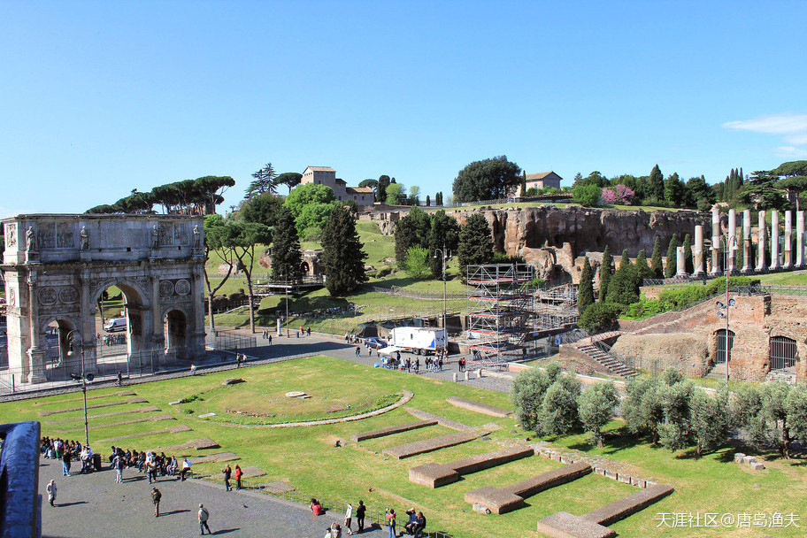

`帕拉蒂尼山/Palatine Hill`一角

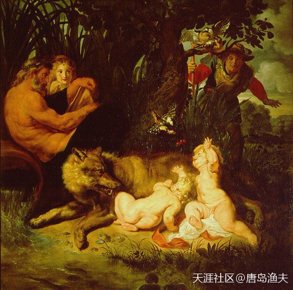

`浮斯图卢斯/Faustulus`发现狼孩

> Faustulus (to the right of picture) discovers Romulus and Remus with the she-wolf and woodpecker. 
——Painting by Peter Paul Rubens, c. 1616 (Capitoline Museums)

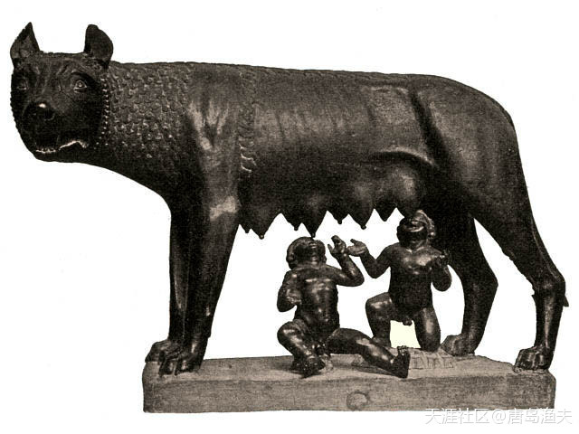

吃狼奶长大的狼孩们

> La Lupa Capitolina "the Capitoline Wolf". 
Traditional scholarship says the wolf-figure is Etruscan, 5th century BC. 
The figures of Romulus and Remus were added in the 15th century AD by Antonio Pollaiuolo. 
Recent studies suggest that the she-wolf may be a medieval sculpture dating from the 13th century AD. 
 
从公元前五世纪到公元十三世纪，跨度全凭一张嘴啊。

## 七丘之城（五）

顺便插一句，当时的`台伯河/Tiber River`虽然没有吞没两个幼小的婴儿，但`台伯河/Tiber River`的河神`泰伯里努斯/Tiberinus`，却趁火劫了个色。他搭救了落难的大侄女`西尔维亚/Rhea Silvia`，并且把`西尔维亚/Rhea Silvia`娶回了家。不同于`西尔维亚/Rhea Silvia`对外宣称的跟战神`玛尔斯/Mars`有染，河神和`西尔维亚/Rhea Silvia`的这一段，则是明媒正娶。而我们也知道，河神`泰伯里努斯/Tiberinus`的家世也是不低，他是提坦神`欧申纳斯/Oceanus`夫妇的孩子们之一。就这样，`西尔维亚/Rhea Silvia`因祸得福，做了正牌的河神夫人，得以善终。

在牧人的精心培养下，`罗慕路斯/Romulus`兄弟茁壮成长，从弱不禁风的幼苗最终长成了可以独当一面的参天大树。

两兄弟后来得知了自己的身世，寻根溯源，认祖归宗，找到了自己的外祖父`努米特/Numitor`。万幸的是老国王`努米特/Numitor`身子骨还算壮实，于是`努米特/Numitor`就带着两个外孙子，召集旧部，杀回了`阿尔巴龙伽/Alba Longa`。

伪王`阿穆略/Amulius`后来被废除，之后被两兄弟杀掉。

外祖父`努米特/Numitor`再登王位，重新执掌朝纲。

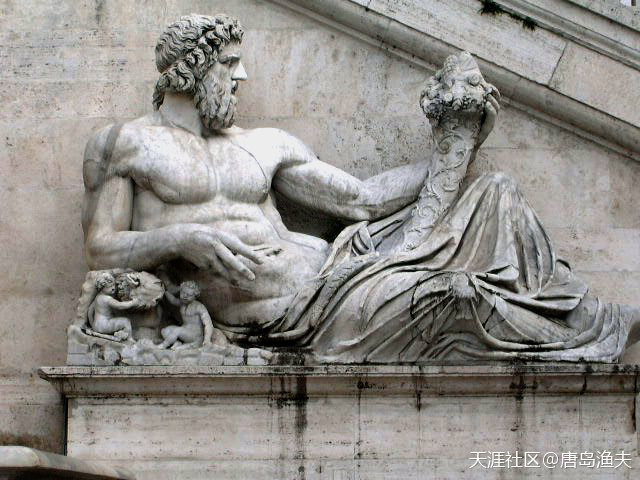

河神`泰伯里努斯/Tiberinus`

> Tiberinus (statue from the Campidoglio, Rome)

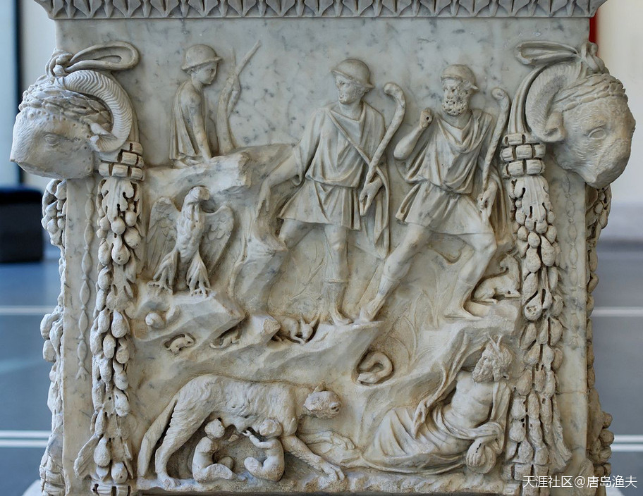

河神和双胞胎们的故事

Altar, showing Tiberinus (bottom right) revealing the twins

## 七丘之城（六）

外祖父`努米特/Numitor`再登王位，重新执掌朝纲。

`努米特/Numitor`为了表彰两位宝贝外孙的拥立之功，大笔一挥，把`台伯河/Tiber River`河畔的七座山丘，划拨给了兄弟二人另建新城，协助外公夯实王朝基业。

如果说故事发展到这里，也算是个大团员的结局。但是`埃涅阿斯/Aeneas`家族跟当年的特洛伊家族没有什么区别，就是天生爱折腾。

双胞胎的兄弟两个，也算是心有灵犀，一下就想到了他们当年被`阿穆略/Amulius`遗弃以及被母狼喂养的地方。然而，关于具体在哪个地点建城的问题上，兄弟两个却发生了严重的争执。

争执期间，`罗慕路斯/Romulus`失手，杀了自己的亲兄弟`勒莫斯/Remus`。

后世的很多学者，不断试图为这场兄弟内讧还原当时的场景，希望能够找到一种能够合理解释兄弟相残的缘由。然而，无论这一则传说是否真的存在，孰是孰非，都不重要。重要的是，`罗慕路斯/Romulus`被认为是最终的胜出者，并且按照他的本意，新城被选址在了`帕拉蒂尼山/Palatine Hill`。新城就以`罗慕路斯/Romulus`的名字来命名，被叫做——罗马（Rome）。以`帕拉蒂尼山/Palatine Hill`为中心，辐射到周围的所有七座山丘，那么这个广义的城市，也被叫做`七丘之城/Seven Hills`。

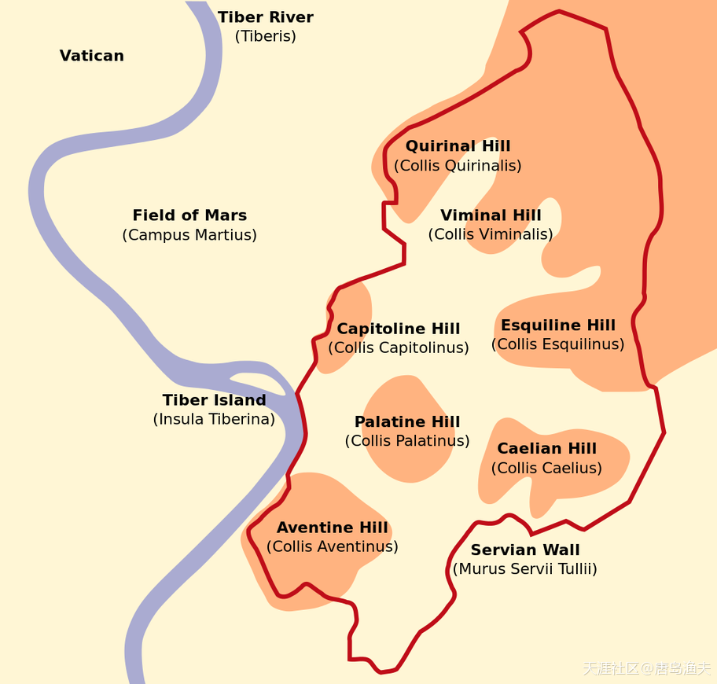

七丘之城罗马示意图

> Schematic map of Rome showing the seven hills

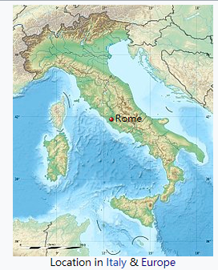

罗马城的位置
