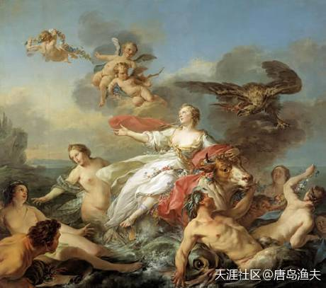

# 引言

一切，都要从`欧罗巴/Europa`这个名字的由来开始说起：

?> 话说在很久很久以前，地中海的东岸有个腓尼基王国。 
腓尼基王国有个公主，名字叫做 `欧罗巴/Europa`。 
年轻漂亮的欧罗巴正在野外愉快地玩耍，希腊诸神之一的天王`宙斯/Zeus`，被欧罗巴的美貌所吸引，于是便化身公牛来到凡间。 
宙斯化身的公牛，在宙斯的儿子，希腊诸神之一的`赫尔墨斯/Hermes`的帮助下，吸引欧罗巴骑上了牛背。 
于是神牛四蹄腾空，上天入海带着欧罗巴游到了大海的另外一边。 
大海的另外一边，又是一片广大的陆地，这片大陆的东南角，是一小片海。 
这小片海的名字叫`爱琴海/Aegean Sea`，海中有个小岛，名叫克里特岛。 
公主就被带到了克里特岛。 
来到克里特岛的公主欧罗巴，就在这里和英俊的宙斯同志相结合。 
而多情的宙斯在得到欧罗巴之后，就返回了天界，只剩下孤零零的欧罗巴。 
远离故土，悲痛欲绝的欧罗巴，绝望之中遇到了爱的女神`阿佛洛狄忒/Aphrodite`。 
在循循善诱而又风流成性的希腊女神`阿佛洛狄忒/Aphrodite`的开导之下，`欧罗巴/Europa`就留在了克里特岛，坚定了革命信念，为宙斯生儿育女。

`克里特岛/Crete`背后这片新大陆，后来就被叫做`欧罗巴/Europa`。

于是，`欧罗巴公主`就成了传说中的第一个欧洲人。所以，`欧罗巴/Europa`是今天欧洲人的老祖母，而今天的欧洲人都是她的孩子。

?> 那么，`欧罗巴公主`来到了新大陆，腓尼基王国后来怎样了？这个腓尼基王国，实际上也是一笔糊涂账，我们放在后边继续说。

这篇文字主要讲`欧罗巴/Europa`，那么我就先看欧洲的故事。

讲欧洲，我们就先沿着欧罗巴的情夫`宙斯/Zeus`这条线慢慢讲。

?> `宙斯/Zeus`是天王，但宙斯的天王之位，来的并不容易。说白了，`宙斯/Zeus`只是希腊诸神的第三代领导集团核心，而在成为众神之王的过程中，`宙斯/Zeus`的人生经历了惊涛骇浪，付出了千辛万苦。

The Rape of Europa
> by Jean-Baptiste Marie Pierre (1750)

---

- 备注：品牌爱马仕（Hermes），在西方文化中，就是在蹭`赫尔墨斯/Hermes`的热度。在奥林波斯十二主神中，赫尔墨斯是商业和小偷之神，狡猾狡猾地。看爱马仕的中文译法，就够狡猾。`赫尔墨斯`到了`罗马神话`中就是`墨丘利/Mercury`（也是`水星`），同样是西方知名品牌。

- 一群海盗使用诈骗的手段从腓尼基掳掠了一个贵族女子，在玩腻了之后把已经怀孕的她扔在了一个岛上。这个女子起初痛不欲生，后来遇到当地的一个神婆，劝她认命；她也确实知道回家无望，只好收拾心情生下了孩子，准备长期在当地生活。

- **要看清西方文化本源很难，因为自大航海时代至今，西方人掌握了世界话语权，掩盖了很多真实历史背后的真相。很多细枝末节甚嚣尘上，很多涉及历史重大变故的内容被故意隐去。远的不说，说二战以来：赫尔备忘录、朝鲜战争、麦卡锡主义……几乎从没人提起。**

- 渔夫给自己的定位，就是历史小剧场。

- 分析的很棒，西方历史在文艺复兴之前的基本造假，之后的，五五分吧，这五分真点的还集中在19世纪中叶以后。

- **谢谢支持。我们先把他们看明白了，知己知彼，百战百胜。**

- **学中国历史，也要先看盘古开天地、女娲造人，这是`神话时代`；然后呢，三皇五帝，这是`传说时代`；有记录的历史才进入`文字考据`，我们是公元前841年。**

- 第一章的安排，都是渔夫定义中的`神话`，因此不必当成事实。传统西方史观，会把荷马史诗与罗马创城的背后故事，作为欧洲正史来做背后考古学和历史学论证，渔夫觉得没有太大必要。因为今天西方人的思维体系，跟真正的历史关系不大，反而是来源于神话传说。所以统统放进神话部分了，包括王政罗马的时代，呵呵……

---