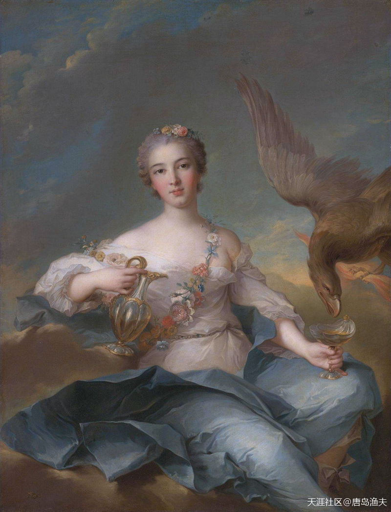
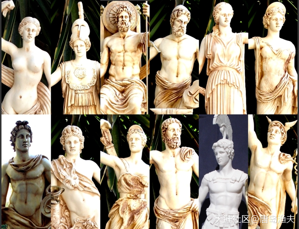
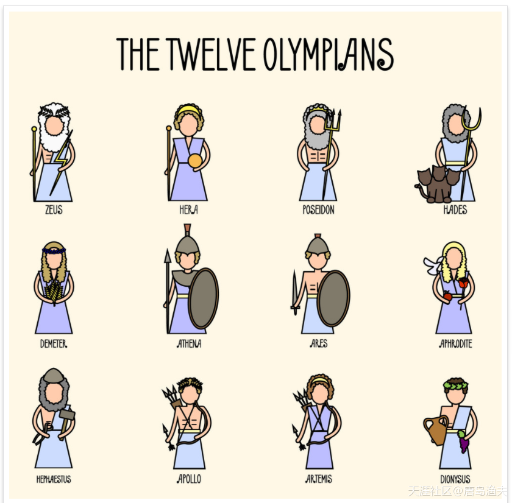
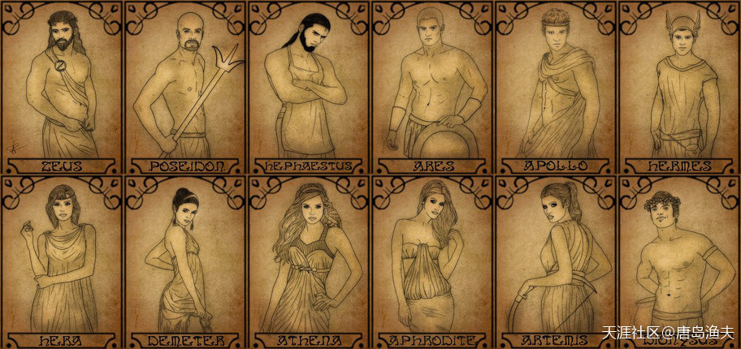
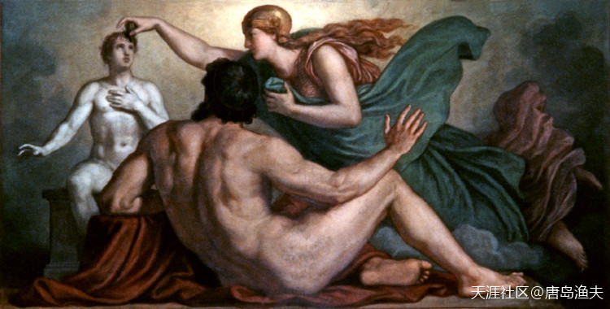
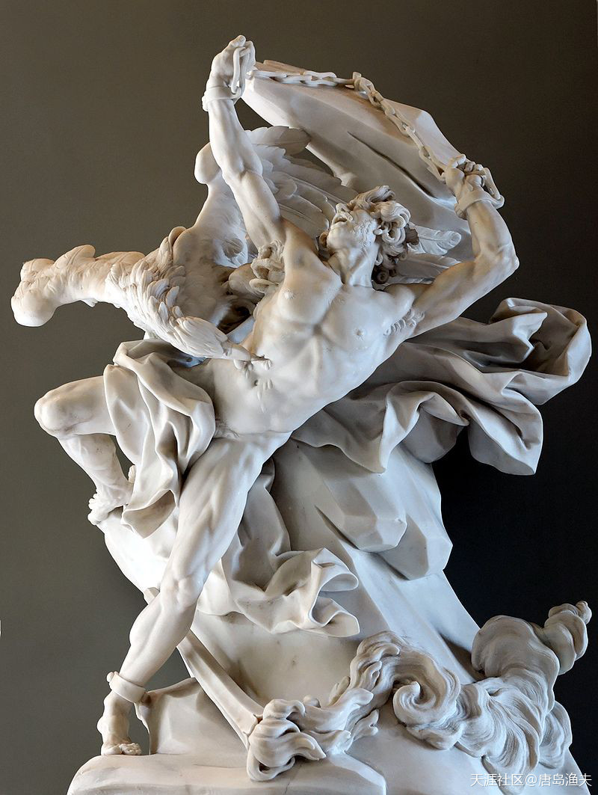
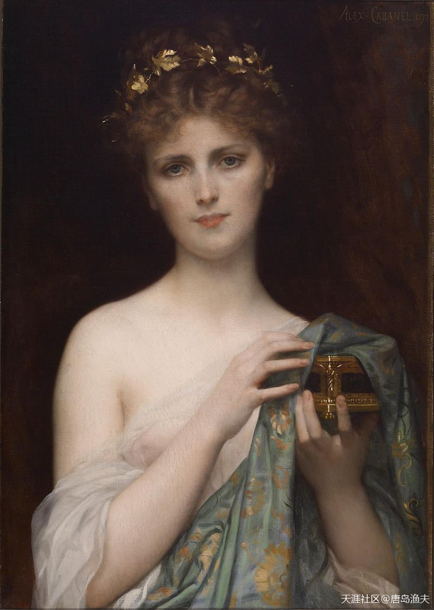
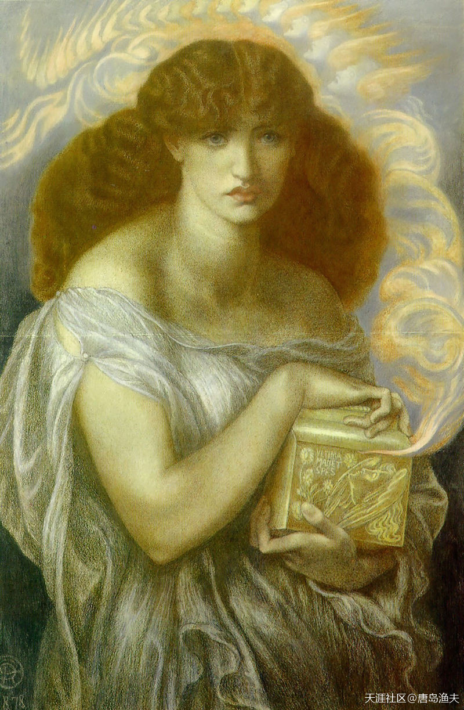

# 第三节 普罗米修斯

## 普罗米修斯（一）

`普罗米修斯/Prometheus`是个圣者，看上去完美无缺的神。

但这样的神，`宙斯/Zeus`并不喜欢。

因为`宙斯/Zeus`本神，就是一个有道德瑕疵的神，他不仅好色，而且乱伦。

1. 在婚内，`宙斯/Zeus`和第一个老婆兼堂姐，智慧女神`美狄丝/Metis`，生出了第二代智慧女神`雅典娜/Athena`；
1. 和第二个老婆兼姑妈，规律女神`忒弥斯/Themis`，生出了命运三女神；
1. 和第三个老婆，美狄丝的亲妹妹`欧律诺墨/Eurynome`，生出了美惠三女神；
1. 和第六个老婆兼表姐，哺育女神`勒托/Leto`，生出了狩猎女神`阿尔忒弥斯/Artemis`和光明之神`阿波罗/Apollo`；
1. 第七个老婆兼姐姐，天后`赫拉/Hera`，生出了前文提到的火神`赫淮斯托斯/Hephaestus`，还有青春女神`赫柏/Hebe`，战神`阿瑞斯/Ares`等等。

---

- 雅典娜应该是长女了。其他都是小字辈，有神力没话语权。

- 雅典娜名气太大了，呵呵，圣斗士也功不可没。

- 看`希腊神话`，人名还好，后来的`罗马神话`更晕。

- 神话尤其乱，后来的罗马帝国也是。

- 勒托好像不是表姐，也是人间少女，被`宙斯/Zeus`看上，生下了一子一女。因为这件事，被赫拉打压的很惨。

---

青春女神`赫柏/Hebe`，`Hebe`这个英文名字，起源于此

> Louise Henriette de Bourbon as Hebe  
—— by Jean-Marc Nattier (1744)

## 普罗米修斯（二）

在婚外，宙斯他老人家也没闲着。开篇提到的，帮助宙斯得到欧罗巴公主的神使赫尔墨斯，就是宙斯的私生子之一。后来成为酒神的`狄俄尼索斯/Dionysus`，则是`宙斯/Zeus`与凡间女子婚外放飞自我的产物。

在`宙斯/Zeus`同志婚内婚外的不懈努力之下，`宙斯/Zeus`的孩子们遍布神界，洒满人间，`宙斯/Zeus`同志也终于在`奥林波斯山/Olympus`上凑齐了十二位负主要责任的正神，合称奥林波斯十二神。

他们是：

1. 天王`宙斯/Zeus`
1. 天后`赫拉/Hera`
1. 海神`波塞冬/Poseidon`
1. 农神`德墨忒尔/Demeter`（宙斯的四老婆）
1. 智慧女神`雅典娜/Athena`
1. 光明之神`阿波罗/Apollo`
1. 狩猎女神`阿尔忒弥斯/Artemis`
1. 战神`阿瑞斯/Ares`
1. 爱神`阿佛洛狄忒/Aphrodite`
1. 火神`赫菲斯托斯/Hephaestus`
1. 神使`赫尔墨斯/Hermes`
1. 酒神`狄俄尼索斯/Dionysus`（这个位子原本是属于灶神`赫斯提亚/Hestia`，后来灶神到了人间同人类一起生活，因此最终版本中酒神就递补进入十二主神行列）

奥林波斯十二主神——标准照

奥林波斯十二主神——萌版

奥林波斯十二主神——夜店海报版

---

- `酒神`也叫`欢乐神`。

- 请问，主神没有`哈迪斯`吗？

- 奥林波斯十二主神有多种说法，但大多数的说法都没有哈迪斯。他老人家是冥界的，跟大家物理和化学上还是有点距离。

---

## 普罗米修斯（三）

`宙斯/Zeus`这样的神，就是神界的多情种，凭借说一不二的权力和能力，把女性当成社会资源大量囤积。这样物化女性的举动，让很多神界的女神无法接受，于是一些神界的女权主义先驱，就自发成立了一个处女联盟，用来反击神界荒淫无度现状。联盟的发起者有三个，他们是灶神`赫斯提亚/Hestia`、智慧女神`雅典娜/Athena`和狩猎女神`阿尔忒弥斯/Artemis`。这三个女神，在希腊神话中被称为“三处女神”。

所以说，`宙斯/Zeus`这样的神，和貌似道德楷模的`普罗米修斯/Prometheus`是天生互相看不上的。

作为`提坦神/Titans`之一，`普罗米修斯/Prometheus`在提坦之战中表现出了十足的吃里扒外的战斗精神，因此得到了`宙斯/Zeus`的赏识，从而得以留在了神界第三代领导集团的生活办公区域——`奥林波斯山/Olympus`。

当时的天空、海洋、冥界，已经分别被`宙斯/Zeus`三兄弟所瓜分，唯有在大地上，十分拥挤地布满了各种动物，然而虽然各种动物横行于世，但并没有一种动物可以成为万物之灵，用来作为大地的主宰。

具备高度革命觉悟的普罗米修斯同志，于是就仿照自己的身体，用粘土创造出了世界上第一批人类。而因为普罗米修斯的参照物是他自己的身体，因此世界上这第一批人类，都是男性。

随后，智慧女神`雅典娜/Athena`，赋予了这些男人们灵魂与生命。

普罗米修斯造人（注意，这个创始神话，跟后来的基督教体系完全不同）

> Prometheus watches Athena endow his creation with reason 
—— painting by Christian Griepenkerl, 1877

---

- 男版女娲，东西方创世神话有很多共通之处，有意思的咧~

- 这里完全就是剽窃了中国神话，西方历史神话就是完全山寨再加工。

- 用泥捏人东西方是达到共识了:)

- 这图多有意思，人正面面对观众，神背对着。

---

## 普罗米修斯（四）

作为众神之神的天王`宙斯/Zeus`，终于有一天知道了人类的存在。这件事情非常严肃，因为很显然，这群大地上的生物虽然没有超自然的能力，但他们的形象跟`奥林波斯山/Olympus`众神别无二致。`宙斯/Zeus`虽然默许了人类的存在，但因为跟`普罗米修斯/Prometheus`同志的价值观相去甚远，并且在一次众神办公会上又有意无意地跟普罗米修斯产生了非常大的冲突。`宙斯/Zeus`决议，将不会把`火`——这种当时能够极大改变人类生活质量的必需品，赐予人类。让人类，永远生活在漫漫长夜与茹毛饮血的艰苦岁月中。

这事，并没有难倒，也没有吓倒我们一贯坚强的道德主义战士`普罗米修斯/Prometheus`。

`普罗米修斯/Prometheus`偷偷地从光明之神`阿波罗/Apollo`那里，偷走了火种，并将这个火种带到了人类世界中。

当宙斯有一天突然发现人间炊烟袅袅的时候，他雷霆震怒。宙斯下令，把肆意妄为，犯了欺君之罪的普罗米修斯，用一根铁链，锁在了`高加索山`的一个悬崖上。他永远无法入睡，双腿也永远无法弯曲，甚至胸口还被钉了一个钉子。并且一只饿鹰天天来啄食普罗米修斯的肝脏，而被啄空的肝脏，晚上又会重新长出来，就这样日复一日地让普罗米修斯遭受折磨。

`普罗米修斯/Prometheus`同志，为自己崇高而自由的革命理想遭受了折磨。

普罗米修斯受难雕像

> Prometheus depicted in a sculpture 
—— by Nicolas-Sébastien Adam, 1762 (Louvre)

---

- 这点就没中国文化先进了，我们是燧人氏发明了使用火的方法。不过他们更悲剧，更浪漫。

- ：中国都是靠自己，无论燧人氏钻木取火，还是神农氏尝百草，还有精卫填海、大禹治水、后羿射日，甚至夸父逐日，都是靠自己抗争。

- 无法弯曲的双腿跟图片有点不符啊:)倒在脚边的是火炬么？

---

## 普罗米修斯（五）

`普罗米修斯/Prometheus`同志，为自己崇高而自由的革命理想遭受了折磨。

而受到普罗米修斯保护的人类们，与此同时也在被`宙斯/Zeus`所算计。

作为对人类们玩火的惩罚，`宙斯/Zeus`准备让大地上的男人们接受一个更大的惩罚——赐给大地上的男人们一个女人。

执行这个命令的人，不再是区区一个普罗米修斯，而是一个团队。

`宙斯/Zeus`充分地调动手中的行政资源，组成了一个突击攻坚小组，创造女人。

让女人报复男人。

于是，火神`赫菲斯托斯/Hephaestus`领到任务，加班加点，并参照奥林波斯山上女神们的身体创造出了女人；爱神`阿佛洛狄忒/Aphrodite`为这个女人身体增添香味；智慧女神`雅典娜/Athena`为这个女人穿衣打扮；神使`赫尔墨斯/Hermes`传授给这个女人语言天赋。

`宙斯/Zeus`最终为这个可爱的女人命名——`潘多拉/Pandora`。

第一个女人`潘多拉/Pandora`

---

- 对，更狠的是，用女人来收拾男人。。。

- 让女人报复男人，这思路怎么那么别致呢:)

- 魔盒

- `潘多拉/Pandora`的衣服那么鲜亮。哪个朝代的？

---

整个欧亚大陆地人类史，应该是不断地有部族从中国北方被赶跑，顺着欧亚大草原往西迁移地历史。

迁移地过程中，不断跟原来更早迁移过去地，或者是跟黑人杂家，然后形成新人种地历史。

---

- 匈人，阿瓦尔人，塞尔柱突厥，确实是这个套路。其中后两者，基本确认跟中国历史中的柔然和突厥有关系。

- 而且，注意，凯尔特人被哥特人往西赶，哥特人原来又再黑海北岸的草原上生活，是被匈人赶过去的。再往前，实在是不知道了。但是他们祖先都是游牧民族这个可以确定。

- 匈人唯一能够确认的，是东亚黄种人的外貌特征。

- 这就反映出一个问题了，你有抽象思维与归纳能力没有？给你一个石头，你除了看到石头，还能看到什么？给你一堆石头呢？你在河流的下游，看到一堆石头，我说，这对石头都是从河流的上有冲下来的，你说，不对，我只看到这是个石头，是不是这样的？

- 或者，这一对石头里边，有一个石头是从旁边的山上滚下来的，然后，你就说，我只知道这个石头不是从河流的上游冲下来的，是不是？

---

## 普罗米修斯（六）

神使`赫尔墨斯/Hermes`遵循`宙斯/Zeus`的命令，将世界上第一个女人`潘多拉/Pandora`，赐予了`普罗米修斯/Prometheus`的弟弟——`埃庇米修斯/Epimetheus`，`潘多拉/Pandora`也就成了`埃庇米修斯/Epimetheus`的老婆，`普罗米修斯/Prometheus`的弟媳妇。`普罗米修斯/Prometheus`在之前，曾经严正地告诫自己的弟弟，不要接受`宙斯/Zeus`的任何赏赐。但`潘多拉/Pandora`的出现，却让弟弟欲罢不能。很显然，哥哥的话在美色面前是不起作用的。

和`潘多拉/Pandora`一起陪嫁的，还有`宙斯/Zeus`给的一个盒子，这个盒子里面装满了`贪婪Greedy`、`虚伪Hypocrisy`、`诽谤Slander`、`嫉妒Envy`、`痛苦Pain`等。在好奇心的驱使之下，最终`潘多拉/Pandora`打开了这个盒子，从此盒子里的东西也就布满了人间。

到最后，盒子里还剩下智慧女神`雅典娜/Athena`留下的一样东西——`希望Hope`。

人间只要还保有希望，那么就依然还有巨大的生机。

然而，希望固然有，但提坦之战刚刚结束，奥林波斯众神，甚至于众神与人类之间，就迫不及待地开始了勾心斗角，尔虞我诈。这事，显然非常不合时宜，也非常让人感到沮丧。

奥林波斯诸神们并不知道，提坦们正在酝酿卷土重来。

`潘多拉/Pandora`的盒子

> Jane Morris in the role, Dante Gabriel Rossetti, coloured chalks, 1879

---

- 哈哈，原来贪婪、虚伪、诽谤、嫉妒、痛苦灯都是女人带来了的……

---

欧洲：`希腊神话`、`罗马神话`、`北欧神话`

中东：`埃及神话`、`巴比伦神话`

美洲：`玛雅神话`、`印第安神话`

> 谢谢支持。前三个，都会讲到。

这些是不是就是权力的游戏中的诸神？

> 权力的游戏是典型的西方架空历史，是一堆西方历史元素的杂揉在一起的产物。里面的绝境长城，来源于哈德良长城。七神崇拜，有点类似于古罗马的万神殿多神体系。历史背景，有点类似金雀花王朝。后边都还会讲到。

