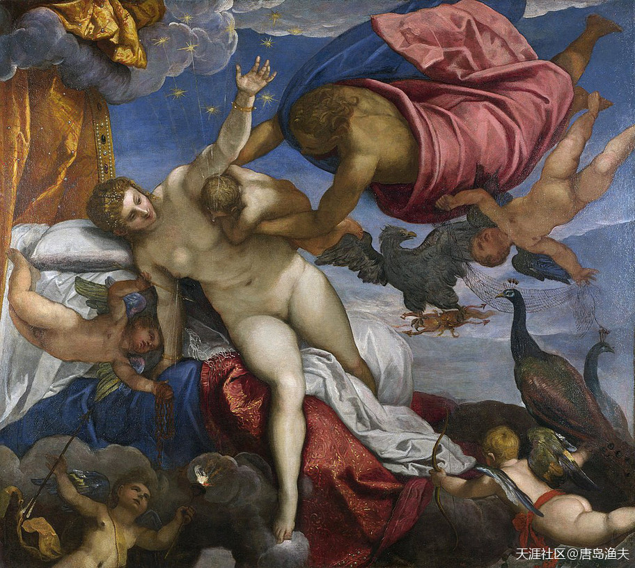

# 第五节 赫拉克勒斯

## 赫拉克勒斯（一）

自打`赫拉克勒斯/Hercules`生下来那天为止，很多人就说他是`宙斯/Zeus`在人间的私生子。

实际上，事情远没有那么简单。

赫拉克勒斯的爹是宙斯，赫拉克勒斯的妈，叫做`阿尔克墨涅/Alcmene`。

`阿尔克墨涅/Alcmene`是凡间的王后，是底比斯国王`安菲特律翁/Amphiltrion`的老婆。而`底比斯`则是`古希腊`的一个王国，坐落于尼罗河流域，关于这个国家，我们后文还会提到。

> 更正一下，这个底比斯应该是`古希腊`底比斯，只是和`古埃及`的底比斯重名了。

这里单说`阿尔克墨涅/Alcmene`。

阿尔克墨涅/Alcmene 剧照

## 赫拉克勒斯（二）

这里单说`阿尔克墨涅/Alcmene`。

`阿尔克墨涅/Alcmene`的爷爷叫做`珀尔修斯/Perseus`，珀尔修斯也是`宙斯/Zeus`在凡间的儿子之一，是宙斯与古希腊`阿尔戈斯/Argos`王国的公主`达那埃/Danae`所生。

- `珀尔修斯/Perseus`是一位半人半神的凡间英雄，他长大之后，杀掉了女妖`美杜莎/Medusa`，将美杜莎的头颅献给了`雅典娜/Athena`。
- 正因为这样的不朽功勋，`宙斯/Zeus`后来将`珀尔修斯/Perseus`升上天空，成为`英仙星座`。
- 被珀尔修斯杀掉的`美杜莎/Medusa`，断掉的脖子中生出来飞马`珀伽索斯/Pegasus`，就成了`天马星座`。
- 而`珀尔修斯/Perseus`在凡间曾经娶了埃塞俄比亚王国的公主`安德罗墨达/Andromeda`为妻，那么`珀尔修斯/Perseus`成为`英仙星座`，公主也就成了`仙女座`。那么公主的老爹老妈，也就成了后来的`仙王座`、`仙后座`。

> 天马星座  Pegasus 
英仙星座  Perseus 
仙女星座  Andromeda 
仙王座   
仙后座   

`珀尔修斯/Perseus`力斩`美杜莎/Medusa`

> Perseo trionfante 
—— by Antonio Canova (1801) Musei Vaticani, Rome

万魔之父`堤丰/Typhaon`之女——`美杜莎/Medusa`

---

- 电影《诸神之战》的主角，也是一人得道，鸡犬升天啊

---

## 赫拉克勒斯（三）

值得一提的是，`珀尔修斯/Perseus`和`安德罗墨达/Andromeda`一共生了六个儿子。

- 大儿子`佩尔塞斯/Perses`，先是继承了埃塞俄比亚王国遗产，后来又成了波斯人的祖先，据说`波斯/Persian`这个单词词源，就是`Perses`；
- 二儿子叫做`厄勒克特律翁/Electryon`，传说他创建了迈锡尼王国，而`阿尔克墨涅/Alcmene`就是他的女儿。

这样算下来，脉络就清晰了。

`阿尔克墨涅/Alcmene`其实就是`宙斯/Zeus`的曾孙女，宙斯和自己的曾孙女结合，然后就有了`赫拉克勒斯/Hercules`。

**那么换个角度，`宙斯/Zeus`既是`赫拉克勒斯/Hercules`的父亲，又是`赫拉克勒斯/Hercules`的高祖父。**

亲上加亲。

`宙斯/Zeus`这事，干的漂亮。

`阿尔克墨涅/Alcmene`的人生巅峰——`赫拉克勒斯/Hercules`的诞生

**从这一小节开始，会陆续出现很多神话背后的`星座`，我们不妨记一下！**

`英仙星座/Perseus 珀尔修斯`

`天马星座/Pegasus 珀伽索斯`

`仙女星座/Andromeda 安德罗墨达`

`仙王星座/Cepheus 克普斯`

`仙后星座/Cassiopeia 卡西奥佩娅`

中西方星座（宫）名字几乎一致。那么问题也随之而来，谁抄袭的谁？或者同源？本人在天涯里学习和收藏过一些有关中国古代文化的帖子，纯属爱好而非研究，学习并部分认同中国的汉字来源于古代天文一说。那么中国古文字目前有出土的青铜器金文甲骨文为证，古代西方的出土文字又在哪呢？本楼的219楼说的很有一定道理。

中西星座名称对照表：http://www.doc88.com/p-417988911605.html

> 星相学，完全有可能是欧洲照抄中国的。因为就中国古代来讲，星象意味着天机，也影响着地上的春种秋收，潮涨潮落，乃至于命理前程。研究星座那是皇室才能有的特权之一，普通人里面也只有大智慧的人才能看懂。渔夫在欧洲的时候，跟当时的一位汉学家聊过类似巧合，她也有类似看法。

《我们被忽悠了二千年！乾卦全是天文星占！-《周易·乾卦》的天文星占本义》
- https://bbs.tianya.cn/m/post-no05-464694-1.shtml

《神的汉字（连载）1：开篇》
- https://bbs.tianya.cn/m/post-no05-451385-607246.shtml

## 赫拉克勒斯（四）

所以说，`赫拉克勒斯/Hercules`从小就是含着金汤匙出生的。当然这话也不全对，因为天后`赫拉/Hera`对他十分妒忌，但凡`宙斯/Zeus`喜欢的女人赫拉都不爽，`阿尔克墨涅/Alcmene`不是第一个，也不是最后一个。

而且变本加厉的是，在`阿尔克墨涅/Alcmene`临产前，`宙斯/Zeus`预言，这一天诞生的`珀尔修斯/Perseus`的后代，将会统治整个`迈锡尼/Mycenae`。`宙斯/Zeus`心中未来的国王`赫拉克勒斯/Hercules`，必将是前途无量，必将是伟大光明而正确的。

毫无疑问，这次`宙斯/Zeus`不仅仅是喜欢一个女人的问题了，而是要把人间的政治与权力斗争，也要跟自己扯在一起。

`宙斯/Zeus`胡言乱语，色迷心窍，`赫拉/Hera`不干了。

正房`赫拉/Hera`（中间带王后冠者）和`宙斯/Zeus`的女人们

> This is one of the many works depicting the event. Hera is the goddess in the center, wearing the crown. 
—— Das Urteil des Paris by Anton Raphael Mengs, ca. 1757

## 赫拉克勒斯（五）

`赫拉/Hera`运用神的力量，延缓了`阿尔克墨涅/Alcmene`的分娩。转而，`珀尔修斯/Perseus`的儿子之一，斯特涅洛斯之子`欧律斯透斯/Eurystheus`率先出生，于是欧律斯透斯也就成了`迈锡尼之王/Mycenae`。

还没有出生，`赫拉克勒斯/Hercules`就已经输在了起跑线上。

出生之后，`赫拉克勒斯/Hercules`的境况也没有好到哪里去。老妈`阿尔克墨涅/Alcmene`怕自己的儿子生下来之后被人欺负，于是就悄悄地将幼小的`赫拉克勒斯/Hercules`抛之荒野。

但是，可巧刚好遇到了天后`赫拉/Hera`与智慧女神`雅典娜/Athena`路过，不仅路过，天后`赫拉/Hera`还母性大发，给`赫拉克勒斯/Hercules`喂奶。结果在喂奶的过程中，幼小婴儿的吸吮，居然弄疼了神界的二掌柜，惊慌的`赫拉/Hera`将这个小生命重新扔在了地上。

智慧女神`雅典娜/Athena`见状，就带着这个小生命到了王宫，送给`阿尔克墨涅/Alcmene`收养。

故事说到这里，等于是从终点又回到了起点，丢掉孩子的老妈又重新找回了自己的娃。不过这个过程也是必要的，因为吸吮了`赫拉/Hera`乳汁的`赫拉克勒斯/Hercules`，终于获得了天降神力，也获得了不死之身。

所以，后来得知真相的`赫拉/Hera`尽管派出了两条毒蛇去袭击幼小的`赫拉克勒斯/Hercules`，却被这个半人半神的婴儿将毒蛇轻松杀死。

`赫拉克勒斯/Hercules`——掐蛇起义

> Baby Hercules strangling a snake sent to kill him in his cradle 
—— Roman marble, 2nd century CE, in the Capitoline Museums of Rome, Italy

---

- `milky way`也是这么来的，喷奶

- `赫拉/Hera`果然是神，不在哺乳期居然也喂奶！

- `Milky Way 银河系`（等于`Milky Way galaxy`）

- 蛇：大哥能别掐我脖子么？赫拉克勒斯：俺们撸蛇~~~~

---

`银河系`（`Milky Way`）的诞生，`赫拉克勒斯/Hercules`猛吸`赫拉/Hera`——响应一下女侠

> he Origin of the Milky Way 
—— by Jacopo Tintoretto

**历史其实造假比较容易，真实记录历史那才叫难。**

西方历史不是没有，而是我们现在学的西方人给我们编得世界史根本就不靠谱。

历史要想没有较大偏差的真实记录必须具备三个条件:

- ①必须有成熟稳定的文字系统。
- ②必须有长期稳定的人来记录历史，既要有类似中国的史官制度。
- ③必须要有成熟精准的历法，既要有较高水平的天文学知识。

为什么在公元前841年以后中国历史这么清晰，那是因为中国在这一年才真正确立了史官制度。之前虽然有文字有历法，但没史官，所以历史有时记有时不记，导致历史事件时间出现偏差，才有的后来的断代工程。但又为什么夏商周之前的历史几乎变成传说，甚至变成半人半神的历史？那是因为中国至少在夏以后才有稳定成熟的文字系统。

让我们看看西方具备写靠谱历史的条件吗？

- ①文字系统是流变性极强的表音文字系统，传播范围和延续性极差。
- ②没有听说西方有长期制度化的史官制度。
- ③西方包括阿拉伯地区大多是鱼猎和游牧文化，这两种文化对历法要求不高，所以直到15世纪欧洲才有制度化的观星台。

你们觉得我列出的这几项还相信西方写的历史靠谱吗?（来自天涯社区客户端）

---

- 兄台说的非常好。其实在我之前的中国历史帖子中，我的观点也是如此。西方历史的确认，多半依靠田野考古，以及当时人的生活记录，只言片语来还原，比如书信，随笔，铭文。所以随意性较大，但是想象空间也多，后世造假也就肆无忌惮了。中国历史史料浩如烟海，但反而框定了范围，吃亏吃这里了。

- 就这篇帖子而言，渔夫不是欧吹，也不是欧黑。因为不管我们对西方历史的疑问有多少，当今世界的话语权是在他们手上的，且已经几百年之久。不管真相如何，西方历史和史观是一套完整体系，至今还在为全世界绝大部分国家所推崇。我们有必要先看清这套体系，搞清西方思维逻辑的理论源泉，对中华复兴并无坏处。

- 口头传说会有不同的版本，就是文字记载的恐怕也是有不同的版本，欧洲的口头传说有不同的版本吗？没有的话绝对是后来编瞎话编出来的。

- 欧洲的各类记载，版本更多，毕竟没有官修史书，作为当事方的各种表达，都是以自己为中心表达。比如这一节希腊众神的身世，就有很多种版本的，只不过是渔夫按照自己的逻辑在整理而已。举个例子，阿芙洛蒂忒的诞生，就不止一个版本。渔夫只不过是采用了其中一个说法。

- 还有个很好的例子。君士坦丁堡之战，因为参战方包括了拜占庭帝国，奥斯曼突厥，也包括了前来参战的日耳曼人，匈牙利人，斯拉夫人，威尼斯人，热那亚人，而且光是宗教系统，就有天主教，东正教，伊斯兰教的不同。各方在描述这场战争的时候，基本上都是凸显本方的伟大，其他方的二逼。

- 【各方在描述这场战争的时候，基本上都是凸显本方的伟大，其他方的二逼】被你这句话逗笑了，正在喝茶喷了屏幕一脸。。。。

---

## 赫拉克勒斯（六）

仇人`赫拉/Hera`偏偏又成了`赫拉克勒斯/Hercules`的命中贵人，这事就透着一股子宿命论。

更加宿命论的是，本来是自己表叔的`欧律斯透斯/Eurystheus`，从生下来那天就成了`赫拉克勒斯/Hercules`的死对头。这位小表叔和赫拉克勒斯是同龄人，却在赫拉克勒斯长大成人的过程中，不断地用各种方式来折磨他。小表叔要求，赫拉克勒斯必须完成国王给列出的十项任务清单，才能最后成为一个不必受国王差遣的自由人。而这十项任务，压根就是刁难赫拉克勒斯而已。在小表叔看来，这十项任务如果完不成，估计表侄也就挂了；即便是侥幸完成了，那么必然也是九死一生。

要说`赫拉克勒斯/Hercules`不仅长得帅，出身好，而且还获得了不死之身，天生神力，这样的高富帅人设，他打心眼里就瞧不起这个凡人的小表叔国王。于是`赫拉克勒斯/Hercules`转而向走老爹`宙斯/Zeus`的后门，准备少点折腾，早点成神。

## 赫拉克勒斯（七）

然而`宙斯/Zeus`虽然是个浪子，但却是一个遵守契约的人。

既然迈锡尼的王是`欧律斯透斯/Eurystheus`，那么毫无疑问，`赫拉克勒斯/Hercules`就应该向国王效忠。国王交代的事情，不仅要做，而且要不打折扣地完成。那么等到完成了这些任务，`赫拉克勒斯/Hercules`再成神也不迟。

到那个时候，`宙斯/Zeus`想给这个凡间儿子开后门，也就不用顾及希腊诸神的口水以及`奥林波斯山/Olympus`舆论界的巨大压力了。

十项任务，个个都不轻松。

好在`赫拉克勒斯/Hercules`除了天生一副好身板之外，成长过程中还得到了良好的教育，受到了名师指点。

---

- 契约精神，嫉妒叫（基督教）的影子。

---

`赫拉克勒斯/Hercules`与迈锡尼王`欧律斯透斯/Eurystheus`

> Hercule apporte à Eurysthée la ceinture de la reine des Amazones 
——by Daniel Sarrabat

---

- 甲: 哥们儿，这女人怎么样? 乙: 够意思，有你的。
- 这台词，到位了。

---

## 赫拉克勒斯（八）

好在`赫拉克勒斯/Hercules`除了天生一副好身板之外，成长过程中还得到了良好的教育，受到了名师指点。

比如教会赫拉克勒斯一身武艺的`喀戎/Chiron`。

`喀戎/Chiron`是希腊诸神中一位著名的贤者，他出身于半人半马的`肯陶洛斯人/Centaurus`部落，他也拥有不死之身，精通琴棋书画唱念做打，也擅长刀枪剑戟斧钺钩叉，堪称史上最强人头马。所以，在后世的艺术作品中，喀戎这位人头马同志，几乎总是以一个完美老师的形象出现在我们的视野。他的学生中除了`赫拉克勒斯/Hercules`之外，比较出名的，还有后来的取得`金羊毛/Argonauts`的`伊阿宋/Jason`，打赢特洛伊之战的`阿喀琉斯/Achilles`等。

自带主角光环，又被无数名师指点，学会了十八般武艺，可以独自下山走江湖的`赫拉克勒斯/Hercules`。他所面对的十项任务，其实就是在正式成为英雄传说之前的，一次汇报演出。

`喀戎/Chiron`行教图（与`阿喀琉斯/Achilles`）

> The Education of Achilles 
—— by James Barry

---

- `依阿宋/Jason`妻子的复仇故事很带感

- `卡戎/Chiron`是`冥王星`的卫星，实际上不比冥王星小多少

---

## 赫拉克勒斯（九）

几乎没有遇到太多的麻烦。

十项任务似乎都凑不够完整的英雄传说，根据汇报演出的剧情安排，国王不满意表侄的表现，还额外增加了两道加试题。最后十项任务被增加了两项，变成了十二项任务。这十二项任务，被合称为 `赫拉克勒斯十二功绩(Twelve Labours of Heracles)`。

一路走来，英雄的努力不在话下，况且还有宙斯在背后撑腰。

`赫拉克勒斯/Hercules`干掉了巨狮，打瘪了巨蟹。这两个名不见经传的小喽啰，统统被`宙斯/Zeus`升上天空，变成了天上的`狮子座`和`巨蟹座`。`宙斯/Zeus`要用这样的方式，让希腊诸神知道，`赫拉克勒斯/Hercules`是谁的儿子。

万魔之父的`堤丰/Typhaon`，本身已经非常倒霉地输给了`宙斯/Zeus`。结果自己的孩子们也不得安宁，赫拉克勒斯杀掉了九头蛇`许德拉`，射死了`高加索神鹰`，又打服了地狱的`三头狗`。`堤丰的后人`不幸成为了`宙斯的后人`练级道路上的小妖精。

`狮子座/Leo`

`巨蟹座/Cancer`

`赫拉克勒斯十二功绩/Twelve Labours of Heracles`浮雕

> Roman relief (3rd century AD) depicting a sequence of the Labours of Hercules 
——representing from left to right the Nemean lion, the Lernaean Hydra, the Erymanthian Boar, the Ceryneian Hind, the Stymphalian birds, the Girdle of Hippolyta, the Augean stables, the Cretan Bull and the Mares of Diomedes

?> 十二星座？ 
   赫拉克勒斯在中国的名气不大，但在西方世界影响极大。`十二功绩`也是为了凑`十二`这个数，西方文化里，`十二`很重要。后边还会讲`犹太十二支派`、`耶稣十二门徒`，很多。敬请期待。

`赫拉克勒斯/Hercules`大战地狱三头狗

> Hercules capturing Cerberus (1545) 
—— by Sebald Beham

---

- `三头狗/Cerberus`是冥王哈迪斯的地狱宠物，还有`百臂巨人`这个老铁。`赫拉克勒斯/Hercules`打狗都不用看主人

- `赫拉克勒斯/Hercules`的`宙斯/Zeus`关系户的人设，暴露无遗

- `赫拉克勒斯/Hercules`的背后，又有很多神话背后的`星座`出现

---

## 你确定这是欧洲历史？

你写中国历史为啥不从`盘古`和`女娲`写起？顺便写写`天庭`的那些事？

- `唐岛渔夫`：谢谢关注。您如果想表达自己的观点，或者对渔夫的观点，直接表达即可，不用使用反问句或者设问句

- `sindy23`：我的意思很简单，神话故事当历史不合适

- `sindy23`：开了个欧洲历史的题目，你把神话故事放到正文第一章，合适吗

- `唐岛渔夫`：谢谢。但渔夫也没说是历史，但是欧洲人没有`正史`，他们离开神话就说不清历史了。如果不把`希腊神话`说清楚，后来的`特洛伊之战`、`希波战争`，同样可以当成神话看。不管我们同意不同意，西方人就是如此定义今天的世界舆论。

- `唐岛渔夫`：我们`中国人`有`史记`，有`太史公`。`欧洲人`只有`伊利亚特`和`奥德赛`，然后就是`近代的田野考古`了。如果按照我们的`方法论`来写他们的历史，`欧洲人的历史`最早只能从`罗马`开始了。况且，这篇文字本来就已经打乱顺序，重组模块了。不喜欢这节，您可以等罗马开篇了再回来。

- `sindy23`：我觉得不是他们离开神话就说不清历史，而是他们把神话当成了历史。`特洛伊之战`对于`现代欧洲`，应该类似于`古印第安人的神话传`说对于`现代之美洲`。主角已经换了，却拿着被自己灭掉的前任的神话当自己的历史。

- `唐岛渔夫`：您说的这些，跟渔夫的出发点没有根本性的区别。然而，仇视和否定不解决任何问题，否则当年的义和团就可以红旗漫卷全球了。此外，帖子开头开宗明义，`用中国人的视角解读欧洲历史，而不是传统西方视角`。

- `唐岛渔夫`：另外，`特洛伊`本身就是`希腊文明`的一部分。还有，在传说中，特洛伊没有被灭掉。恰恰相反，后来的无论`罗马`、`法兰克`、`英国`，都自称是`特洛伊后人`

- `sindy23`：算了，不争辩了。不可否认`古希腊神话`还是挺精彩的。

整个欧亚大陆地人类史，应该是不断地有部族从中国北方被赶跑，顺着欧亚大草原往西迁移地历史。

迁移地过程中，不断跟原来更早迁移过去地，或者是跟黑人杂家，然后形成新人种地历史。

- 非常地赞同。 
而且现在我们只知道匈奴，柔然，突厥，还包括蒙古等黄种民族不断地向西驱赶白种，并最终催生白种人脱离原始社会，进入国家阶段的历史。 
但其实，我认为，在更早期，白种人的形成也与受到东亚黄种人的驱赶有关。原始的棕色人曾经居住在亚洲的广大地区，黄色人种进入农业时代后，不断扩大领地，将棕色人种驱赶到边缘地带，使他们不断向亚洲西方，亚洲北方，再直到欧亚大陆最西北方逃离。其中被驱赶到环境最恶劣的欧亚西北苦寒之地的一部分人群，最后演化成白皮色目的人种。

- ：江浙一带的人有白种人基因

- `唐岛渔夫`：白种人或者称高加索人，不能笼统一概而论。其中分的种类太多了，就像渔夫不支持国观很多极端分子，无差别乱骂白皮一样。

- 评论 唐岛渔夫 ：孙权就是白种人吧，眼睛都是碧色的，另外黄种人没胸毛，但是江浙一带的男人不少有胸毛

- `唐岛渔夫`：胸毛不应该算是高加索人的典型体征，因为除了东亚人种尤其中国人之外，多毛体征在很多民族中都存在。比如，南岛民族。

- 评论 唐岛渔夫 ：中国人的体毛少，我认为一个原因是中国比其他民族更早就穿衣服，据说是山顶洞人就有衣服了，还有一个原因就是中原人有胸毛的被冉天王杀绝了

- `唐岛渔夫`：衣冠华夏嘛，我觉得这个分析是对的。没有体毛体味，这是中国人的优势。但是西方的反向舆论宣传，一直是没有毛就没有男人味。这个，需要咱们拿到话语权再做计较

- 多体毛多体味，野外生存可以有效防蚊虫叮咬。 中国文明时间长了，室外可以用焚烧植物驱赶蚊虫，室内就是焚香。

## 赫拉克勒斯（十）

`赫拉克勒斯/Hercules`汇报演出中唯一一次重大失误，是误伤恩师`喀戎/Chiron`。

在十二项任务中，活捉厄律曼托斯野猪的过程中，`赫拉克勒斯/Hercules`张弓搭箭，射向一个半人马肯陶洛斯强盗的一支箭，不幸射中了`喀戎/Chiron`。更加不幸的是，箭头上涂了九头蛇`许德拉`的毒液。可巧`喀戎/Chiron`还是一个不死之身，于是他没法死，而只能每天痛苦地承受蛇毒之噬。

然而，这一次的重大失误，却又成了让英雄更加传说的资本。

`赫拉克勒斯/Hercules`来到高加索山，解救了`普罗米修斯/Prometheus`，成功地让`喀戎/Chiron`和`普罗米修斯/Prometheus`互换了身体。这样，`喀戎/Chiron`自愿放弃不死之身，同时也从蛇毒痛苦中解脱出来。而换来的，则是`普罗米修斯/Prometheus`走下山崖，获得自由。

死去的`喀戎/Chiron`，也被英雄背后的天王`宙斯/Zeus`升上天空，成为`人马星座`。

`赫拉克勒斯/Hercules`解救`普罗米修斯/Prometheus`

> Heracles freeing Prometheus 
—— relief from the Temple of Aphrodite at Aphrodisias

人马星座/Sagittarius

`人马星座`，就是我们今天常说的`花心射手座`

> 这段把我绕糊涂了。 喀戎忍受不了蛇毒宁愿去死。  普罗米修斯为了自由去忍受毒的痛苦？？ 还是毒随着喀戎去了普的身体？怎么想逻辑都怪怪的  。装在人头马里的普罗米修斯后来还有什么事迹吗？？

## 赫拉克勒斯（十一）

就这样，增加难度之后的十二项任务，轻松完成。

也履行了表侄对于小表叔的诺言，`赫拉克勒斯/Hercules`终于不用事事服从国王的旨意。

最后一次大考，就是参加巨灵之战。

命中注定的巨灵之战，是对英雄传说的最后点睛之笔。

希腊诸神中，很多神祗都相信那个神奇预言——人类英雄前来参战之时，就是巨灵们的战败之时。创世神`盖娅/Gaia`也相信。为了保证自己的150个巨灵儿子们立于不败之地，她决定去寻找一种能够防御凡人攻击的不死药给自己的儿子们。不过，煞费苦心的`盖娅/Gaia`，却被`宙斯/Zeus`抢先一步带走了药草，并将不死药交给了自己的儿子`赫拉克勒斯/Hercules`。

巨灵之战，终于因为凡人英雄`赫拉克勒斯/Hercules`的加入，而战局渐趋明朗。

大战之地，发生在`佛勒格拉平原/Phlegra`。

战斗进行的非常惨烈。150个巨人全部被杀死。其中的团队领袖们，`阿尔库俄纽斯/Alcyoneus`被`赫拉克勒斯/Hercules`手刃，而`波耳费里翁/Porphyrion`则被`宙斯/Zeus`的闪电长矛击死。

巨灵之战的大片背景布——`佛勒格拉平原/Phlegraean`

> A fumarole at the Phlegraean Fields 
——painting by Michael Wutky (1780s)

> 这画画的真的很有感觉。神灵们就应该在这样的地方决战。非常感谢楼主，前一阵一直在看国外名画，也是看的稀里糊涂。跟着楼主走一遍，清楚了许多。

## 赫拉克勒斯（十二）

尘归尘，土归土。

提坦之战的延续——`巨灵之战`，以`盖娅/Gaia`的全面失败而告终。

从此，希腊诸神的政权固化，`奥林波斯山`成为了全宇宙的中心与主宰。

战后论功行赏，立下大功的凡人`赫拉克勒斯/Hercules`被褒奖为“奥林波斯人”。凡间所生的子女中，只有`赫拉克勒斯/Hercules`和酒神`狄俄尼索斯/Dionysus`获得了这一光荣称号。与此同时，战争的胜利，让希腊诸神第三代领导集团涌动的暗流暂时停止，诸神大和解。天后`赫拉/Hera`将自己的掌上明珠，青春女神`赫柏/Hebe`嫁给了`赫拉克勒斯/Hercules`。

`赫拉克勒斯/Hercules`从此成了`宙斯/Zeus`的儿子，兼正牌东床驸马。

多年以后，`赫拉克勒斯/Hercules`意外身亡。他被`宙斯/Zeus`正式请上了奥林波斯山，被封为`大力神`。而且，`赫拉克勒斯/Hercules`跟自己的先祖`珀尔修斯/Perseus`一样，死后也占据了天上的一个星座——`武仙星座/Hercules`。

`希腊神话`，以及由此而延伸的英雄传说，流传至今，生生不息。

那些故事，那些名字，将会随着时间的流逝，被今天的人们万古传颂。

`赫拉克勒斯/Hercules`与`赫柏/Hebe`

> Hercules and Hebe - marble statue 
——by Bertel Thorvaldsen

> 形体真美，看名字是个北欧人做的？

> ：Bertel Thorvaldsen (Danish: [b???dl? ?t??val?sn?]; 19 November 1770 – 24 March 1844) was a Danish sculptor of international fame, who spent most of his life (1797–1838) in Italy。这个人，是在意大利定居的丹麦人。

今天升上天空的星座——`武仙星座/Hercules 赫拉克勒斯`
