# 第一节 爱琴争雄

## 爱琴争雄（一）

当年的`欧罗巴/Europa`公主，在`宙斯/Zeus`所化神牛的指引之下，来到了`克里特岛/Crete`。

在`克里特岛/Crete`上，公主与宙斯度过了非常美妙的浪漫时光，最终生下了三个娃。这三个娃分别是：`米诺斯/Minos`、`拉达曼迪斯/Rhadamanthys`和`萨尔佩东/Sarpedon`。

多年以后，`米诺斯/Minos`成了克里特之王。

克里特之王`米诺斯/Minos`，跟自己的老爹`宙斯/Zeus`一样，是一个生性风流的人。

`米诺斯/Minos`早早就有了一个女儿，叫做`阿卡卡丽丝/Acacallis`。

而`阿卡卡丽丝/Acacallis`后来又生了一个儿子，名字叫做`米利都斯/Miletus`。

这个`米利都斯/Miletus`是一个在克里特岛远近闻名的美少年。可是在那个时代，长的漂亮的往往都是祸水，美少年也不例外。美少年的柔美温婉，吸引了`米诺斯/Minos`这个老外公，也吸引了`米诺斯/Minos`的弟弟`萨尔佩东/Sarpedon`。

就因为爱好美男子这档子事，`米诺斯/Minos`后来被称为欧洲同性恋始祖。

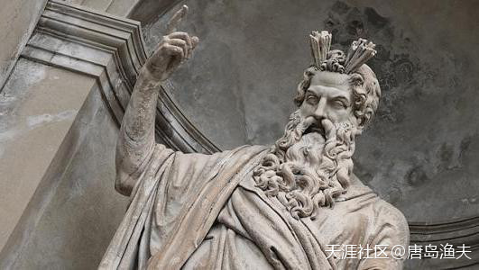

`米诺斯/Minos`

---

- 这个可以脑补，有期待，尤其在那个年代，哈哈...

- 我小时候家里有套希腊神话，有新华词典那么厚，里面的图都是白描图，画的很漂亮，也是露点的，那书是文革前出版的，现在要是还留着恐怕很值钱了。我也因此从小就熟悉希腊神话，那书比楼主讲的可仔细多了。

---

## 爱琴争雄（二）

更加值得一提的是，男同性恋这件事情，在`古希腊人`的概念中其实十分平常，几乎就是日常生活中的一部分。

因为在古希腊人的逻辑中，负责外出打仗，耕田种地，参政议政的男人们，其实才是真正的社会公民。而女人和孩子们，实际上属于在当时的社会分工中不够完整的公民。那么男人和女人之间的结合，不属于真正的爱情，而更多地偏向于身体侵入，或者说是占有。尤其是对于纯身体欲望的控制，男人是有自制力的，而女人是无穷无尽的，所以在这件事情上，女人是危险的。

所以与此相反地，男人和男人之间，尤其是男性公民之间的爱情，才能称得上是真正的神圣的爱情。

`米诺斯/Minos`引领了克里特王国的同性恋风潮，结果却并没有从中捞到好处。

他心爱的外孙`米利都斯/Miletus`的真爱，是`萨尔佩东/Sarpedon`。

后来`萨尔佩东/Sarpedon`和`米利都斯/Miletus`为了寻找真正的自由，为爱私奔。他们来到了今天小亚细亚半岛西部的`吕西亚/Lycia`，创建了古城`米利都斯/Miletus`。

---

- 真长见识。这个真不知道，只知道神话里好象有一个喜欢美少年的神，把少年变成专职伺候他喝酒的侍者。也可能是后面的酒神。

- 后边会讲这个酒侍者，那是另外一个故事。

---

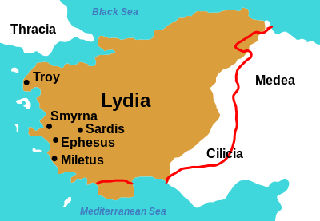

传说中`米利都斯城/Miletus`的位置

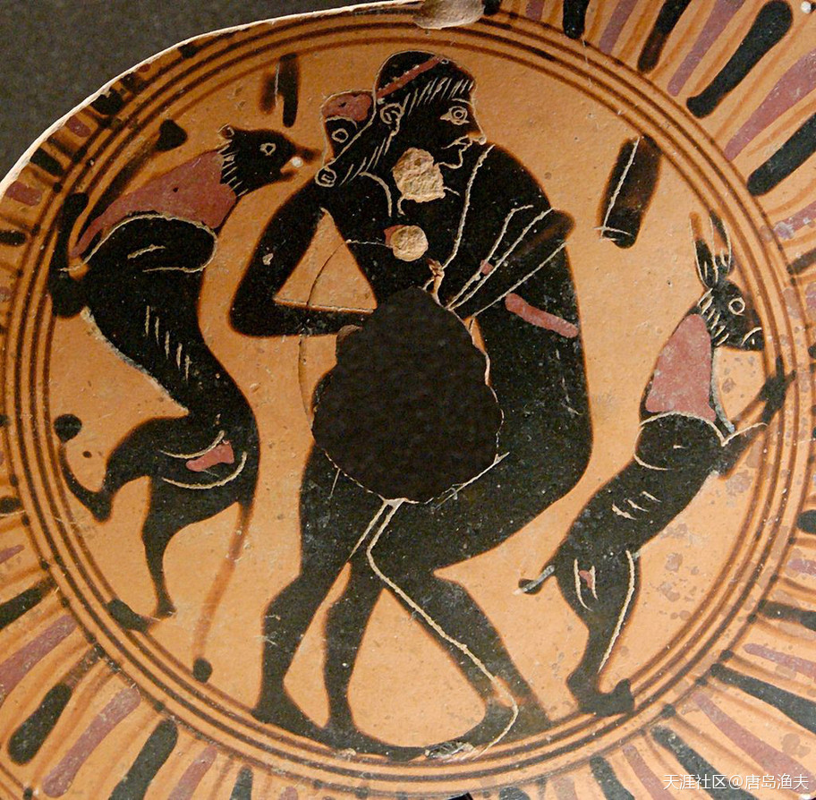

古希腊的同性之爱

> Young man and teenager engaging in intercrural sex, fragment of a black-figure Attic cup, 550 BC–525 BC, Louvre

近现代同性恋之间的委婉说法，在西方经常被叫做“Greek love”（希腊之爱）

---

- 关键部位 原始打码

---

感情白皮乱搞的起源如此早，看来犹太人记载的索多玛一座城乱搞也不奇怪。

---

- 谢谢关注。不建议用`白皮`这个攻击性极强的称呼，因为白人也就是`高加索人`分类很广。从欧洲人的角度来看，欧洲白人按照大类就有`日耳曼`、`斯拉夫`、`拉丁人`的区别，细分则更多。如果广义来看，`中东犹太人`、`波斯人`、`闪米特人`、`突厥人`，古代欧亚大陆的`斯泰基人`……都算。

- 如果真想在`意识形态领域`对`白人`进行反击，最好的办法也不是无差别攻击，因为给中国四处树敌并不明智。如果一定要用反歧视的歧视语言，可以用`粉皮`，而不是`白皮`。近现代的国际秩序，今天的国际话语权，基本上是`日耳曼系白人`在掌控。日耳曼的人类学性状，跟`斯拉夫人`、`拉丁人`完全不同，而且差异极大。

---

## 爱琴争雄（三）

美少年虽然繁花似锦，但男人到最后还要老有所依。

`米诺斯/Minos`的正牌老婆，叫做`帕西法厄/Pasiphae`，也就是`阿卡卡丽丝/Acacallis`的妈妈。

`帕西法厄/Pasiphae`的出身也不错，她的老爸是`提坦/Titan`中的太阳神`赫利俄斯/Helios`，而她的老妈，则是十二提坦`欧申纳斯/Oceanus`的女儿`珀耳塞/Perse`。所以如果论家世，`帕西法厄/Pasiphae`比`米诺斯/Minos`并不差多少。况且`米诺斯/Minos`只能算是半人半神，而`帕西法厄/Pasiphae`可算是正经八百的`提坦公主/Titan`。

提坦公主`帕西法厄/Pasiphae`的故事，跟`米诺斯/Minos`称王有着莫大的关系。

因为，克里特王国的第一代王，并不是`米诺斯/Minos`，而是`拉达曼迪斯/Rhadamanthys`。

`米诺斯/Minos`后来篡了自己的兄弟拉达曼迪斯的王位，才成了克里特之王。换句话讲，当上克里特之王的`米诺斯/Minos`付出了跟同胞兄弟`拉达曼迪斯/Rhadamanthys`和`萨尔佩东/Sarpedon`翻脸的沉重代价。

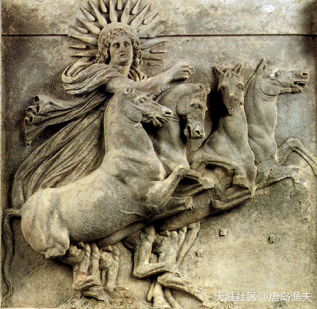

提坦太阳神`赫利俄斯/Helios`

> Helios in his chariot, early 4th century BC, Athena's temple, Ilion

?> 注意，中文语境中，把`太阳神`称号给张冠李戴成了`阿波罗/Apollo`了。 
其实`阿波罗/Apollo`不是太阳神，而是`光明之神`，四匹马拉的车也不是阿波罗的，是`赫利俄斯/Helios`的。 
翻译的原因，还有早期学者崇洋的原因，中文语境中有很多谬误，甚至都不同于西方，后文还会陆续提到。

---

- 法厄同？

- 对，法厄同的爸爸。

- 评论 唐岛渔夫 ：我看到的希腊神话里`法厄同/Phaethon`的爸爸是`阿波罗/Apollo`。

- `法厄同/Phaethon`就是汽车牌子 `辉腾`

- `法厄同/Phaethon`偷老爸的车，结果开到一半就散架了，自己也掉海里了。用这个做汽车牌子，不太吉利啊

---

## 爱琴争雄（四）

篡位之后的`米诺斯/Minos`，日子过的并不踏实，于是就向海神`波塞冬/Poseidon`起誓，以证明自己的篡权是正当的。而`波塞冬/Poseidon`也投桃报李，赐给了`米诺斯/Minos`一头漂亮的白色公牛，希望拿这头公牛来给自己献祭。然而，`米诺斯/Minos`实在是太喜欢这头白色公牛了，就悄悄地偷梁换柱，用了另外一头公牛来代替白色公牛献祭海神`波塞冬/Poseidon`。

`米诺斯/Minos`的小聪明耍的并不高明，他轻而易举地激怒了海神`波塞冬/Poseidon`。

`波塞冬/Poseidon`给米诺斯的王后`帕西法厄/Pasiphae`下了诅咒，让她患上了`恋兽癖/zoophilia`。

事情发展到最后，`帕西法厄/Pasiphae`跟那头白色的公牛结合，生下来一个人身牛头的怪兽。这个怪兽被`米诺斯/Minos`起了个名字，叫做`弥诺陶洛斯/Minotaur`。为了掩盖这桩起源于后宫深处的丑事，`米诺斯/Minos`为这位怪兽儿子建造了一个迷宫，叫做`米诺斯迷宫`。而这位可怜的怪兽儿子，就被常年养在迷宫深处，一为掩人耳目，二还为了困住这头怪兽。

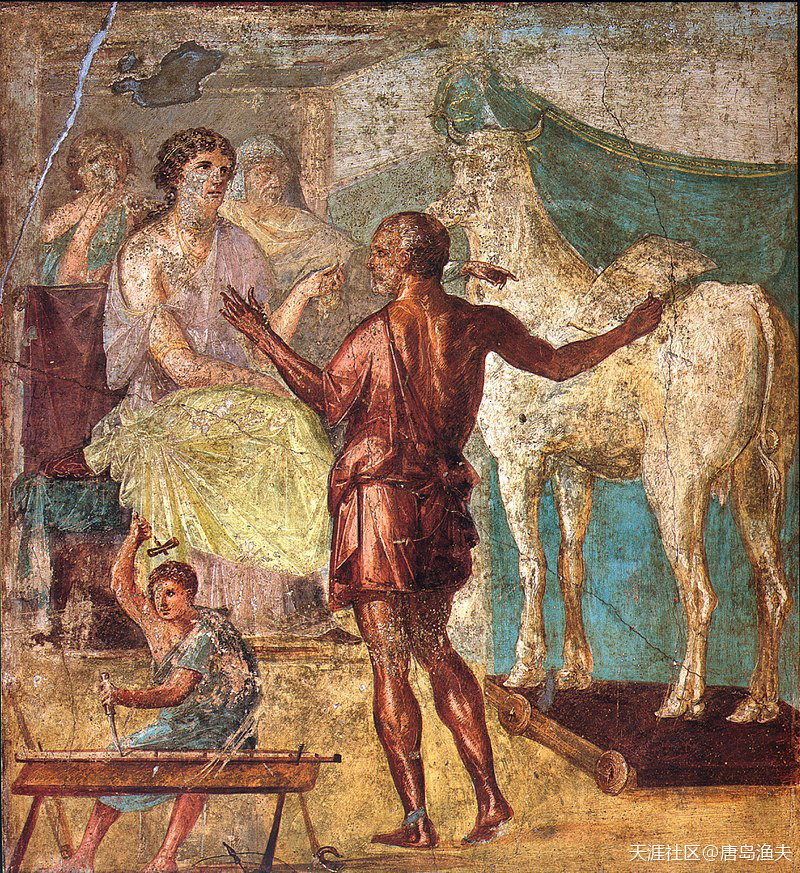

人兽恋的鼻祖——`帕西法厄/Pasiphae`

> Daedalus presents the artificial cow to Pasiphaë: Roman fresco in the House of the Vettii, Pompeii, 1st century CE.

?> 我们换个角度，当年`宙斯/Zeus`变公牛，勾引了`欧罗巴/Europa` 
`欧罗巴/Europa`的儿子`米诺斯/Minos`同性恋，儿媳妇`帕西法厄/Pasiphae`人兽恋 
这就是这一家子的真相~~~~~~

---

- 这白色公牛，牛头马身......？

- 宙斯变公牛这是籍着神话说明欧洲的起源。宙斯后来是变成了人和欧罗巴相爱。人兽恋这些天设，是有默示的。假三位一体就是龙兽假先知，兽在圣经中代表着人类世界的一方势力，这人兽恋也是默示，同样由神话和预言的结合默示人类进程，神是喜欢用恋爱和夫妻启示二者之间的关系。包括神和神的子民也用夫妻关。

- 看神话和历史，不应将这些结合和恋爱婚姻之事单纯看成是情色。

- **我无情色之心看神话，神话人物却实情色之实。**

---

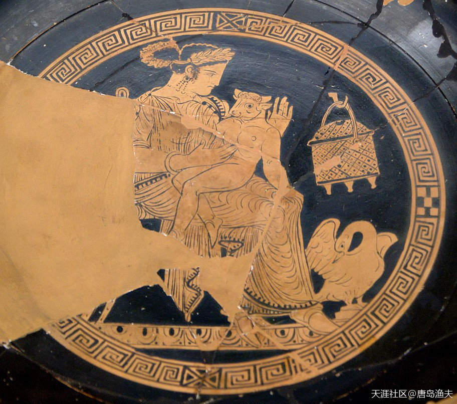

`帕西法厄/Pasiphae`和她的儿子`弥诺陶洛斯/Minotaur`

> Pasiphaë and the Minotaur, Attic red-figure kylix found at Etruscan Vulci (Cabinet des Médailles, Paris)

## 爱琴争雄（五）

事情发展到这里，原本还算是一个不错的突发事件应对方案。

然而，克里特岛似乎是一个天生被人诅咒的地方。

岛上住着一群不堪折腾的人，却偏偏总是摊上玩命折腾的事。

`米诺斯/Minos`有个儿子，名叫`安德罗格奥斯/Androgeos`，这个娃热爱运动，曾经前往`雅典/Athens`参加竞技运动会，并且在运动会上力压群雄，大出风头。不过，这个娃这么高调，雅典本地人作为东道主，面子上就挂不住了。于是，雅典人设计，杀掉了`安德罗格奥斯/Androgeos`。

事情传到了克里特岛，`米诺斯/Minos`国王非常愤怒，他带上大军远征雅典，为死去的那个短命的娃报仇雪恨。

雅典人无奈，和克里特人签下了城下之盟。

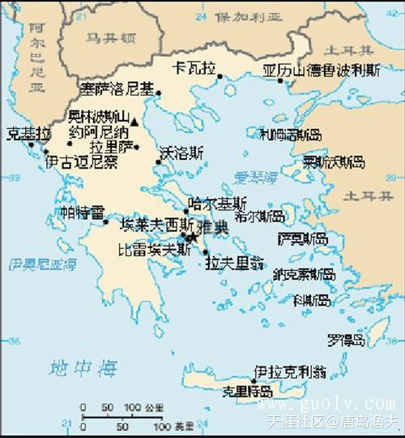

`雅典/Athens`的地理位置

---

- 事实上克里特岛的地质资源根本不可能诞生文明，希腊神话漏洞百出，东一榔头西一棒槌的拼凑起来的，根本行不成体系，成书不会超过五百年。

- 确实有这个疑点。

- 你要这样理解，渔夫是在告诉我们，西方人是怎么理解他们的“历史”的。我们得知道他们理解的出发点，而不是认同那些故事。

- 土耳其海峡原来也属于希腊吧？后来被奥斯曼给占领了。

- 是的。我们知道罗马帝国巅峰时代是把地中海做内湖的，但是古希腊是一样的，古希腊把爱琴海也是做内湖的。区别是，古希腊从来就没统一过，除了那个传说中的马其顿亚历山大时代。

- 希腊还是很聪明的，不允许有国家叫马其顿国，反看中国，允许蒙古国存在，好像它是代表全部蒙古人一样，其实它只是个喀尔喀部落，比较低档的蒙古人。

- 不过呢，蒙古汗国距离今天近些，好在科尔克蒙古能说出一些渊源。马其顿人和古代马其顿人，从语言到人种已经毫无关系了。

- 古代希腊是一个独立的世界。

---

## 爱琴争雄（六）

按照盟约的规定，每隔九年，雅典人就要进贡七对童男童女（十八岁以下）给克里特人。而这些童男童女，实际上是被送给了米诺斯国王的怪兽儿子，人身牛头的`弥诺陶洛斯/Minotaur`。

这和谈协议，原本执行的还不错，不过到了第三次进贡的时候，出事了。

此时此刻的`雅典/Athens`，出了一个少年英雄`忒修斯/Theseus`。

`忒修斯/Theseus`是一个山寨版的`赫拉克勒斯/Hercules`。

`忒修斯/Theseus`在五岁的时候，有幸同大英雄`赫拉克勒斯/Hercules`一起吃了一顿饭，小小孩童被大英雄的风采所倾倒。从此`忒修斯/Theseus`就以`赫拉克勒斯/Hercules`为偶像，立志长大做他那样的人。

跟`赫拉克勒斯/Hercules`一样，`忒修斯/Theseus`也是踌躇满志地到处冒险，打怪升级。只不过`忒修斯/Theseus`的打的怪比`赫拉克勒斯/Hercules`普遍低了一个层级。

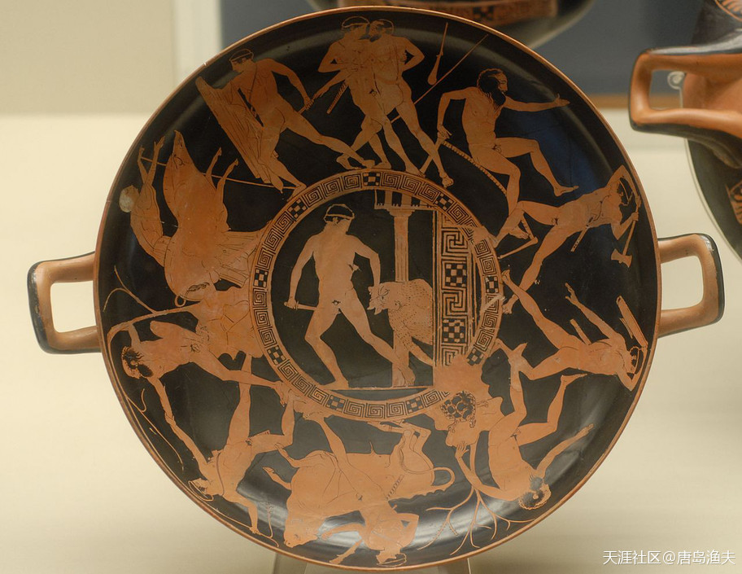

山寨版的赫拉克勒斯——`忒修斯/Theseus`以及他的打怪升级之路

> The deeds of Theseus, on an Attic red-figured kylix, c. 440–430 BC (British Museum)

---

好奇的是欧洲的这些故事是记载在哪些书上流传下来的呢？

有没有出土的文物佐证这些故事？

?> 欧洲历史的尴尬就在这里，没有官修史书，所谓的历史需要一点点还原，拼接出来。尤其是上古史，更是跟神话传说脱离不开。更加尴尬的是，相当数量的资料还都是二手的，文艺复兴之后出现的。

无历史文物佐证，二手资料，文艺复兴时才出现，这些能不能说明所谓欧洲的文明都是舶来品？

?> 据说是在阿拉伯人手里保存着的二手资料，文艺复兴时期翻译回去的。 
从逻辑上来说，这很合理。

---

## 爱琴争雄（七）

跟`赫拉克勒斯/Hercules`一样，`忒修斯/Theseus`也是号称半人半神。只不过，这个半人半神的说法却充满争议。很多人在背后嚼舌头，说`忒修斯/Theseus`是海神`波塞冬/Poseidon`和忒修斯的老妈`埃特拉/Aethra`苟合之后的私生子。只不过后来人们发现，散布这个说法的人，其实正是`埃特拉/Aethra`的老爸，也是古希腊`特洛曾/Troezen`的国王——`庇透斯/Pittheus`。亲外公敢于说自己的女儿跟波塞冬私通并不奇葩，奇葩的是外公又在`忒修斯/Theseus`长大成人之后，让他去找那个被戴了绿帽的人间老爸，`雅典/Athens`国王`埃勾斯/Aegeus`认祖归宗。

感情这`特洛曾/Troezen`的老外公小算盘打得山响，他是一点亏都不肯吃：海神`波塞冬/Poseidon`的神界光芒是吃着碗里的，人间国王的现成便宜是看着锅里的。

回到雅典的`忒修斯/Theseus`，同`埃勾斯/Aegeus`进行父子相认。

---

- 西方人跟中国人不一样，中国人认为自己的孩子的最好的，西方人认为神仙的儿子是最好的，所以西方人特别愿意自己的妻子先跟神仙交配，底层男人找不到神仙，就让僧侣给自己的妻子破处。

---

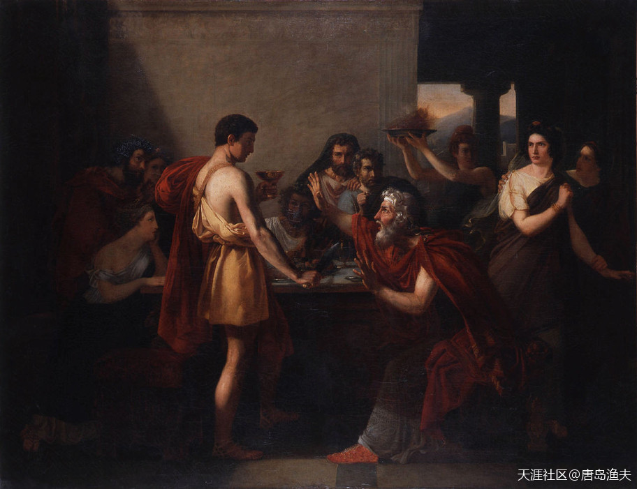

`忒修斯/Theseus`认父

> Thésée reconnu par son père by Antoine-Placide Gibert (1832)

## 爱琴争雄（八）

少年成名，英俊勇敢的`忒修斯/Theseus`，自告奋勇，充当第三次进贡的童男童女，他要去克里特岛，会一会`米诺斯/Minos`，还有那个传说中的半人半牛的怪物`弥诺陶洛斯/Minotaur`。

临行前，`忒修斯/Theseus`和这个疑似自己亲生父亲的`埃勾斯/Aegeus`有个约定：忒修斯的船队从克里特岛返回的时候，如果远远地看见挂的是黑帆，就是忒修斯已经被吃掉了。而如果挂的是白帆，那就是忒修斯全身而退。

`忒修斯/Theseus`在出发之前，曾经假想了各种艰难困苦。但他没有想到，实际的旅途却轻松写意，甚至是桃红柳绿。

`忒修斯/Theseus`上岛之后，第一个没有想到的，就是他居然轻松地让`米诺斯/Minos`的漂亮女儿`阿里阿德涅/Ariadne`爱上了自己。此时此刻的忒修斯并不知道，多年以后，他会阅女无数，对于女人的品味也会越来越高。而这一次对克里特公主`阿里阿德涅/Ariadne`，只是一个惊天情种的初出茅庐，小试牛刀。

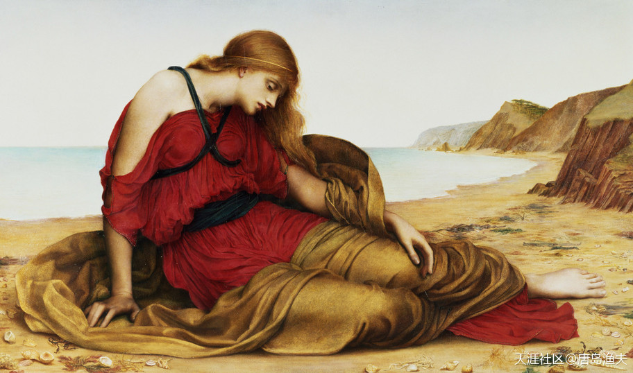

克里特公主——`阿里阿德涅/Ariadne`

> Ariadne in Naxos, by Evelyn De Morgan, 1877

## 爱琴争雄（九）

坠入爱河的`阿里阿德涅/Ariadne`，帮助`忒修斯/Theseus`想到了破解迷宫，以及对付自己怪兽哥哥的好办法。`阿里阿德涅/Ariadne`给了`忒修斯/Theseus`一个线球和一把魔刀，线球沿着忒修斯进入迷宫的道路一路展开，巧妙地记录了忒修斯的进出之路。而魔刀在手，`忒修斯/Theseus`最终手刃怪兽。人身牛头的儿子被杀之后，`米诺斯/Minos`也在一次意外中死去。米诺斯死后，`宙斯/Zeus`把他擢升为冥界的三大判官之一，并且是三人中的主判。

这其实，也是一个略显凄美的爱情桥段。

被爱情冲昏头脑的`阿里阿德涅/Ariadne`，背叛了自己的老父亲，帮助自己的临时老爷们杀了自己一起长大的哥哥。

---

- ：美狄亚？
- ：还真不是，不过这两个故事似乎有互相模仿之嫌。

---

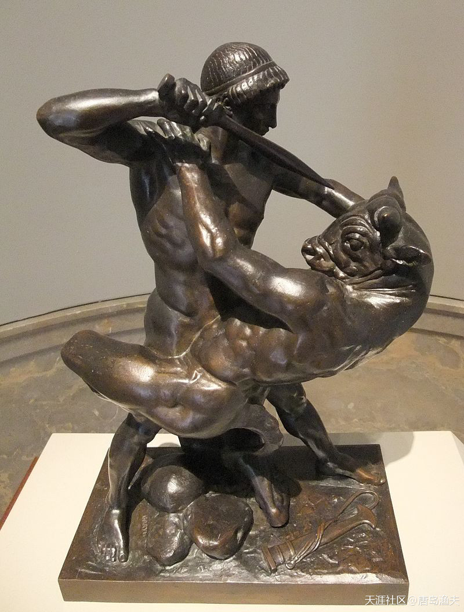

`忒修斯/Theseus`手刃牛妖

> Theseus Slaying Minotaur (1843), bronze sculpture by Antoine-Louis Barye

## 爱琴争雄（十）

初恋总是不完美的。

大功告成，逃离克里特岛的`忒修斯/Theseus`，在半路上遗弃了`阿里阿德涅/Ariadne`。悲痛欲绝的`阿里阿德涅/Ariadne`，找到了酒神`狄俄尼索斯/Dionysus`，重启一段浪漫的爱情；而回到`雅典/Athens`的`忒修斯/Theseus`，在很多年后，迎娶了`米诺斯/Minos`的另外一个女儿，和`阿里阿德涅/Ariadne`一母同胞的`淮德拉/Phaedra`。

整个故事的尾声也颇为出人意料。

胜利凯旋的`忒修斯/Theseus`，中途忘记及时地把舰队的黑帆换成白帆，老父亲`埃勾斯/Aegeus`痛心不已，投海自尽。埃勾斯跳的那片海，后来以`埃勾斯/Aegeus`的名字所命名，叫做`爱琴海（Aegean Sea）`。

`埃勾斯/Aegeus`死后，`忒修斯/Theseus`继承乃父遗志，成为新的`雅典/Athens`之王。

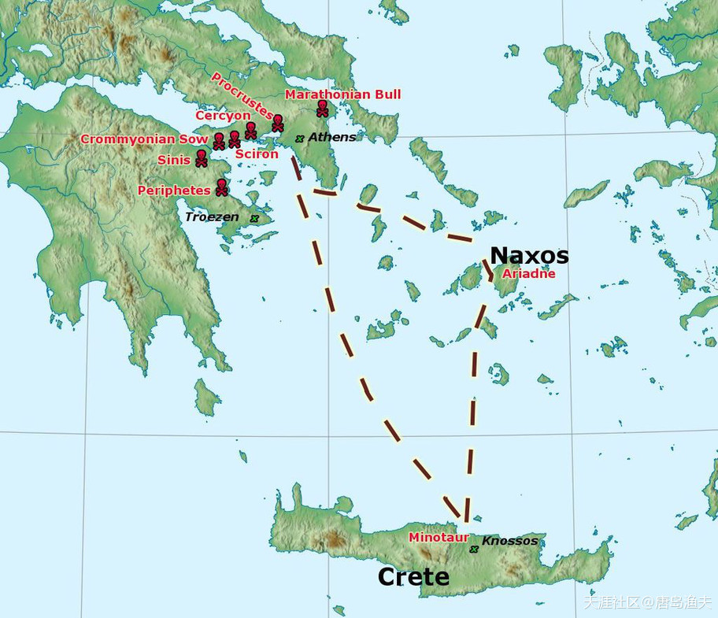

`忒修斯/Theseus`远征与抛妻路线图

> Map of Theseus's labours

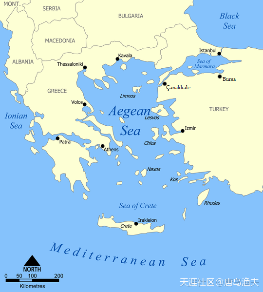

`爱琴海（Aegean Sea）`的名字，就是来源于`雅典/Athens`绿帽子王`埃勾斯/Aegeus`