# 第四节 阿特拉斯的魔咒

## 阿特拉斯的魔咒（一）

`阿伽门农/Agamemnon`并没有等待太久。

`阿伽门农/Agamemnon`的弟媳妇，全希腊最漂亮的女人`海伦/Helen`，充分发扬了`自带惹事生非体质的特殊基因`，为`阿伽门农/Agamemnon`带来了一个千载难逢的好机会。

事情的缘起，跟`特洛伊/Troy`王国有关系。

`特洛伊/Troy`，是一个天生被诅咒过的国家。

原因也很简单，`特洛伊/Troy`的原始祖先，是`阿特拉斯/Atlas`。

当年在提坦之战中，`阿特拉斯/Atlas`率领提坦众神攻打`奥林波斯山/Olympus`未果，被`宙斯/Zeus`降罪，罚去西方擎天，这一擎就是无休无止，无始无终。期间，倒霉的`阿特拉斯/Atlas`同学并非没有机会逃离这个永久的诅咒。

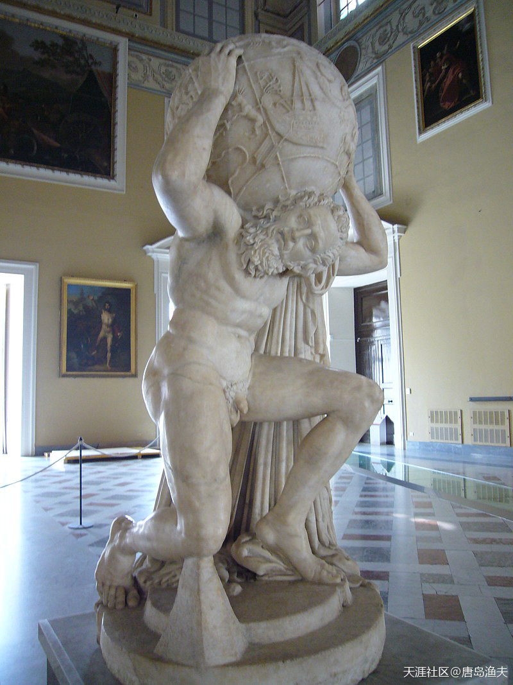

大家复习一下，倒霉的`阿特拉斯/Atlas`同志

> Statua romana di Atlante (sec II d.C.). Già nella Collezione Farnese, oggi al Museo Archeologico Nazionale di Napoli.

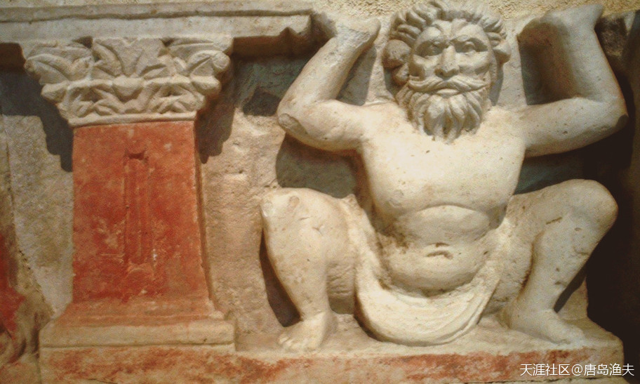

`阿特拉斯/Atlas`同志不仅帮西方人擎天，还帮助东方的佛祖打过零工

> Greco-Buddhist (c. AD 100) Atlas, supporting a Buddhist monument, Hadda, Afghanistan

---

- 他的名字在拉丁系语言里看上去和大西洋也很相似

- 这个是没错的，前文也暗示过这一点，阿特拉斯是在“大西”这个地方擎天的。。。这个词的词根，跟大西洋是一个。

---

## 阿特拉斯的魔咒（二）

提坦之战战后，来自`迈锡尼/Mycenae`的半人半神英雄`赫拉克勒斯/Hercules`的十二项任务中，其中有一项就是去西方摘下`金苹果`，献给`欧律斯透斯/Eurystheus`。这个金苹果所在的苹果园，我们知道是由三仙女`赫斯珀里得斯/Hesperides`来看守的。除了三仙女之外，还有个叫做`拉冬`的百头巨龙。因此，到大洋西岸去摘金苹果，这事并不容易。`赫拉克勒斯/Hercules`一路向西，路上历尽了千难万险，却依然没有完成这个艰巨的任务，甚至连苹果园的门儿朝哪开，他都无从得知。

`赫拉克勒斯/Hercules`一直到拯救了`普罗米修斯/Prometheus`，才找到了打开这个难题的钥匙。

专业坑爹坑娘坑兄弟的`普罗米修斯/Prometheus`同志，为了报答`赫拉克勒斯/Hercules`的搭救之情。他提示`赫拉克勒斯/Hercules`，最好不要自己去金苹果园，有一个人可以替大英雄去冒这个险。这个人不是别人，就是`普罗米修斯/Prometheus`的亲兄弟，擎天的`阿特拉斯/Atlas`。

于是`赫拉克勒斯/Hercules`找到了`阿特拉斯/Atlas`，主动提出来帮`阿特拉斯/Atlas`擎天，而让`阿特拉斯/Atlas`帮自己去摘金苹果。`阿特拉斯/Atlas`擎天擎了这么多年，连个说话的人都找不到，各种孤独寂寞空虚冷。于是，二话不说，交易达成。

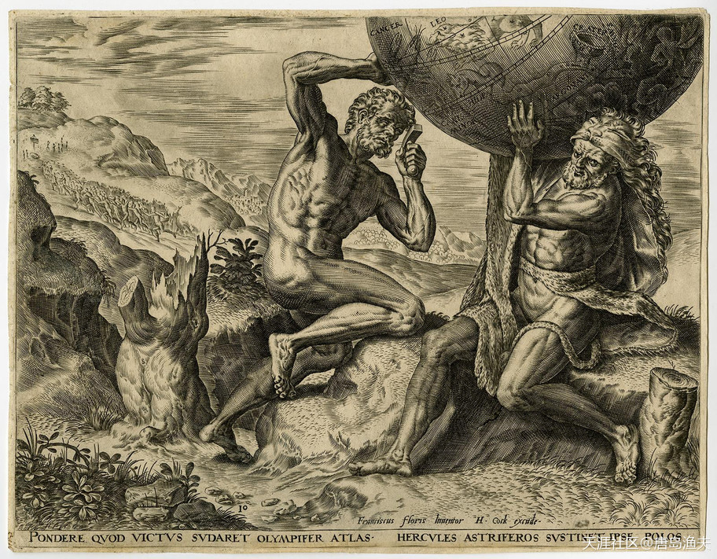

`阿特拉斯/Atlas`与`赫拉克勒斯/Hercules`，临时交接工作

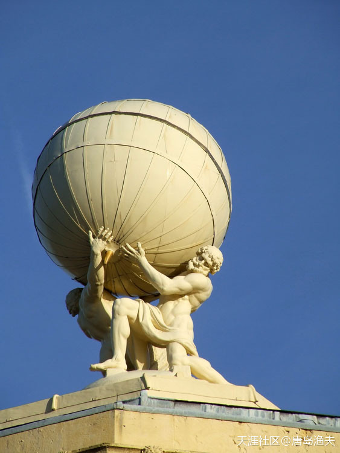

`阿特拉斯/Atlas`与`赫拉克勒斯/Hercules`雕像，在英格兰

> Atlas & Hercules, a photo from Oxfordshire, England

## 阿特拉斯的魔咒（三）

`阿特拉斯/Atlas`倒是也不含糊，成功骗过了三仙女，又三下五除二杀死了百头巨龙拉冬。当`阿特拉斯/Atlas`再一次回到`赫拉克勒斯/Hercules`身边的时候，他的手上已经拿到了三个金苹果。

但是在接下来到底谁继续擎天的问题上，`阿特拉斯/Atlas`和`赫拉克勒斯/Hercules`产生了分歧。

`赫拉克勒斯/Hercules`假意对`阿特拉斯/Atlas`说，自己的肩膀需要一个垫子，希望`阿特拉斯/Atlas`帮助他代擎一会儿，自己缓一缓再加个垫子。实心眼的`阿特拉斯/Atlas`，就这样重新接过了擎天重担，而`赫拉克勒斯/Hercules`则一去不回头，带着三个金苹果扬长而去。

帮大英雄完成使命的`阿特拉斯/Atlas`，继续着苦力生活。

同样帮大英雄完成使命的金苹果，被`雅典娜/Athena`女神带回了苹果园，交还给了三仙女。

不过，`阿特拉斯/Atlas`的故事还在继续，金苹果的魔咒也并没有结束。

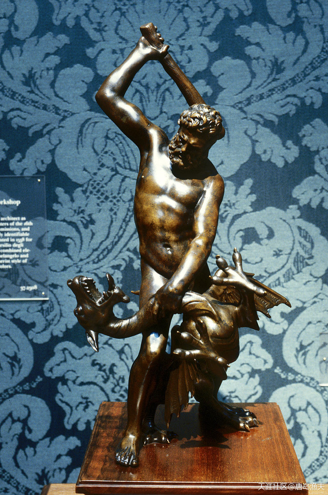

`赫拉克勒斯/Hercules`与巨龙`拉冬/Ladon`

> Hercules and the Dragon Ladon, from the workshop of Giambologna, early 17th century (Walters Art Museum).

## 阿特拉斯的魔咒（四）

`宙斯/Zeus`打败了`阿特拉斯/Atlas`，罚人去永世擎天也就算了，结果好色的`宙斯/Zeus`同志了解到`阿特拉斯/Atlas`家里还有七个如花似玉的女儿。

这七个女儿，都是`宁芙仙子/Nymph`。七个女儿的妈，是三千大洋神女之一的`普勒俄涅/Pleione`。因此，这七位漂亮女儿，被统称为`普勒阿得斯/Pleiades`，意思是`普勒俄涅的女儿们`，也就是希腊神话中的`七仙女`。

七仙女的名字，分别是`伊莱卡/Electra`、`迈亚/Maia`、`塔吉忒/Taygete`、`阿耳刻悠妮/Alcyone`、`美罗珀/Merope`、`塞莱诺/Celaeno`、`丝黛罗普/Sterope`。

其中前三位仙女，`伊莱卡/Electra`、`迈亚/Maia`、`塔吉忒/Taygete`，统统没有逃过`宙斯/Zeus`的桃色小魔爪。

我们前文提到的奥林波斯十二主神之一的神使`赫尔墨斯/Hermes`，其实就是`宙斯/Zeus`与`迈亚/Maia`所生；`宙斯/Zeus`同`塔吉忒/Taygete`结合，生下了`拉克代蒙/Lacedaemon`，他就是`斯巴达/Sparta`城的建立者，也是`斯巴达/Sparta`王国的第一代王。

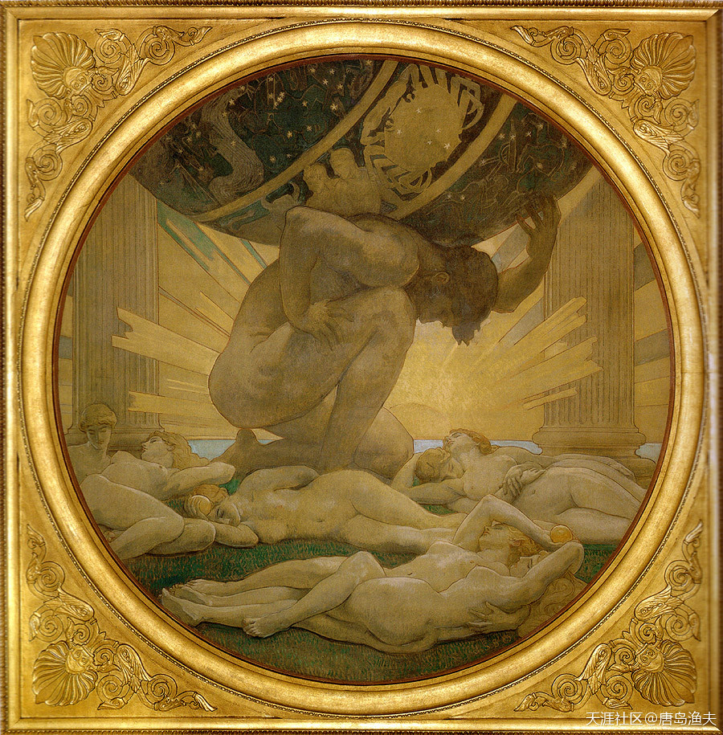

`阿特拉斯/Atlas`和他的漂亮女儿们

> Atlas and the Hesperides by Singer Sargent, John (1925)

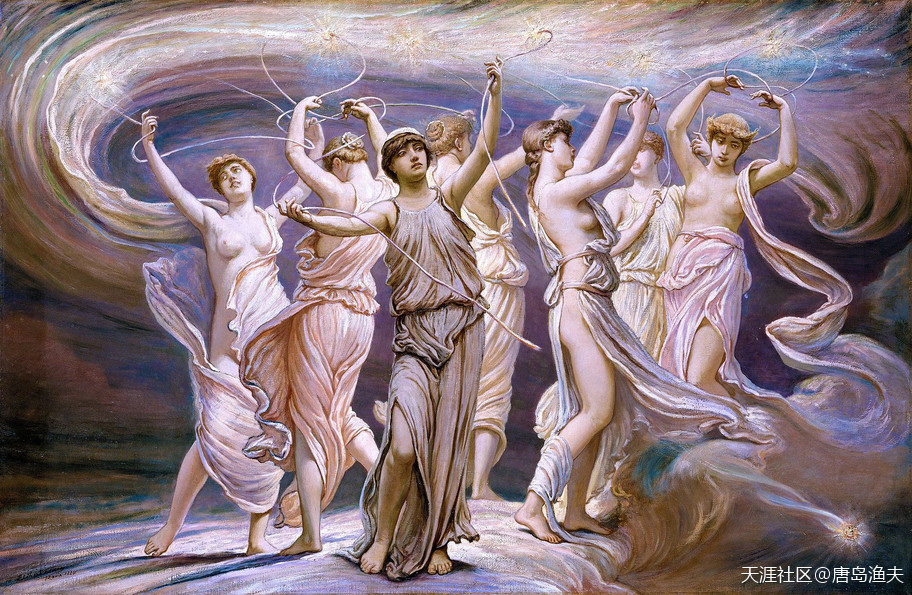

`阿特拉斯/Atlas`家的`古希腊七仙女/Pleiades`

> The Pleiades (1885) by the Symbolist painter Elihu Vedder

## 阿特拉斯的魔咒（五）

而`宙斯/Zeus`与`伊莱卡/Electra`，则生下了一个叫做`达耳达诺斯/Dardanus`的儿子。

`达耳达诺斯/Dardanus`长大之后，到了今天小亚细亚半岛附近，开发并命名了`达达尼尔海峡/Dardanelles`地区，并在这里成立了一个新的希腊化国家，叫做`达尔达尼亚`。

`达尔达尼亚`王国传到了第三代，`达耳达诺斯/Dardanus`的孙子`特罗斯/Tros`成为国王。那么从`特罗斯/Tros`开始，国王就依据自己的名字，改称`达尔达尼亚人民`为`特洛伊人`。而到了`特罗斯/Tros`的儿子`伊洛斯/Ilus`称王，他为了纪念自己的老爸，新建了一座城市。这座城市按照伊洛斯的名字，就叫做伊利昂城（Ilion）。而如果按照伊洛斯的本意，纪念自己的老爸特罗斯，那么城市也被叫做`特洛伊/Troy`。从此以后，`达尔达尼亚王国`就改了个名字，叫做`特洛伊王国`。

改头换面之后的`特洛伊王国/Troy`，继续着`阿特拉斯/Atlas`家族的叵运。

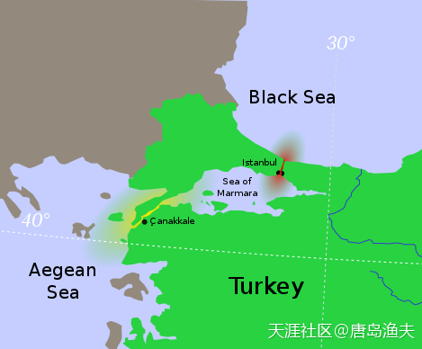

土耳其海峡的其中一段——`达达尼尔海峡/Dardanelles`（标黄部分）

> The strait of the Dardanelles (yellow) takes its name from Dardanus.

- 有没有感觉名字很熟悉？其实就是源自`宙斯/Zeus`的儿子`达耳达诺斯/Dardanus`。

- 所以，对西方文化，你可以骂街，你可以不屑，但这并不妨碍西方人或者世界其他国家的自我认同。

- 而且，中国的教科书里面，天天就写着宙斯儿子的名字，天天让你背诵，考试……

- 博斯普鲁斯海峡，马耳马拉海，达达尼尔海峡。。。高中必备。不过我是根据三个火枪手的名字记住达达尼尔的:p

## 阿特拉斯的魔咒（六）

话说`特洛伊/Troy`之王`伊洛斯/Ilus`，本来有三兄弟，`伊洛斯/Ilus`、`阿萨剌科斯/Assaracus`和`伽倪墨得斯/Ganymedes`。三兄弟中最年轻最英俊的美少年，是`伽倪墨得斯/Ganymedes`。

`伽倪墨得斯/Ganymedes`的俊美惊动了全希腊，也惊动了奥林波斯山上的众神。

这件事传到了`宙斯/Zeus`的耳朵里，男女通吃的`宙斯/Zeus`同志开始打`伽倪墨得斯/Ganymedes`的歪主意。在一片狂风暴雨和电闪雷鸣中，`宙斯/Zeus`化作一只巨鹰俯冲到人间，带走了`伽倪墨得斯/Ganymedes`。被带到奥林波斯山的`伽倪墨得斯/Ganymedes`，迅速用自己的年少英俊，击败众多美艳的女神，成为了宙斯的心尖子。

当时的神界，恰逢青春女神`赫柏/Hebe`嫁给了大英雄`赫拉克勒斯/Hercules`，之前属于`赫柏/Hebe`的奥林波斯山侍酒童的职位空缺，于是`宙斯/Zeus`就任命自己的新爱人`伽倪墨得斯/Ganymedes`做了新的侍酒童。

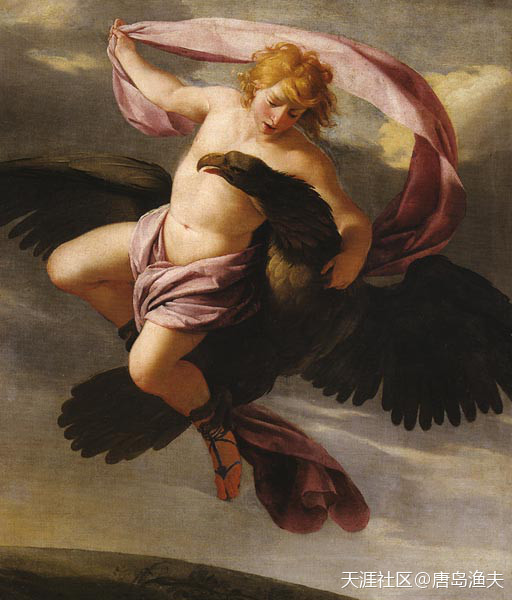

巨鹰宙斯拐走了伽倪墨得斯

> The Abduction of Ganymede (ca. 1650), by Eustache Le Sueur

- 这婴儿肥……

## 阿特拉斯的魔咒（七）

`伽倪墨得斯/Ganymedes`的这份工作做的非常出色，奥林波斯众神对`伽倪墨得斯/Ganymedes`交口称赞。并且，`伽倪墨得斯/Ganymedes`和`宙斯/Zeus`之间的感情，也越来越腻乎。很多时候，`伽倪墨得斯/Ganymedes`在为`宙斯/Zeus`倒酒的时候，都要在酒杯上先用嘴唇抿一下杯壁。再把酒杯旋转180度，递给宙斯。这样的细枝末节中的浪漫，美少年和老天王之间，又岂止发生了一件。

天后`赫拉/Hera`终于坐不住了。

`赫拉/Hera`可以接受宙斯的滥情，可以接受`宙斯/Zeus`同神界人间的各色女神女人们厮混，但`赫拉/Hera`却无法容忍自己御姐一般的魅力，居然敌不过一个凡间男人。

盛怒之下的天后`赫拉/Hera`，将`伽倪墨得斯/Ganymedes`变成了一个水瓶，而这个水瓶，将永生永世为`宙斯/Zeus`倒水。事实上，水瓶里面倒出来的水，其实都是美少年的眼泪。

看到自己的心上人无辜受过，`宙斯/Zeus`的心非常疼。

最终`宙斯/Zeus`将这只水瓶升上了天空，成为了夜空中的`水瓶星座`。

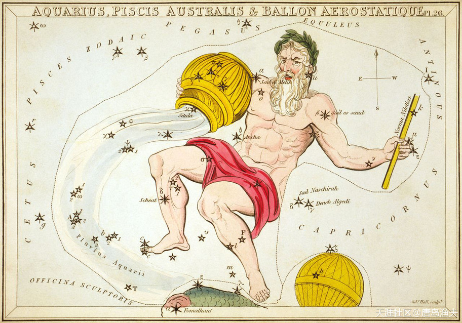

`水瓶星座/Aquarius`

> A representation of Aquarius printed in 1825 as part of Urania's Mirror (including a now-obsolete constellation, Ballon Aerostatique south of it)

## 阿特拉斯的魔咒（八）

`特洛伊/Troy`王子`伽倪墨得斯/Ganymedes`的爱情故事告一段落，但关于特洛伊的魔咒还在继续。

`伽倪墨得斯/Ganymedes`的兄弟，`伊洛斯/Ilus`国王死后，王位传给了`拉俄墨冬/Laomedon`。而这个`拉俄墨冬/Laomedon`是个极端作死的人。他曾经欺骗过光明之神`阿波罗/Apollo`和海神`波塞冬/Poseidon`，从而招来了海神`波塞冬/Poseidon`的疯狂报复。`波塞冬/Poseidon`派出海怪，抓走了`拉俄墨冬/Laomedon`的女儿，也就是特洛伊的公主`赫西俄涅/Hesione`。正在`拉俄墨冬/Laomedon`冬束手无措的时候，恰逢大英雄`赫拉克勒斯/Hercules`远征`亚马逊女战士/Amazons`凯旋，路过`特洛伊/Troy`。于是，`拉俄墨冬/Laomedon`央求大英雄打败海怪，救出自己心爱的公主。事成之后，`拉俄墨冬/Laomedon`答应送给大英雄一群来自于天王`宙斯/Zeus`御赐骏马作为酬谢。

在冷兵器时代，骏马对于英雄们的意义非同寻常。爱美女的英雄，多半都爱骏马；当然，不爱美女的英雄，也爱骏马。

`赫拉克勒斯/Hercules`是前者。

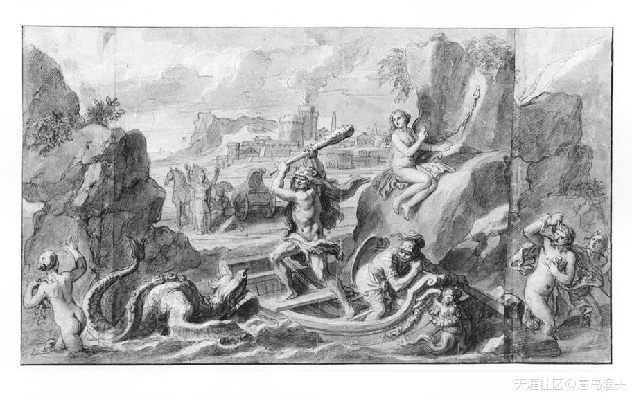

`赫拉克勒斯/Hercules`英雄救美，大战海怪

> Hercules rescuing Hesione from the Sea Monster, from Scenes from the Labors and Exploits of Hercules.

- 打来打去都是棒槌……

## 阿特拉斯的魔咒（九）

在冷兵器时代，骏马对于英雄们的意义非同寻常。爱美女的英雄，多半都爱骏马；当然，不爱美女的英雄，也爱骏马。

`赫拉克勒斯/Hercules`是前者。

况且，`赫拉克勒斯/Hercules`不是没有在这样的赌注中得到过美妙记忆。当年大英雄路过`色皮耶王国/Thespiae`，帮助国王`瑟斯皮乌斯/Thespius`打败了一头强大的狮子，保护了整个色皮耶王国。在大英雄同狮子决战期间，兴奋的老国王为了犒劳大英雄，派出了自己的50个待嫁的公主分成五十个晚上，轮流服侍大英雄共度良宵。而大英雄`赫拉克勒斯/Hercules`也不含糊，成功杀掉狮子，也成功地让所有的女孩每个人都生下了一个儿子。

`赫拉克勒斯/Hercules`面对海怪，毫无惧色，最终斩将夺旗，救出了公主。

然而，`拉俄墨冬/Laomedon`却习惯性地言而无信，没有履行自己的承诺。

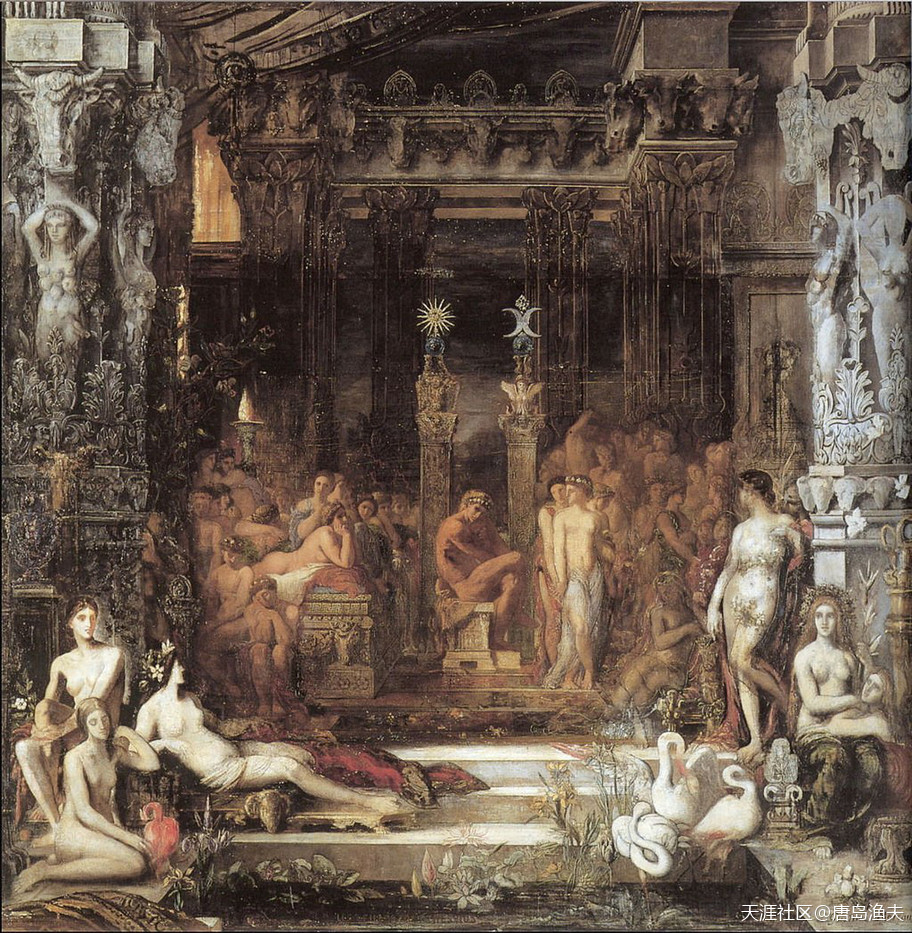

`瑟斯皮乌斯/Thespius`的五十个宝贝女儿

> Daughters of Thespius——by Gustave Moreau

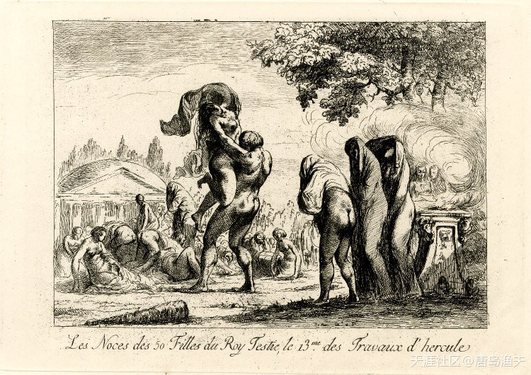

`赫拉克勒斯/Hercules`笑纳五十佳丽（被称为`第十三功绩/The thirteenth labour`）

> The thirteenth labour: erotic scene, with the 50 daughters of Thespius offered to Hercules, who is mating with one while three others are waiting in line on the right. c.1793  
——The British Museum

## 阿特拉斯的魔咒（十）

骏马没有捞到，公主也没有让大英雄一亲芳泽。

跟`瑟斯皮乌斯/Thespius`国王比起来，`拉俄墨冬/Laomedon`干的这点事，可是真不讲究。

这件事情，让`赫拉克勒斯/Hercules`怒不可遏。

当`赫拉克勒斯/Hercules`完成了十二项任务，获得了`迈锡尼/Mycenae`的自由之身的之后。大英雄重回`特洛伊/Troy`，诛杀了大嘴巴的`拉俄墨冬/Laomedon`，还有拉俄墨冬的几个儿子。最后只留下了小儿子`普里阿摩/Priam`。

`普里阿摩/Priam`后来就成了新的`特洛伊/Troy`之王。

`普里阿摩/Priam`有个儿子，名叫`帕里斯/Paris`。

`阿伽门农/Agamemnon`的那个千载难逢的好借口，就缘自`海伦/Helen`和`特洛伊/Troy`王子`帕里斯/Paris`的孽缘。

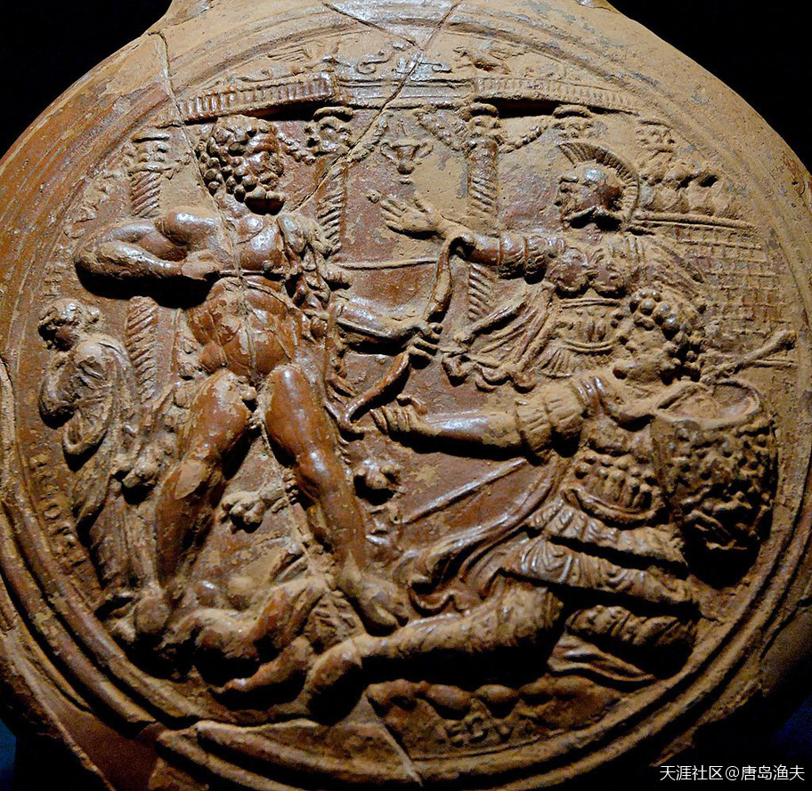

`赫拉克勒斯/Hercules`荡平`特洛伊/Troy`

> Heracles about to kill Laomedon, terra sigillata flask from Southern Gaul, late 1st century–early 2nd century AD

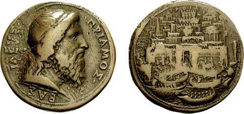

`普里阿摩/Priam`的硬币

> Priam of Troy, by Alessandro Cesati. fl. 1540-1564 
