# 第一节 帕里斯的判决

## 帕里斯的判决（一）

印象里面，都觉得`帕里斯/Paris`王子是个翩翩少年的样子，至少也是个白面小生人设。

然而，我们都被电影的艺术再加工给骗了。

`帕里斯/Paris`王子其实出道很早。

特洛伊之王`普里阿摩/Priam`与王后`赫卡柏/Hecuba`先后生了几个孩子，`帕里斯/Paris`只是其中一个。这个孩子生下来之前，老妈`赫卡柏/Hecuba`做了一个梦，梦见有人预言，即将生下来的这个孩子，以后会毁了`特洛伊/Troy`。这事发生在平常百姓家可能也就算了，因为普通百姓的家里本来也就没什么可毁的。但是发生在王室则就了不得了，这种谶言，宁可信其有，不可信其无，因为谶言的背后，关系到国运兴衰，万民安危。于是老爹`普里阿摩/Priam`狠了狠心，把`帕里斯/Paris`丢到了荒郊野外的`伊达山/Mount Ida`。

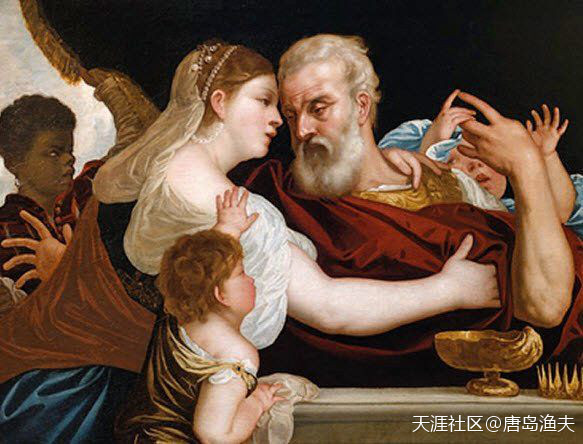

`普里阿摩/Priam`与`赫卡柏/Hecuba`

> Hecuba and Priam 
——by Alessandro Varotari - 1620

## 帕里斯的判决（二）

不料，这个刚刚出世的婴儿，在饥饿与寒冷中度过了五天五夜，居然安然无恙。这个时候有个牧羊人经过，觉得这个大难不死的孩子一定会有福报，于是就把`帕里斯/Paris`带回家抚养，直到`帕里斯/Paris`长成一个英俊而又强壮的小小少年。

长大之后的`帕里斯/Paris`，遇到了河神`克白林/Cebren`（欧申纳斯夫妇的儿子之一）的女儿`俄诺涅/Oenone`。

两位年轻人，情窦初开的年龄，每天就这样无忧无虑地腻味在了一起。

`帕里斯/Paris`原以为，他从此将会在这个偏僻的山谷牧羊唱歌，生儿育女，度过余生。孰料人算不如天算，就像是中国古代神话故事中，无数个自小失踪后来遇到名师指点，最终学艺下山的少年英雄们一样，命运注定还是安排了一场意外，让`帕里斯/Paris`走出大山来到人间，也从人生大戏的幕后走向了台前。

命运安排的这场意外，来源于神界的一场婚礼。

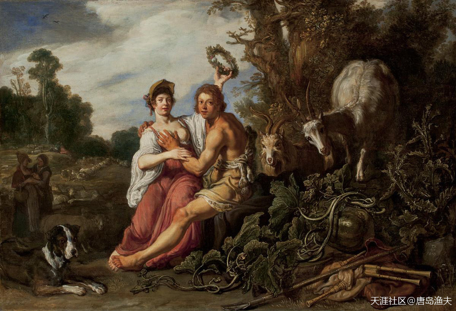

`帕里斯/Paris`与`俄诺涅/Oenone`

> Paris and Oenone  
——Worcester Art Museum

## 帕里斯的判决（三）

命运安排的这场意外，来源于神界的一场婚礼。

这个婚礼，有点来历。

话说当年生性风流的`宙斯/Zeus`化成巨鹰（又是这个套路），拐走了河神`阿索波斯/Asopus`（欧申纳斯夫妇的另外一个儿子）的小女儿`埃癸娜/Aegina`。要知道`阿索波斯/Asopus`这位老同志一辈子只做一件事情，就是专注于生女儿，但是生完一堆女儿，老同志却没有精力去保护她们。于是，前面生的八个掌上明珠一样的的女儿全部都离奇失踪，小女儿`埃癸娜/Aegina`是硕果仅存的一个。小女儿失踪，老同志彻底疯了，之后就走上了寻找女儿的漫漫长路。

老河神`阿索波斯/Asopus`在寻找女儿的路上，遇到了科林斯的国王`西西弗斯/Sisyphus`。老河神用手中的一条四季长流的河流作为代价，从生性狡猾的`西西弗斯/Sisyphus`手中，换取到了`埃癸娜/Aegina`的下落。

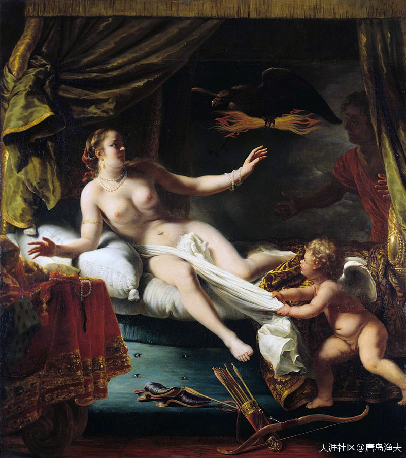

等待`宙斯/Zeus`临幸的`埃癸娜/Aegina`

> Aegina Awaiting the Arrival of Zeus. 
——Painting by Ferdinand Bol  
很有意思的明暗对比，`宙斯`的本体和化身都隐藏在黑暗里，右下的天使也很抢镜，正在扯下最后的遮羞布。

---

欧洲的历史就是一部神话，说它是所谓的文艺复兴时期那帮写手们捣鼓出来的也毫不为过，因为没有真实可靠的古代出土文物加以佐证。如果有“文物”，也是工业革命后的产品。

渔夫以神话来写欧洲历史，可谓清醒而深刻。神话写得天马行空，我们也看得眼花缭乱。那油画中的小人儿，撇开那些千篇一律线条健硕高鼻环眼的呕男，千篇一律丰润白嫩显山露水的那些个看久了倒有几分心动。

- `唐岛渔夫`: 所以，不要被一些搞艺术的给巧言令色了。西方文艺复兴的人体艺术，本来就是要回归原始的欲望与审美。所谓的用艺术的眼光来看人体，压根就不存在，所以也不用怀疑自己是不是艺术的水平不够。西方的那些近现代画油画的，哪个不是给泰坦尼克的杰克一样，阅女无数？

- `拾遗郎2011`：河马时代类似我们的三皇五帝时代吧……

- `唐岛渔夫`：评论 拾遗郎2011：`荷马时代`最像的是`武王伐纣`，哈哈。

---

## 帕里斯的判决（四）

`西西弗斯/Sisyphus`的多嘴，惹恼了天王`宙斯/Zeus`。泡妞的事让你抖搂出去也就算了，还拿着这个情报换利益，这就是作死的节奏。天王`宙斯/Zeus`命令死神带走`西西弗斯/Sisyphus`，但`西西弗斯/Sisyphus`用尽自己的聪明才智，同冥界诸神斗智斗勇。结果可想而知，`西西弗斯/Sisyphus`又惹恼了冥界众神。于是变本加厉，`西西弗斯/Sisyphus`得到了一个比死刑更惨的惩罚——每天要活着，把一块巨大无比的石头从一座山的山脚下，推到山顶上，再眼睁睁看着这块大石头从山顶滚到山脚下。然后所有工作清零，从头再来。

`西西弗斯/Sisyphus`永生永世，就周而复始做这个没有意义的工作。

这个惩罚，后来被称为`西西弗斯式/Sisyphus`的悲剧。

再说河神`阿索波斯/Asopus`，老人家虽然知道了女儿的下落，但是却没办法阻止女儿被天王`宙斯/Zeus`占有。不仅没有办法阻止，被人揭发出来丑行的`宙斯/Zeus`还恼羞成怒，用自己的闪电长矛，击伤了老河神的一条腿。从此以后，老河神也就断了找回女儿的念想，拖着一条伤腿，踏踏实实做了天王`宙斯/Zeus`的`野岳父`之一。而他的小女儿`埃癸娜/Aegina`和`宙斯/Zeus`结合，生下了一个孩子，叫做`埃阿科斯/Aeacus`。

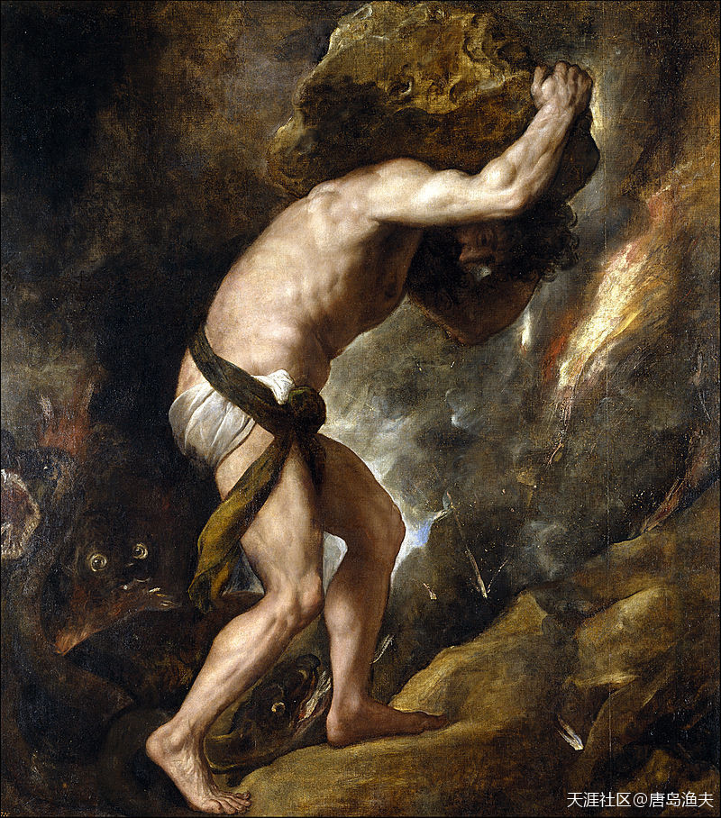

`西西弗斯式的悲剧/Sisyphys`

> Sisyphys (1548–49) by Titian, Prado Museum, Madrid, Spain

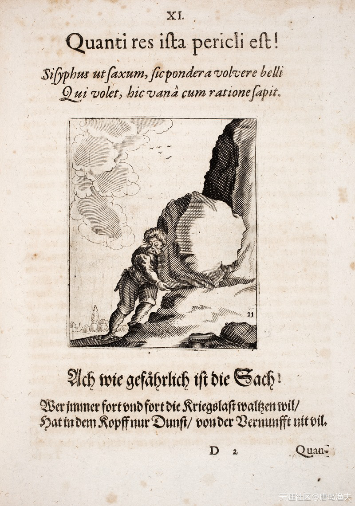

`西西弗斯式悲剧`的解读——这事在哲学角度，对西方文化影响很深

> Sisyphus as a symbol for continuing a senseless war. Johann Vogel: Meditationes emblematicae de restaurata pace Germaniae, 1649

- 联想到台湾九合一选举，很多人盲目地跟着国民党摇旗呐喊，奔走相告。

- 不统不独不武，国民党到底跟谁是一家的呢？台湾永远保持现状，难道不是西西弗斯式的惩罚吗？

- 联想到巴以，印巴，直布罗陀，阿尔萨斯洛林。。。这个世界版图发展到今天，都有其内在规律。

## 帕里斯的判决（五）

`埃阿科斯/Aeacus`后来做了冥界的判官，至此冥界就集齐了三大判官。我们前文提到的克里特之王`米诺斯/Minos`是主判，此外还有米诺斯的兄弟`拉达曼迪斯/Rhadamanthys`，以及`埃阿科斯/Aeacus`。

`埃阿科斯/Aeacus`后来娶了半人马星座`喀戎/Chiron`的女儿`恩得伊斯/Endeis`，两个人在一起生了两个儿子，一个叫`忒拉蒙/Telamon`，另一个叫做`珀琉斯/Peleus`。

`忒拉蒙/Telamon`和`珀琉斯/Peleus`，后来都成了扬名爱琴海的人间英雄，也都双双跻身于当年`伊阿宋/Jason`的`阿尔戈/Argo`五十英雄行列。

改变`帕里斯/Paris`一生命运的那场婚礼，男主角就是`珀琉斯/Peleus`。

`珀琉斯/Peleus`当时要娶的女人，是海洋女神`忒提丝/Thetis`（原始海神`蓬托斯/Pontos`的孙女，海洋老人`涅柔斯/Nereus`的女儿）。

婚礼本身倒也无话可说，门当户对，美女英雄。宾朋齐聚，佳偶天成。

不过热热闹闹的婚礼，却男女主人却没有邀请不和女神`厄里斯/Eris`。没邀请自然有没邀请的道理，因为这样的大婚时刻，谁都不愿意让一个略显晦气的女神出现。然而，这件事情却激怒了女神，女神决定要展开自己的报复。

?> `厄里斯/Eris`倒过来念就是`sire`，不请人家就作妖到让你叫爸爸，真是熟悉的桥段，熟悉的味道。

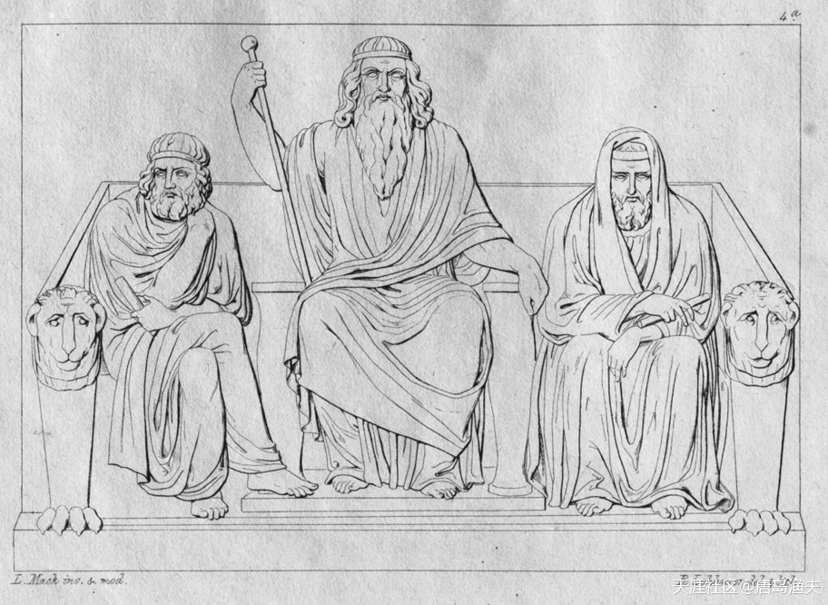

冥界三大判官

> Minos, Aeacus and Rhadamanthys 
——by Ludwig Mack, Bildhauer

- 行文到这里，就不得不说西方又开始山寨中国判官了……

- 中国古代四大判官——赏善司`魏征`、罚恶司`钟馗`、察查司`陆之道`、阴律司`崔钰`。

- ：确切地说，陆判这个小说出自于蒲松龄的小说集。陆判什么时候流行的， 最开始流行的时候原型是不是陆判，都未可知。退一步讲，四大判官是后人给总结出来的，蒲松龄的小说之前，中国冥界也早就有判官这个配置。

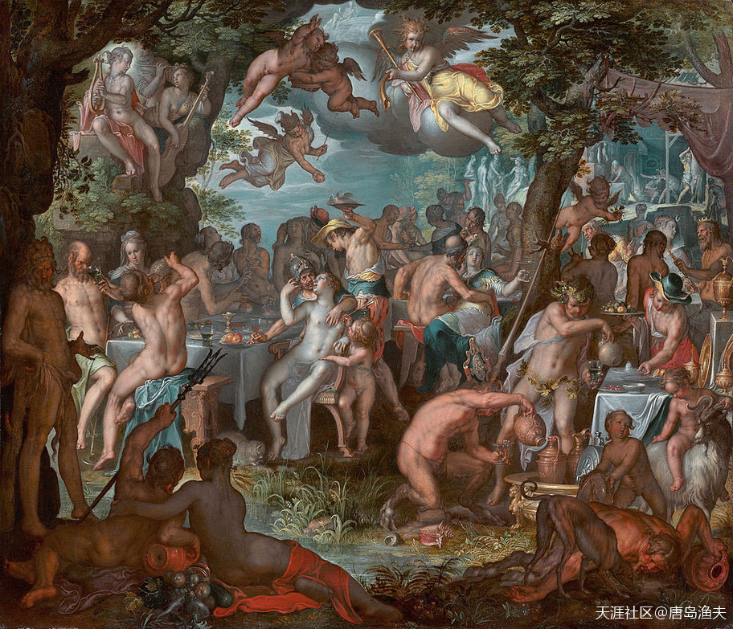

`珀琉斯/Peleus`与`忒提丝/Thetis`的婚礼现场

> The wedding of Peleus and Thetis,  
——by Joachim Wtewael

## 帕里斯的判决（六）

正当所有人沉浸在婚礼的欢乐时刻的时候，一个`金苹果`（又是金苹果），当着所有人的面从天而降。金苹果上面写着一行字——`献给最美的`。

婚礼现场，有三位女神对这件事情产生了浓厚的兴趣，他们都想成为那个最美的。这三位女神分别是，天后`赫拉/Hera`，智慧女神`雅典娜/Athena`，爱神`阿佛洛狄忒/Aphrodite`。要说这不和女神确实不是一般神，小小一个金苹果，让整个现场热情洋溢，团结友爱的气氛瞬间遭到破坏，为三位女神心中播下了不和的种子。

三位女神争执不下，都想拿到这个金苹果。但三位女神又都不是善茬，他们让众神裁决，众神也只能是和稀泥。众神和稀泥不要紧，这个皮球又踢给了德不高望也不重的众神之王`宙斯/Zeus`。对于`宙斯/Zeus`来讲，这三位女神，`赫拉/Hera`是自己的老婆，惹不起；`雅典娜/Athena`是自己的宝贝女儿，而且这个宝贝女儿还一向不齿于自己的私生活，惹不起；而`阿佛洛狄忒/Aphrodite`则是比自己高一辈的姑姑，而且这位姑姑是爱神，掌管着爱情和欲望。自己在神界人间对良家妇女胡作非为的事，样样都瞒不过老姑妈不说，必要的时候，还需要老姑妈出来拉皮条或者擦屁股，比如开篇的`欧罗巴/Europa`公主那档子事。

`宙斯/Zeus`没办法，只能是接着和稀泥，把这个皮球踢给了神使`赫尔墨斯/Hermes`。

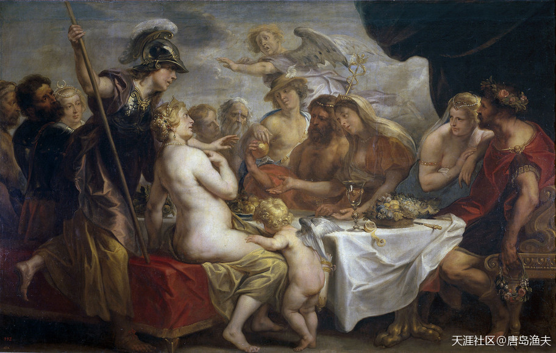

`珀琉斯/Peleus`与`忒提丝/Thetis`婚礼现场的`金苹果/Golden apple`

> Golden apple of discord 
——by Jakob Jordaens, 1633

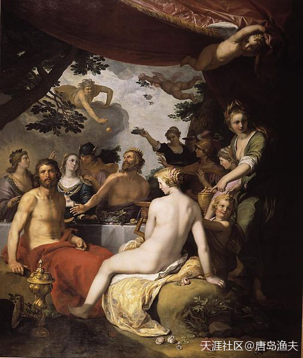

`珀琉斯/Peleus`与`忒提丝/Thetis`婚礼现场的金苹果——这张感觉是从天上扔下来的

> The feast of the gods at the wedding of Peleus and Thetis. 
from 1797 until 1815 : Musée Napoléon, today Louvre Museum, Paris

- 插一句，不要被西方散播的古铜色皮肤偏爱所蛊惑，西方人同样以白为美，这句话要说三遍。此外，西方人同样不喜欢雀斑，同样的事说三遍。传统审美从西方油画可见一斑，只要他们突出塑造的美女，都是白的发亮。

- ：至于古铜色这个梗是怎么来的，渔夫后边还会专门讲。

## 帕里斯的判决（七）

`赫尔墨斯/Hermes`能有什么好办法？只能是酒足饭饱，带着三位女神出去溜达溜达。

溜达的过程中，`赫尔墨斯/Hermes`与三位女神遇到了牧羊人装束的`帕里斯/Paris`。

`帕里斯/Paris`也是冤，人在路上走，锅从天上来。

三位女神的来历，`帕里斯/Paris`稀里糊涂，并不清楚。况且说了，你们神界都断不清的家务事，让一个凡人背什么锅？但三位女神分别给了`帕里斯/Paris`开出来了无法拒绝的诱惑条件。天后赫拉答应`帕里斯/Paris`，如果把金苹果判给自己，就给予`帕里斯/Paris`至高无上的权力；而智慧女神雅典娜，则承诺给了`帕里斯/Paris`荣誉；爱神当然也不含糊，而且条件更加直截了当——许诺给`帕里斯/Paris`世界上最美的女人。

正是青春年少的时节，哪个少年不风流，哪个少女不怀春。

`帕里斯/Paris`没有思考太久，就把金苹果判给了爱神`阿佛洛狄忒/Aphrodite`。

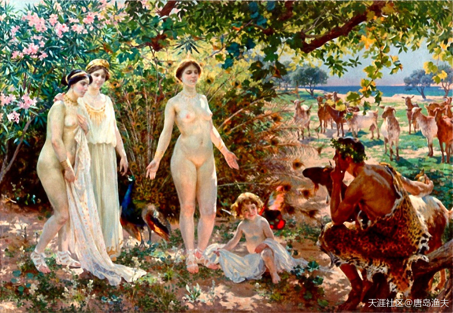

`帕里斯/Paris`的判决——judgement of Paris

> El Juicio de Paris  
——by Enrique Simonet, ca. 1904. 
Paris is studying Aphrodite, who is standing before him naked. The other two goddesses watch nearby.  
其实应该改个名，爱神赤膊上阵，大战`帕里斯/Paris`。

- 西欧普遍冒认祖宗，不仅法国人。后边讲法兰克王国，会统一说这一段，慢慢来，不急。

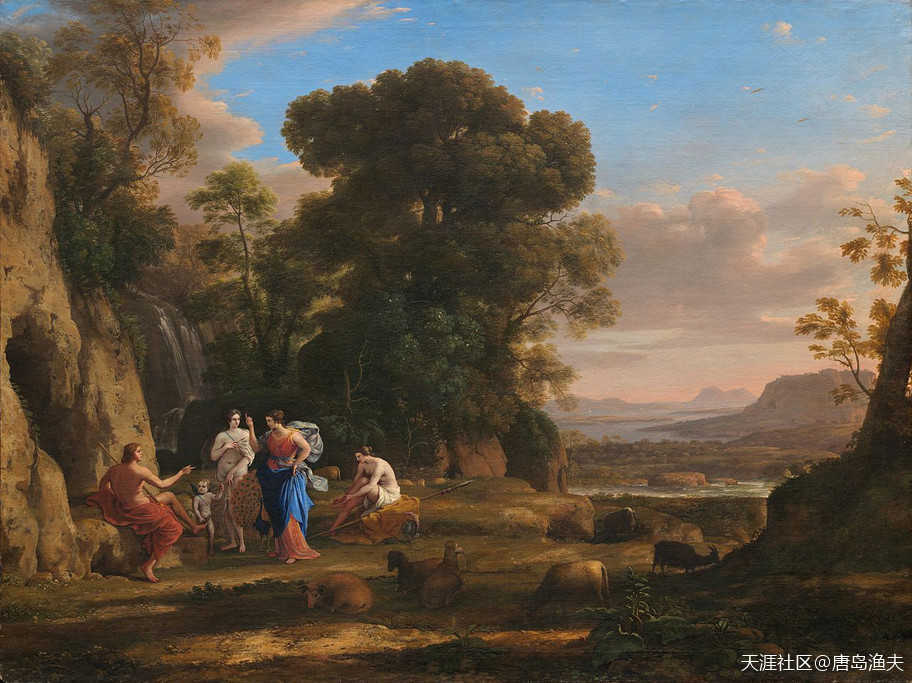

`帕里斯/Paris`的判决

> 这幅图，更加符合我们对于伊达山与牧羊人打扮的帕里斯的背景设定 
——by Claude Lorrain, c. 1645-1646

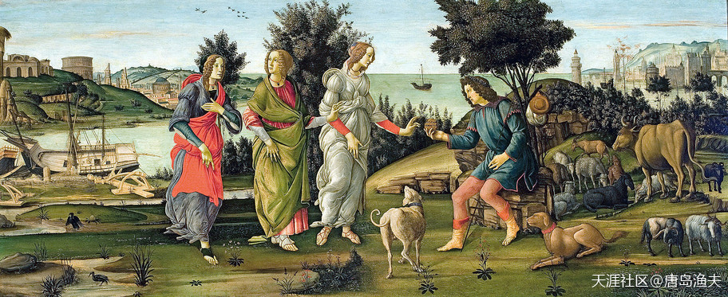

各个版本，三女神几乎就没有穿衣服的，这幅图是女神们没有衣冠不整的不多的一幅

> 西欧各国，几乎都有对于帕里斯的判决的本国演绎，这幅图也是结合国情的本地化版本之一  
——by Sandro Botticelli, c. 1485–1488. This is one of the very few versions in which all three goddesses are fully clothed.

---

- 正是青春年少的时节，哪个少年不风流，哪个少女不怀春。

- `帕里斯/Paris`没有思考太久，就把金苹果判给了爱神`阿佛洛狄忒/Aphrodite`。

- 我们知道，当时世上最美的女人，人人都说是`海伦/Helen`。

- `帕里斯/Paris`和`海伦/Helen`，是上天注定的一对乱世鸳鸯。

---
