# 第二节 阿喀琉斯

## 阿喀琉斯（一）

金苹果的判决之后不久，`帕里斯/Paris`辗转回到了`特洛伊/Troy`王国。

`特洛伊/Troy`王国不会平白无故就增加一个干吃饭不干活的贵族，`帕里斯/Paris`的认祖归宗之路并不平坦。最终老国王`普里阿摩/Priam`安排了几场比武，凭借着天生神力，以及这些年来在`伊达山/Mount Ida`上餐风饮露获得的刚强。`帕里斯/Paris`最终成了各路王子中的佼佼者，他甚至打败了诸位兄弟中战力最高的`赫克托尔/Hector`。

最终老国王承认了`帕里斯/Paris`的贵族身份，`帕里斯/Paris`成为了一名真正的王子。

不久之后，老国王派出`帕里斯/Paris`到海对岸的希腊本土参加外交活动。爱神`阿佛洛狄忒/Aphrodite`投桃报李，指引着`帕里斯/Paris`到了`斯巴达/Sparta`。在爱神的撮合之下，`帕里斯/Paris`王子终于见到了当时世界上最美丽的女人`海伦/Helen`。

天雷勾动了地火，一对璧人互生情愫，居然携手私奔。

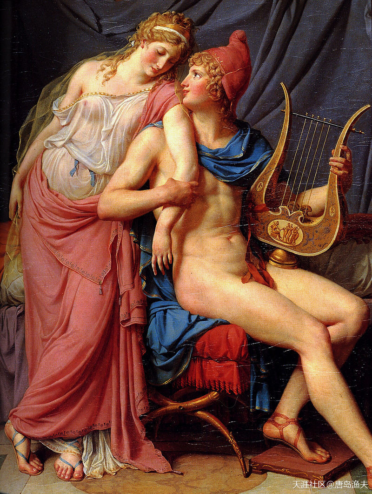

`海伦/Helen`与`帕里斯/Paris`

> The Love of Helen and Paris  
——by Jacques-Louis David (oil on canvas, 1788, Louvre, Paris)

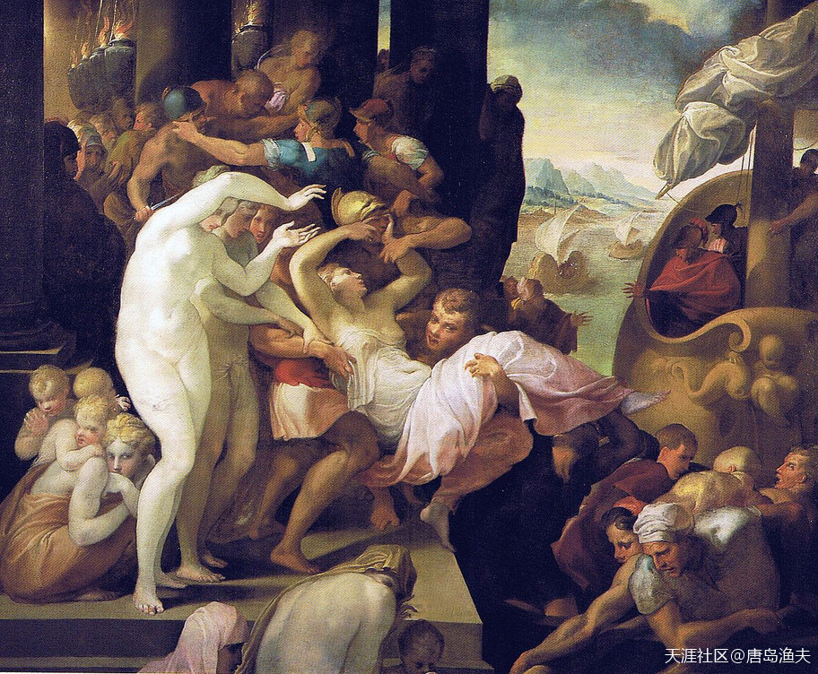

对比起海伦和帕里斯的两情相悦，西方人更愿意相信`海伦/Helen`是被抢走的

> 海洋文化天生与商业文化，海盗文化，殖民文化都连在一起。抢来的东西，比拿来的或者赚来的用着硬气  
In western painting, Helen's journey to Troy is usually depicted as a forced abduction. The Rape of Helen by Francesco Primaticcio (c. 1530–1539, Bowes Museum) is representative of this tradition.

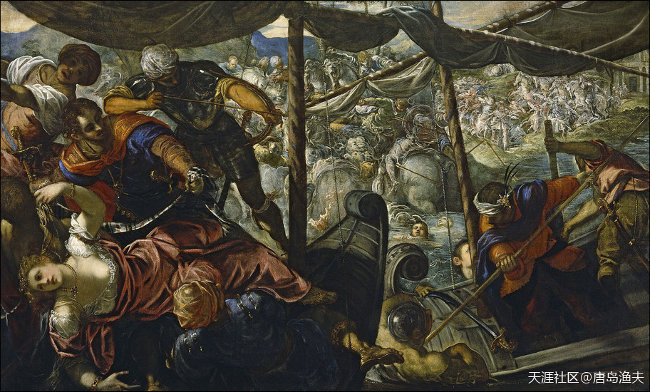

`海伦/Helen`确实是个自带被抢基因的女人，如果我们还有印象的话，前文已经提到过`庇里托俄斯/Pirithous`和`忒修斯/Theseus`的抢亲二人组

> The Rape of Helen by Tintoretto (1578–1579, Museo del Prado, Madrid); Helen languishes in the corner of a land-sea battle scene

## 阿喀琉斯（二）

`海伦/Helen`注定是一个不会接受平凡的女人。当年选婿大会，她放弃`奥德修斯/Odysseus`，选择`墨涅拉奥斯/Menelaus`是如此；而如今她早已嫁为人妇，却不甘于乏味的`斯巴达/Sparta`宫廷贵妇生活，最终和带着伊达山野性回归的王子`帕里斯/Paris`寻找新的幸福，则又是如此。

为了真爱，为了自由，`海伦/Helen`抛弃了自己的丈夫，也抛弃了自己和`墨涅拉奥斯/Menelaus`所生的独生女`赫尔弥奥涅/Hermione`。

在回特洛伊的途中，海洋老人`涅柔斯/Nereus`好心劝阻，但依然没有拦得下美女`海伦/Helen`与英俊的`帕里斯/Paris`两颗炙热的心。已经顾不上太多的这对热恋中的男女，一路扬帆远航，只用了三天时间，就赶回到了`特洛伊/Troy`。

很显然，这件事情闹大了。

`帕里斯/Paris`不仅拐走了`海伦/Helen`，还变本加厉地顺走了`斯巴达/Sparta`王宫的金银财宝。

---

- 哈利波特中的`赫敏`正是这个名字，像是Helen和墨涅拉奥斯的字头合起来造的。

---

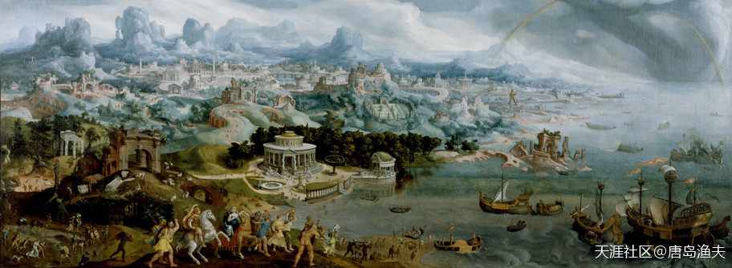

给全世界人民收看的`特洛伊/Troy`电影中的场景，应该是这样的

> In this painting by Maarten van Heemskerck Helen, queen of the Greek city-state Sparta, is abducted by Paris, a prince of Troy in Asian Minor  
——The Walters Art Museum. 
这个博物馆，在美国马里兰州

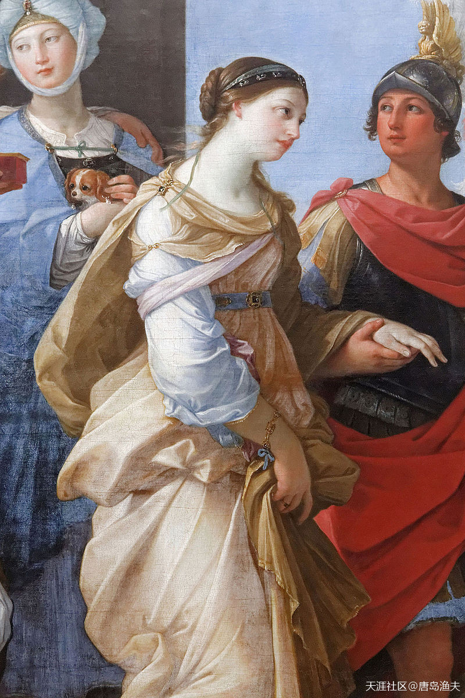

适合给全世界展示的西方人的价值观，还包括如此浪漫的含情脉脉

> In Guido Reni's painting (1631, Louvre, Paris), however, Paris holds Helen by her wrist, and leave together for Troia.

## 阿喀琉斯（三）

`帕里斯/Paris`不仅拐走了`海伦/Helen`，还变本加厉地顺走了`斯巴达/Sparta`王宫的金银财宝。

`墨涅拉奥斯/Menelaus`是真怒了。

到`克里特岛/Crete`出了一趟差，后院被漂亮老婆绿成了一片大草原。

这口气怎么咽得下去。

表面怒气冲冲的，还包括了`墨涅拉奥斯/Menelaus`的兄弟`阿伽门农/Agamemnon`。

`阿伽门农/Agamemnon`早就想找一个合适的借口，做整个古希腊世界的王中之王。这一次`海伦/Helen`的私奔，终于让这个借口从天而降。而且至少从表面上看，`阿伽门农/Agamemnon`也有足够的理由让自己冲冠一怒。`阿伽门农/Agamemnon`的儿子`俄瑞斯透斯/Orestes`，娶了`海伦/Helen`的女儿`赫尔弥奥涅/Hermione`。所以，`海伦/Helen`既是自己的弟媳妇，也是自己的儿女亲家。千载难逢的机会就此到来，`阿伽门农/Agamemnon`打心眼里感激那个喜欢惹事生非的弟媳妇`海伦/Helen`。

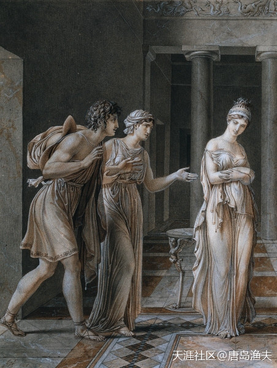

堂兄妹之间的爱情——`俄瑞斯透斯/Orestes`和`赫尔弥奥涅/Hermione`

> The Meeting of Orestes and Hermione 
——by Anne-Louis Girodet de Roucy-Trioson

---

- 等等，阿伽门农儿子和墨涅拉奥斯女儿，这是堂兄妹在一起了吗？

- 肥水不落外人田

- 绿成草原:)
---

## 阿喀琉斯（四）

`阿伽门农/Agamemnon`和`墨涅拉奥斯/Menelaus`兄弟两个，分别代表了当时古希腊世界最强大的城邦，`迈锡尼/Mycenae`和`斯巴达/Sparta`。

兄弟齐心，其利断金。

兄弟不齐心，明里暗里，也要以这个借口大动刀兵。

`阿伽门农/Agamemnon`兄弟，想起了当年在`海伦/Helen`选婿大会上，全希腊众多求婚者所立的那个誓言——所有人都要为`墨涅拉奥斯/Menelaus`所受到的屈辱而战。

希腊各个王国几乎都派人参战，其中的名门之后也不在少数，比如克里特王国`米诺斯/Minos`的孙子`伊多墨纽斯/Idomeneus`，`萨拉弥斯/Salamis`王国英雄`忒拉蒙/Telamon`之子`埃阿斯/Ajax`，此外还有`赫拉克勒斯/Hercules`的好友`菲洛克忒忒斯/Philoctetes`等等。

不过，诸位好汉虽然已经小聚，但英雄帖上，依然还有两位重量级的人物没有出现。这两个人，一个是`奥德修斯/Odysseus`，一个是`阿喀琉斯/Achilles`。

---

- 嗯嗯，看到了`阿贾克斯/Ajax`的名字。
- 尼德兰球会---`Ajax`足球俱乐部的图标在2018年，被国际足联评选为世界上最美的球会图标。

---

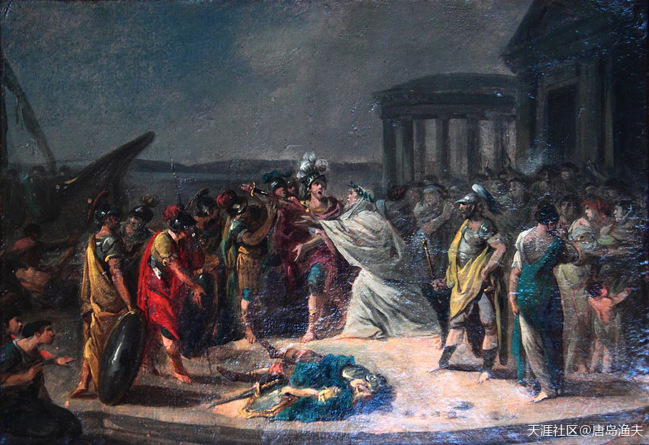

`伊多墨纽斯/Idomeneus`

> 这些在我们看起来名气不大，戏份不多的配角，各自其实都有自己的背景故事，西方人如数家珍 
Idomeneus coming back, Palais Niel, France

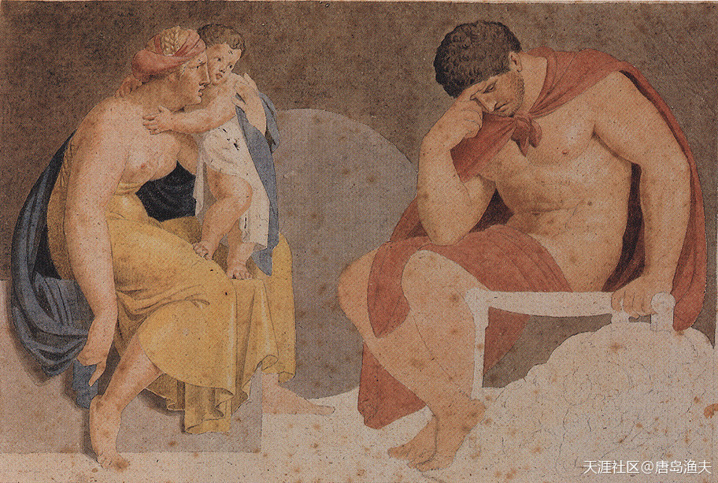

`大埃阿斯/Ajax the Great`

> Sorrowful Ajax 
—— by Asmus Jacob Carstens, ca. 1791  
`忒拉蒙/Telamon`的`埃阿斯/Ajax`，被称为`大埃阿斯/Ajax the Great`，以区别于参加特洛伊之战的另外一个`埃阿斯/Ajax`。 
`Ajax`这个名字，在西方同样如雷贯耳，荷兰著名甲级俱乐部`阿贾克斯`，就是由`大埃阿斯`而得名。

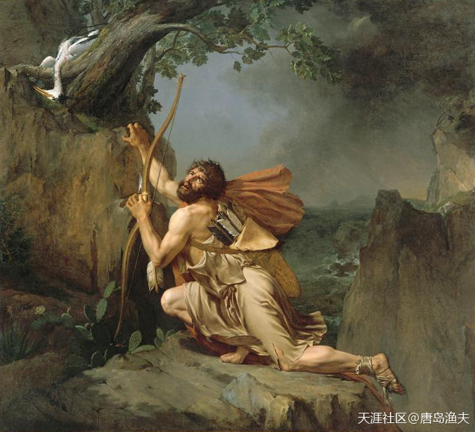

`菲洛克忒忒斯/Philoctetes`

> Philoctetes on the Island of Lemnos, by Guillaume Guillon-Lethière. 
行文情节衔接的原因，有些人物的故事就不展开了，大家可以自行查找…… 
`菲洛克忒忒斯/Philoctetes`是被落在岛上受罪十年的，图上就是拖着一条伤腿的样子。

## 阿喀琉斯（五）

`奥德修斯/Odysseus`的事迹，我们前文已经有所涉及。

`阿喀琉斯/Achilles`，则是当时整个希腊最有名的人间英雄，是半人半神之躯的传奇人物。

`阿喀琉斯/Achilles`的亲生父母，就是那场改变所有人命运的婚礼的男女主角——`珀琉斯/Peleus`和`忒提丝/Thetis`。

对于`阿喀琉斯/Achilles`来讲，海洋女神`忒提丝/Thetis`是个称职的妈妈，她本人作为奥林波斯山诸神之一，已经拥有了不死之身。然而爱娃心切的`忒提丝/Thetis`也想让`阿喀琉斯/Achilles`拥有同样的不死之身。于是，在`阿喀琉斯/Achilles`刚刚降生之后，`忒提丝/Thetis`就手握着幼小的`阿喀琉斯/Achilles`的脚踝，把他放到冥河`斯提克斯/Styx`（the River Styx）中侵泡。于是，除了没有浸泡到河水的脚踝之外，`阿喀琉斯/Achilles`生来也练就了金刚不坏之躯。然而，这个唯一的弱点，就是`脚踝/Heel`。所以，后世也就有了 `阿喀琉斯之踵/Achilles' Heel` 的说法。

一句话总结，`阿喀琉斯/Achilles`家世显赫，神功护体，是古希腊根正苗红的`神二代`。

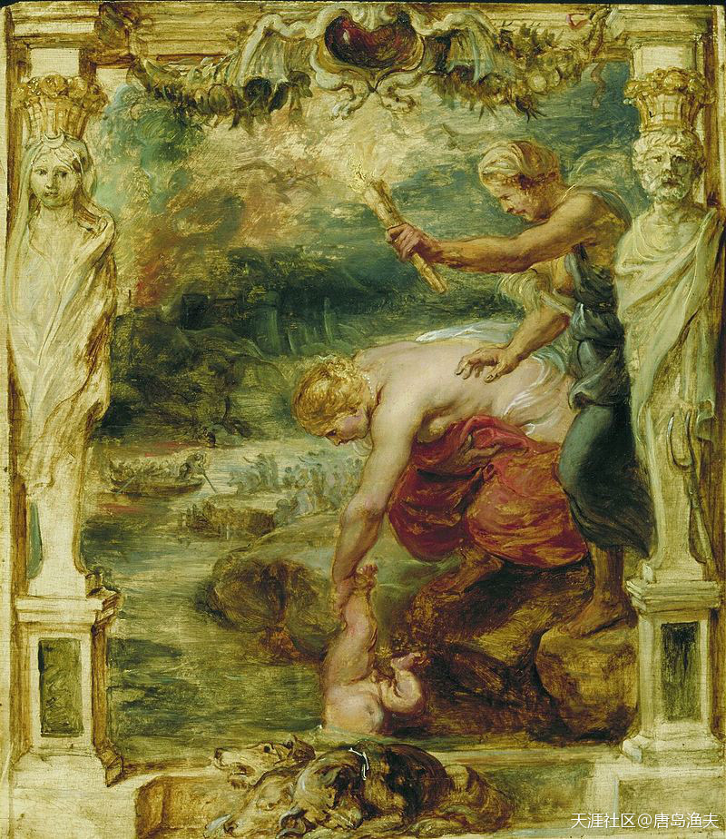

`阿喀琉斯之踵/Achilles Heel`

> Oil painting (c. 1625) by Peter Paul Rubens 
——the goddess Thetis dipping her son Achilles in the River Styx, which runs through Hades. In the background, the ferryman Charon rows the dead across the river in his boat.

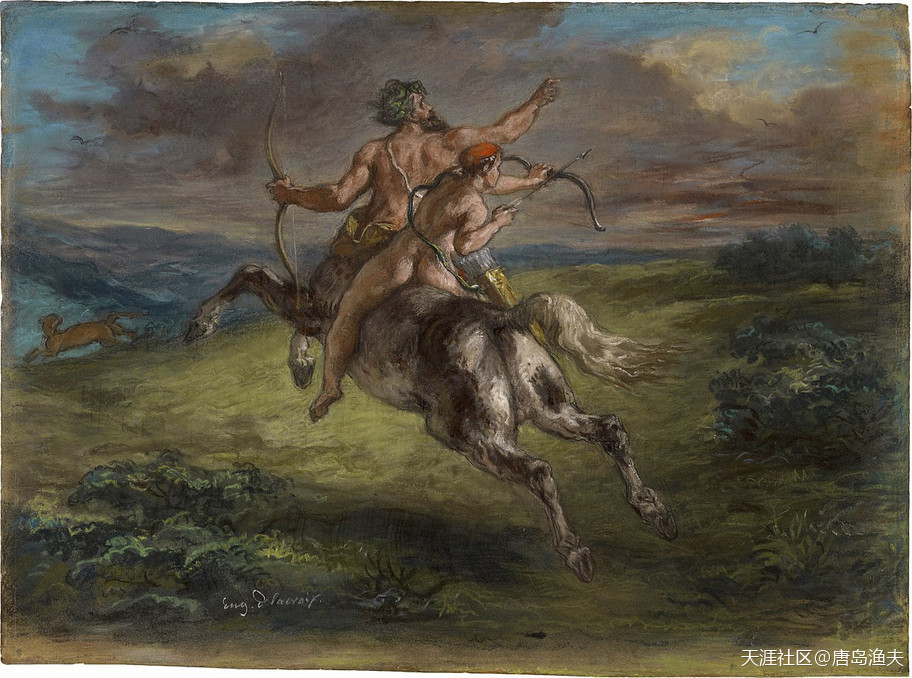

`阿喀琉斯/Achilles`——师从半人马`喀戎/Chiron`学艺

> The Education of Achilles 
——by Eugène Delacroix, pastel on paper, c. 1862 (Getty Center, Los Angeles)

## 阿喀琉斯（六）

大军远征前。`奥德修斯/Odysseus`的入列，并不十分情愿，尽管他就是当年倡议为`海伦/Helen`未来夫婿而战的主要发起者。`奥德修斯/Odysseus`这样的聪明人，知道这一去对于个人，对于家庭意味着什么。更何况，他这个时候刚刚生了个娃。然而，在`阿伽门农/Agamemnon`的强大政治压力之下，`奥德修斯/Odysseus`最终同意同行。

`奥德修斯/Odysseus`这一去，必将铸造一个不朽传奇。

`奥德修斯/Odysseus`的第一站，就是去搬请`阿喀琉斯/Achilles`。

虽然过程颇为一波三折，但`阿喀琉斯/Achilles`最终同意为希腊联军而战。大英雄的老爸`珀琉斯/Peleus`，为儿子送上了一套奥林波斯众神赠送的铠甲，一匹海神`波塞冬/Poseidon`送的战马，还有伟大的导师半人马`喀戎/Chiron`送的一柄长矛。临行前，`阿喀琉斯/Achilles`还带上了自己的好朋友——`帕特罗克洛斯/Patroclus`。

至此，希腊联军齐聚爱琴海岸的奥利斯港湾(Aulis)，百舸争流，千帆竞渡。

文有`奥德修斯/Odysseus`，武有`阿喀琉斯/Achilles`。

大军即日开拔，战争一触即发。

---

- 部落联盟......或者说城邦联盟吧......开始

---

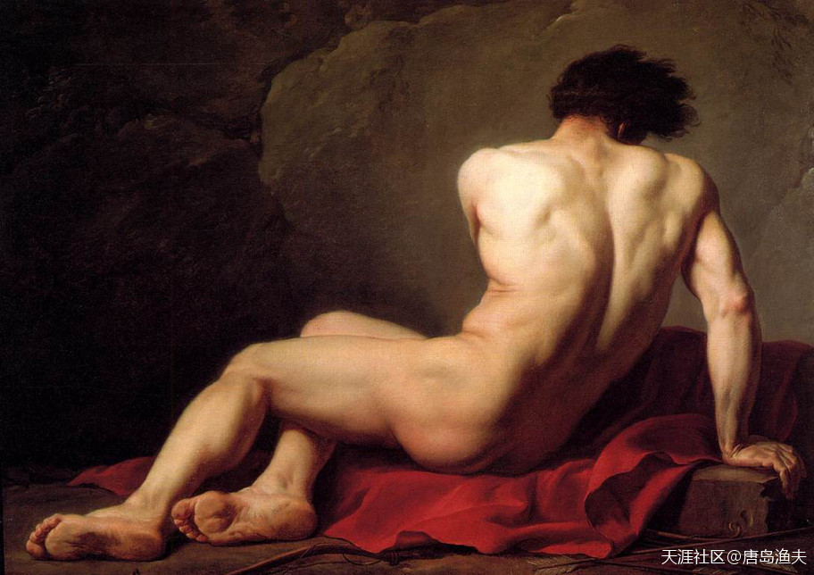

`帕特罗克洛斯/Patroclus`——古希腊真正的爱情真谛，从男人的视角看男人

> Patroclus 
——by Jacques-Louis David (1780)  
这货和`阿喀琉斯/Achilles`是虾米关系？ 
非常纯洁的男男关系。

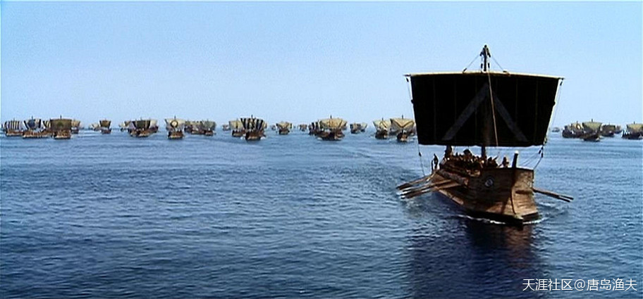

大战一触即发
