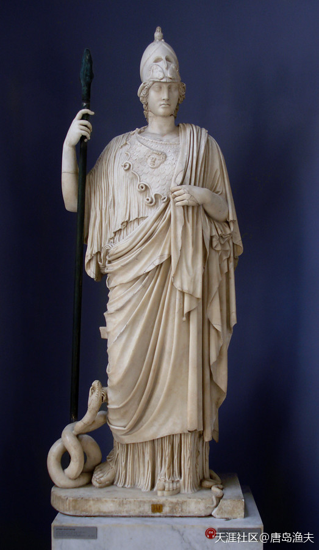

# 第四节 诸神参战

## 诸神参战（一）

战争持续了九年。

在九年之中，`特洛伊/Troy`王国被蚕食得只剩下了主城`特洛伊/Troy`。

在九年之中，`阿喀琉斯/Achilles`的奋勇作战，意外地触动了神祗们的利益。

在周边小城的一次战斗中，`阿喀琉斯/Achilles`俘虏了两个女人——`克律塞伊斯/Chryseis`及`布里塞斯/Briseis`，这两个女人不仅出身不错，而且都天生丽质，于是`阿喀琉斯/Achilles`把克律塞伊斯作为战利品送给了`阿伽门农/Agamemnon`，而自己则把`布里塞斯/Briseis`放在了自己身边。然而，`阿喀琉斯/Achilles`当时并不十分清楚，这两个女人都是`克律塞斯/Chryses`的女儿，而`克律塞斯/Chryses`则是光明之神`阿波罗/Apollo`的祭司。

这里面，牵扯了很多利益关系进来。

作战状态的`阿喀琉斯/Achilles`

> Ancient Greek polychromatic pottery painting (dating to c. 300 BC) of Achilles killing the Ethiopian king Memnon, who fought as an ally of the `Trojans` during the `Trojan War`  
看见`Trojan`这个词儿就想到木马病毒，翻译得真好。

`阿喀琉斯/Achilles`和`布里塞斯/Briseis`

> Briseis and Achilles, engraving. 
——by Wenceslaus Hollar (1607–1677)

## 诸神参战（二）

神祗们的利益被牵扯进战争本身，让`特洛伊之战/Trojan War`变得更加错综复杂。

尽管我们知道，`特洛伊之战/Trojan War`整个事件的缘起，其实就是因为`珀琉斯/Peleus`婚礼上的`金苹果`，由此带来的诸神之争。那么人间发生的战争，必然导致诸神选边站。

到`阿波罗/Apollo`祭司事件为止，神祗们已经各自选好了阵营。

那么我们按照金苹果事件这条明线的指引可知，

站在`特洛伊人/Trojan`一边的是——金苹果的拥有者，爱神`阿佛洛狄忒/Aphrodite`，这一次被卷入到战争中的光明之神`阿波罗/Apollo`；

站在希腊联军一边的是——天后`赫拉/Hera`，智慧女神`雅典娜/Athena`。

`阿佛洛狄忒/Aphrodite`

> The Birth of Venus (1863) by Alexandre Cabanel 
大家复习一下，当年镰刀夺位，老天神的丁丁飞出天外，导致了`阿佛洛狄忒/Aphrodite`诞生于爱琴海。

`雅典娜/Athena`

> The Athena Giustiniani, a Roman copy of a Greek statue of Pallas Athena. The guardian serpent of the Athenian Acropolis sits coiled at her feet. 
`雅典娜/Athena`和`阿佛洛狄忒/Aphrodite`是西方油画中的两个极端： 
前者上场，基本上一身戎装；后者出街，基本上不穿衣服。 
前者背景团结紧张，严肃活泼；后者身边灯红酒绿，莺歌燕舞。

## 诸神参战（三）

所以，`特洛伊人/Trojan`认为众神会庇护`特洛伊/Troy`，这个推理并没有错，但他们只说对了一半。诸神中有支持特洛伊的阵营，也必然有反对特洛伊的阵营。

不过这只是金苹果这条明线，私底下我们还有一条暗线。

暗线，是由风流美貌的爱神`阿佛洛狄忒/Aphrodite`所引发的。

爱神`阿佛洛狄忒/Aphrodite`的老公，就是我们在前文提到的火神`赫菲斯托斯/Hephaestus`。在奥林波斯山上的很多外人看来，`赫菲斯托斯/Hephaestus`这个天生瘸腿的男人，在外形上跟`阿佛洛狄忒/Aphrodite`的差距是明显的。但好在`赫菲斯托斯/Hephaestus`是个专注于事业的男人，他虽然木讷，但却有着与生俱来的工匠精神。凭着这股子职业精神，`赫菲斯托斯/Hephaestus`为天王宙斯三兄弟打造了令敌人闻风丧胆的兵器，也为世界创造了第一个女人——`潘多拉/Pandora`。

然而，`赫菲斯托斯/Hephaestus`这样的男人，和爱神`阿佛洛狄忒/Aphrodite`这样的女人，显然并不是一对好伴侣。火神想要的持家贤内助，爱神做不了；爱神想要的一辈子的花前月下，火神同样给不了。

更加令火神无奈的是，爱神是个敢爱敢恨，敢作敢为的女人。

?> 好像大郎配金莲啊

`赫菲斯托斯/Hephaestus`标准像

> Vulcan. Marble, reception piece for the French Royal Academy, 1742.

`阿喀琉斯/Achilles`的装备，当年就是火神`赫菲斯托斯/Hephaestus`为他专属定制的

> Thetis Receiving the Weapons of Achilles from Hephaestus 
——by Anthony van Dyck (1630-1632)

## 诸神参战（四）

既然爱神想要的浪漫，火神给不了，爱神就转而追求火神的弟弟——战神`阿瑞斯/Ares`。`阿瑞斯/Ares`和`赫菲斯托斯/Hephaestus`一母同胞所生，但龙生九子，各有不同，兄弟二人的性格迥异。`阿瑞斯/Ares`虎背熊腰，头脑简单，好战嗜杀。对于爱神`阿佛洛狄忒/Aphrodite`来讲，或许`阿瑞斯/Ares`这个正牌小叔子也并不是理想中的那个真命天子，但`阿瑞斯/Ares`这样的人，做一个完美情人则绰绰有余。

于是，`阿佛洛狄忒/Aphrodite`很快和小叔子`阿瑞斯/Ares`腻乎到了一起。

然而，这种危险的甜蜜并没有持续太久。两个人之间的那点秘密，就被`赫菲斯托斯/Hephaestus`发现了。火神不仅是发现了这点丑事，而且还利用自己的聪明才智，把爱神与战神两个人捉奸捉了双。非但是捉奸捉双，还用一张精巧的黄金网把两个人罩住，保留了两个人的作案现场，在奥林波斯众神面前公开展览了一下。

战神`阿瑞斯/Ares`标准像

> Helmeted young warrior, so-called Ares. Roman copy from a Greek original—this is a plaster replica, the original is now stored in the Museum of the Villa. Canope at the Villa Adriana

被美神勾引的`阿瑞斯/Ares`

> Mars Being Disarmed by Venus (1824) by Jacques-Louis David

火神`赫菲斯托斯/Hephaestus`捉奸在网

> Mars and Venus Surprised by Vulcan (1827) by Alexandre Charles Guillemot. 
从此之后，爱神阿芙洛蒂忒与战神阿瑞斯就成了网红。 
`维纳斯/Venus`那泛红的脸颊，以发遮面的娇羞真是我见犹怜;右上角的吃瓜众神亮了，还有就是两幅画都有一对调情的鸽子来暗示。

## 诸神参战（五）

这件丑事，也让`赫菲斯托斯/Hephaestus`与`阿瑞斯/Ares`兄弟二人反目，从此成了势不两立的对头。

于是，当`特洛伊之战/Trojan War`爆发后，兄弟二人也就各自选择了立场。

火神`赫菲斯托斯/Hephaestus`，站在天后`赫拉/Hera`，智慧女神`雅典娜/Athena`一边；

战神`阿瑞斯/Ares`，站在爱神`阿佛洛狄忒/Aphrodite`与光明之神`阿波罗/Apollo`一边。

诸神的参战，让`特洛伊之战/Trojan War`变得异常热闹。

诸神的参战，也直接让战争天平在第十个年头到来的时候，开始倾斜。

第一个不顾形象地直接介入战事的，是光明之神`阿波罗/Apollo`。

自己的祭司被欺负，让`阿波罗/Apollo`感到大受侮辱。

光明之神`阿波罗/Apollo`标准像

> Apollo of the Belvedere 
celebrated marble sculpture from Classical Antiquity. The Apollo is now thought to be a Roman copy of Hadrianic date (ca. 120–140) of a lost bronze original made between 350 and 325 BC by the Greek sculptor Leochares. 
——now in the Cortile del Belvedere of the Pio-Clementine Museum of the Vatican Museums  
真的男人，总是于细微处见真章。 
断掉的不只是手指，还有丁丁。 
丁丁没断啊，是天有点冷。

`阿波罗/Apollo`战斗图

> The gods taking sides. Apollo (naked with a bow and arrow) sides with the Trojans. 
——by John Flaxman  
这场战争最让我不可思议的就是：双方好像完全没有后勤这回事一样。 
这个确实有点恶搞。

## 诸神参战（六）

更加让神感到不可理解的是，祭司`克律塞斯/Chryses`本人亲自到希腊联军军营中去赎出女儿`克律塞伊斯/Chryseis`，`阿伽门农/Agamemnon`也没有给祭司任何谈判的余地，反而变本加厉地把祭司轰了出去。祭司没有办法，只能找自己的主神阿波罗商议对策。

`阿波罗/Apollo`感到怒不可遏。

`阿波罗/Apollo`使用了神的报复，让希腊联军患上了瘟疫。

瘟疫的第十天，大英雄`阿喀琉斯/Achilles`再也坐不住了，他怒气冲冲地来到了`阿伽门农/Agamemnon`的营帐，要求统帅交出美人`克律塞伊斯/Chryseis`，还给可怜的祭司`克律塞斯/Chryses`。

然而站在`阿伽门农/Agamemnon`的角度来讲，大英雄的这次义正词严的敢言直谏，显得颇为滑稽。`阿伽门农/Agamemnon`固然是占有了`克律塞伊斯/Chryseis`不肯放手，但`克律塞伊斯/Chryseis`的姐妹`布里塞斯/Briseis`岂不是也在`阿喀琉斯/Achilles`的手上没有交出来？那么两姐妹的老妈，虽然第一次要人的清单上没有`布里塞斯/Briseis`，也并不意味着`布里塞斯/Briseis`这个女儿就是后娘养的，要完姐姐再要妹妹，那是水到渠成的事情。这样看来，`阿伽门农/Agamemnon`不放`克律塞伊斯/Chryseis`，整个希腊联军十万兄弟中，最没有资格叫嚣的，就是`阿喀琉斯/Achilles`。

`阿喀琉斯/Achilles`上门要人

> Achilles and Agamemnon 
——by Gottlieb Schick (1801)  
：也有可能就是妹妹给大英雄吹了什么风也说不定……
：极有可能，哈哈

一言不合就要拔刀

> Achilles and Agamemnon, from a fresco of Pompeii, 1st century AD 
出自庞贝壁画（from a fresco of Pompeii）

## 诸神参战（七）

更何况，`阿伽门农/Agamemnon`和`阿喀琉斯/Achilles`分别占有了祭司家的两姐妹，不管这事干的地不地道，俩人怎么说也算是连襟了，就算不扯亲戚关系也算是一条船上的。结果人家老爸打上门来要人，你`阿喀琉斯/Achilles`第一时间就站在了道德的制高点上批判统帅，感情抢人家闺女还分个三六九等，谁还能比谁更正人君子一些？

统帅恼羞成怒，难道老夫就比你更龌龊？

你丫要放人可以，要放就大家一起放。我放姐姐，你放妹妹。

大英雄也恼羞成怒，

`阿波罗/Apollo`对联军搞`生化攻击`，是因为祭司。祭司吃闭门羹，是因为你`阿伽门农/Agamemnon`。所以姐姐必须放，而妹妹的事再说不迟。更何况妹妹辣么漂亮，我大英雄怎么可能放？历来说书唱戏都是英雄配美女，你个老朽也配？

针尖对麦芒。

希腊联军为两个女人乱成一团，谁说只有`海伦/Helen`才倾国倾城

> The Wrath of Achilles (c. 1630–1635) 
——painting by Peter Paul Rubens

## 诸神参战（八）

两个人拔剑相向，联军内讧了。

好在联军中的英雄云集，和稀泥的本领和拉架的人手也够，最终没有发生流血冲突。而一直站在云端负责给人间挑事的智慧女神`雅典娜/Athena`，也从幕后走到了台前，她也不允许希腊联军内部出现裂痕。

调停虽然奏效了，但`阿伽门农/Agamemnon`颜面扫地，`阿喀琉斯/Achilles`愤然离席。

联军中和稀泥的第一高手`奥德修斯/Odysseus`，随后抓紧将`克律塞伊斯/Chryseis`送回到了老爸身边。联军中的其他和稀泥高手，则负责为统帅`阿伽门农/Agamemnon`找回面子，一股脑儿跑去找`阿喀琉斯/Achilles`索要`布里塞斯/Briseis`。最终，`阿喀琉斯/Achilles`架不住一帮伶牙俐齿的主儿，在自己旁边微言大义，东拉西扯地叨叨，没办法只能交出了美人。

`阿喀琉斯/Achilles`无奈，只能交出小女友

> Achilles cedes Briseis to Agamemnon, from the House of the Tragic Poet in Pompeii, fresco, 1st century AD (Naples National Archaeological Museum)

找上门来要`克律塞伊斯/Chryseis`闺女的老爸`克律塞斯/Chryses`

> Chryses attempting to ransom his daughter Chryseis from Agamemnon, Apulian red-figure crater by the Athens 1714 Painter, ca. 360 BC–350 BC, Louvre.

## 诸神参战（九）

瘟疫危机解除了，放出两个美人，药到病除；

`阿喀琉斯/Achilles`的自尊，受到了一万点伤害。

这次特洛伊之战，`阿喀琉斯/Achilles`曾经设想了无数种剧情，但这一个小节的铺陈，却完全颠覆了自己受命于天的大英雄人设。偷鸡不成蚀把米，打上门去对着统帅一顿急头白脸的道德拷问，结果自己倒是赔上了自己心爱的妹子。

气恨难消的`阿喀琉斯/Achilles`，不能在一群庸人面前折了尊严，也不能让他们看到自己的软弱。大英雄思来想去，只能跑到了自己的老妈海洋女神`忒提丝/Thetis`那里，去舔舐自己的心灵创伤。

`忒提丝/Thetis`标准像

> hetis (1861), a marble sculpture by William Henry Rinehart, housed in the Walters Art Museum in Baltimore, Maryland.

`忒提丝/Thetis`与幼年`阿喀琉斯/Achilles`

> Statue of Thetis with a triton. Thasian marble, Roman copy from a Greek original of the 2nd century BC. A recent reconstruction identifies the statue as a part of the sculptural group by Skopas of Thetis giving her son Achilles new weapons described by Pliny. According to this theory, the statue known as “Ludovisi Ares” would actually represent Achilles. 
此塑像有争议，后文中会提到，后来的`罗马神话`照抄了`希腊神话`，因此在流传中不可避免地出现了讹传。 
大理石易腐蚀，生生的被水气制造了喀斯特地貌。 
按照写实风格，欧洲人鼻子大，先坏鼻子也符合逻辑。

