# 第六节 木马屠城

## 木马屠城（一）

得到消息的`阿喀琉斯/Achilles`，感到胸中流窜着一股污浊之气。

战争持续了十年，耗尽了希腊人的物力财力；

战争持续了十年，大英雄失去了自己最爱的女人，还有自己最爱的男人。

如果战争不能够尽快结束，只能让更多的人付出代价。

`阿喀琉斯/Achilles`决定，不惜一切代价，为止战而战。

逃避，显然无法解决问题，唯有用武，方能止戈。

火神`赫菲斯托斯/Hephaestus`也适时出现，他为`阿喀琉斯/Achilles`重新打造了兵器，大英雄如虎添翼。

`阿喀琉斯/Achilles`率军出现在特洛伊城下，他和仇人`赫克托尔/Hector`之间，必有一战。

`阿喀琉斯/Achilles`并不是个坚定的作战者，但这一次他被各种矛盾裹挟着来到了台前，并且也处于舆论的风口浪尖；`赫克托尔/Hector`也并不是个惹事的愣头青，只不过`帕里斯/Paris`的错误必须要有人来背，而误杀`帕特罗克洛斯/Patroclus`的那场决斗，已经无可挽回。

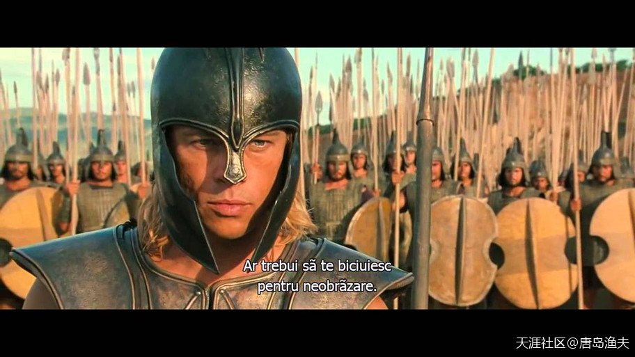

大英雄`阿喀琉斯/Achilles`准备复仇

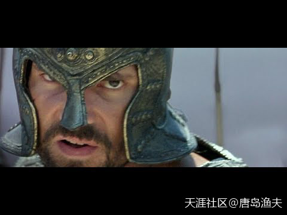
`赫克托尔/Hector`准备迎战

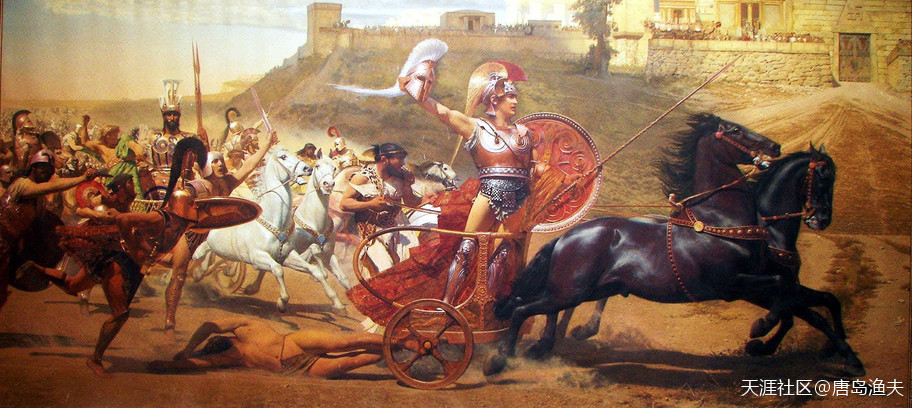

`阿喀琉斯/Achilles`拖尸回营

> Triumphant Achilles dragging Hector's lifeless body in Troy. (A fresco in the Achilleion, Corfu)

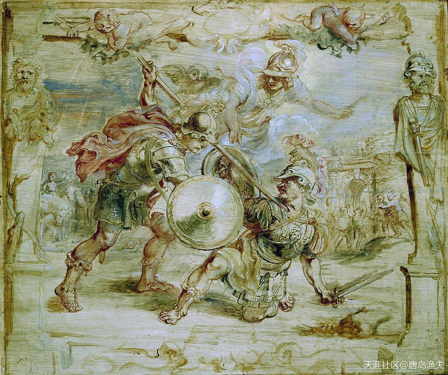

`阿喀琉斯/Achilles`手刃`赫克托尔/Hector`

> The death of Hector, unfinished oil painting. 
——by Peter Paul Rubens

## 木马屠城（二）

两个人的决斗，过程并不复杂。

`阿喀琉斯/Achilles`赢得并不轻松，`赫克托尔/Hector`则搭上了自己的身家性命。

成功复仇的`阿喀琉斯/Achilles`，冲动的魔鬼再次附体，他把`赫克托尔/Hector`的尸体拴在了马尾巴上，拖尸回到自己的军营。`赫克托尔/Hector`不仅战死，而且还受到了这样的侮辱。老王普里阿摩十分伤感，他亲自来到了联军大营，讨回了自己儿子的尸体。

`阿喀琉斯/Achilles`解气倒是解气了，但拖尸这样的庆祝方式，也败光了自己所有的人品。

他也并不知道，`帕特罗克洛斯/Patroclus`之死，`赫克托尔/Hector`之死，只是多米诺骨牌的开始。

在随后不久的一次战斗中，`帕里斯/Paris`王子张弓搭箭，对`阿喀琉斯/Achilles`痛下杀手。`帕里斯/Paris`的箭法如何我们并不知道，但这只离弦之箭，却在光明之神`阿波罗/Apollo`的引导之下，准确地命中了`阿喀琉斯/Achilles`。确切地说，是`阿喀琉斯之踵/Achilles' Heel`。

英雄应声倒下。

## 木马屠城（三）

大英雄`阿喀琉斯/Achilles`战死沙场，也算是死得其所。

联军方面的`埃阿斯/Ajax`和`奥德修斯/Odysseus`，拼死保护了`阿喀琉斯/Achilles`的尸体以及盔甲，避免了被特洛伊方面寻仇辱尸的可能性。尤其是`埃阿斯/Ajax`表现生猛，他不仅保护了表兄弟的遗体，而且还亲手抢回了遗体。按照大英雄生前的要求，`阿喀琉斯/Achilles`的盔甲将被赠与抢回尸体的那个人，主持这件事情的人，是`阿喀琉斯/Achilles`的老妈忒提丝。然而，就在这时，`奥德修斯/Odysseus`却跳出来，说服众人，让大家相信其实功劳最大的是他。

`埃阿斯/Ajax`百口莫辩，最后眼睁睁看着盔甲给了`奥德修斯/Odysseus`。

明面上，这只是一副盔甲；暗地里，这是全希腊最高的荣誉。

`埃阿斯/Ajax`爱惜自己的荣誉，就像爱惜自己的羽毛。

搞沙场斗将，`埃阿斯/Ajax`是`阿喀琉斯/Achilles`之外的`阿尔戈/Argos`英雄中第二把交椅；搞阴谋诡计，`埃阿斯/Ajax`根本不是`奥德修斯/Odysseus`的对手。更不用说，`奥德修斯/Odysseus`背后还站着一个他的保护神——`雅典娜/Athena`。

在`奥德修斯/Odysseus`和`雅典娜/Athena`的一顿背后操作之下，`埃阿斯/Ajax`最终拔剑自刎。

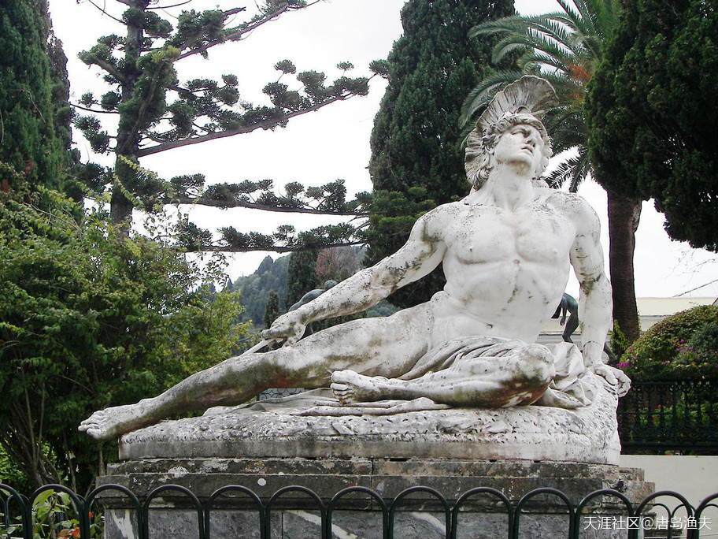

正在死去的`阿喀琉斯/Achilles`

> Dying Achilles (Achilleas thniskon) in the gardens of the Achilleion. 
在希腊CORFU岛 
无情的风雨腐蚀中的大理石雕像。

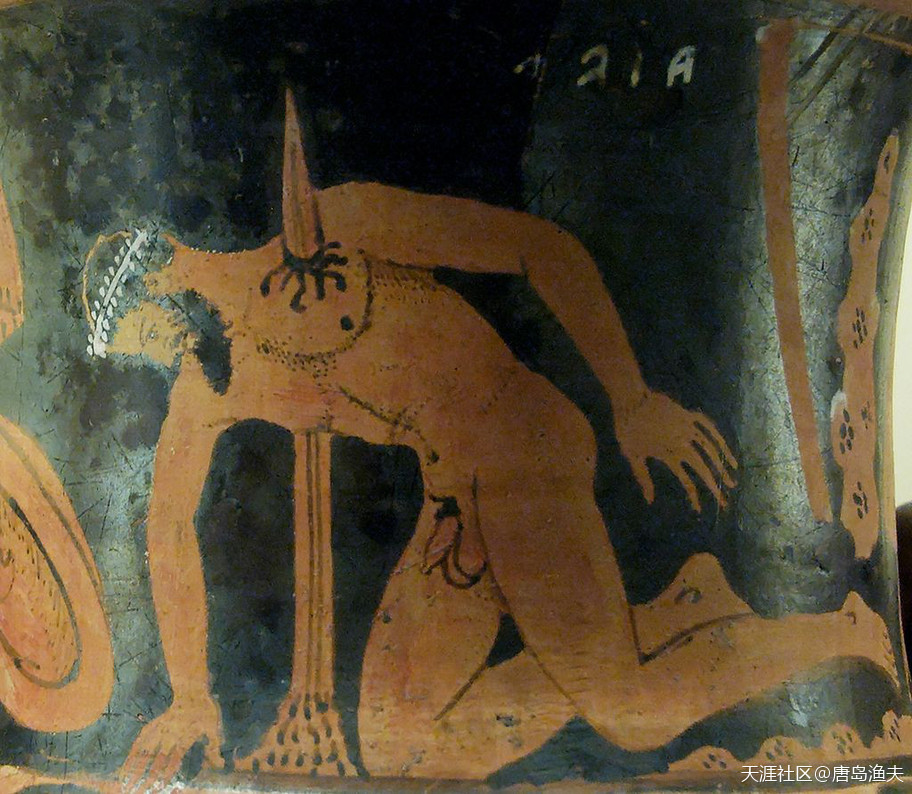

自杀的`大埃阿斯/Ajax`

> The suicide of Ajax. Etrurian red-figured calyx-krater, ca. 400–350 BC. 
如果这个所谓文物是真实情况的话，`埃阿斯/Ajax`应该是戳胸自尽

## 木马屠城（四）

短时间内，几位英雄相继离世，一系列连锁反应带着非常浓重的宿命感，那个最初的肇事者`帕里斯/Paris`也没有撑过战争的第九年。

联军失去了`阿喀琉斯/Achilles`与`埃阿斯/Ajax`，于是赫拉克勒斯/Hercules的好友`菲洛克忒忒斯/Philoctetes`出山。

`菲洛克忒忒斯/Philoctetes`不仅是赫拉克勒斯/Hercules的好友，而且还在当年大英雄死后，继承了大英雄弓箭。依靠这副弓箭，`菲洛克忒忒斯/Philoctetes`终于成为`阿尔戈人/Argiver`中的第一神箭手。

`菲洛克忒忒斯/Philoctetes`出山，战场之上，射杀了`帕里斯/Paris`。

以箭对箭。

以彼之道，还施彼身。

由`阿喀琉斯/Achilles`的好基友`帕特罗克洛斯/Patroclus`引发的连锁反应，终于告一段落。

特洛伊方面，失去了`赫克托尔/Hector`，`帕里斯/Paris`两位王子；

联军方面，失去了`阿尔戈/Argo`英雄榜排名第一的`阿喀琉斯/Achilles`和排名第二的`埃阿斯/Ajax`。

战况两败俱伤。

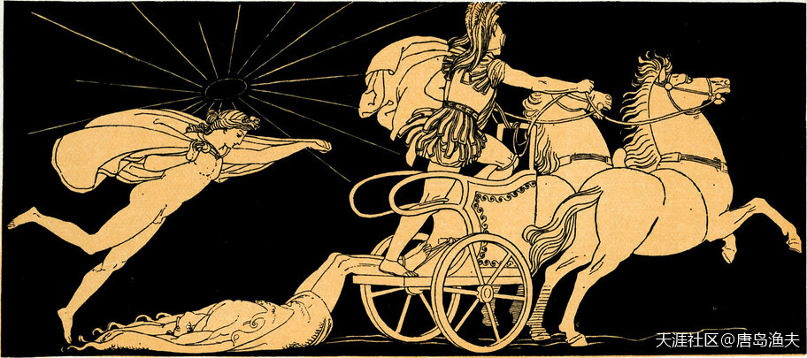

战争的很多细节之一：阿波罗保护赫克托尔的尸身完整

> Apollo protecting Hector's body. 
——by John Flaxman

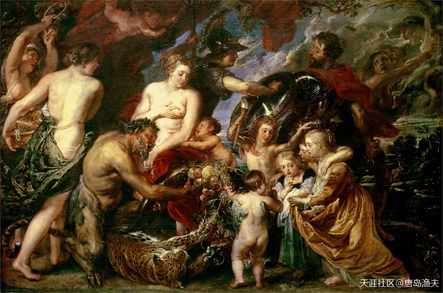

守护和平的`雅典娜/Athena`

> Minerva Protecting Peace from Mars (1629). 
——by Peter Paul Rubens

## 木马屠城（五）

战争已经来到了第十年，然而僵持却仍在继续。

站出来解决问题的人，还是`奥德修斯/Odysseus`。

`奥德修斯/Odysseus`，为联军献上了木马屠城之计。

为后人所熟知的，是后来的剧情。联军假装溃退，扔下了一个巨大的木马留在海滩。`特洛伊人/Trojan`把木马作为战利品运回到城内，甚至为了成功运进城内，`特洛伊人/Trojan`还不惜拆掉了一部分城墙。围着这个巨大的木马，特洛伊举行了盛大的欢庆仪式。很显然，在`特洛伊人/Trojan`看来，战争已经基本结束了。

入夜之后，藏在木马内部的全副武装的希腊战士倾巢而出。

特洛伊城被里应外合，最终攻破。

在一片熊熊大火之中，特洛伊城化为灰烬。

城破之后，老王`普里阿摩/Priam`被`阿喀琉斯/Achilles`的儿子`涅俄普托勒摩斯/Neoptolemus`手刃。

长达十年的`特洛伊之战/Trojan War`，以这样的方式落下帷幕。

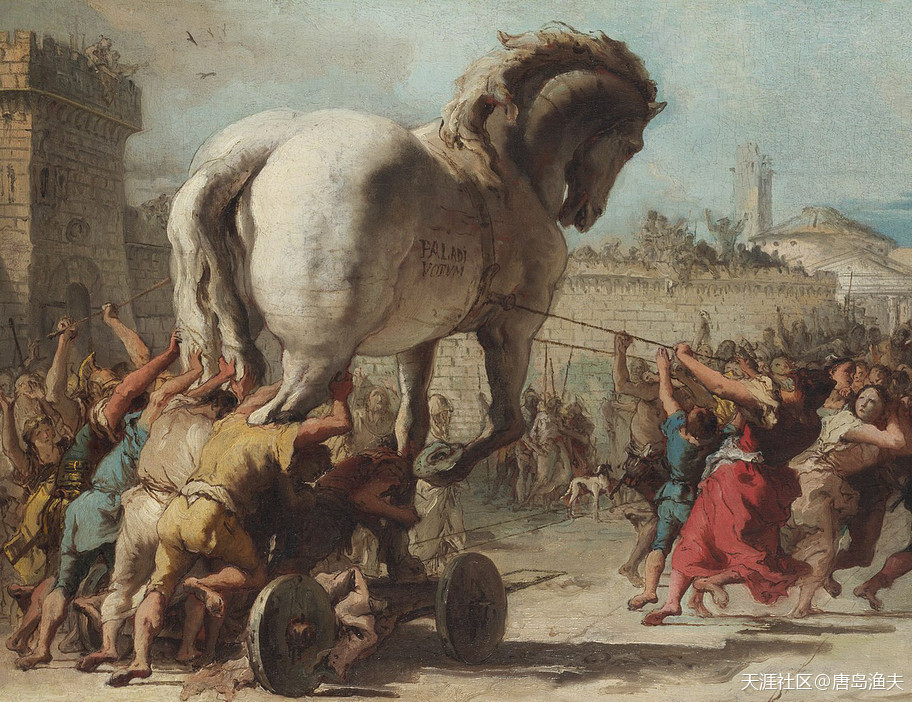

`木马/Trojan Horse`进城

> Detail from The Procession of the Trojan Horse in Troy by Domenico Tiepolo (1773), inspired by Virgil's Aeneid

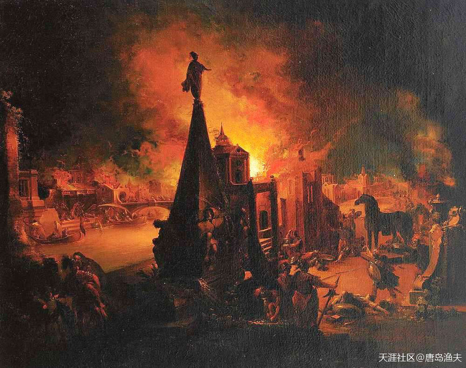

木马屠城

> The Burning of Troy (1759/62), oil painting by Johann Georg Trautmann.

## 木马屠城（六）

长达十年的`特洛伊之战/Trojan War`，以这样的方式落下帷幕。

战争中，无论人神，纷纷选边站；

战争中，很多人的命运被改变。

比如我们前文提到的，克里特岛那个出逃的王子`萨尔佩东/Sarpedon`，还有来自于亚马逊的女战士首领`彭特西勒亚/Penthesilea`，都作为特洛伊人的支持方，死于`特洛伊之战/Trojan War`的乱军之中。

胜利一方，也不是全部得以善终。

十年征战，后院起火的也不在少数。

比如联军的统帅`阿伽门农/Agamemnon`，得胜回国之后，他的妻子`克吕滕涅斯特拉/Clytemnestra`（前文讲过的`海伦/Helen`亲姐妹）就没有给过他一个好脸。因为`克吕滕涅斯特拉/Clytemnestra`忘不了，当年`阿伽门农/Agamemnon`为了扬帆远征，拿她的亲生女儿`伊菲格涅娅/Iphigenia`献祭的历历往事。更何况，十年战争期间，`克吕滕涅斯特拉/Clytemnestra`还搭上了一个小情人——`埃癸斯托斯/Aegisthus`。后来二人合谋，杀掉了`阿伽门农/Agamemnon`。

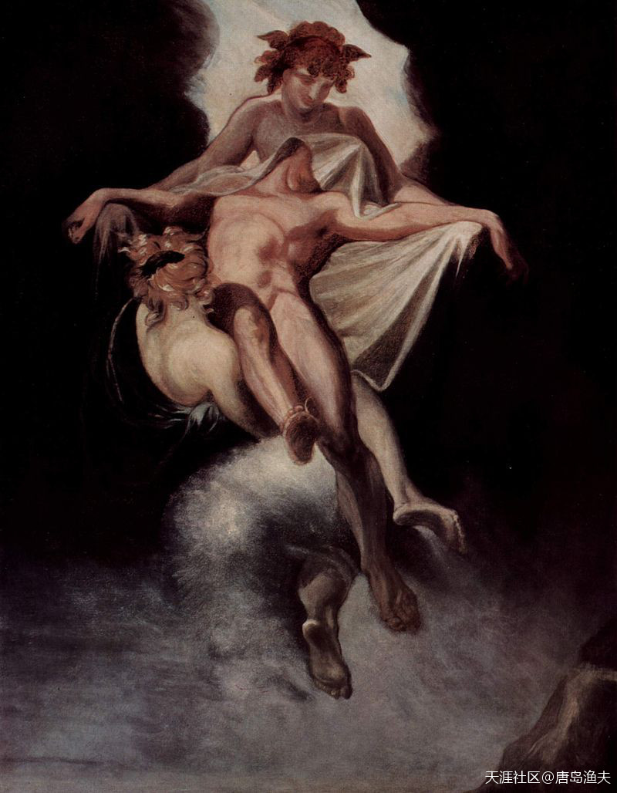

`萨尔佩东/Sarpedon`之死

> Sarpedon carried away by Sleep and Death, 
——by Henry Fuseli, 1803.  
还记不记得萨尔佩东？复习一下 
`萨尔佩东/Sarpedon`是天王`宙斯/Zeus`与`欧罗巴/Europa`公主的三个儿子之一，克里特王`米诺斯/Minos`的亲兄弟，同克里特外孙`米利都斯/Miletus`勤奋搞基的`忠厚长者` 
表侮辱忠厚长者这个词。。。

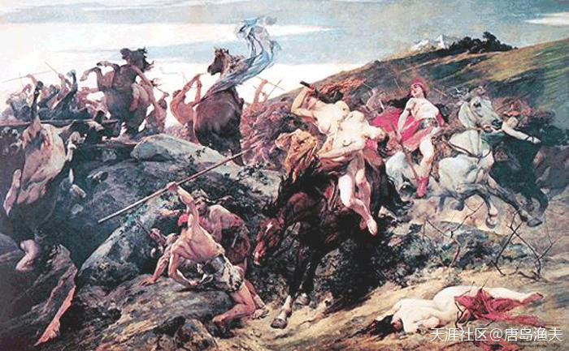

作战中的`亚马逊女战士//Amazons`之王——`彭特西勒亚/Penthesilea`

> A 19th century interpretation of Penthesilea fighting, 
——by Arturo Michelena  
还记不记得`彭特西勒亚/Penthesilea`？复习一下 
`彭特西勒亚/Penthesilea`是亚马逊女战士`希波吕特/Hippolyta`的亲姐妹，是希腊英雄传说第二网红`忒修斯/Theseus`的小姨子 
`希波吕特/Hippolyta`之死，就是拜`彭特西勒亚/Penthesilea`所赐

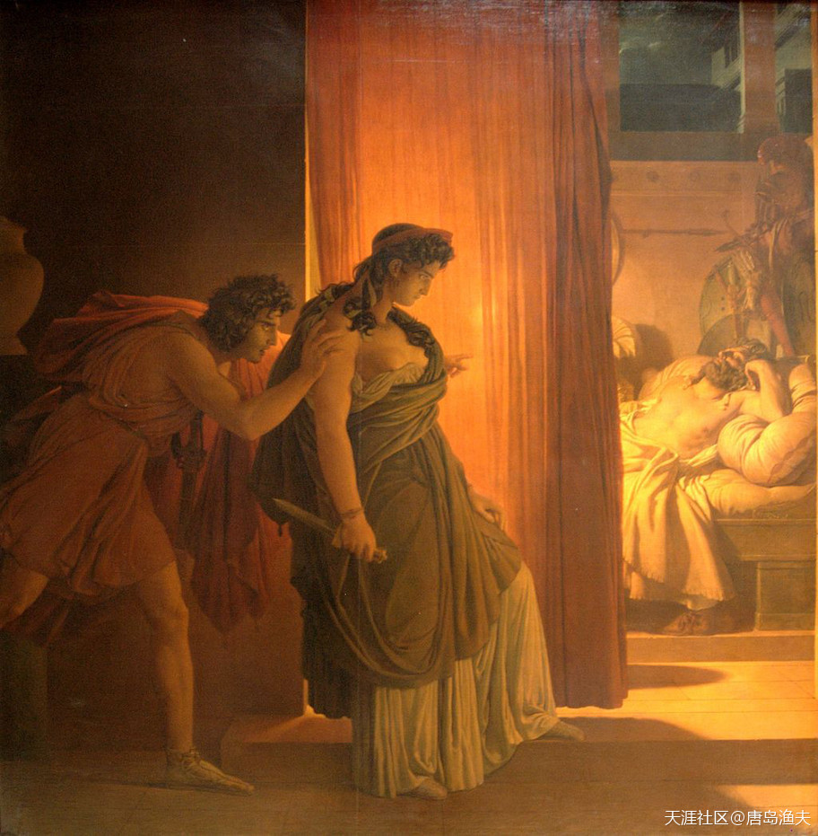

谋杀亲夫的`克吕滕涅斯特拉/Clytemnestra`

> Murder of Agamemnon, painting by Pierre-Narcisse Guérin (1817) 
[第二章 第三节 迈锡尼王国（四）](/part0/chapter2/section3/#迈锡尼王国（四）)中的这幅图的背景，正是`克吕滕涅斯特拉/Clytemnestra`的杀人第一现场 
oceanary3：动不动就匕首大斧的，同是谋杀亲夫，思路也如此不同 
评论 oceanary3：居然还有思路...... 

## 木马屠城（七）

`特洛伊之战/Trojan War`，联军中的另外一个重要角色，`奥德修斯/Odysseus`的命运也没有好到哪里去。城破之后，`奥德修斯/Odysseus`又在海上整整漂流了十年。战胜了无数的艰难险阻，暗礁浅滩，妖魔鬼怪，最后终于回到了希腊。据说他的妻子`佩内洛普/Penelope`，期间一直为他坚守贞节。但也就意味着，她一直等了二十年，才等到了自己丈夫`奥德修斯/Odysseus`的重归故里。

`奥德修斯/Odysseus`的奇遇，后来被编纂成了一个史诗，史诗名字叫做`《奥德赛》/Odyssey`。

而`《奥德赛》`发生之前的`特洛伊之战/Trojan War`，则被编纂成了另外一部史诗`《伊利亚特》/Iliad`（`特洛伊城`的名字，也叫`伊利昂/Ilion`）。

`特洛伊之战/Trojan War`中的其他主要人物，被`帕里斯/Paris`戴绿帽子的国王，英俊的`墨涅拉奥斯/Menelaus`，带着美女`海伦/Helen`重新回到希腊半岛，开始了幸福新生活。然而，在`墨涅拉奥斯/Menelaus`去世之后，`海伦/Helen`被希腊人民所唾弃，最终被愤怒的人民流放。

一代传奇女人`海伦/Helen`，终于消失在希腊神话的长河中

奥德赛斯是海上三藏，奥德赛是西方的西游记。西游记是取这个经。奥德赛斯在海上历多少劫难，那些劫和西游记差不多，风神，女儿国，独眼怪等等。奥的赛斯是雅典娜保护，唐三藏是孙悟空保护，所以雅典娜=孙悟空，吻合啊，雅典娜之灵=孙悟空。这些都不是天上掉馅饼乱编的。都是环环相扣，真刀真枪得回来的

`奥德修斯/Odysseus`的奇幻漂流

> Odysseus and Polyphemus (1896) by Arnold Böcklin: Odysseus and his crew escape the cyclops Polyphemus.  
`奥德修斯/Odysseus`是海上`唐三藏`，`《奥德赛》/Odyssey`是西方的《西游记》。西游记是取这个经。`奥德修斯/Odysseus`在海上历多少劫难，那些劫和西游记差不多，风神，女儿国，独眼怪等等。`奥德修斯/Odysseus`是`雅典娜/Athena`保护，`唐三藏`是`孙悟空`保护，所以`雅典娜=孙悟空`，吻合啊，`雅典娜之灵=孙悟空`。这些都不是天上掉馅饼乱编的。都是环环相扣，真刀真枪得回来的。

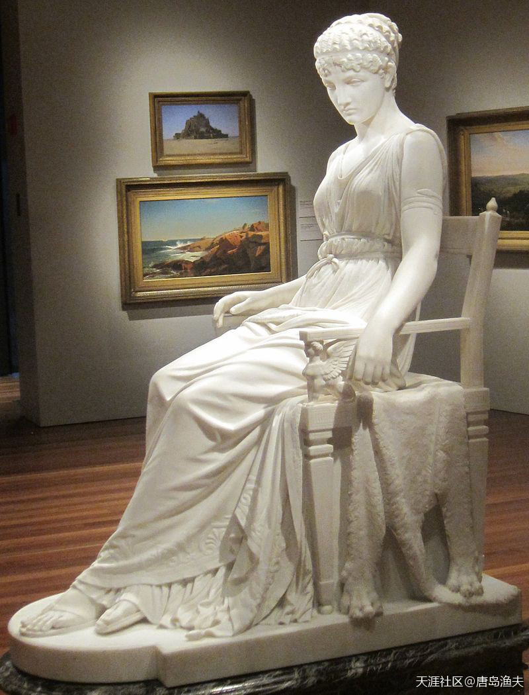

破屋寒窑，守节一场的`佩内洛普/Penelope`

> Penelope by Franklin Simmons, marble, 1896. On display at the De Young Museum in San Francisco.

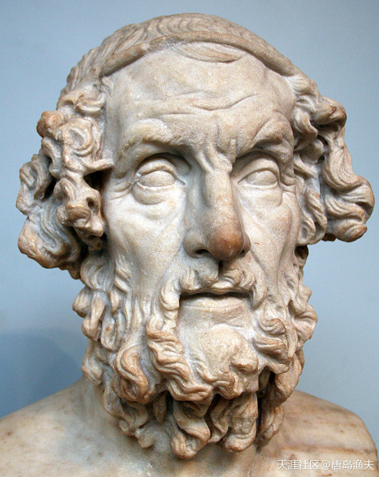

`荷马/Homer`本荷

> Roman bust of Homer from the second century AD, portrayed with traditional iconography, based on a Greek original dating to the Hellenistic Period

## 尾声

`特洛伊之战/Trojan War`，历经十年，尘埃落定。

不过，`特洛伊之战/Trojan War`的巨大影响力却远未结束。

`特洛伊城/Troy`破的同时，`特洛伊人/Trojan`中有一个王室贵族趁乱出逃，这个人的名字叫做`埃涅阿斯/Aeneas`。

------

看这些图画上的男性都挺men的，但时下我们很多媒体炒作出来的流量之星，虽有两种性别，但却捧成了一种美，感觉很可悲！！！不知西方当下的媒体对审美的引导是否也如此？还请楼主得空时，分享一下，不胜感谢！！！

?> `唐岛渔夫`：中国人的审美跟当前的价值观一样，暂时都无法影响世界，甚至反过头来被欧美和日韩影响。日韩这种从属于欧美文化之下的亚文化，花美男和娘炮，伪娘，颓废动漫风，都是典型的欧美非主流人群的最爱。

