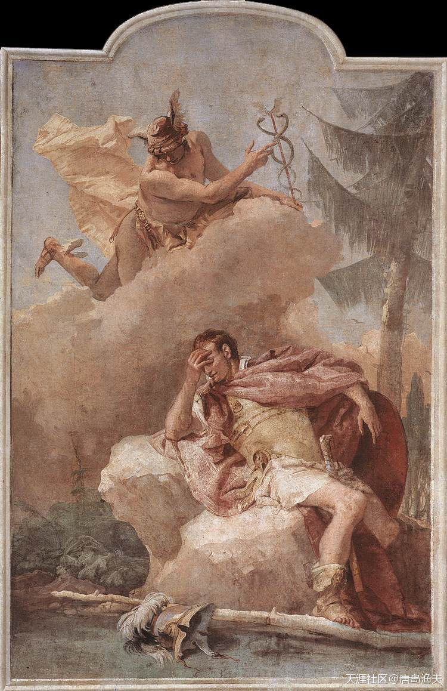
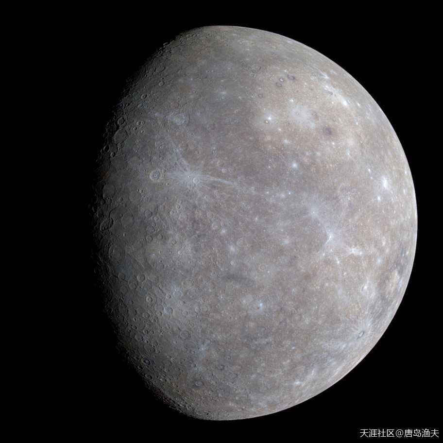
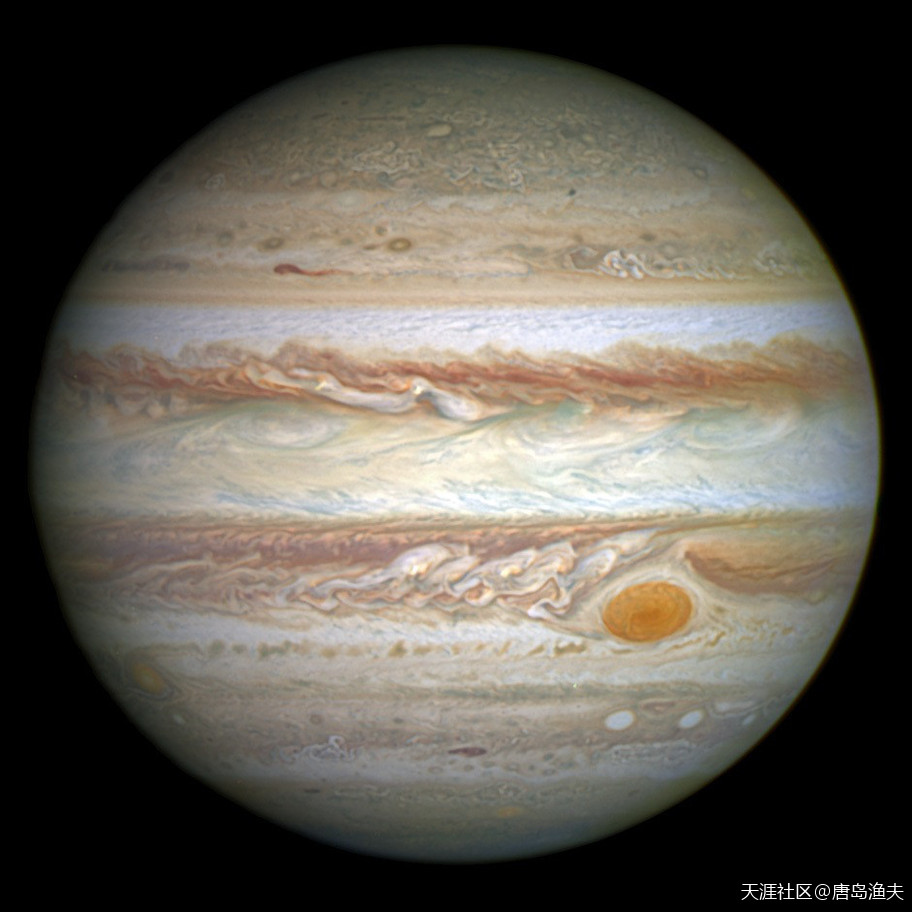
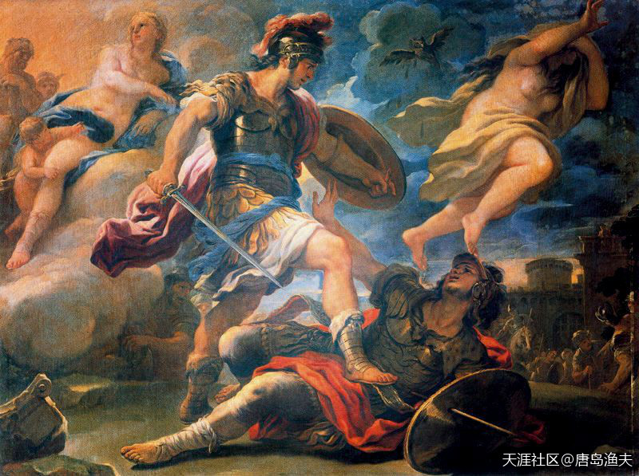

# 第一节 埃涅阿斯

## 埃涅阿斯（一）

`埃涅阿斯/Aeneas`并不是普通贵族，他有着显赫的家世。

`埃涅阿斯/Aeneas`的老爸，叫做`安喀塞斯/Anchises`，而`安喀塞斯/Anchises`的嫡亲外祖父，就是前文说的创建特洛伊城的国王`伊洛斯/Ilus`。我们前面已经交代过，`伊洛斯/Ilus`这个名字，同时也是`伊利昂城/Ilium city`和`《伊利亚特》/Iliad`这部史诗的词源。在`伊洛斯/Ilus`的众多孙子中间，前文提到的`普里阿摩/Priam`后来继承王位，成为特洛伊国王。但如果说算上外孙，那么所有孙辈中最年长的就是`安喀塞斯/Anchises`。

换个角度讲，`安喀塞斯/Anchises`和`普里阿摩/Priam`是姑舅兄弟关系，`安喀塞斯/Anchises`也就是`普里阿摩/Priam`的大表哥。

在特洛伊的所有贵族中间，`安喀塞斯/Anchises`是最帅的一个。依靠着一副好皮囊以及好身板，`安喀塞斯/Anchises`赢得了奥林波斯众女神中最风情万种的爱神`阿佛洛狄忒/Aphrodite`的芳心。后来`安喀塞斯/Anchises`与`阿佛洛狄忒/Aphrodite`生下了一个半人半神的娃，这个娃就是`埃涅阿斯/Aeneas`。

---

- 流窜亚平宁。七丘山寨。 抢女人之战。一百零五男人团。李逵两把开山斧。

---

爱神`阿佛洛狄忒/Aphrodite`与`安喀塞斯/Anchises`的野合

> William Blake Richmond's Venus and Anchises (1889 or 1890)  
人家用一对雌雄狮子代替鹊桥 
绿帽子火神在偷看。黄金网呢？

爱神`阿佛洛狄忒/Aphrodite`与自己的儿子`埃涅阿斯/Aeneas`

> Venus as Huntress Appears to Aeneas, by Pietro da Cortona

## 埃涅阿斯（二）

我们再从头捋一捋，`安喀塞斯/Anchises`是特洛伊老王`普里阿摩/Priam`姑妈家的大表哥。那么`埃涅阿斯/Aeneas`同`赫克托尔/Hector`，`帕里斯/Paris`之间，就是再远一辈的表兄弟关系。但俗话说的好，姑舅亲，辈辈亲。在特洛伊之战中，`埃涅阿斯/Aeneas`又自然而然地成了`赫克托尔/Hector`手下的主将之一。况且`埃涅阿斯/Aeneas`的老妈`阿佛洛狄忒/Aphrodite`，因为一个金苹果之争，就在神界和人间掀起了惊涛骇浪，她本人就是特洛伊这场大战的直接发起者和参与者。那么老妈亲自上阵，儿子`埃涅阿斯/Aeneas`也就必须是身先士卒了。

不仅如此，在特洛伊的所有新生代王子中间，`埃涅阿斯/Aeneas`拥有半人半神属性。那么这个半神属性，天然就高于人间出身的贵族属性，于是在新生代王子中间，`埃涅阿斯/Aeneas`早早就被指定为特洛伊王储。换句话说，特洛伊老王`普里阿摩/Priam`虽然子女众多，其中也不乏`赫克托尔/Hector`这样的佼佼者。但如果后来没有发生特洛伊木马屠城这一幕，在`普里阿摩/Priam`百年之后，继承特洛伊王位的就是`埃涅阿斯/Aeneas`。

不过人算不如天算，特洛伊城破，所有的人世繁华终成南柯一梦。

在冲天的大火与遍地的鲜血之中，`埃涅阿斯/Aeneas`背着自己的老爹`安喀塞斯/Anchises`，带着自己的众多家臣，杀出一条血路，冲出了特洛伊。那么`埃涅阿斯/Aeneas`的这个事迹，后来就被称为“背父出逃”。

`埃涅阿斯/Aeneas`背父出逃

> Aeneas flees burning Troy, Federico Barocci, 1598 (Galleria Borghese, Rome, Italy)

还是背父出逃的主题

> Flight of Aeneas from Troy, 
——by Girolamo Genga (between 1507 and 1510).

仍然是背父出逃主题

> Aeneas and his Father Fleeing Troy, by Simon Vouet (c. 1635).

背父出逃雕塑，也是这个主题

> Aeneas & Anchises, by Pierre Lepautre (c. 1697).

一次又一次地触动欧洲艺术家的灵感——依然是背父出逃

> Aeneas fleeing from Troy, by Pompeo Batoni (c. 1750). 
到底是什么动力，让艺术家们如此前赴后继呢？ 
渔夫先不剧透，只是稍微启发一下...... 
大家还记不记得渔夫在《打乱顺序重读中国历史》帖子中说过的——我大汉以孝治天下？ 
国灭贵族血统未灭，后人可以自豪。 
而且配角是清一色的妇孺，高大形象跃然纸上

## 埃涅阿斯（三）

`埃涅阿斯/Aeneas`一行人，虽然逃出了`特洛伊/Troy`，但家是回不去了，特洛伊一战，胜者为王，败者为奴，现实就是这么残酷。地中海茫茫无际，`埃涅阿斯/Aeneas`他们举目无亲，只能苦苦寻觅自己新的栖身之处。

在漫无目的的海上漂泊之中，`埃涅阿斯/Aeneas`一行人经历了无数的艰难困苦。其中在经过`西西里岛/Sicily`这个地方的时候，`埃涅阿斯/Aeneas`的老爸`安喀塞斯/Anchises`长眠于此，客死他乡。

自离开特洛伊以来，海上的流浪生活持续了整整六年。

第一次让`埃涅阿斯/Aeneas`有了家的感觉的地方，叫做`迦太基/Carthage`。

`迦太基/Carthage`是北部非洲地中海岸边的一个古王国，关于`迦太基/Carthage`的那点事，我们后边还会专门来详细讲，这里暂时不展开说。

此时的`迦太基/Carthage`，掌权的是一个女王，女王的名字叫做`蒂朵/Dido`（又称`爱莉莎/Elissa`）。`埃涅阿斯/Aeneas`的船队到达`迦太基/Carthage`之后，女王`蒂朵/Dido`爱上了身心俱疲的特洛伊王子`埃涅阿斯/Aeneas`。王子与女王两个人，从此开始了幸福新生活。一切都看上去太过顺理成章，太过小说家言。

这桩美事，最终遭到了奥林波斯众神的干预。

`埃涅阿斯/Aeneas`与`蒂朵/Dido`的幸福生活

> Dido and Aeneas, from a Roman fresco, Pompeian Third Style (10 BC - 45 AD), Pompeii, Italy

`埃涅阿斯/Aeneas`与`蒂朵/Dido`——痛说特洛伊革命家史

> Aeneas tells Dido about the fall of Troy, by Pierre-Narcisse Guérin  
故事里的事，说是就是不是也是 
袖珍小美女，人体比例不对啊

## 埃涅阿斯（四）

这桩美事，最终遭到了奥林波斯众神的干预。

老妈`阿佛洛狄忒/Aphrodite`（对应`罗马神话`中的`维纳斯/Venus`）首先就不同意。出于同为女人的敏感，老妈对这个主动投怀送抱的儿媳妇感到莫名其妙。老妈觉得一切得来太过容易的爱情，都充满虚幻或者阴谋，况且儿子`埃涅阿斯/Aeneas`一定不是久居池中之物，离开眼前这个女人才是人间正道。而不仅是爱神本人反对这门亲事，天王`宙斯/Zeus`（对应`罗马神话`中的`朱庇特/Jupiter`）也是穷极无聊，一定要拆散这对苦命鸳鸯。

`朱庇特/Jupiter`和`维纳斯/Venus`最终派了神界使者`墨丘利/Mercury`下界，教唆`埃涅阿斯/Aeneas`离开`蒂朵/Dido`的温柔乡，去奔自己的远大前程。`墨丘利/Mercury`对应`希腊神话`中的神使`赫尔墨斯/Hermes`，由`古希腊`而`古罗马`，这个`神使拉皮条`搅混水和稀泥的本事倒是一脉相承的。

`埃涅阿斯/Aeneas`毕竟还是个吃五谷杂粮的普通人，他不敢违抗老妈的意志，更不敢挑战神界的指引。再高的革命觉悟，再决绝的山盟海誓，都敌不过一句好汉不吃眼前亏的直白与接地气。

同女王`蒂朵/Dido`厮守了一年之久，`埃涅阿斯/Aeneas`带着自己的船队秘密逃出`迦太基/Carthage`。

爱神`维纳斯/Venus`现身说法

> Venus Appearing to Aeneas on the Shores of Carthage, by Tiepolo (1757)

擅长挑拨离间的`墨丘利/Mercury`也现身说法

> Mercury Appearing to Aeneas, by Tiepolo (1757)  
`Mercury`这个词汇，有没有感觉似曾相识？它是今天很多中外品牌的LOGO

`Mercury`还是什么？没错，英文中的`水星`

`Mercury`是水星，那么`Venus`呢？没错，`Venus`就是`金星`

`Mercury`是`水星`，`Venus`是`金星`，那么`Jupiter`呢？没错，`Jupiter`就是`木星`

至于其他行星，以后再说。

## 埃涅阿斯（五）

失去老公的女王`蒂朵/Dido`感到生无可恋，最终用一把剑结束了自己的生命。

这把剑曾是`蒂朵/Dido`与`埃涅阿斯/Aeneas`的定情之物，而如今就在同样是这把宝剑的见证之下，`蒂朵/Dido`死前发下毒誓——`迦太基人/Carthagians`与`埃涅阿斯/Aeneas`永世为仇。

更加令人伤心的是，`埃涅阿斯/Aeneas`在`迦太基/Carthage`逗留一年时间，`蒂朵/Dido`的妹妹`安娜/Anna`也曾经仰慕姐夫的风流倜傥。多年以后，妹妹`安娜/Anna`也追随姐姐的脚步，找到了已经重新娶妻生子的`埃涅阿斯/Aeneas`。并且小姨子`安娜/Anna`相信爱情，不要名分，也奋不顾身地嫁给`埃涅阿斯/Aeneas`，让`埃涅阿斯/Aeneas`享尽齐人之福。当此后`安娜/Anna`被`埃涅阿斯/Aeneas`的正妻所憎恶的时候，`安娜/Anna`也跟姐姐一样，选择了自杀这条路。

一场风花雪月的浪漫，最终以巨大的悲剧告终。

而姐妹相继殉情，更是加深了这场悲剧的宿命感。

重整旗鼓，踏上征途的`埃涅阿斯/Aeneas`，则继续着自己靠女人吃饭的故事。

这项天赋在外形条件出众的`特洛伊家族/Trojan Family`，从`帕里斯/Paris`到`安喀塞斯/Anchises`，从`安喀塞斯/Anchises`又到`埃涅阿斯/Aeneas`，一脉相承。

---

- 这不是悲剧，这就是贱！
- 这是傻吧，象`伊娥卡斯特`那样，国王死了再招个老公才是最好的

- 三观尽毁，怎一样乱字了得

- 神话时代确实乱的可以，不过后边到了信史时代，依然如此。

- 埃涅阿斯这段，杜撰的可能性要远高于特洛伊，蒂朵这段更是为政治目的所埋的伏笔。他们欧洲人说说，我们听听就好。

---

当初来到`迦太基/Carthage`，卑躬屈膝的`埃涅阿斯/Aeneas`一行人

> The Meeting of Dido and Aeneas, by Nathaniel Dance-Holland

情到浓时的`埃涅阿斯/Aeneas`与`蒂朵/Dido`

> Landscape with Dido and Aeneas, by Thomas Jones (1769) 
像舞台布景一样美

悲痛欲绝的`蒂朵/Dido`

> Dido, a painting by Dosso Dossi  
 死个老公就自杀了？要知道自杀是进不了天堂的 
那会儿没基督教......

`蒂朵/Dido`之死

> Death of Dido, by Guercino, AD 1631  
阿佛洛狄忒，`维纳斯/Venus`的老公是谁？ 
火神同志

## 埃涅阿斯（六）

`埃涅阿斯/Aeneas`和他的船队，最终来到了今天亚平宁半岛的西海岸。

西海岸有一块叫做`拉丁姆/Latium`的地方，`拉丁姆/Latium`翻译成今天的意大利语，就是`拉齐奥/Lazio`，两者词源和意思都相同。所以`拉丁姆/Latium`的大致范围，跟今天的`拉齐奥/Lazio`大区也基本相同。当时`拉丁姆/Latium`的土著，叫做`拉丁人/Latins`，拉丁人的王，叫做`拉丁努斯/Latinus`。

话说`拉丁努斯/Latinus`也是一个非常能作的主儿，他被眼前这个流浪的特洛伊王子身上的沧桑忧郁气质所折服，于是他不由自主地相信了自己在之前得到的那个神谕——`拉丁努斯/Latinus`的女儿`拉维尼亚/Lavinia`，注定要嫁给一个叫做`埃涅阿斯/Aeneas`的男人。

一言不合嫁女儿，这事在逻辑上并不存在任何问题，但问题是`拉维尼亚/Lavinia`已经许配了人家。而且这个被许配的结亲对象还不是一般人家，是当时`拉丁姆/Latium`附近的`卢杜里/Rutuli`之王`图努斯/Turnus`。

杀父之仇，夺妻之恨，是大丈夫最不能容忍的两件事情。

---

- 简直是行走的春药

---

`拉丁姆/Latium`地区——大致相当于今天的意大利`拉齐奥/Lazio`大区

`拉齐奥/Lazio`地区地形图

`意大利/Italy`地形图

`拉丁努斯/Latinus`

> Latinus in Council, print by Wenceslas Hollar, 1607-1677

## 埃涅阿斯（七）

盛怒之下的`图努斯/Turnus`，起兵向`拉丁努斯/Latinus`与`埃涅阿斯/Aeneas`宣战。在不能够取胜的情况下，`图努斯/Turnus`又找到了拉丁人的女王`亚玛达/Amata`（拉丁人的分布比较广，所以并不只有一个王），以及亚平宁半岛中部比较大的一股势力，`伊特鲁里亚人/Etruscans`之王`美赞提乌斯/Mezentius`。三者结成同盟，准备打`埃涅阿斯/Aeneas`，瓜分战争带来的红利。

战争持续了三年，最终的得利者，是外来户`埃涅阿斯/Aeneas`。

战争中，`图努斯/Turnus`的三王同盟被打败，`图努斯/Turnus`战死。而`埃涅阿斯/Aeneas`一方，老岳父`拉丁努斯/Latinus`战死，外来的特洛伊人正式合并到了拉丁人之中，拉丁人共尊`埃涅阿斯/Aeneas`为新的拉丁人之王。

作为胜利者一方的`埃涅阿斯/Aeneas`，在拉丁姆地区重新建立了一座城市，并以妻子的名义，把新城命名为`拉维尼/Lavinium`。以`拉维尼/Lavinium`为中心，`埃涅阿斯/Aeneas`的势力盛极一时。

`埃涅阿斯/Aeneas`，至此终于实现了自己当年的那个远大理想，在拉丁人的支持下找到了属于`古希腊贵族`的往日荣光。木马屠城，劫后余生的`特洛伊人/Trojan`，也在遥远的亚平宁半岛，获得新生。

传说中的`伊特鲁里亚人/Etruscans`势力范围（以及同时代的`古希腊/Greek`势力范围）

> 这个图上没有标示时间，也不知道有没有考古发现佐证。在地中海航行都被视作远征的年代，产品如果能够远销到整个西欧甚至北欧的话，先不说硬件要求，光耗费的时间就很客观了。 
走海路应该不算什么稀奇事，尤其是黑海沿岸和爱琴海沿岸。这一点，算是欧洲早期文明的得天独厚之处，周边到处都是“大咸水湖”。

`埃涅阿斯/Aeneas`击败`图努斯/Turnus`

> Aeneas defeats Turnus, by Luca Giordano, 1634–1705. 
The genius of Aeneas is shown ascendant, looking into the light of the future, while that of Turnus is setting, shrouded in darkness

