# 第三节 抢亲之战

## 抢亲之战（一）

搞死了自己孪生弟弟的`罗慕路斯/Romulus`，终于如愿以偿，建城`罗马/Rome`。

正式挂牌营业的罗马城，在`拉丁姆/Latium`地区从一开始就有非常强的号召力。这样的卓越表现，并非因为`罗慕路斯/Romulus`这个人天赋异禀。而是有了老国王`努米特/Numitor`的支持，外孙`罗慕路斯/Romulus`，等于有了一个来自于阿尔巴龙伽王室嫡系后裔的官方注册正统。

身在罗马城，从`帕拉蒂尼山/Palatine Hill`极目四望，当时的亚平宁半岛中部大概有三股势力。

第一大势力，就是`拉丁姆/Latium`地区的`拉丁人/Latins`。

`拉丁人/Latins`并没有一个统一的王朝政治中心，不过`拉丁姆/Latium`地区却因为阿尔巴龙伽的一系列前尘旧事，有了三个比较强的城邦——`拉维尼/Lavinium`，`阿尔巴龙伽/Alba Longa`，`罗马/Rome`。

第二大势力，是前文出现的`伊特鲁里亚人/Etruscans`。

第三大势力，是`萨宾人/Sabines`。

要想在这种错综复杂的形势种生存下来，`罗慕路斯/Romulus`必须明白的一件事情，就是整军备战，枕戈待旦。而建成初期的`罗马/Rome`，最稀缺的资源就是人口。

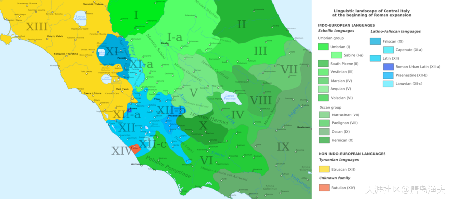

`罗马城/Roman`创建早期各方势力范围

> The linguistic landscape of Central Italy at the beginning of Roman expansion

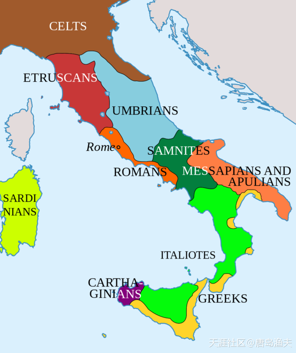

另外一幅地图

## 抢亲之战（二）

那么顺理成章地，`罗马/Rome`开始不断吸纳年轻人口进入`罗马城/Roman`。不管是奴隶还是自由民，不管是`拉丁人/Latins`、萨宾、还是`伊特鲁里亚人/Etruscans`，来到罗马的都是`罗马人/Roman`。愿意当兵吃官饭的，就成了士兵；不愿意的，就成了平民。总之都是罗马公民。只要成了合法的罗马公民，那么就享有公平议事，选举提名，当兵入伍的合法权利。

那么在罗马公民中，选出来一百个，成立`罗马元老院/Roman senate`。而这些被选出来的人，则被单独地称之为`长老/padres`（或者`城市之父/the city fathers`）。元老院就是最高国家咨询机构，后来的权力又慢慢扩大，逐渐掌握了整个国家的政治，经济，外交，军事，文化等权力。而这一百个人的荣誉称号，则代代相传，他们的后代也就成了`贵族/patrician`。

这样的政策，在那个年代还是具有相当的吸引力的。于是在极短的时间内，罗马城就聚集了大量的年轻男性。这些人的加入，也就带来了充足的兵源以及劳动力。

不过也有坏处。

年轻男人们聚集的罗马城，雄性的荷尔蒙爆棚。这帮子人在不参加劳动或者打仗的时候，就成了一群寻衅滋事的火药桶。

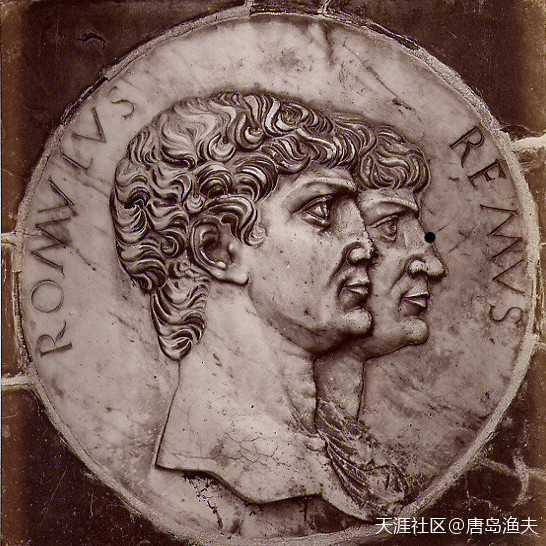

罗马创城的狼孩兄弟硬币

> Brogi, Carlo (1850-1925), "Certosa di Pavia - Medallion at the base of the facade". The Latin inscription tells that these are Romulus and Remus. 

## 抢亲之战（三）

`罗慕路斯/Romulus`必须为这群男人们找到女人，这事迫在眉睫。

最开始的`罗慕路斯/Romulus`也没有什么好办法，只能是利用国家机器，调动国家媒体部门，为讨老婆事业进行广告宣传工作。只可惜，周边的部落并不买账，愿意让自己的家中女性投奔这个新兴城市的家庭，寥寥无几。

那么既然按套路出牌忽悠不了别人，就只能是想想野路子了。

`罗慕路斯/Romulus`决定，明人不做暗事，率领兄弟们抢女人——自己动手，丰衣足食。自己动手，也妻妾成群。

借着一次盛大的献祭活动，`罗马人/Roman`向周边萨宾部落广发邀请函，希望能够借这次献祭，组织一些比较大的游乐活动，丰富人民群众的精神生活。不过很显然，从古到今，最爱逛街，最爱凑热闹的群体，就是女人，尤其是少女。

活动举办的非常成功，然而在`罗慕路斯/Romulus`的组织之下，`罗马人/Roman`摔杯为号，实施了野蛮的抢女人行动。有备而来的`罗马人/Roman`，打跑了`萨宾人/Sabines`的男人，留下了`萨宾人/Sabines`的青春少女。事后清点人数，几百萨宾少女被成功俘获。

女人们被掳走，`萨宾人/Sabines`男人们不干了。

---

- 在注也是这个名 
  圣经中抢处女也是第一次抢了400人。人类的历史都是按圣经而演变。

- xinbupiaobo 
  评论 在注也是这个名：是安啦，你那是歪经，已经唱歪了。

---

在西方文化中，对于抢`萨宾人/Sabines`女人这个话题津津乐道，乐此不疲，有很多艺术作品问世。

我们分别来看一看......

---

- 唐岛渔夫:
  抢来的东西，用着硬气，这个理念是西方文化的本源之一

- RHB之再战江湖
  评论 唐岛渔夫 ：这么说的话，霸占文物也符合它们的思路。

---

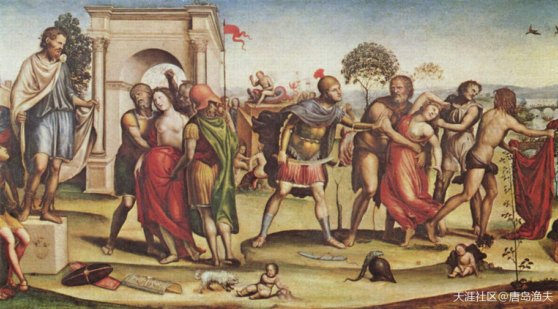

哄抢萨宾女人

> Ratto delle Sabine "The Rape of the Sabines", Il Sodoma (1507)

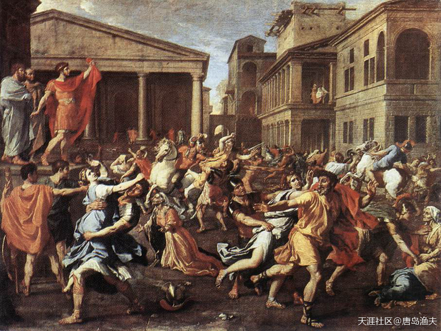

哄抢萨宾女人

> L'Enlèvement des Sabines "The Abduction of the Sabines", Nicolas Poussin (1638)

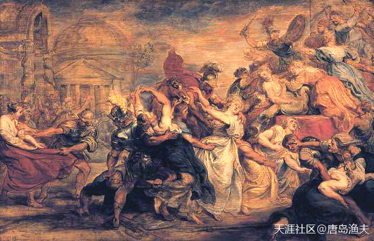

哄抢萨宾女人

> The Rape of the Sabine Women, Peter Paul Rubens (1634–36)

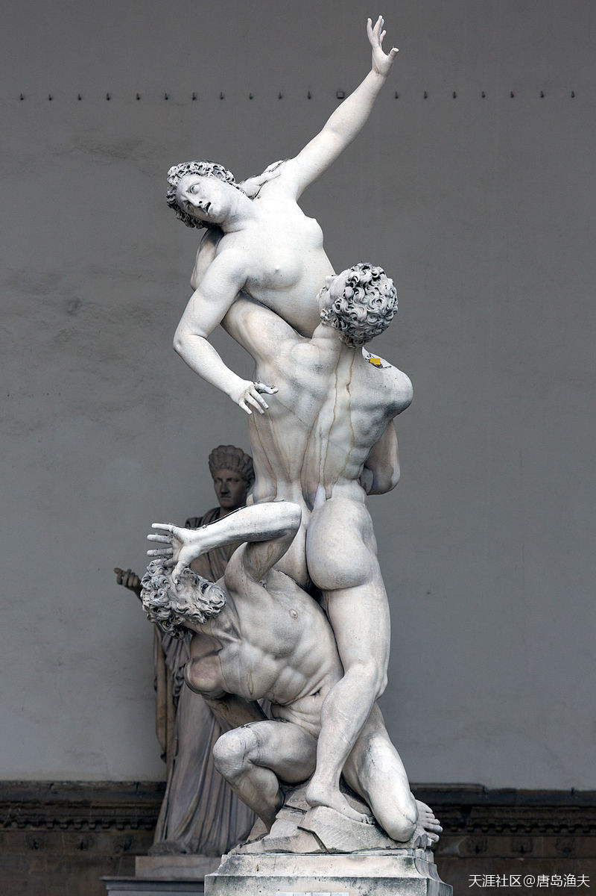

哄抢萨宾女人

> Ratto delle Sabine "Rape of the Sabines", Giambologna (1583)

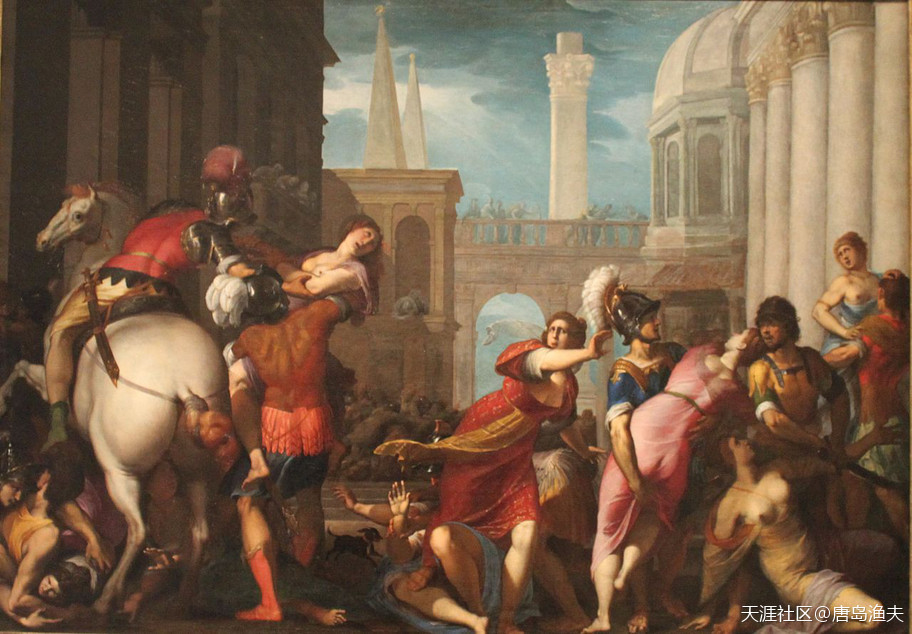

哄抢萨宾女人

> Ratto delle Sabine "The Rape of the Sabines", Jacopo Ligozzi (c.1565-1627)

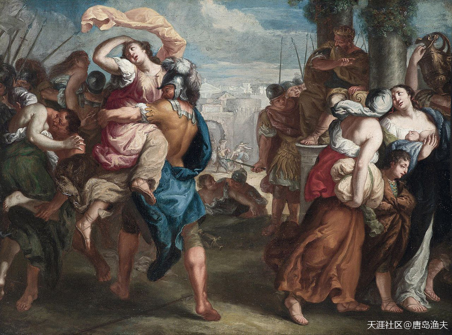
哄抢萨宾女人

> L'Enlèvement des Sabines "The Abduction of the Sabines", Attributed to Theodoor van Thulden (17th c.)

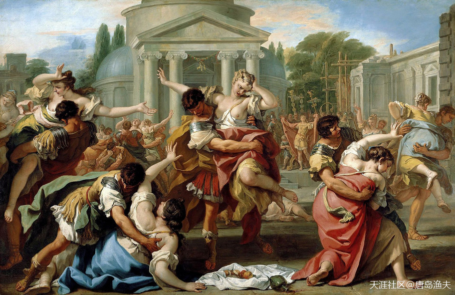
哄抢萨宾女人

> "The Rape of the Sabine Women", Sebastiano Ricci (c.1700)

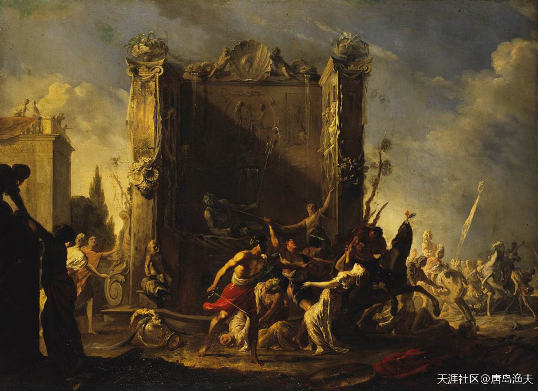
哄抢萨宾女人

> Der Raub der Sabinerinnen "The Rape of the Sabine Women", Johann Heinrich Schönfeld (1640)

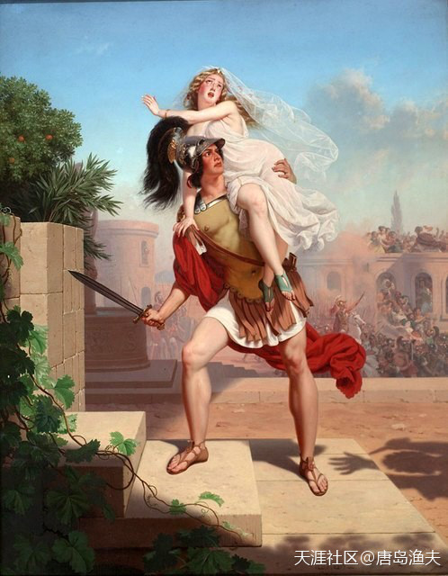
哄抢萨宾女人——单兵作战版本

> The Rape Of The Sabines - The Abduction, Charles Christian Nahl (1870) 
女孩还穿着婚纱，这是蓄谋已久被抢啊

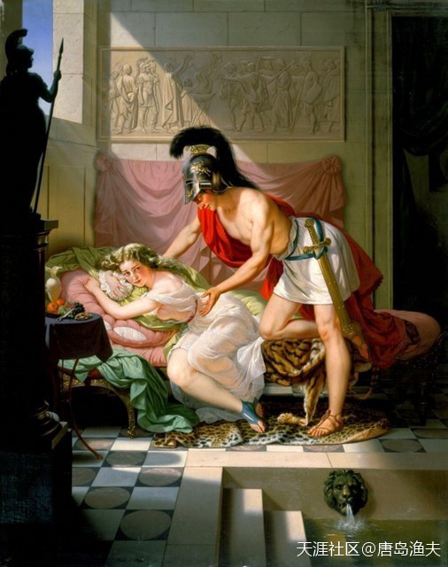
哄抢萨宾女人——单兵作战版本

> The Rape Of The Sabines - The Captivity, Charles Christian Nahl (1871)

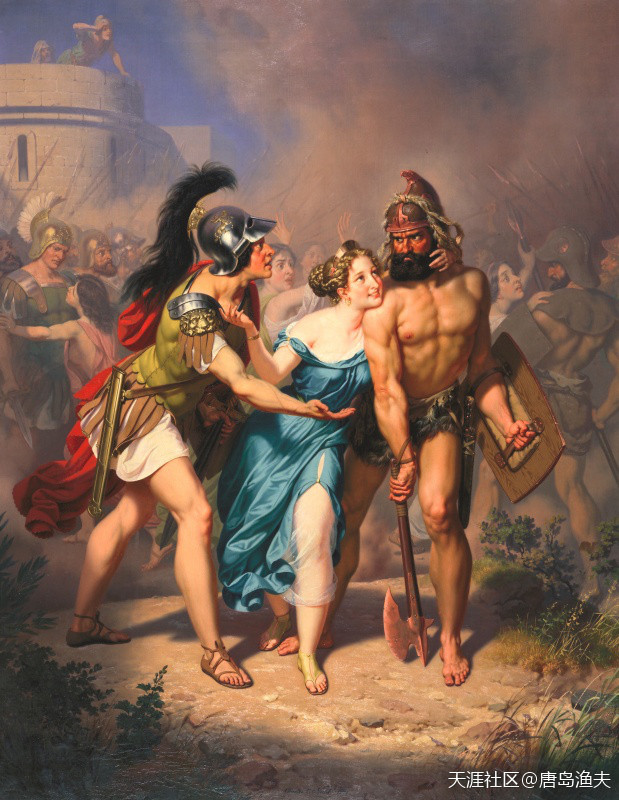
哄抢萨宾女人——三P版本

> The Rape Of The Sabines - The Invasion, Charles Christian Nahl (1871) 
三幅图是一套连环画，侵入，劫掠，囚禁 
这是你情我愿嘛

其实，不用再多展示了。。。

在欧洲传统文化中，抢东西并不可耻，给你天赐良机了你没抢或者抢了抢不来，那才是可耻。。。

看看一个哄抢萨宾女人的主题，体现了我们的欧洲艺术家们的艺术眼光，还是恶趣味呢？

不是圣母白莲花吗，不是扶老携幼，绅士风度吗？

那么大航海时代开启之后，几千万几千万消失的印第安人呢？

- 荷马史诗中，女人就是战利品，攻城略地之后，掳略来的战利品，女人列在其中。抢来的女人一般做奴隶。

- 普世价值外皮下的肮脏内在。

----

## 抢亲之战（四）

女人们被掳走，萨宾男人们不干了。

`罗马人/Roman`与`萨宾人/Sabines`的战斗正式开始。

`萨宾人/Sabines`没有保护好自己的女人们，结果在战斗中也没有好好地教`罗马人/Roman`做人。大量初尝爱情禁果的罗马小伙子们，为了保卫自己刚刚开始的幸福生活，而加入战斗序列，勇猛顽强地抵抗`萨宾人/Sabines`。

战斗赢不了没关系，就怕拖时间。

时间一拖就是一年多，`萨宾人/Sabines`被抢走的大姑娘，转年就变成了小媳妇，绝大部分小媳妇，都为罗马男人们生了娃。事情发展到这一步，这仗就没法打了。对于被掳走的萨宾女人来讲，一边是自己的不那么合法的丈夫，即便不是合法丈夫也是孩子他亲爸；而一边则是为迎回自己而在战场上拼命的父亲，兄弟。孩子没生的时候，当然要支持父兄。但一旦有了孩子，那么就成了手心手背都是肉了。

如果罗马城破，就意味着自己的娃将失去爸爸；

如果罗马大胜，或许就意味着自己将失去爸爸，哥哥。

最终`罗马人/Roman`和`萨宾人/Sabines`握手言和。

从此，`罗马人/Roman`和萨宾部落合并，罗马的总人口增加了一倍。而罗马之王罗慕路斯，则与萨宾之王`泰特斯·塔蒂乌斯/Titus Tatius`共治天下。

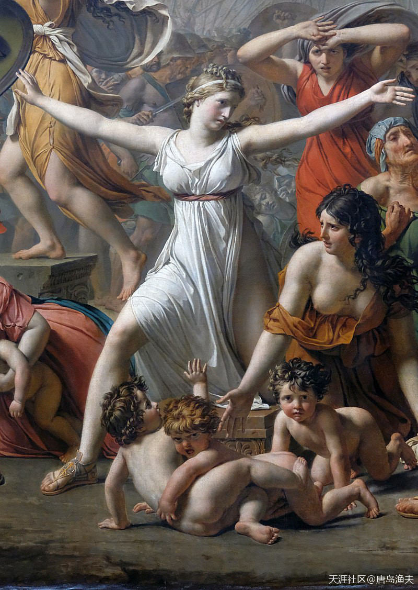

劝架的萨宾女人

> Hersilia from a detail of Les Sabines "The Intervention of the Sabine Women", Jacques-Louis David (1799)

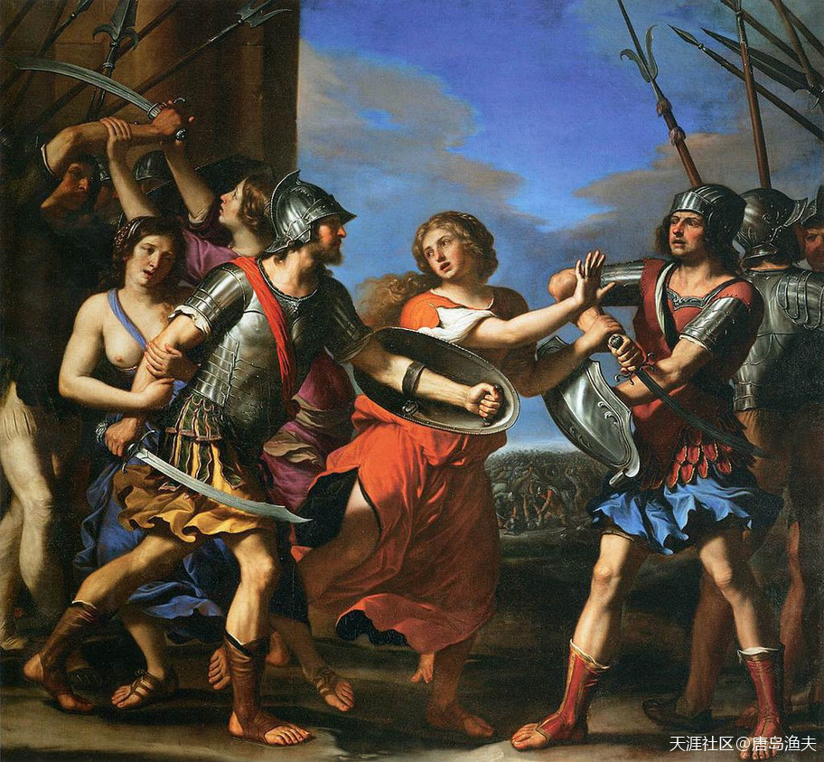

劝架的萨宾女人

> Ersilia separa Romolo da Tazio "Hersilia Separating Romulus and Tatius, Guercino (1645)

---

关于抢女人为妻，圣经有这样的记载，很奇特的一段历史。

以色列人兄弟间打架。一支派的人因为行了凶淫丑恶的事，被以色列其他的兄弟攻打，双方都死了很多人。最后，以色列人得胜，将那一支派各城的人和牲畜，并一切所遇见的，都用刀杀尽，又放火烧了一切城邑。

以色列胜了之后，曾起誓说，我们都不将女儿给他们为妻。之后，他们又上伯利特，坐在神面前直到晚上，放声痛哭，说：“耶和华以色列的神啊，为何以色列中有这样缺了一支派的事呢？”

后来，就有了以色列人为那一支派抢处女给他们剩下的人为妻的历史。又因为他们曾起了誓不给女儿给那支派的人为妻，于是，事件就变得曲折复杂，先是抢自己兄弟一支派的处女给那个支派的人为妻，发现仍然不够，以色列的百姓就后悔，因为神使以色列人缺了一个支派，之后又去抢外邦的女子给那个支派的人为妻。

事件虽然残酷，也曲折，但是人类的成长可见其中。圣经中将一件如此残酷的事件，描述记载得很幽默。

---

## 抢亲之战（五）

当然`萨宾人/Sabines`也没有吃亏。

一百个萨宾贵族被选出来，同之前的一百个贵族一起，成立了新元老院。

共和行政的罗马王朝，并没有持续太久，后来在一次内部纷争中，`塔蒂乌斯/Tatius`被刺杀，`罗慕路斯/Romulus`于是成了`罗马人/Roman`与`萨宾人/Sabines`的共主。

又过了一段时间，阿尔巴龙伽的老王`努米特/Numitor`去世，`罗慕路斯/Romulus`作为唯一继承人，联合了阿尔巴龙伽。不过即便如此，`罗慕路斯/Romulus`却并没有去到阿尔巴龙伽就任，而是由阿尔巴的本地人轮流出任国王。至此，新城邦罗马的势力发展到极盛。

公元前715年，在执政三十七年之后，`罗慕路斯/Romulus`在一场风暴之后消失。

谁也说不清楚，`罗慕路斯/Romulus`去了哪里。

惊愕与悲痛之余的`罗马人/Roman`，后来尊`罗慕路斯/Romulus`为`罗马人/Roman`的吉祥之神——`奎里努斯/Quirinus`。

或许在传说中，`罗慕路斯/Romulus`消失的真正意义，跟中国的黄帝乘龙飞天，有若干异曲同工之妙。也只有这样的突然离去，才能够衬托一代传奇的神秘与至高无上。

`罗慕路斯/Romulus`已然离去，不过在他身后，那个属于`罗马/Rome`的传奇，依然在继续。

---

- 是的，圣经中就有以利亚升天，黄帝飞天，顺治不见了。。。人类所有的历史，圣经必有。

- 这能说明什么？神的预言？还是你们这些信徒的生活都是被安排的？信徒们只是神豢养的玩物？有点脑子好么？圣经完全版往前倒推，经的起考证么？

---