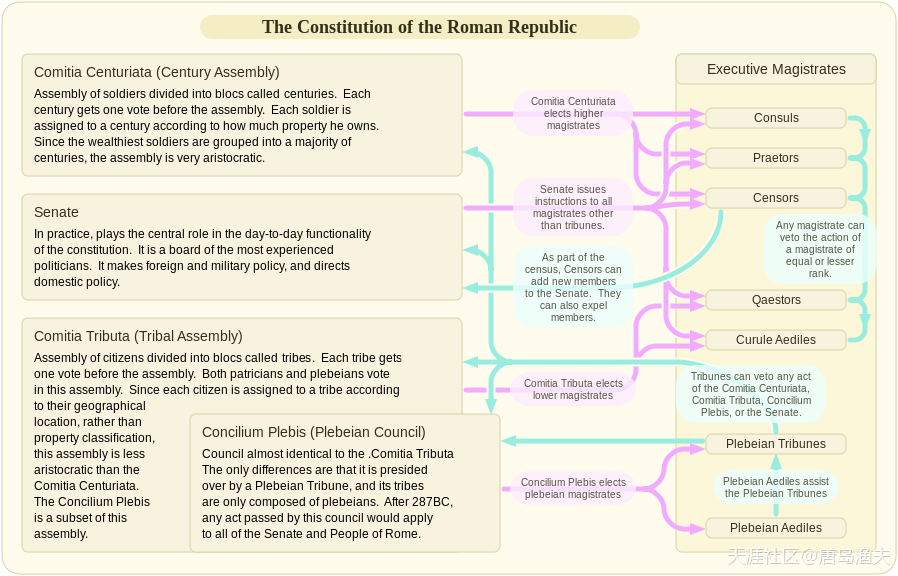
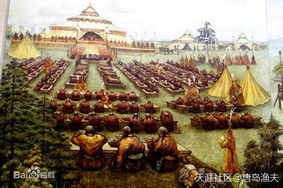
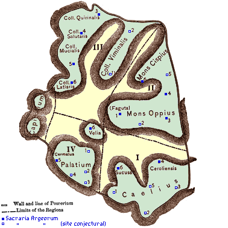
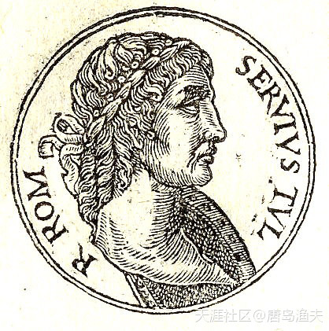
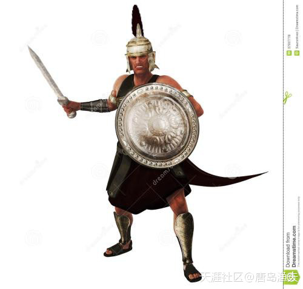
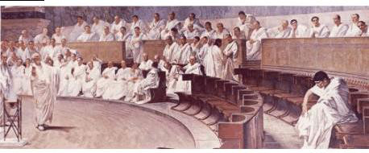
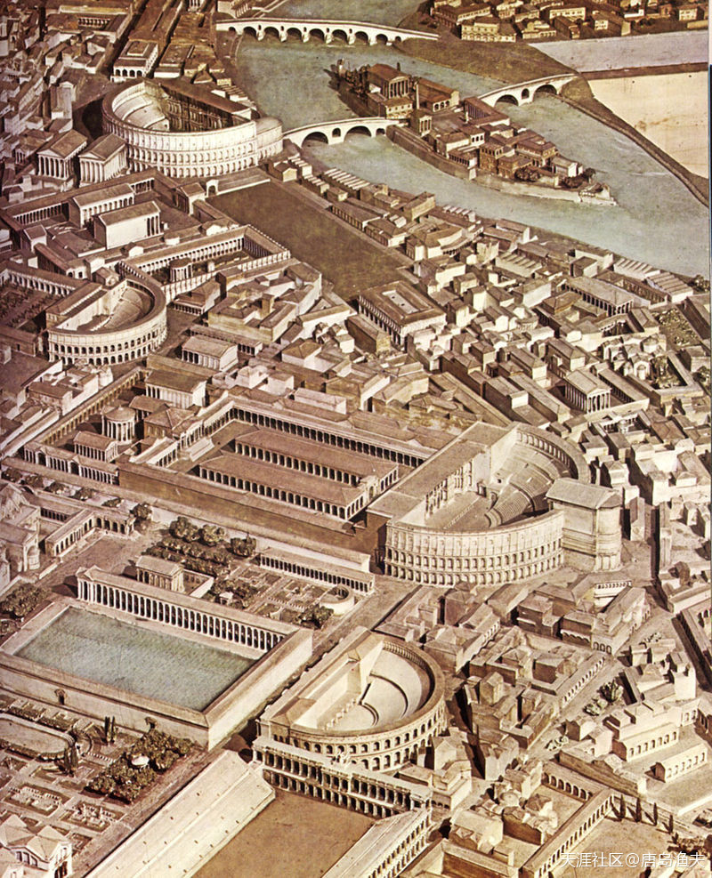
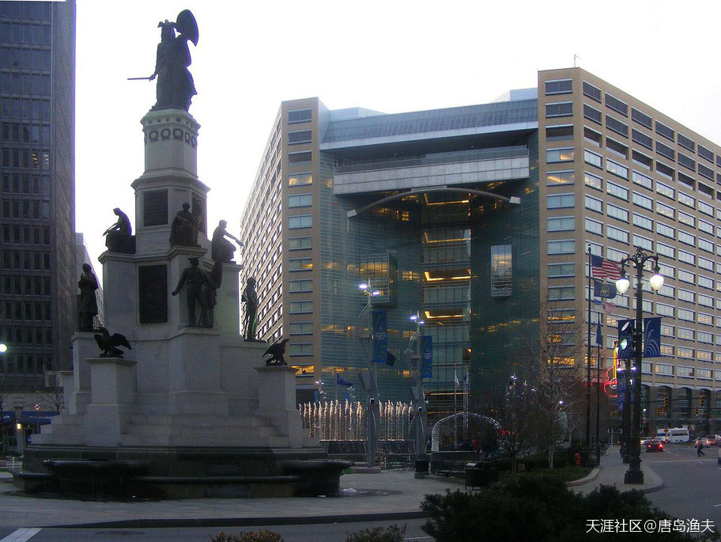

# 第四节 百人团

## 百人团（一）

国王凭空消失，而且是`罗马人/Roman`的首任国王。

那么谁来接班呢？这是个问题。

这不仅仅是一个单纯的接班问题，还涉及到国家体制的走向问题。

我们前文提到了元老院这个组织，元老院确实权力很大，但元老院还不能决定新任国王的产生。决定国王最终人选的组织，叫做`库里亚大会/Comitia Curiata`。一般对于国王的产生来讲，元老院可以提名，但最终确认人选，必须由`库里亚大会/Comitia Curiata`来拍板。当时拍板的方式也很接地气，可是是举手表决，也可以是大声叫喊，哪一个候选人支持团队的嗓门大，就定哪个候选人做国王。所谓的“有理也在声高”，是那个时代的特色之一。

`库里亚大会/Comitia Curiata`，实际上就是普通群众参与的民众大会。确切一点讲，是由罗马公民中的成年男子组成的民众大会。

## 百人团（二）

跟当时亚平宁半岛的人口组成相匹配，`罗马人/Roman`的`库里亚大会/Comitia Curiata`也由三类人组成——`拉丁人`、`萨宾人`和`伊特鲁里亚人`。

当时的全部`罗马人/Roman`，分成三个部落，三个部落就分别对应着`拉丁人`、`萨宾人`和`伊特鲁里亚人`。三个部落的名字后来固定为，`ramnes部落`，`tities部落`，`luceres部落`，前两个的部落名字，很显然分别是以`拉丁人`的领袖`罗慕路斯/Romulus`和`萨宾人`的领袖`塔蒂乌斯/Tatius`的名字来命名的。而第三个部落，传说也对应着`伊特鲁里亚人`的一位领袖。

三个`部落`，每个部落下面，都有十个`库里亚`，而每个`库里亚`，下面则又有十个`氏族`。

至此，罗马人的`日常政权组织形式`已经跃然纸上了。

最高处是`国王/Rex`，此外就是居于中间的`元老院/Senate`，再就是`库里亚大会/Comitia Curiata`。

而事实上，在传说中，这种政权组织形式并不是罗马人首创，他诞生在`荷马史诗//Homer's Epic`（英雄时代）时期，也就是我们前文提到的`迈锡尼/Mycenae`，`特洛伊文明`时期。而这种政权组织形式的官方名称，叫做`军事民主制/military democracy`。

传说中的`王政罗马时代`的`政权组织形式`示意图

## 百人团（三）

就军事民主制而言，他的常规组织架构包括：`军事首领/Military leader`、`长老议事会/Council of elders`、`民众会/People's meeting`。军事首领是名义上的最高首脑，但不能够世袭；长老议事会，被赋予了所有军国大事的先议权；而原则上的最高权力机构，就是民众会。那么这种军事民主制对应到罗马早期，也就是`国王`，`元老院`，`库里亚大会`。

最终，按照早期军事民主制的朴素政权组织形式。在罗慕路斯突然升天之后，罗马人选出了第二任国家元首，来自于萨宾人的`努马/Numa Pompilius`。

在努马之后，来自拉丁人的`托里斯/Tullus Hostilius`成为第三代国王，而来自萨宾人的`安库斯/Ancus Marcius`成为第四代国王。就这样，拉丁人与萨宾人，梅花间竹般地，将国王这个称号在各自的族属中轮转了两次。

例外发生在第五代国王的人选上，这个人不是拉丁人，也不是萨宾人，甚至他根本就不是本地人。他是移居到亚平宁半岛的希腊人的后代——`塔克文/Lucius Tarquinius Priscus`。

还记不记得蒙古人的“库里台大会”？

> 这就是典型的军事民主制。。。所以，民主这个词并不陌生，也并不现代 
早期的华夏先民，欧洲先民，蒙元满清。。。早期都是军事民主制

## 百人团（四）

塔克文的父系是希腊人，母系则是本地的伊特鲁里亚人，因此，塔克文也被认为是拉丁人和萨宾人轮流执政之后的第三势力的崛起。实际上，从塔克文开始，之后的国王权位就一直掌握在伊特鲁里亚人手中，再没有旁落。

塔克文的上台，并非意味着拉丁人，萨宾人与伊特鲁里亚人之间的政治对立越来越尖锐了。恰恰相反，经过一百多年的国家发展，三者之间慢慢地互相融合，互相吸纳，不同部落人种之间的界限已经越来越模糊了。那么塔克文的上台，则是这种自然发展的一种极致表现形式。

而到了塔克文之后，他的接班人，第六任国王塞尔维乌斯（Servius Tullius）干脆顺应形势，把原来以出身血缘为基准的三个部落的划分方式，改成了以地域划分的新模式。把原来的三部落，转变成了四个城区部落——分别是Suburana, Esquilana, Collina以及Palatina。这个转变，也就意味着罗马的军事民主制进入了新的阶段，之前略显原始的氏族社会，进入了罗马为中心的城邦时代。

王政时代（Roman Kingdom）的罗马四个区

> The City of the Four Regions, roughly corresponding to the city limits during the later kingdom. The division is traditionally, though probably incorrectly, attributed to Servius Tullius.  
`Din`！！！`Zan`！！！虽然每个字母都认识，但连在一起就不认识了：)但是！顶赞是必须的：)

## 百人团（五）

不仅如此，在之前的罗马公民划分中，贵族和平民构成了公民身份的两个最基本的划分方式。而随着生产力的不断发展，社会经济的逐渐繁荣，公民与公民之间的身份差别，非常极端地体现在了公民对于财产占有的不同中来。

贵族和平民之间的财产此消彼长，也只是在罗马公民层面上来考虑问题的。在公民的范围之外，如果我们再算上“客民”，那么情况就更加复杂了。客民是相对于公民来讲的，客民（proletarius）不具备完全的公民权利，但客民也是自由民。就最初的罗马城邦规模而言，罗马只不过是整个亚平宁半岛地区的小城，用蕞尔小邦这个成语来形容罗马是比较贴切的。那么当时整个广大的亚平宁半岛地区，生活着大量的伊特鲁里亚人，那么这些人如果慕名来投奔罗马，最开始也就只能是客民。客民虽然政治地位不高，但这并不意味着这帮人就没钱。有钱的客民在罗马城中，就会活得比较舒服。有钱的客民们，在罗马城吃喝嫖赌抽的事样样都沾，却并不参与赋税徭役，参政议政，当兵打仗。因为这些事，是属于公民范畴内的事情。那么这种情况，也就必然引起罗马公民的不满。

所有这一切，都是留给第六任国王塞尔维乌斯的一个新课题。

六王塞尔维乌斯

> Servius Tullius was the sixth legendary king of ancient Rome and the second king of the Etruscan dynasty.

## 百人团（六）

于是，塞尔维乌斯在任期间，他对所有罗马自由民进行了一次财产摸底普查活动。在这次活动之后，他将所有的自由民，按照财产拥有数量，重新划分成了五个等级。需要特别指出的是，财产拥有量是与他们能够提供的作战配置单元相匹配的。这个基本的作战配置单元，叫做森都里亚（ centuriae，英文century的词根），也就是“百人团”，由一百个士兵组成。

对于富人来讲，他们提供的森都里亚，必须是重装步兵，也就是带盔甲防护的。其实对于前三个等级来讲，重装步兵只是起步价。

第一等级的森都里亚重装步兵，必须是全副武装的。拥有头盔，胸甲，腿甲，长矛，圆盾，剑；第二等级的重装步兵，则就省掉了胸甲；而第三个等级的重装步兵，则就进一步省掉了腿甲。

考虑到经济条件的不同，后边两个等级的士兵都是轻步兵。

第四等级只有长矛和标枪，第五等级则只有石块和投石器。

当然，后来在第一等级之前，还出现了骑士百人团，顾名思义，这部分就是富人阶层中的贵族。这部分人就不仅仅的重装步兵的问题了，而是重装骑兵。而在所有的五个等级后边，还有个无产阶级，这部分人基本上啥也提供不了，军事上只能是参与一些比较低级的协助功能。

-------

- 对比木兰辞中的描写，出征前也是好自己购置家当的

- 正解，女侠中午好

- 圣经中的百夫长

-------

罗马士兵示意图

## 百人团（七）

关于与财产等级强相关的森都里亚，这里只是介绍了军事功能。

实际上森都里亚是和政治强相关的。

第六任国王塞尔维乌斯规定，每个森都里亚就有一个投票权，那么所有森都里亚组合在一起，也就形成了一个新的人民民众会——森都里亚大会（ comitia centuriata）。

按照我们之前所提到的财产等级划分，贵族们拥有18个骑士百人团，也就是18个森都里亚；而第一等级拥有40个青年百人团和40个老年百人团，也就是总共80个森都里亚；第二等级，第三等级，第四等级情况差不多，各自拥有20个森都里亚，和第一等级一样，青年百人团老年百人团也都是五五分；第五等级稍有增加，共有30个森都里亚，15个青年团，15个老年团。无产阶级，也有五个或者六个百人团。

这样算下来的话，

森都里亚大会，总共193个或者194个投票席位，而其中单单是富人或者富人阶层以上，就占据了98个席位。那么在实际的国家大政方针的决策期间，投票的顺序也是从第一等级开始，到第五等级结束。那么占据了98个席位的富人们，如果意见一致的话，后边的投票也就成了走过场。因为不用到穷人们投票，前面富人们的票数，就已经在森都里亚大会中过了半数。

元老院一角

## 百人团（八）

这套森都里亚大会体制，把全国人民的财产进行了普查并登记，同时把提供的军事义务同享有的政治权利相挂钩，十分符合当时的社会发展，也十分科学。到后来完全取代了库里亚大会，成为了早期罗马政治生活中最为重要的一个环节。

不过，让我们颇为感到诧异的是，罗马富人的数量居然能够占据到公民的多数。如果从常理分析的话，这样的“富人”，其实已经远远算不上富人了。只能说是中产阶级，这样则比较贴切一些。

换言之，罗马城邦体制确立之后，森都里亚大会就成了政治生活中最为重要的那个环节，而其中的中流砥柱，是中产阶级和贵族阶层。而若干年以后，就在森都里亚大会的基础上，又衍生出了由全体罗马公民参与的新的公民大会组成形式——特里布斯会议(Comitia Tributa)。

应该来讲，第六任国王塞尔维乌斯是一位相当成功的军事民主制度统帅。他在位期间，创立了森都里亚大会制度。同时因为军事上的崛起，大量战俘作为奴隶充实到了罗马人民的生活中，确立了罗马早期奴隶制度。政府班子运作制度化的同时，塞尔维乌斯还动员人民在罗马市中心修建了“玛尔斯广场”（Campus Martius），而玛尔斯广场后来则成了罗马政治的一个象征。

玛尔斯广场想象图

> 与当时的生产力水平和人口规模，这么大体量的建筑群很难想象

## 百人团（九）

这样，在六王塞尔维乌斯时期，氏族部落消失，城邦分区确立，让罗马彻底进入了城邦时代，成为了一个名副其实的王国。那么从第一任国王罗慕路斯到第六任塞尔维乌斯，“王政罗马”从雏形到成熟，终于在欧洲历史上占有了自己的一席之地。

毫无疑问，塞尔维乌斯让“王政罗马”达到巅峰时代。

然而，塞尔维乌斯并非十全十美的一位国王。比如当初他的登位，就充满各种瑕疵，也开创了一个极其恶劣的先例。

美国的玛尔斯广场公园——在底特律
