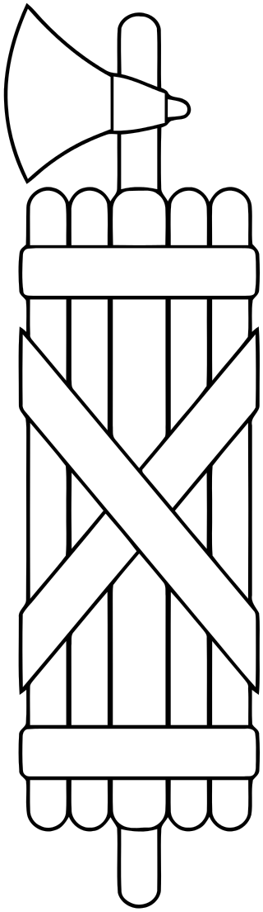

# 第五节 法西斯

## 法西斯（一）

`塞尔维乌斯/Servius Tullius`本人，是第五任国王塔克文在生前，着力培养的接班人。

不过，`塞尔维乌斯/Servius`的登位，却跳过了法定程序。

当时老国王塔克文的突然离世，属于非正常死亡。他死在了第四任国王安库斯的两个儿子手上。在事态紧急的情况下，安库斯妻子马上通知了`塞尔维乌斯/Servius Tullius`。于是，计划赶不上变化，塞尔维乌斯并没有通过元老院提名和库里亚大会裁定这个合法步骤，直接由元老院商定，从而登基称王。

`塞尔维乌斯/Servius`登位之后，在国王这个岗位上做的兢兢业业，后来也就木已成舟了，再没有人去提非法登基这档子事了。

不过，没人提归没人提，这个比较恶劣的先例就算是开了先河。

说到底，早期的罗马人怕的就是程序的不正义。

程序的不正义可能带来独裁，可能带来权力的滥用。权力这个东西，看不到摸不着，但不管是谁，只要是尝到了权力的甜头，那就等于是开启了一个潘多拉魔盒，各种欲望，贪婪，放纵就全部都随之而来。

正因为如此，王政罗马时代，人们让无形的“权力”有形化了。

这个有形化之后的“权力”，叫做束棒。束棒的文化源头，据传是来自于伊特鲁里亚人，从伊特鲁里亚人又传给了罗马人。

束棒的示意图

?> 到是古代中国的传国玉玺更符合契约精神

## 法西斯（二）

所谓的“束棒”，是指一根被多根绑在一起的木棍围绕的斧头，周围的束棒，以及中间的斧子，合称“束棒”。束棒是一种权力象征，在伊特鲁里亚人以及在在后来的罗马人心目中，象征着最高长官的权力与威信。王政罗马时代的国王们，自上任开始，身后经常就会站着手持束棒的卫兵们，这种形式上的威仪，则更加强化了权力的神圣不可侵犯性质。

“束棒”在古罗马人使用的古拉丁语中，被读作Fasces，也就是后世所称的“法西斯”。

一个城邦的经济发展以及人心的凝聚，离不开法西斯，尤其是在罗马初创时期。在强敌环伺的亚平宁半岛上能够生存下来，最高统帅对外用兵的绝对权力，是一个必要条件。然而对于内政来讲，法西斯又是一把双刃剑。权力的滥用，将会带来灾难性的后果。因此，对于军事民主政治来讲，如果有效地使用法西斯，以及如何有效地控制法西斯，是一项重要课题。

塞尔维乌斯虽然是非法登位，但他本人在位期间并没有滥用法西斯。

真正的问题出现在了塞尔维乌斯身后。

束棒——在牛津大学

> Ornamentation consisting of fasces held in the mouth of a lion inside the Sheldonian Theatre at Oxford University

束棒——在法国非正式国徽上

> The unofficial but common National Emblem of France is backed by a fasces, representing justice

束棒——在法国枫丹白露大皇宫

> Les Grands Palais de France Fontainebleau

束棒——在欧洲的法式建筑物上

束棒——1848年的法国大印章

> Great Seal of France, 1848

束棒——在美国国民警卫队徽章

束棒——在美国国会众议院的旗帜上

> Most visibly, fasces bestride the U.S. flag in the House chamber of the US Capitol

束棒——在美国总统办公室门上方（图中为肯尼迪总统）

> Above the door leading out of the Oval Office

束棒——在美国硬币上

> Mercury dime reverse  
硬币上有一句拉丁文E Pluribus Unum，也是美国国徽上的，等于Out of many,One。合众为一。束棒就像这句被奉为箴言的宣示一样，都是他们极推崇的。

束棒——在1989年的一美金硬币上

> 1989 U.S. Congress Bicentennial commemorative coin reverse, depicting mace of the United States House of Representatives

束棒——在林肯纪念堂的林肯座椅上

> The Lincoln Memorial with the fronts of the chair arms shaped to resemble fasces

---

**综上所述，`束棒`就是`法西斯`……`西方文化`普遍`崇拜法西斯`！**

**那么二战中，美国人为首所成立的，真的是“反法西斯统一战线”吗？**

- `Sang1367`： 
**那是犹太人大量进入美国以后开始主导媒体的讲法了，开始所谓三国轴心是反共轴心，三者都是民粹极致的结果，而德国反犹参考的正是美国黑人种族隔离主义。**

- `唐岛渔夫`： 
  评论 `sang1367`：**正解。所以，我们今天看到的历史和现实，都是西方想呈现给我们的。**

- `岁月静好1103`： 
  本来是一个很好的词，结果现在成了残暴的代名词了。

- `唐岛渔夫`： 
  评论 `岁月静好1103`：**确实被美国人污名化了。**

- `无定天风姬归真`： 
  评论 `唐岛渔夫`：**美国对这个词一方面污名化，一方面却用得肆无忌惮。**

---

## 法西斯（三）

和第三任先王安库斯一样，第四任先王塔克文也同样有两个儿子，这两个儿子对政治也都同样充满兴趣。这两个儿子的性格恰好相反，一个心术不正，另一个则性情温和。那么塞尔维乌斯也恰好有两个女儿，一个外向，另一个内向。于是老王决定，把内向的女儿嫁给那个心术不正的塔克文，而把外向的女儿嫁给那个性情温和的塔克文。

这样的做的目的，是想中和一下基因。

不过好人不长命，祸害遗千年。事与愿违的是，两个性格比较好的人早早离开人世，只剩下那个外向的女儿，同心术不正的塔克文活在人世，两个人还结合到了一起。

塞尔维乌斯最终死在了自己的女婿`小塔克文/Lucius Tarquinius Superbus`手上，小塔克文比自己的老岳父当年做的还绝。他没有经过森都里亚大会，也没有经过元老院，直接自行宣布，拿到了法西斯，做了罗马之王。

小塔克文，也就是第七任罗马国王。

小塔克文登位——漫画

> Tarquinius Superbus makes himself King; from The Comic History of Rome by Gilbert Abbott à Beckett (c. 1850s) 
左边的一位弟兄已经没眼看了 
哈哈，这个细节都被捕捉了。

## 法西斯（四）

要说小塔克文的对外军事行动，还是比较成功的，所以在他最初登位的那段日子里，不管是森都里亚大会还是元老院，都没有对小塔克文的法西斯进行过多的限制。对内也大概差不多，小塔克文的独裁统治之下，并没有个人或者组织站出来，对他的权力进行有效的限制。在相当长的一段时间里，小塔克文都被人在背后偷偷地称之为`傲慢者塔克文/Tarquin the Proud`。

小塔克文，最后栽在了一个女人身上。

小塔克文有一个儿子，名叫`塞克斯图斯/Sextus`。这个塞克斯图斯不仅继承了老爸小塔克文飞扬跋扈的基因，而且还是罗马城中的一个浮浪子弟，斗鸡走狗，欺男霸女，不一而足。终于有一天，塞克斯图斯欺负到了一个名叫`琉克蕾西娅/Lucretia`头上。

`琉克蕾西娅/Lucretia`是有夫之妇，而且夫家还不是一般人。`琉克蕾西娅/Lucretia`的夫家是贵族，也姓塔克文，丈夫的名字叫做克拉提乌斯（Lucius Tarquinius Collatinus），是当时王政罗马时代一位在外领兵打仗的将军。克拉提乌斯的祖父，跟老塔克文是同胞兄弟，而当朝小塔克文，则是克拉提乌斯的堂叔。就`琉克蕾西娅/Lucretia`的身份来讲，在整个罗马王国也算数一数二的贵妇，出身背景那就是当仁不让的硬茬子。

然而，即便如此，色胆包天的塞克斯图斯，还是趁着`克拉提乌斯/Collatinus`领兵在外，强行对`琉克蕾西娅/Lucretia`实施了不轨行为。这件事，也被后来的欧洲史家称为`琉克蕾西娅之非礼/Rape of Lucretia`。

`琉克蕾西娅/Lucretia`的日常

> Unusual depiction of Lucretia weaving with her ladies, 1633, Willem de Poorter

非礼现场

> Titian's Tarquin and Lucretia (1571)

非礼现场之二

> The rape, by Artemisia Gentileschi

## 法西斯（五）

说来`琉克蕾西娅/Lucretia`也是一个刚烈女子，她连夜把实情告诉了自己的父兄还有丈夫，并且当着他们的面自杀身亡。

`琉克蕾西娅/Lucretia`之死，引起了轩然大波。

傲慢者塔克文即便傲慢，但是法西斯还没有到滥用的地步。

然而塔克文的儿子塞克斯图斯，居然能够做出这样丧天良，灭人伦的事情来。他不仅辱没了塔克文家的门风，也辱没了王政罗马时代的社会底线。

站出来进行口诛笔伐的，一个是受害者的丈夫`克拉提乌斯`，一个是`小塔克文`的外甥`布鲁特斯/Lucius Junius Brutus`。`克拉提乌斯`的愤怒，可想而知。而`布鲁特斯/Brutus`，则更是怀着当年父亲惨死于小塔克文之手的深仇大恨。

如今，新仇旧恨一起清算。

小塔克文教子无方，求仁得仁，最终被群情激愤得罗马人民所流放。

罗马人民赶走了独裁者，却再也无法忍受那个不受控得法西斯。

于是，罗马就再也没有设置国王这个工作岗位，而是选出了两位`执政官/consul`。最初的两位执政官，正是代表塞尔维乌斯家族的`布鲁特斯/Brutus`，以及代表塔克文家族的克拉提乌斯。

跟中国在西周末年的“共和行政”相类似，罗马也进行了两个执政官的共和行政；跟中国西周末年的“共和行政”所不同的是，罗马从此结束了“王政时代”。

历史进入了新的纪元。

---

- `唐岛渔夫`： 
  更正：`布鲁特斯/Brutus`并非六王塞尔维乌斯的儿子，而是小塔克文的外甥，渔夫被误导了。最终形成正文之后，这段文字将会进行改动。

- `在注也是这个名`： 
  较早相类似的是圣经的南北二国，以色列一分为二。看世界很多国家和地区，一分为二的不在少数。中国，台湾，南北韩国，印度和巴基斯的克什米尔，中东一分为二就更加由来已久，这其实是一种让人类自治的智慧，相互制约。

- `长大的珠`： 
  评论 `在注也是这个名`： **这不是西方势力干预的结果么，也不是自然形成的！！！**

- `唐岛渔夫`： 
  评论 `在注也是这个名`： **自己的幸福，靠别人痛苦来实现？**

- `在注也是这个名`： 
  评论 `唐岛渔夫`：此话从何说起？未明。西方势力干预，爱尔兰，北爱尔兰。魁北克省，美国差点南北分裂等等，这些又是谁造成的呢？平衡。这其中考据的是智慧，不说了。

- `唐岛渔夫`： 
  评论 `在注也是这个名`：**平衡术，收到。不送。**

---

`琉克蕾西娅/Lucretia`之死

> Lucrecia, 1525, Monogrammist I.W. active in the Cranach studio c. 1520–40. The most common type of depiction.

`琉克蕾西娅/Lucretia`之死

> Lucretia by Lucas Cranach the Elder

死去的`琉克蕾西娅/Lucretia`

> Dead Lucrecia (1804), by Spanish sculptor Damià Campeny. Barcelona: Llotja de Mar.

`布鲁特斯/Brutus`矢志推翻独裁

> The less common subject of Brutus holding the dead Lucretia and swearing the oath

由女人之死引发的共和革命

> Detail of The Story of Lucretia (c. 1500–01), by Sandro Botticelli. Here citizens with swords are swearing the overthrow of the monarchy

## 结束

至此，`第一部分 洪荒神话` 告一段落。

`第二部分 嗜血王冠`即将开始。